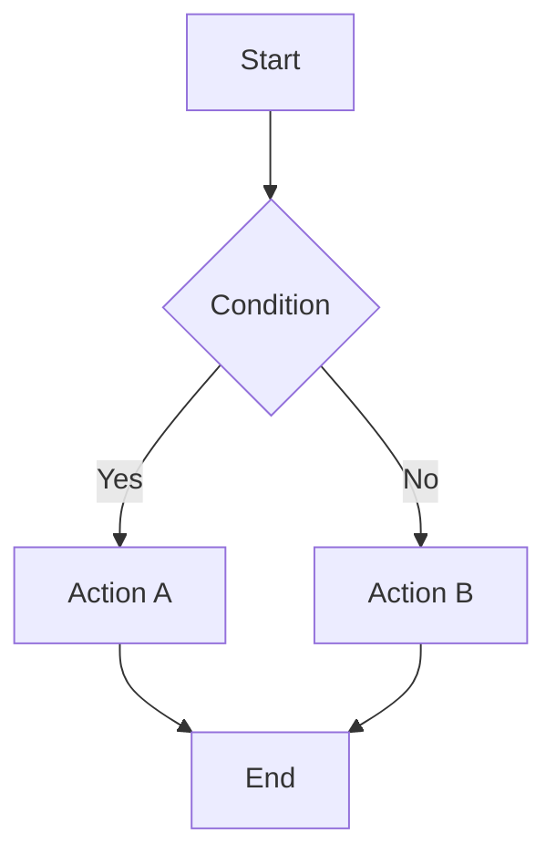
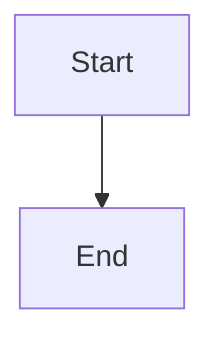

# Diagrammes Mermaid

Tous les diagrammes de ce projet sont en **Mermaid** (pas d'images PNG/SVG). Stockés dans `docs/` près du contenu qu'ils illustrent, versionnés en Git.

## Types de diagrammes utilisés

- **Flowchart** — processus métier, workflows (ex. : inscription, validation équipes)
- **Sequence** — interactions temporelles, échanges de données
- **ER (Entity-Relationship)** — schéma base de données
- **State** — transitions d'état (ex. : statut rencontre, statut inscription)
- **Deployment** — architecture infrastructure (Next / Supabase / Netlify)
- **Git Graph** — branches, stratégie de versioning

## Workflow

### 1. Quand créer un diagramme

- Une spec décrit un processus complexe → diagramme Flowchart pour clarifier
- La BDD a des relations entre entités → diagramme ER pour visualiser
- Un comportement temporel complexe → diagramme Sequence
- Un mécanisme avec états → diagramme State

Ne pas sur-diagrommer : une phrase claire est souvent mieux qu'un petit diagram flou.

### 2. Écrire et valider



**Validation avant commit** :

- Ouvrir le fichier `.mmd` dans l'éditeur — la syntaxe doit être valide (pas de message d'erreur)
- Vérifier les flèches : `-->` (normal), `->` (courbe), `==` (épais)
- Vérifier les nœuds : `A[text]`, `A{diamond}`, `A([circle])`, `A[[note]]`
- Lancer `npm run lint:md` — doit passer (valide la syntaxe Markdown + Mermaid)

### 3. Placer dans la structure

```text
docs/
├── specs/
│   ├── [spec-name].md
│   └── [spec-name].mmd        ← diagramme lié à la spec
├── conventions/
│   └── *.md
└── schemas/
    └── [schema-name].mmd       ← diagrammes de BDD
```

Toujours placer le `.mmd` **au même niveau** que le contenu auquel il se rapporte.

### 4. Intégrer dans le Markdown

````markdown
# Ma spec

## Processus



````

Deux options :

- **Référence** : `` → charge le fichier (recommandé pour gros diagrammes)
- **Inline** : bloc code ` ```mermaid ``` ` → pour petits diagrammes

### 5. Avant de commiter

```bash
npm run lint:md   # Valide Markdown + syntaxe Mermaid
git add docs/
git commit -m "..."
```

Si `lint:md` échoue :

- Ouvrir le fichier `.mmd`
- Vérifier les erreurs (keywords, nœuds mal fermés, flèches mal typées)
- Corriger et relancer le linter

## Règles

1. **Pas de Copilot** — générer les diagrammes directement (pas de tool LM).
2. **Valider toujours** — syntaxe correcte, pas de nœuds flottants.
3. **Français** — labels en français (alignement avec le projet).
4. **Source unique** — un diagramme `.mmd` ne vit qu'à un endroit (pas de duplication).
5. **Versionning** — les changements à un diagramme = commit séparé, message clair.

## Ressources

- Docs Mermaid : [mermaid.js.org](https://mermaid.js.org/)
- Éditeur live (tests rapides) : [mermaid.live](https://mermaid.live/)
- Cheatsheet locale : voir `node_modules/mermaid/` si besoin

## Exemples du projet

Voir `docs/` pour diagrammes existants :

- Architecture : `docs/schemas/architecture.mmd`
- BDD : `docs/schemas/entites-et-relations.mmd`
- Workflow : voir les specs dans `docs/specs/`
