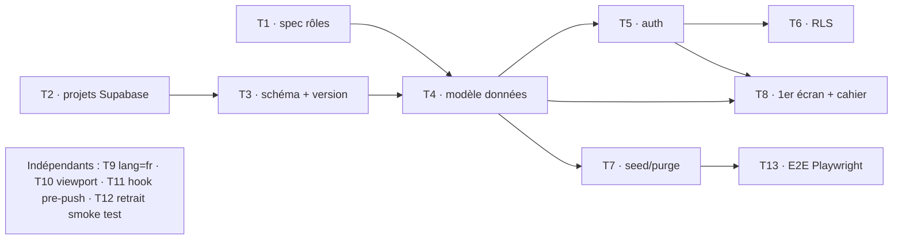

# TODO — Initialisation du projet

Liste de référence des tâches d'initialisation, avec dépendances et statuts.
**Règle de rappel** : on ne remonte que les tâches **🔄 en cours** et **⏳ en
attente** (les tâches ✅ faites sont archivées en bas, pas rappelées).

Statuts : ✅ fait · 🔄 en cours · ⏳ en attente (à faire) · 🚫 bloqué (dépendance non levée)

Dernière mise à jour : 2026-09-23.

---

> ℹ️ **La phase d'initialisation (T1→T8) est terminée.** Le projet est en
> développement fonctionnel (specs #3→#10). Cette section suit désormais l'état
> des specs métier et les tâches d'init résiduelles.

## 🔄 En cours

**Développement fonctionnel (specs #3→#10) — codé & validé en local.**
Implémenté depuis fin juillet 2026 (cf. `git log`) :

- **Spec #3 — Écrans de paramétrage admin** : gabarit de rencontre par catégorie
  (voies difficulté/bloc/vitesse, points, paliers), configuration de rencontre,
  **barème de vitesse par rang** éditable (gabarit + rencontre, R46/R47/R48).
- **Spec #4 — Tableau de bord admin** d'une rencontre.
- **Spec #5 — Espace coach** : engagement/compositions, groupes de départ,
  **prêts de grimpeurs** persistants (admin + coach d'accueil), invitation coach
  permanent par QR/URL, navigation du coach temporaire bornée à sa rencontre.
- **Spec #6 — Saisie des résultats** (coach) : voie & bloc, intégration vitesse
  au score, affichage chute/NP.
- **Spec #7 — Classement** : calcul du score, points de vitesse matérialisés
  (trigger, classement par sexe).
- **Spec #9 — Saisie admin des résultats** (tous clubs).
- **Spec #10 — Saisie de la vitesse par le juge** (temps/chute/NP).

Domaine pur couvert par Vitest (`src/domaine/` : gabarit, engagement, résultat,
score, vitesse, pret, invitation-coach…) ; parcours couverts par cahiers
`docs/tests/10→21` et E2E Playwright (`e2e/`).

> 🧪 **À faire côté utilisateur — appliquer les migrations en recette** (puis
> prod à la bascule sur `main`). D'après `supabase/migrations/JOURNAL.md`, tout
> le **lot fonctionnel reste `à appliquer`** en recette :
> `202607291000` (gabarit) → `202609221600` (points de vitesse), soit les
> gabarits/voies, phases (clôture, préparation), engagement, prêts, invitation
> coach, saisie résultats, `grimpeur.sexe`, saisie vitesse juge et barème.
> Appliquer dans l'ordre chronologique (SQL Editor), mettre à jour le JOURNAL,
> puis dérouler les cahiers `docs/tests/11→21` en colonne **Recette**.
>
> ⚠️ Le JOURNAL n'a pas d'entrée pour `202609181000_grimpeur_sexe`,
> `202609181100_grant_epreuve_service_role` et `202609221000_resultat_auteur` :
> les ajouter à la table de suivi lors de l'application.

## ⏳ En attente (à faire)

| ID | Tâche | Dépend de | Notes |
| ---- | ------- | ----------- | ------- |
| T10 | Export `viewport` (Next 16) dans le layout racine | — | cf. `07-standards-nextjs-16.md` §3 / `08` §3. Toujours absent de `src/app/layout.tsx`. |
| T11 | (Option) Hook local pre-push : `lint` + `typecheck` + `test` | — | Filet de sécurité car `push` = déploiement. Pas de `.husky`. |
| T13 | Étendre l'E2E Playwright sur parcours stabilisés | T7 | En cours : `admin-equipes`, `admin-prets`, `coach-engagement` couverts. Poursuivre au fil des specs stabilisées. |

## 🧊 Différés fonctionnels (reportés volontairement)

Tâches identifiées mais reportées, à traiter quand l'occasion se présente.

| ID | Tâche | Origine | Notes |
| ---- | ------- | --------- | ------- |
| D1 | **Temps réel (Supabase Realtime)** : propager les MAJ (résultats, scores, classement) sur **tous les écrans ouverts** sans rechargement | demandé 2026-09-22 | Aujourd'hui seul l'écran de celui qui écrit se rafraîchit. S'abonner à `resultat_voie`/`resultat_bloc` et invalider les vues dérivées. Périmètre : specs #6, #7, #9 (noté « évolution future » dans #7 et #9). |
| D2 | **Retirer les références `RXX` des IHM (avant prod)** : les écrans affichent « (R5) », « (R22) »… | demandé 2026-09-18 | Reformuler en langage clair pour l'utilisateur final ; garder la traçabilité `Rn` en commentaires/specs/cahiers. Balayage sur tout `src/app/**` (ex. `coach/rencontres/[id]/resultats/panneau-resultats.tsx`). |
| D3 | **Cache/optimisation des bascules d'écran — saisie résultats (#6)** : navigation grimpeurs ‹/› (R25) et bascule par équipe / alphabétique (R24) | demandé 2026-09-08 | Éviter de recharger les données à chaque bascule (stratégie de cache). Point technique hors règles de spec. |

## ✅ Fait (archive — non rappelé)

- **Specs #3→#10 codées & validées en local** (juil.→sept. 2026) : gabarit &
  configuration de rencontre, tableau de bord admin, espace coach (engagement,
  prêts, invitation), saisie des résultats voie/bloc, classement + points de
  vitesse, saisie admin des résultats, saisie vitesse juge, barème de vitesse
  par rang. Domaine Vitest + cahiers `docs/tests/10→21` + E2E. **Reste
  utilisateur** : appliquer le lot de migrations en recette (cf. « En cours »).
- **T12 — Suppression de `src/domaine/smoke.test.ts`** : fait (le domaine a de
  vrais tests).
- **T9 — `<html lang="fr">`** dans `src/app/layout.tsx` (+ `suppressHydrationWarning`
  sur `body`, commit `9093a46`).
- **T8 — Écrans de paramétrage admin (Clubs, Rencontres, Grimpeurs)** terminés
  (2026-07-25) : domaines purs (`club`/`rencontre`/`grimpeur`), écrans
  `/admin/*` (design « Nuit », mobile-first), loaders + Server Actions (gardes
  admin + RLS), cahiers `docs/tests/07→09`. Aucune migration (tables/policies de
  T6).
- **T7 — Seed/purge consolidés** (2026-07-25) : `supabase/seed/01-jeu-de-test.sql`
  (idempotent) + `99-purge-jeu-de-test.sql` (plage d'UUID réservée). Validé en
  local (`db reset` + suites `test:t*`).
- **T6 — RLS des 9 tables métier** (2026-07-25) : migration
  `202607251000_rls_tables_metier` (helpers de périmètre `SECURITY DEFINER`,
  grants `authenticated`, policies par opération — matrice spec #1 + ADR 0001,
  gating de phase). Validé local `test:t6` (17/17) + cahier
  `06-rls-tables-metier-t6.cahier.md`. Migration appliquée en recette.
- **T5d — Ouverture de session QR au scan** (validée 2026-07-25) : domaine pur
  `src/domaine/session-qr.ts` (11 tests Vitest), migration `202607231000` (table
  `session_qr` + RLS select own + RPC `ouvrir_session_qr` SECURITY DEFINER —
  ADR 0001), page `/scan` (Client Component `signInAnonymously` → RPC → redirect
  `/coach` ou `/juge`), stubs `/coach` et `/juge`, QR encodant l'URL de scan (via
  `NEXT_PUBLIC_APP_URL`). Cahier `docs/tests/05-session-qr-t5d.cahier.md`
  (CT-01..10, CT-05 complété en T6/T8). Connexions anonymes activées + migration
  appliquée (local + recette) + cahier déroulé. Purge des anonymes (`auth.users`
  sans `session_qr`) à prévoir (job/script, hors périmètre). **Débloque T6.**
- **T5c — Jetons QR (génération/affichage/révocation/régénération)** (2026-07-23) :
  domaine pur `src/domaine/jeton-qr.ts` (R9/R15–R23, 16 tests Vitest), migration
  `202607230900` (helper `club_courant()` + grants + policies RLS `jeton_qr` :
  admin tout, coach temp. de son club), loaders `src/lib/jetons/jetons.ts`
  (catalogues via `service_role`, jetons via RLS, **vrai QR** côté serveur via
  `qrcode`), Server Actions `src/lib/jetons/actions.ts` (générer/révoquer/
  régénérer, gardées `peutGererJeton` + RLS), écrans `/admin/jetons` (tout
  périmètre + affectation juge) et `/coach/jetons` (jeton de son club), données
  de test (jetons) — depuis T7, fondues dans `seed/01-jeu-de-test.sql`. Décision :
  [ADR 0003](decisions/0003-affichage-qr-et-lecture-catalogues.md).
  Cahier `docs/tests/04-jetons-qr-t5c.cahier.md` + script `scripts/test-t5c.sh`
  (`npm run test:t5c`, CT-06..09). Reste (utilisateur) : appliquer la migration +
  dérouler le cahier. **Débloque T5d.**
- **T5b — Mapping de rôle (écran admin)** (2026-07-22) : domaine pur
  `src/domaine/mapping-de-role.ts` (validation R1–R5, 7 tests Vitest), écran
  `/admin/mapping` (`src/app/admin/mapping/`) sur le design system « Nuit »,
  loaders `src/lib/auth/mapping.ts` + Server Action `mapping-actions.ts`
  (`attribuerMapping`, garde admin + upsert via RLS), client `service_role`
  `src/lib/supabase/admin.ts` (lecture comptes/clubs), lien « Administrer les
  rôles » sur l'accueil (admin). Décision : [ADR 0002](decisions/0002-liste-des-comptes-via-cle-service.md).
  Cahier `docs/tests/03-mapping-de-role-t5b.cahier.md`. **Aucune migration**
  (modèle `compte` + policies datent de T5a). Reste (utilisateur) : dérouler le
  cahier. Design system « Nuit » appliqué aussi aux écrans accueil + connexion.
  **Débloque T5c.**
- **T5a — Auth permanente + rôle courant** (2026-07-22) : migration
  `202607221300` (fonctions `role_courant()`/`est_admin()` `SECURITY DEFINER` +
  grants + policies RLS de `compte`), schéma client par défaut = `interclub`, DAL
  `src/lib/auth/session.ts`, Server Actions connexion/déconnexion
  (`src/lib/auth/actions.ts`), écran `/connexion` + accueil reflétant la session,
  données de test (3 comptes) — depuis T7, fondues dans `seed/01-jeu-de-test.sql`,
  cahier `docs/tests/02-authentification-t5a.cahier.md` et script `scripts/test-t5a.sh`
  (`npm run test:t5a`, 8/8 OK). Validé sur la stack locale. **Débloque T5b, T5c.**
  Reste (utilisateur) : dérouler les cas UI du cahier.
- **ADR 0001 — Auth des sessions QR éphémères**
  (`docs/decisions/0001-authentification-sessions-ephemeres-qr.md`), acceptée le
  2026-07-22. Tranche le mécanisme laissé « hors périmètre » par la spec #2 :
  connexions **anonymes** Supabase + table `interclub.session_qr` + RPC
  `ouvrir_session_qr` (`SECURITY DEFINER`), autorisation recalculée en RLS
  (coupure immédiate R13/R22/R23). **Débloque T5d et T6.**
- **Stack Supabase locale (Docker)** installée & validée le 2026-07-22 :
  `supabase start` + `supabase db reset` rejouent les 4 migrations sur base
  neuve. Convention 03 §5 **amendée** (validation locale autorisée ; `db push` /
  `db diff` **interdits** ; application recette/prod **manuelle**) ;
  `supabase/config.toml` versionné (`interclub` exposé, seed branché,
  `major_version = 17`) ; pas-à-pas `docs/stack-locale-supabase.md` ; CLI 2.109.1.
- **T3 — Migration initiale** (`202607221000_creation_schema_interclub_et_version.sql`) :
  schéma `interclub` + table `interclub.version`. Appliquée en **recette** le
  2026-07-22, schéma exposé à l'API. **Prod reportée** à la bascule sur `main`.
  Débloque T4.
- **T2 — Projets Supabase recette + prod** créés, variables Netlify par contexte
  (preview/branch→recette, production→prod). Débloque T3.
- **T1 — Spec #1 : Rôles & autorisations** (`docs/specs/01-roles-et-autorisations.md`),
  statut `validée` le 2026-07-12. Matrice rôles × actions + cycle de vie d'une
  rencontre. Débloque T4 (modèle de données), T5 (auth), T6 (RLS).
- Conventions & architecture (`docs/conventions/00→09`) + skills (`.claude/skills/`).
- Mise à jour **Next.js 16.2.10** (+ `eslint-config-next`).
- Standards **Next.js 16** (`07`), **IHM responsive** (`08`), **environnements &
  données** (`09`), **gitflow** (`05`).
- Outillage de test installé et vérifié : **Vitest + Testing Library** (`vitest.config.mts`,
  `vitest.setup.ts`), **Playwright + Chromium** (`playwright.config.ts`, dossier
  `e2e/`), scripts npm (`test`, `test:watch`, `test:coverage`, `test:e2e`,
  `typecheck`). Test fumée vert.
- Suivi migrations (`supabase/migrations/JOURNAL.md`) et seed (`supabase/seed/README.md`).

## Graphe de dépendances

