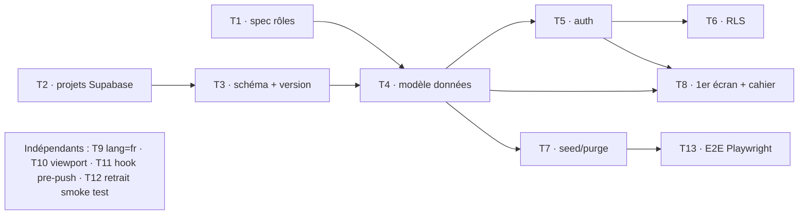

# TODO — Initialisation du projet

Liste de référence des tâches d'initialisation, avec dépendances et statuts.
**Règle de rappel** : on ne remonte que les tâches **🔄 en cours** et **⏳ en
attente** (les tâches ✅ faites sont archivées en bas, pas rappelées).

Statuts : ✅ fait · 🔄 en cours · ⏳ en attente (à faire) · 🚫 bloqué (dépendance non levée)

Dernière mise à jour : 2026-07-22.

---

## 🔄 En cours

Aucune tâche en cours.

> ⏳ **Report prod** : migration T3 (`202607221000_…`) appliquée en **recette**
> uniquement ; **prod à appliquer à la bascule sur `main`** (idem futures
> migrations tant qu'on n'a pas basculé).

## ⏳ En attente (à faire)

| ID | Tâche | Dépend de | Notes |
| ---- | ------- | ----------- | ------- |
| T4 | Modèle de données socle (entités issues des specs : clubs, équipes, joueurs, divisions, rencontres…) → migrations | T1, T3 | Dérive des specs validées. RLS incluse. |
| T5 | Authentification Supabase (inscription/connexion) + mapping utilisateur ↔ rôle/joueur | T1, T4 | cf. `expertise-supabase`. |
| T6 | Policies **RLS** selon la matrice de la spec rôles | T4, T5 | Une policy par opération ; vérifiées par cahier de test (négatifs inclus). |
| T7 | Jeux de données de test : `seed/01-jeu-de-test.sql` + `seed/99-purge-jeu-de-test.sql` (recette) | T4 | Idempotent + purge bornée. cf. `09` §3-4. |
| T8 | Premier écran + cahier de test associé (responsive, vérif mobile) | T4, T5 | Suivre `nouvelle-fonctionnalite` + `expertise-ihm-responsive`. |
| T9 | `<html lang="en">` → `lang="fr"` dans `src/app/layout.tsx` | — | Reporté (a11y). cf. mémoire `todo-differes`. |
| T10 | Export `viewport` (Next 16) dans le layout racine | — | cf. `07-standards-nextjs-16.md` §3 / `08` §3. |
| T11 | (Option) Hook local pre-push : `lint` + `typecheck` + `test` | — | Filet de sécurité car `push` = déploiement. |
| T12 | Supprimer `src/domaine/smoke.test.ts` | T-init | Dès le premier vrai test du domaine. |
| T13 | (Plus tard) Étendre l'E2E Playwright sur parcours stabilisés | T7 | Tant que recette non stable, cahier manuel prioritaire. |

## ✅ Fait (archive — non rappelé)

- **T3 — Migration initiale** (`202607221000_creation_schema_interclub_et_version.sql`) :
  schéma `interclub` + table `interclub.version`. Appliquée en **recette** le
  2026-07-22, schéma exposé à l'API. **Prod reportée** à la bascule sur `main`.
  Débloque T4.
- **T2 — Projets Supabase recette + prod** créés, variables Netlify par contexte
  (preview/branch→recette, production→prod). Débloque T3.
- **T1 — Spec #1 : Rôles & autorisations** (`docs/specs/01-roles-et-autorisations.md`),
  statut `validée` le 2026-07-12. Matrice rôles × actions + cycle de vie d'une
  rencontre. Débloque T4 (modèle de données), T5 (auth), T6 (RLS).
- Conventions & architecture (`docs/conventions/00→09`) + skills (`.claude/skills/`).
- Mise à jour **Next.js 16.2.10** (+ `eslint-config-next`).
- Standards **Next.js 16** (`07`), **IHM responsive** (`08`), **environnements &
  données** (`09`), **gitflow** (`05`).
- Outillage de test installé et vérifié : **Vitest + Testing Library** (`vitest.config.mts`,
  `vitest.setup.ts`), **Playwright + Chromium** (`playwright.config.ts`, dossier
  `e2e/`), scripts npm (`test`, `test:watch`, `test:coverage`, `test:e2e`,
  `typecheck`). Test fumée vert.
- Suivi migrations (`supabase/migrations/JOURNAL.md`) et seed (`supabase/seed/README.md`).

## Graphe de dépendances

