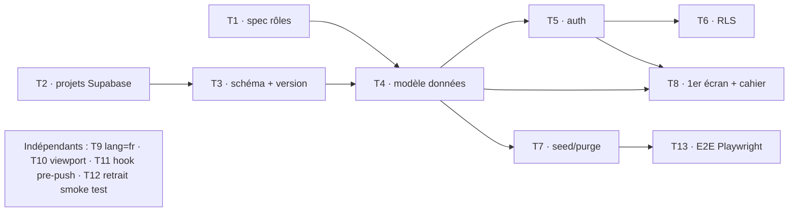

# TODO — Initialisation du projet

Liste de référence des tâches d'initialisation, avec dépendances et statuts.
**Règle de rappel** : on ne remonte que les tâches **🔄 en cours** et **⏳ en
attente** (les tâches ✅ faites sont archivées en bas, pas rappelées).

Statuts : ✅ fait · 🔄 en cours · ⏳ en attente (à faire) · 🚫 bloqué (dépendance non levée)

Dernière mise à jour : 2026-07-25.

---

## 🔄 En cours

**T6 codé** (2026-07-25) : migration `202607251000_rls_tables_metier` — 11
helpers de périmètre `SECURITY DEFINER` (phase, coach temp./juge de rencontre,
écritures équipe/composition/résultat/temps vitesse) + grants `authenticated` +
policies par opération sur les **9 tables métier**, implémentant la matrice de la
spec #1 et les 2 chemins d'acteur de l'[ADR 0001](decisions/0001-authentification-sessions-ephemeres-qr.md)
(permanent via `compte`, éphémère via `session_qr`) avec gating de phase.
Précisions spec #1 validées (rév. 2026-07-25) : périmètre juge = épreuve vitesse
(R30) ; roster grimpeur éditable hors phase (R6). Validé en local :
`npm run test:t6` (17/17) + cahier `docs/tests/06-rls-tables-metier-t6.cahier.md`
(CT-01..12). **Prochaine étape : T8** (1er écran).

**T7 codé** (2026-07-25) : jeu de données de test **consolidé** en source unique
`supabase/seed/01-jeu-de-test.sql` (idempotent — clubs, comptes, rencontre,
voies, équipes, grimpeurs, épreuves, compositions, jetons) + purge bornée
`supabase/seed/99-purge-jeu-de-test.sql` (plage d'UUID réservée, rejouable).
Anciens seeds `01-utilisateurs`/`02-jetons`/`03-session-qr` fusionnés et
supprimés ; `config.toml` → `sql_paths` explicite (purge exclue). Validé en
local : `db reset` + `test:t6` (17/17), `test:t5a/b/c` (8+4+4), purge → tout à 0,
rejeu OK, idempotence OK.

**T8 amorcé — 1er écran de paramétrage : Clubs** (2026-07-25) : domaine pur
`src/domaine/club.ts` (`normaliserNomClub`, 6 tests Vitest), écran admin
`/admin/clubs` (create/rename/delete, design « Nuit », mobile-first) — loader
`src/lib/clubs/clubs.ts`, Server Actions `src/lib/clubs/actions.ts` (garde admin
et RLS `club_*_admin`, R11), lien « Clubs » sur l'accueil admin. **Aucune
migration** (table et policies datent de T6). Cahier
`docs/tests/07-parametrage-clubs-t8.cahier.md` (CT-01..09). Validé : typecheck +
ESLint + build OK, Vitest 48/48. Suite paramétrage : **rencontre**, **grimpeur**
(même patron).

**T8 suite — écran de paramétrage : Rencontres** (2026-07-25) : domaine pur
`src/domaine/rencontre.ts` (`normaliserSaisieRencontre` + cycle de phases
`phaseSuivante`/`phasePrecedente`, 14 tests Vitest), écran admin
`/admin/rencontres` (create/modify/change-phase/delete, design « Nuit »,
mobile-first) — loader `src/lib/rencontres/rencontres.ts`, Server Actions
`src/lib/rencontres/actions.ts` (garde admin et RLS `rencontre_*_admin`, R12 ;
phases R5), lien « Rencontres » sur l'accueil admin. **Aucune migration** (table
et policies datent de T6). Cahier
`docs/tests/08-parametrage-rencontres-t8.cahier.md` (CT-01..09). Validé :
typecheck + ESLint + build OK, Vitest 62/62. Reste : **grimpeur** (même patron).

**T8 suite — écran de paramétrage : Grimpeurs (volet admin du roster)**
(2026-07-25) : domaine pur `src/domaine/grimpeur.ts` (`normaliserSaisieGrimpeur`
— nom/prénom + année de naissance bornée, 9 tests Vitest), écran admin
`/admin/grimpeurs` (add/modify/delete par club, design « Nuit », mobile-first) —
loader `src/lib/grimpeurs/grimpeurs.ts` (grimpeur + club + nb engagements),
Server Actions `src/lib/grimpeurs/actions.ts` (garde admin R11/R13 ; la RLS
`grimpeur_*` admet aussi le coach du club, R18 — futur écran coach), lien
« Grimpeurs » sur l'accueil admin. **Aucune migration** (table et policies datent
de T6). Cahier `docs/tests/09-parametrage-grimpeurs-t8.cahier.md` (CT-01..09).
Validé : typecheck + ESLint + build OK, Vitest 71/71. **T8 (paramétrage admin :
Clubs, Rencontres, Grimpeurs) terminé.**

> 🧪 **À faire côté utilisateur** :
>
> 1. ✅ Migration `202607251000` appliquée en **recette** (2026-07-25) — et les
>    prérequis (voie, auth/jetons, rls_compte, rls_jeton, session_qr).
> 2. Appliquer le seed **`01-jeu-de-test.sql`** en **recette** (SQL Editor), puis
>    dérouler le cahier T6 (colonne **Recette**, CT-01..12). Pour rejouer :
>    `99-purge-jeu-de-test.sql` puis `01-jeu-de-test.sql`.
>
> ✅ **T5a / T5b / T5c / T5d** entièrement clos et validés.

## ⏳ En attente (à faire)

| ID | Tâche | Dépend de | Notes |
| ---- | ------- | ----------- | ------- |
| T8 | Écrans de paramétrage (admin) + cahiers (responsive, vérif mobile) — **Clubs ✅**, **Rencontres ✅**, **Grimpeurs ✅** | T4, T5 | Suivre `nouvelle-fonctionnalite` + `expertise-ihm-responsive`. |
| T9 | `<html lang="en">` → `lang="fr"` dans `src/app/layout.tsx` | — | Reporté (a11y). cf. mémoire `todo-differes`. |
| T10 | Export `viewport` (Next 16) dans le layout racine | — | cf. `07-standards-nextjs-16.md` §3 / `08` §3. |
| T11 | (Option) Hook local pre-push : `lint` + `typecheck` + `test` | — | Filet de sécurité car `push` = déploiement. |
| T12 | Supprimer `src/domaine/smoke.test.ts` | T-init | Dès le premier vrai test du domaine. |
| T13 | (Plus tard) Étendre l'E2E Playwright sur parcours stabilisés | T7 | Tant que recette non stable, cahier manuel prioritaire. |

## ✅ Fait (archive — non rappelé)

- **T5d — Ouverture de session QR au scan** (validée 2026-07-25) : domaine pur
  `src/domaine/session-qr.ts` (11 tests Vitest), migration `202607231000` (table
  `session_qr` + RLS select own + RPC `ouvrir_session_qr` SECURITY DEFINER —
  ADR 0001), page `/scan` (Client Component `signInAnonymously` → RPC → redirect
  `/coach` ou `/juge`), stubs `/coach` et `/juge`, QR encodant l'URL de scan (via
  `NEXT_PUBLIC_APP_URL`). Cahier `docs/tests/05-session-qr-t5d.cahier.md`
  (CT-01..10, CT-05 complété en T6/T8). Connexions anonymes activées + migration
  appliquée (local + recette) + cahier déroulé. Purge des anonymes (`auth.users`
  sans `session_qr`) à prévoir (job/script, hors périmètre). **Débloque T6.**
- **T5c — Jetons QR (génération/affichage/révocation/régénération)** (2026-07-23) :
  domaine pur `src/domaine/jeton-qr.ts` (R9/R15–R23, 16 tests Vitest), migration
  `202607230900` (helper `club_courant()` + grants + policies RLS `jeton_qr` :
  admin tout, coach temp. de son club), loaders `src/lib/jetons/jetons.ts`
  (catalogues via `service_role`, jetons via RLS, **vrai QR** côté serveur via
  `qrcode`), Server Actions `src/lib/jetons/actions.ts` (générer/révoquer/
  régénérer, gardées `peutGererJeton` + RLS), écrans `/admin/jetons` (tout
  périmètre + affectation juge) et `/coach/jetons` (jeton de son club), données
  de test (jetons) — depuis T7, fondues dans `seed/01-jeu-de-test.sql`. Décision :
  [ADR 0003](decisions/0003-affichage-qr-et-lecture-catalogues.md).
  Cahier `docs/tests/04-jetons-qr-t5c.cahier.md` + script `scripts/test-t5c.sh`
  (`npm run test:t5c`, CT-06..09). Reste (utilisateur) : appliquer la migration +
  dérouler le cahier. **Débloque T5d.**
- **T5b — Mapping de rôle (écran admin)** (2026-07-22) : domaine pur
  `src/domaine/mapping-de-role.ts` (validation R1–R5, 7 tests Vitest), écran
  `/admin/mapping` (`src/app/admin/mapping/`) sur le design system « Nuit »,
  loaders `src/lib/auth/mapping.ts` + Server Action `mapping-actions.ts`
  (`attribuerMapping`, garde admin + upsert via RLS), client `service_role`
  `src/lib/supabase/admin.ts` (lecture comptes/clubs), lien « Administrer les
  rôles » sur l'accueil (admin). Décision : [ADR 0002](decisions/0002-liste-des-comptes-via-cle-service.md).
  Cahier `docs/tests/03-mapping-de-role-t5b.cahier.md`. **Aucune migration**
  (modèle `compte` + policies datent de T5a). Reste (utilisateur) : dérouler le
  cahier. Design system « Nuit » appliqué aussi aux écrans accueil + connexion.
  **Débloque T5c.**
- **T5a — Auth permanente + rôle courant** (2026-07-22) : migration
  `202607221300` (fonctions `role_courant()`/`est_admin()` `SECURITY DEFINER` +
  grants + policies RLS de `compte`), schéma client par défaut = `interclub`, DAL
  `src/lib/auth/session.ts`, Server Actions connexion/déconnexion
  (`src/lib/auth/actions.ts`), écran `/connexion` + accueil reflétant la session,
  données de test (3 comptes) — depuis T7, fondues dans `seed/01-jeu-de-test.sql`,
  cahier `docs/tests/02-authentification-t5a.cahier.md` et script `scripts/test-t5a.sh`
  (`npm run test:t5a`, 8/8 OK). Validé sur la stack locale. **Débloque T5b, T5c.**
  Reste (utilisateur) : dérouler les cas UI du cahier.
- **ADR 0001 — Auth des sessions QR éphémères**
  (`docs/decisions/0001-authentification-sessions-ephemeres-qr.md`), acceptée le
  2026-07-22. Tranche le mécanisme laissé « hors périmètre » par la spec #2 :
  connexions **anonymes** Supabase + table `interclub.session_qr` + RPC
  `ouvrir_session_qr` (`SECURITY DEFINER`), autorisation recalculée en RLS
  (coupure immédiate R13/R22/R23). **Débloque T5d et T6.**
- **Stack Supabase locale (Docker)** installée & validée le 2026-07-22 :
  `supabase start` + `supabase db reset` rejouent les 4 migrations sur base
  neuve. Convention 03 §5 **amendée** (validation locale autorisée ; `db push` /
  `db diff` **interdits** ; application recette/prod **manuelle**) ;
  `supabase/config.toml` versionné (`interclub` exposé, seed branché,
  `major_version = 17`) ; pas-à-pas `docs/stack-locale-supabase.md` ; CLI 2.109.1.
- **T3 — Migration initiale** (`202607221000_creation_schema_interclub_et_version.sql`) :
  schéma `interclub` + table `interclub.version`. Appliquée en **recette** le
  2026-07-22, schéma exposé à l'API. **Prod reportée** à la bascule sur `main`.
  Débloque T4.
- **T2 — Projets Supabase recette + prod** créés, variables Netlify par contexte
  (preview/branch→recette, production→prod). Débloque T3.
- **T1 — Spec #1 : Rôles & autorisations** (`docs/specs/01-roles-et-autorisations.md`),
  statut `validée` le 2026-07-12. Matrice rôles × actions + cycle de vie d'une
  rencontre. Débloque T4 (modèle de données), T5 (auth), T6 (RLS).
- Conventions & architecture (`docs/conventions/00→09`) + skills (`.claude/skills/`).
- Mise à jour **Next.js 16.2.10** (+ `eslint-config-next`).
- Standards **Next.js 16** (`07`), **IHM responsive** (`08`), **environnements &
  données** (`09`), **gitflow** (`05`).
- Outillage de test installé et vérifié : **Vitest + Testing Library** (`vitest.config.mts`,
  `vitest.setup.ts`), **Playwright + Chromium** (`playwright.config.ts`, dossier
  `e2e/`), scripts npm (`test`, `test:watch`, `test:coverage`, `test:e2e`,
  `typecheck`). Test fumée vert.
- Suivi migrations (`supabase/migrations/JOURNAL.md`) et seed (`supabase/seed/README.md`).

## Graphe de dépendances

