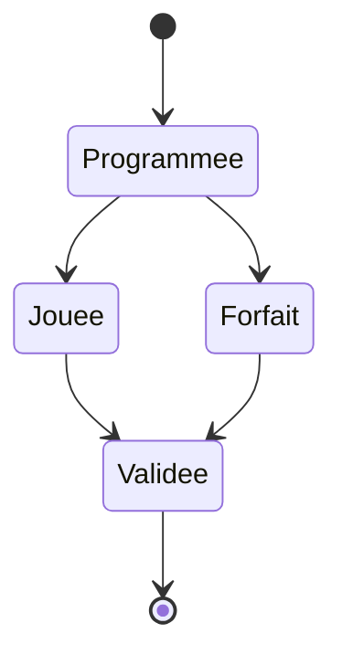

# 01 — Workflow : Spec-first & TDD

## 1. La règle d'or

> **La spécification est la vérité.**

Ordre de vérité, du plus fort au plus faible :

```
①  Spécification fonctionnelle détaillée   (docs/specs/)
②  Tests                                    (à côté du code / e2e)
③  Implémentation                           (src/)
```

- ① décrit **le comportement attendu** (le _quoi_ et le _pourquoi_).
- ② **encode** ce comportement de façon exécutable.
- ③ **satisfait** les tests.

En cas de contradiction, **le niveau supérieur gagne**. Un test qui contredit la
spec est un test faux. Un code qui contredit les tests est un bug.

## 2. Le cycle de travail (spec-first)

Pour toute nouvelle fonctionnalité ou évolution :

```
1. SPEC     Rédiger / mettre à jour la spec fonctionnelle détaillée.
            → Validation avant de continuer.
2. TESTS    Écrire les tests qui encodent la spec. Ils échouent (RED).
3. CODE     Implémenter le minimum pour faire passer les tests (GREEN).
4. REFACTOR Nettoyer sans changer le comportement. Tests toujours verts.
5. VÉRIF    Suite complète verte + revue vis-à-vis de la spec.
```

Aucune étape n'est sautée. On **n'écrit pas de code sans test**, et on **n'écrit
pas de test sans spec**.

Le skill [`nouvelle-fonctionnalite`](../../.claude/skills/nouvelle-fonctionnalite/SKILL.md)
guide ce cycle de bout en bout.

## 3. La règle de changement (CRITIQUE)

Quand une demande **impacte le comportement décrit par une spec** :

> **On ne modifie jamais le code en premier.**
> On **demande d'abord**, puis on répercute dans l'ordre : **spec → tests → code**.

Procédure :

1. **Détecter** l'impact : la demande change-t-elle une règle déjà spécifiée ?
2. **S'arrêter et demander.** Exposer :
   - la règle actuelle (citer la spec),
   - le changement proposé,
   - les conséquences (autres specs/tests/écrans impactés).
3. Une fois **validé** :
   1. mettre à jour la **spec**,
   2. mettre à jour / ajouter les **tests** (ils repassent au rouge),
   3. adapter le **code** (retour au vert).

Jamais dans l'autre sens. Un changement de comportement qui arrive « par le code »
sans passer par la spec est un défaut de processus.

### Quand faut-il demander ?

| Situation | Demander ? |
|-----------|-----------|
| Nouvelle règle métier / modification d'une règle existante | ✅ Oui |
| Changement d'un comportement décrit dans une spec | ✅ Oui |
| Ajout d'un cas limite non prévu par la spec | ✅ Oui (compléter la spec) |
| Refactoring sans changement de comportement | ❌ Non (tests garants) |
| Correction d'un bug = code non conforme à la spec | ❌ Non (le code doit suivre la spec) |
| Correction d'un bug = la spec elle-même est fausse | ✅ Oui (corriger la spec d'abord) |

## 4. Format d'une spécification fonctionnelle détaillée

Les specs vivent dans `docs/specs/`, une par domaine/fonctionnalité, en français.
Squelette (détaillé dans le skill [`rediger-spec`](../../.claude/skills/rediger-spec/SKILL.md)) :

> **Règlement : la dernière version fait toujours foi.** Une spec cite la version
> du règlement dont elle dérive (traçabilité), mais en cas de nouvelle version du
> règlement, **c'est la plus récente qui prime** : les specs impactées doivent
> être revues (via la règle de changement §3). La version courante de référence
> est le PDF le plus récent dans `docs/reglement/`.

```markdown
# Spec : <Nom de la fonctionnalité>

- **Statut** : brouillon | validée | obsolète
- **Sources** : règlement <version, ex. 2025 v3.1> §X, décision du <date>, …
  (⚠️ la dernière version du règlement prime toujours)

## Objectif
Pourquoi cette fonctionnalité existe (valeur métier).

## Vocabulaire
Termes du domaine utilisés (alignés avec le règlement).

## Règles fonctionnelles
R1. <règle atomique, testable, non ambiguë>
R2. …

## Scénarios
### Scénario nominal
Étant donné … Quand … Alors …
### Cas limites / erreurs
…

## Contraintes de données
Ce que la base doit garantir (unicité, intégrité).

## Hors périmètre
Ce que cette spec ne couvre PAS.
```

**Chaque règle `Rn` doit être traçable jusqu'à au moins un test.**

### Diagrammes — toujours en Mermaid

Dans **toute spec et toute documentation** (technique/dev **ou** utilisateur), les
schémas sont écrits en **Mermaid** (blocs ` ```mermaid `), jamais en images
externes ou en ASCII. Ils restent ainsi versionnés, diffables et rendus par
GitHub/l'IDE. Types utiles selon le besoin :

| Besoin | Diagramme Mermaid |
|--------|-------------------|
| Enchaînement d'étapes / décisions (parcours, algorithme) | `flowchart` |
| Interactions dans le temps (auth, realtime, appels Supabase) | `sequenceDiagram` |
| Cycle de vie d'une entité (ex. statut d'une rencontre) | `stateDiagram-v2` |
| Modèle de données (tables/relations) | `erDiagram` |

Exemple (cycle de vie simplifié d'une rencontre) :



Garder les diagrammes **synchrones avec les règles** : un diagramme qui contredit
une règle `Rn` est un bug de spec.

## 5. Traçabilité spec ↔ test

- Nommer les tests d'après les règles/scénarios de la spec.
- Référencer la règle dans le test (`// R3 : une équipe ne peut aligner …`).
- Une règle sans test = spec non couverte (à corriger).
- Un test sans règle correspondante = comportement non spécifié (remonter à la spec).

## 6. Définition de « terminé » (Definition of Done)

Une fonctionnalité est terminée quand :

- [ ] La spec est **validée** (statut `validée`).
- [ ] Chaque règle de la spec est couverte par au moins un test **automatisé
      (Vitest)** ou un **cas de cahier de test** manuel.
- [ ] Tous les tests automatisés passent.
- [ ] Le cahier de test concerné est écrit et **exécuté** (résultat tracé).
- [ ] Le lint et le typecheck passent.
- [ ] Les migrations Supabase (si schéma modifié) sont écrites en SQL versionné,
      **appliquées à la main** et consignées (pas de Docker/CLI ici).
- [ ] Les policies RLS couvrent les nouveaux accès (vérifiées par le cahier).
- [ ] Aucune régression dans la suite complète.

## 7. À ADAPTER pour un autre projet

Rien dans ce document n'est spécifique à l'interclub : le processus est
réutilisable tel quel. Seul le **contenu** des specs change d'un projet à l'autre.
