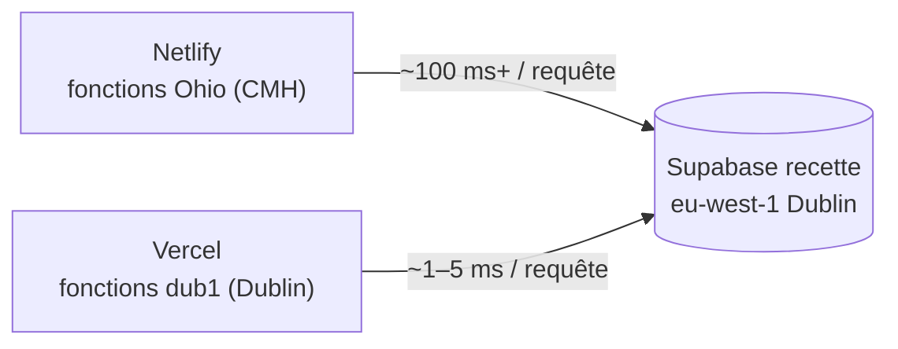
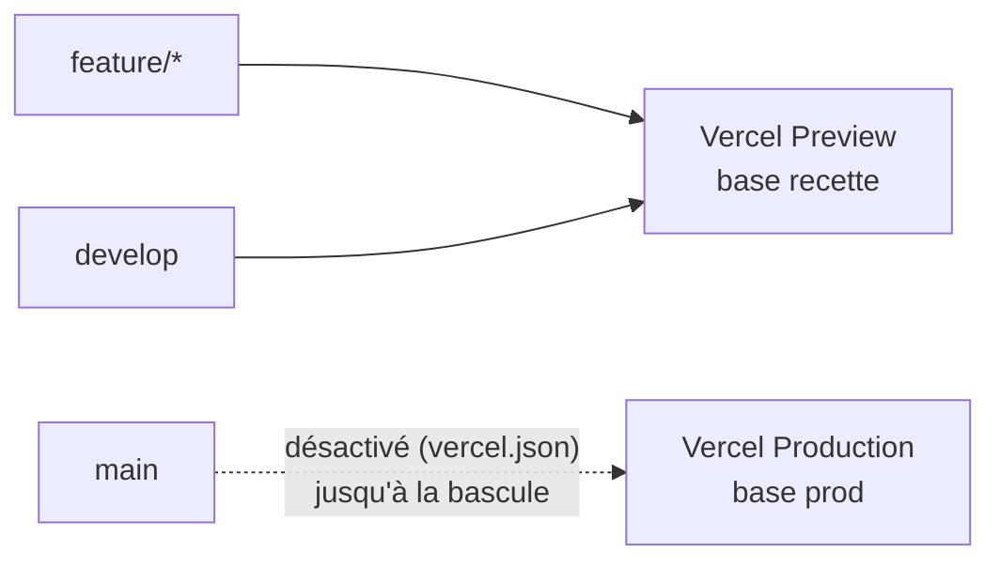

# Déploiement sur Vercel (mesure des performances)

> **Statut : expérimental.** L'hébergement de référence reste **Netlify**
> (cf. [05-git-et-deploiement.md](conventions/05-git-et-deploiement.md)).
> Vercel est déployé **en parallèle** pour comparer les temps de réponse.
> `netlify.toml` est conservé tel quel : chaque hébergeur ignore la
> configuration de l'autre.

## 1. Pourquoi

Diagnostic du 2026-10-07 : les fonctions Netlify (offre gratuite) tournent en
**Ohio (CMH)** alors que Supabase recette est à **Dublin (eu-west-1)**. Chaque
aller-retour serveur ↔ base coûte 130–1000 ms. Vercel, même en offre gratuite
(Hobby), permet de **choisir la région des fonctions** : on la fixe à `dub1`
(Dublin), au plus près de la base.

## 2. Branches et environnements Vercel

On reprend le gitflow (cf.
[09-environnements-et-donnees.md](conventions/09-environnements-et-donnees.md)) :

| Branche | Environnement Vercel | Base Supabase | État |
|---------|----------------------|---------------|------|
| `develop` | **Preview** (URL de branche stable) | recette | actif |
| `feature/*` | **Preview** (une URL par déploiement) | recette | actif |
| `main` | **Production** | prod | **désactivé** jusqu'à la bascule (§5) |

## 3. Ce qui est versionné

`vercel.json` à la racine :

| Clé | Valeur | Effet |
|-----|--------|-------|
| `framework` | `nextjs` | Détection explicite du framework |
| `buildCommand` | `npm run build` | Même build que Netlify |
| `regions` | `["dub1"]` | Fonctions (Server Components, Server Actions, routes, `proxy.ts`) exécutées à Dublin |
| `git.deploymentEnabled.main` | `false` | Aucun déploiement Vercel depuis `main` tant que la prod n'est pas basculée (§5) |

Rien d'autre ne change dans le code : `next.config.ts`, `proxy.ts` et les
helpers Supabase fonctionnent tels quels.

## 4. Mise en place (une seule fois)

### 4.1 Créer le projet Vercel

1. Se connecter sur <https://vercel.com> avec le compte GitHub.
2. **Add New… → Project** → importer le dépôt `interclub`.
3. Écran de configuration :
   - *Framework Preset* : **Next.js** (pré-rempli par `vercel.json`).
   - *Root Directory* : `./`.
   - *Build / Install / Output* : laisser les valeurs par défaut.
4. **Deploy** (le premier déploiement peut échouer faute de variables : sans
   gravité, on les ajoute ci-dessous puis on redéploie).

### 4.2 Branche de production

*Project → Settings → Environments → Production → Branch Tracking* : laisser
**`main`** (valeur par défaut). `develop` part ainsi en **Preview**.

### 4.3 Variables d'environnement (Preview = recette)

*Project → Settings → Environments → Preview → Add Environment Variable*,
avec les valeurs du projet Supabase **recette** (mêmes que `.env.local`) :

| Variable | Type | Environnement | Valeur |
|----------|------|---------------|--------|
| `NEXT_PUBLIC_SUPABASE_URL` | **Config** | Preview | URL **recette** |
| `NEXT_PUBLIC_SUPABASE_ANON_KEY` | **Config** | Preview | clé `anon` **recette** |
| `SUPABASE_SERVICE_ROLE_KEY` | **Secret** | Preview | clé `service_role` **recette** |

- Type **Config** pour les `NEXT_PUBLIC_*` : Vercel refuse le type *Secret* sur
  un préfixe public. Elles sont de toute façon intégrées au bundle navigateur,
  et la clé `anon` est publique par conception (protégée par la RLS).
- **Ne pas** cocher *Production* pour ces valeurs : Production recevra les clés
  **prod** à la bascule (§5).
- L'environnement *Development* ne sert qu'à `vercel dev` / `vercel env pull`
  (facultatif).

Puis *Deployments → dernier déploiement de `develop` → ⋯ → Redeploy*.

### 4.4 Région des fonctions

*Project → Settings → Functions → Function Region* doit afficher
**Dublin, Ireland (West) – dub1**. Sinon, la sélectionner (l'offre Hobby
autorise une seule région, commune à Preview et Production), *Save*, puis
**Redeploy** : le réglage ne vaut que pour les nouveaux déploiements.

> Piège rencontré : le déploiement initial à l'import part de `main`, qui ne
> contient pas encore `vercel.json` → région par défaut `iad1` (Washington).
> Fixer la région dans les réglages du projet évite ce cas.

### 4.5 Accès aux previews

Par défaut, Vercel protège les déploiements *Preview* (*Settings → Deployment
Protection → Vercel Authentication*) : seul un compte Vercel membre du projet
peut les ouvrir. Pour tester sur téléphone ou faire tester par d'autres
personnes, désactiver cette protection pour les previews (l'application a sa
propre authentification Supabase).

### 4.6 Supabase

Aucun réglage nécessaire : l'authentification utilise
`signInWithPassword` / `signInAnonymously` (sessions éphémères QR), sans lien
e-mail ni URL de redirection. Le domaine Vercel n'a pas à être déclaré dans
*Auth → URL Configuration*.

## 5. Plus tard : la production sur `main`

À faire au moment de la bascule de la prod vers Vercel :

1. **Vérifier la région du projet Supabase prod.** `regions` est commun à tous
   les environnements : si la prod n'est pas en `eu-west-1`, choisir avec quelle
   base co-localiser les fonctions (ou aligner les deux projets).
2. *Settings → Environments → Production* : ajouter les 3 variables avec les
   valeurs du projet Supabase **prod** (mêmes types qu'au §4.3).
3. Dans `vercel.json`, supprimer le bloc `git.deploymentEnabled` (ou passer
   `main` à `true`), committer sur `develop` puis promouvoir vers `main`.
4. Le domaine de production (`<projet>.vercel.app` ou domaine personnalisé) se
   règle dans *Settings → Domains*.

## 6. Déployer

| Méthode | Commande / action | Résultat |
|---------|-------------------|----------|
| Git (automatique) | `git push` sur `develop` | Preview, URL de branche stable `interclub-git-develop-<équipe>.vercel.app` |
| Git (automatique) | `git push` sur une `feature/*` | Preview, URL dédiée |
| CLI (ponctuel) | `npx vercel` | Preview depuis le poste, sans pousser |

Netlify déploie **aussi** à chaque `push` : les deux hébergeurs tournent en
parallèle sur la même base recette.

Pour la CLI, la première fois : `npx vercel login` puis `npx vercel link`
(crée `.vercel/`, déjà ignoré par git).

## 7. Comparer les performances

Toujours comparer **la même page, même compte, mêmes données**, après un
premier chargement « à chaud » (le démarrage à froid d'une fonction fausse la
première mesure).

1. **Vérifier où tourne la fonction** — DevTools → Network → requête du
   document → en-tête `x-vercel-id`, par ex. `cdg1::dub1::abcd-…` : le premier
   code est le point d'entrée CDN, le second la région d'exécution (doit être
   `dub1`).
2. **Temps serveur** — colonne *Waiting for server response (TTFB)* de la
   requête document et des requêtes POST de Server Actions, sur Netlify puis
   sur Vercel. Faire 5 mesures et garder la médiane.
3. **Logs** — *Vercel → Project → Logs* affiche la durée de chaque invocation ;
   à rapprocher des logs de fonctions Netlify.

Écrans conseillés (les plus riches en requêtes) : classement d'une rencontre,
contrôle des résultats, saisie coach, écran juge vitesse.

## 8. Limites connues

- **Corps de requête limité à 4,5 Mo** sur les fonctions Vercel, alors que
  `next.config.ts` autorise 10 Mo pour les Server Actions (import des
  licenciés, spec #13). Un fichier `.xlsx` de plus de 4,5 Mo échouera sur
  Vercel (erreur 413).
- **Offre Hobby** : usage non commercial, quotas mensuels (invocations, bande
  passante) largement suffisants pour un test.

## 9. Revenir en arrière

Pour arrêter l'essai : supprimer le projet sur Vercel (*Settings → Advanced →
Delete Project*) puis supprimer `vercel.json` et ce guide. Netlify n'est pas
touché.
