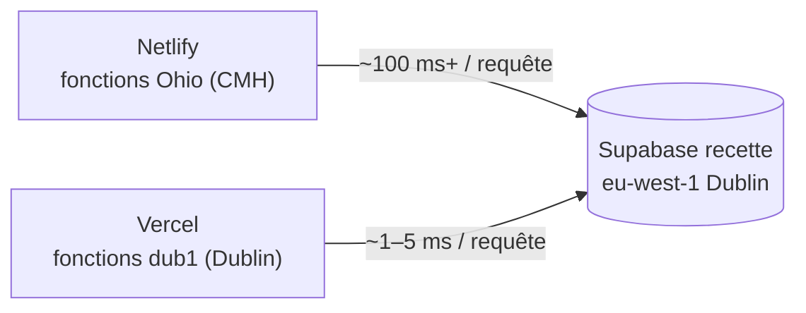

# Déploiement de test sur Vercel (mesure des performances)

> **Statut : expérimental.** L'hébergement de référence reste **Netlify**
> (cf. [05-git-et-deploiement.md](conventions/05-git-et-deploiement.md)).
> Vercel sert uniquement à comparer les temps de réponse, **sur la base de
> recette**. `netlify.toml` est conservé tel quel : chaque hébergeur ignore la
> configuration de l'autre.

## 1. Pourquoi

Diagnostic du 2026-10-07 : les fonctions Netlify (offre gratuite) tournent en
**Ohio (CMH)** alors que Supabase recette est à **Dublin (eu-west-1)**. Chaque
aller-retour serveur ↔ base coûte 130–1000 ms. Vercel, même en offre gratuite
(Hobby), permet de **choisir la région des fonctions** : on la fixe à `dub1`
(Dublin), au plus près de la base.

## 2. Ce qui est versionné

`vercel.json` à la racine :

| Clé | Valeur | Effet |
|-----|--------|-------|
| `framework` | `nextjs` | Détection explicite du framework |
| `buildCommand` | `npm run build` | Même build que Netlify |
| `regions` | `["dub1"]` | Fonctions (Server Components, Server Actions, routes, `proxy.ts`) exécutées à Dublin |
| `git.deploymentEnabled.main` | `false` | **Aucun déploiement Vercel depuis `main`** : la prod reste exclusivement sur Netlify |

Rien d'autre ne change dans le code : `next.config.ts`, `proxy.ts` et les
helpers Supabase fonctionnent tels quels.

## 3. Mise en place (une seule fois)

### 3.1 Créer le projet Vercel

1. Se connecter sur <https://vercel.com> avec le compte GitHub.
2. **Add New… → Project** → importer le dépôt `interclub`.
3. Écran de configuration :
   - *Framework Preset* : **Next.js** (pré-rempli par `vercel.json`).
   - *Root Directory* : `./`.
   - *Build / Install / Output* : laisser les valeurs par défaut.
4. **Environment Variables** — saisir les trois variables du projet Supabase
   **recette** (mêmes valeurs que `.env.local`), cochées pour **Production**
   **et** **Preview** :

   | Variable | Valeur |
   |----------|--------|
   | `NEXT_PUBLIC_SUPABASE_URL` | URL du projet **recette** |
   | `NEXT_PUBLIC_SUPABASE_ANON_KEY` | clé `anon` **recette** |
   | `SUPABASE_SERVICE_ROLE_KEY` | clé `service_role` **recette** (secrète) |

   > **Jamais les clés de prod.** Sur Vercel, *tous* les environnements pointent
   > vers la recette.

5. **Deploy**.

### 3.2 Faire de `develop` la branche « Production » Vercel

Par défaut Vercel considère `main` comme branche de production. Comme `main`
est désactivée (`vercel.json`), on bascule :

1. *Project → Settings → Environments → Production → Branch Tracking*.
2. Remplacer `main` par **`develop`** → *Save*.

Résultat : un `push` sur `develop` déploie sur l'URL stable
`https://<projet>.vercel.app` ; une branche `feature/*` produit une URL de
preview, toutes sur base recette.

### 3.3 Vérifier la région

*Project → Settings → Functions → Function Region* doit afficher
**Dublin, Ireland (West) – dub1**. Si ce n'est pas le cas, la sélectionner
(l'offre Hobby autorise une seule région).

### 3.4 Supabase

Aucun réglage nécessaire : l'authentification utilise
`signInWithPassword` / `signInAnonymously` (sessions éphémères QR), sans lien
e-mail ni URL de redirection. Le domaine Vercel n'a pas à être déclaré dans
*Auth → URL Configuration*.

## 4. Déployer

| Méthode | Commande / action | Quand |
|---------|-------------------|-------|
| Git (automatique) | `git push` sur `develop` ou une `feature/*` | Usage normal : Netlify **et** Vercel déploient en parallèle |
| CLI (ponctuel) | `npx vercel` (preview) / `npx vercel --prod` | Tester sans pousser |

Pour la CLI, la première fois : `npx vercel login` puis `npx vercel link`
(crée `.vercel/`, déjà ignoré par git). Les variables d'environnement sont
celles du projet Vercel ; `npx vercel env pull .env.vercel.local` permet de les
vérifier localement (ne pas commiter).

## 5. Comparer les performances

Toujours comparer **la même page, même compte, même données**, après un
premier chargement « à chaud » (le démarrage à froid d'une fonction fausse la
première mesure).

1. **Vérifier où tourne la fonction** — DevTools → Network → requête du
   document → en-tête `x-vercel-id`, par ex. `cdg1::dub1::abcd-…` : le premier
   code est le point d'entrée CDN, le second la région d'exécution (doit être
   `dub1`).
2. **Temps serveur** — colonne *Waiting for server response (TTFB)* de la
   requête document et des requêtes POST de Server Actions, sur Netlify puis
   sur Vercel. Faire 5 mesures et garder la médiane.
3. **Logs** — *Vercel → Project → Logs* affiche la durée de chaque invocation ;
   à rapprocher des logs de fonctions Netlify.

Écrans conseillés (les plus riches en requêtes) : classement d'une rencontre,
contrôle des résultats, saisie coach, écran juge vitesse.

## 6. Limites connues

- **Corps de requête limité à 4,5 Mo** sur les fonctions Vercel, alors que
  `next.config.ts` autorise 10 Mo pour les Server Actions (import des
  licenciés, spec #13). Un fichier `.xlsx` de plus de 4,5 Mo échouera sur
  Vercel (erreur 413) ; sans impact pour la mesure de performance.
- **Offre Hobby** : usage non commercial, quotas mensuels (invocations, bande
  passante) largement suffisants pour un test.
- Netlify et Vercel déploient **en parallèle** à chaque `push` : les deux URLs
  partagent la même base recette (les données saisies sur l'une sont visibles
  sur l'autre).

## 7. Revenir en arrière

Pour arrêter l'essai : supprimer le projet sur Vercel (*Settings → Advanced →
Delete Project*) puis supprimer `vercel.json` et ce guide. Netlify n'est pas
touché.
