# Guide utilisateur — Administrateur

> **Public** : organisateurs et administrateurs de la compétition interclubs.
>
> **Captures** : générées automatiquement par `npm run doc:captures` (voir
> [Mettre à jour les captures](#mettre-à-jour-les-captures)). Les numéros roses
> sur les captures renvoient à la colonne « N° » des tableaux.

## Sommaire

1. [Avant de commencer](#1-avant-de-commencer)
2. [Tableau de bord](#2-tableau-de-bord)
3. [Clubs et invitations des coachs](#3-clubs-et-invitations-des-coachs)
4. [Grimpeurs et imports](#4-grimpeurs-et-imports)
5. [Gabarit de rencontre](#5-gabarit-de-rencontre)
6. [Rencontres](#6-rencontres)
7. [Tableau de bord d'une rencontre](#7-tableau-de-bord-dune-rencontre)
8. [Jetons QR : coachs temporaires et juges](#8-jetons-qr--coachs-temporaires-et-juges)
9. [Le jour J : saisie et affichage](#9-le-jour-j--saisie-et-affichage)
10. [Après la compétition : contrôle et publication](#10-après-la-compétition--contrôle-et-publication)
11. [Rôles et comptes](#11-rôles-et-comptes)
12. [Questions fréquentes](#12-questions-fréquentes)

## 1. Avant de commencer

L'administrateur prépare et pilote la compétition : il gère les **clubs**, les
**grimpeurs** et les **rencontres**, fait avancer chaque rencontre de phase en
phase, distribue les **QR** des coachs temporaires et des juges, et corrige,
contrôle puis publie les résultats. Il agit sur **tous les clubs**.

L'espace administrateur s'utilise de préférence sur **ordinateur** ; il reste
utilisable sur tablette et téléphone.

### Les phases d'une rencontre

Chaque rencontre suit cinq phases, dans l'ordre. **Seul l'administrateur** les
fait évoluer, une étape à la fois, en avant ou en arrière.

| Phase | Coachs | Juges | Administrateur |
| --- | --- | --- | --- |
| ① Pré-compétition | Le coach permanent engage ses équipes | — | Modifie la structure (voies, blocs, vitesse) |
| ② Préparation (jour J) | Coachs permanent et temporaire ajustent les équipes | — | Structure verrouillée |
| ③ Compétition (jour J) | Saisie des voies et blocs ; équipes figées | Saisie de la vitesse | Saisit et corrige tous les résultats |
| ④ Clôture | Saisie fermée | Saisie fermée | Corrige et contrôle les résultats |
| ⑤ Résultats publics | Classement officiel | — | Exporte le classement en PDF |

Deux garde-fous à connaître :

- **Jour J** : une rencontre ne peut entrer en ② préparation ou ③ compétition
  que **le jour de sa date**. Le bouton reste inactif les autres jours.
- **Passage en ④ clôture** : toute voie ou tout bloc attendu et non saisi est
  automatiquement noté **NP** (non présenté, 0 point). La vitesse n'est pas
  concernée : un grimpeur sans résultat de vitesse compte 0 point.

### Déroulé type

1. **En début de saison** : créer les clubs, importer les grimpeurs, vérifier le
   gabarit, transmettre aux coachs l'invitation de leur club.
2. **Pour chaque rencontre** : la créer, ajuster sa structure en ①, laisser les
   coachs engager leurs équipes, organiser les prêts éventuels.
3. **Le jour J** : passer en ② préparation, distribuer les QR, passer en ③
   compétition au début des épreuves, lancer l'écran d'affichage.
4. **Après les épreuves** : passer en ④ clôture, contrôler les résultats contre
   les fiches des juges, corriger si besoin, puis passer en ⑤ et exporter le
   classement officiel.

## 2. Tableau de bord

Page d'accueil de l'administrateur : vue d'ensemble de la compétition et
raccourcis vers chaque écran.

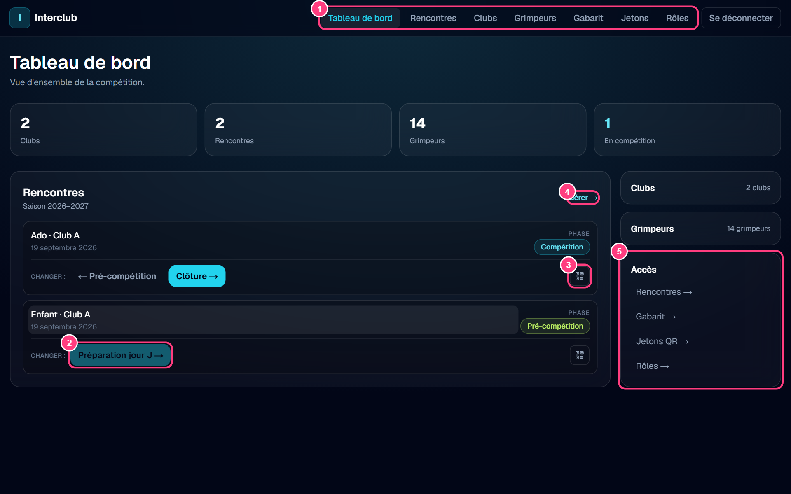

| N° | Élément | Effet |
| --- | --- | --- |
| 1 | Barre de navigation | Accès à tous les écrans : Rencontres, Clubs, Grimpeurs, Gabarit, Jetons, Rôles |
| 2 | Bouton de phase | Fait avancer (ou reculer) la rencontre d'une phase, sans quitter le tableau de bord |
| 3 | Icône QR | Ouvre les jetons QR de cette rencontre |
| 4 | Gérer | Ouvre l'écran complet des rencontres |
| 5 | Accès | Raccourcis vers les écrans de paramétrage |

En tête, quatre compteurs : clubs, rencontres, grimpeurs et rencontres en cours
de compétition. La carte **Rencontres** montre les 5 rencontres les plus
récentes de la saison en cours.

## 3. Clubs et invitations des coachs

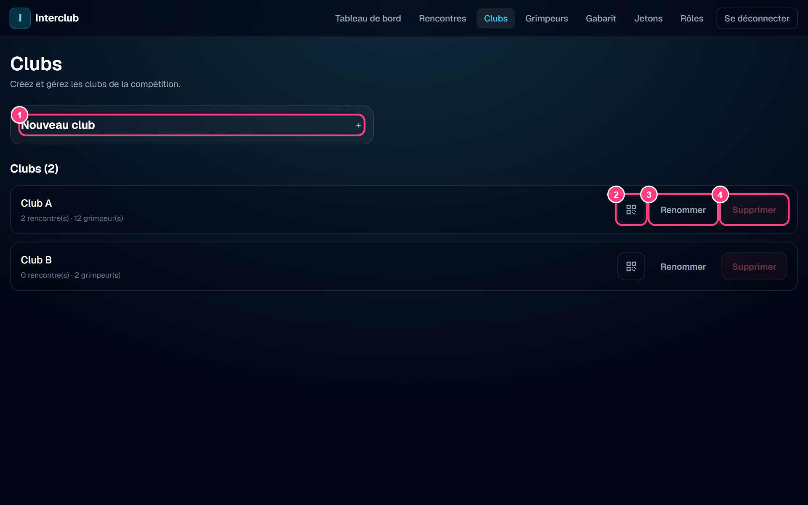

| N° | Élément | Effet |
| --- | --- | --- |
| 1 | Nouveau club | Ouvre le formulaire de création |
| 2 | Icône QR | Affiche l'invitation coach du club (ou la génère) |
| 3 | Renommer | Modifie le nom du club |
| 4 | Supprimer | Supprime le club |

Le nom d'un club est obligatoire, unique et limité à 100 caractères. Chaque
ligne indique le nombre de rencontres et de grimpeurs du club : un club n'est
**supprimable que s'il n'a ni rencontre ni grimpeur** (le bouton est désactivé
sinon).

### Inviter les coachs d'un club

Chaque club dispose d'une **invitation coach** : un QR et le lien
correspondant. En l'ouvrant, un coach crée son compte, qui est
**automatiquement rattaché à ce club**.

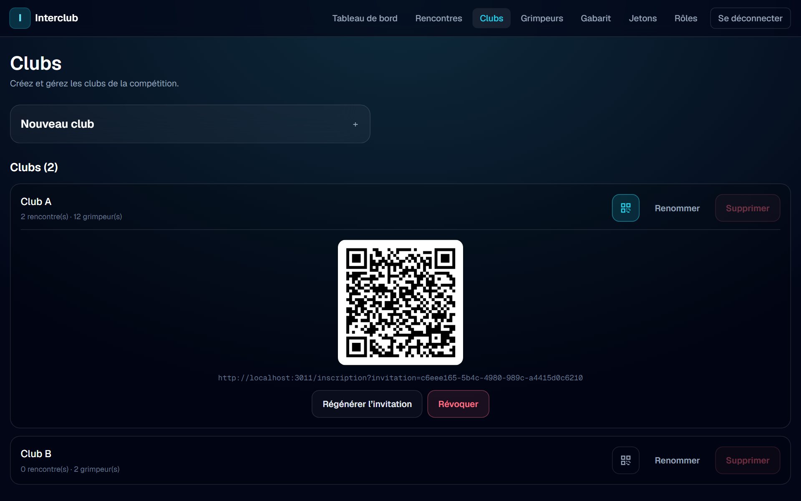

- L'invitation est **durable et réutilisable** : tous les coachs du club peuvent
  s'inscrire avec la même.
- **Régénérer l'invitation** la remplace : l'ancienne ne fonctionne plus. Les
  comptes déjà créés restent valides.
- **Révoquer** la désactive sans la remplacer.

## 4. Grimpeurs et imports

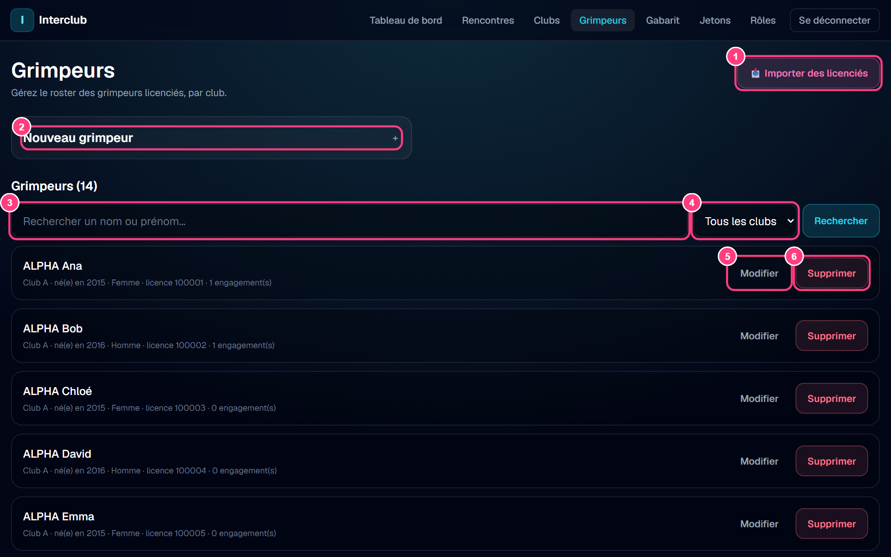

| N° | Élément | Effet |
| --- | --- | --- |
| 1 | Importer des licenciés | Ouvre l'import du fichier de la fédération |
| 2 | Nouveau grimpeur | Ouvre le formulaire de création |
| 3 | Rechercher un nom ou prénom | Filtre la liste |
| 4 | Tous les clubs | Restreint la liste à un club |
| 5 | Modifier | Modifie le grimpeur, y compris son club |
| 6 | Supprimer | Supprime le grimpeur |

Un grimpeur porte un **club**, un **nom**, un **prénom**, une **année de
naissance**, un **sexe** et un **numéro de licence**, obligatoire et unique. La
catégorie (Enfant ou Ado) n'est pas saisie : elle découle de l'âge.

**Attention** : supprimer un grimpeur supprime aussi ses engagements et tous ses
résultats ; la confirmation le signale.

Les numéros de licence à partir de **2 000 000 000** sont réservés aux licences
**générées** par l'import CSV sans licence ; ils sont suivis de la mention
« générée » dans la liste.

### Importer les licenciés de la fédération

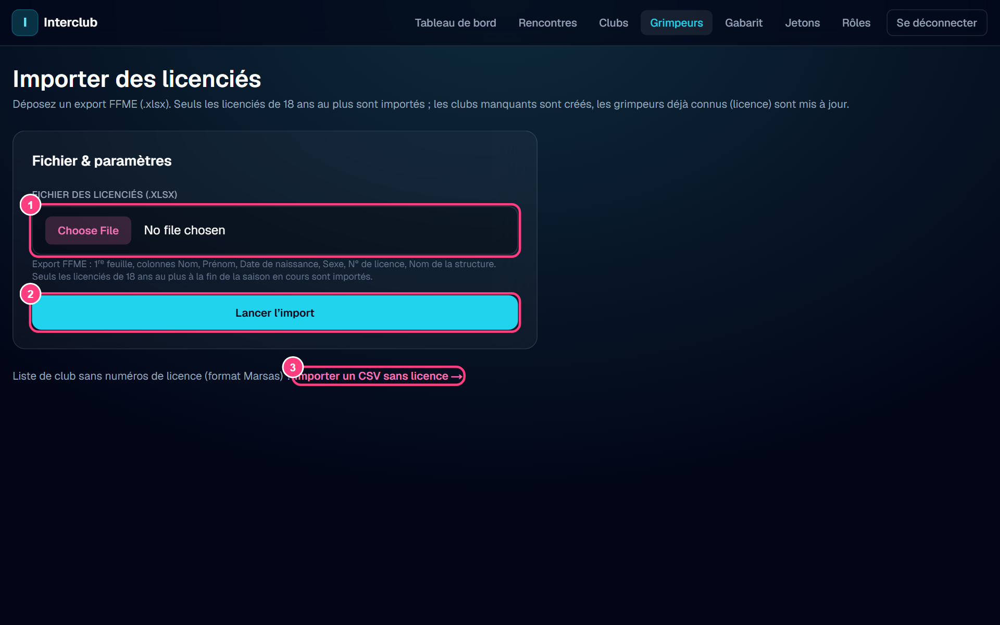

| N° | Élément | Effet |
| --- | --- | --- |
| 1 | Fichier | Fichier `.xlsx` exporté de la fédération |
| 2 | Lancer l'import | Analyse le fichier puis importe les lignes valides |
| 3 | Importer un CSV sans licence | Ouvre l'import des grimpeurs sans licence |

- **Format** : un fichier `.xlsx`, lu sur sa première feuille, avec les colonnes
  Nom, Prénom, Date de naissance (`JJ/MM/AAAA`), Sexe, N° de licence et nom de
  la structure (le club).
- **Âge** : seuls les licenciés de **18 ans au plus** à la fin de la saison sont
  importés ; les autres sont ignorés, sans erreur.
- **Clubs** : chaque grimpeur est rattaché au club qui porte exactement le nom
  de sa structure ; un club absent est **créé automatiquement**.
- **Mise à jour** : un grimpeur dont la licence existe déjà est **mis à jour**
  (identité, sexe, club), pas dupliqué.
- **Lignes en erreur** : elles sont écartées, les autres sont importées. Si la
  base refuse l'écriture, **rien** n'est importé.

Un **compte-rendu** s'affiche ensuite : grimpeurs créés, mis à jour, ignorés
pour l'âge, lignes en erreur (avec leur numéro et la raison), clubs créés.

### Importer un CSV sans licence

Pour les grimpeurs non licenciés à la fédération (format « Marsas »).

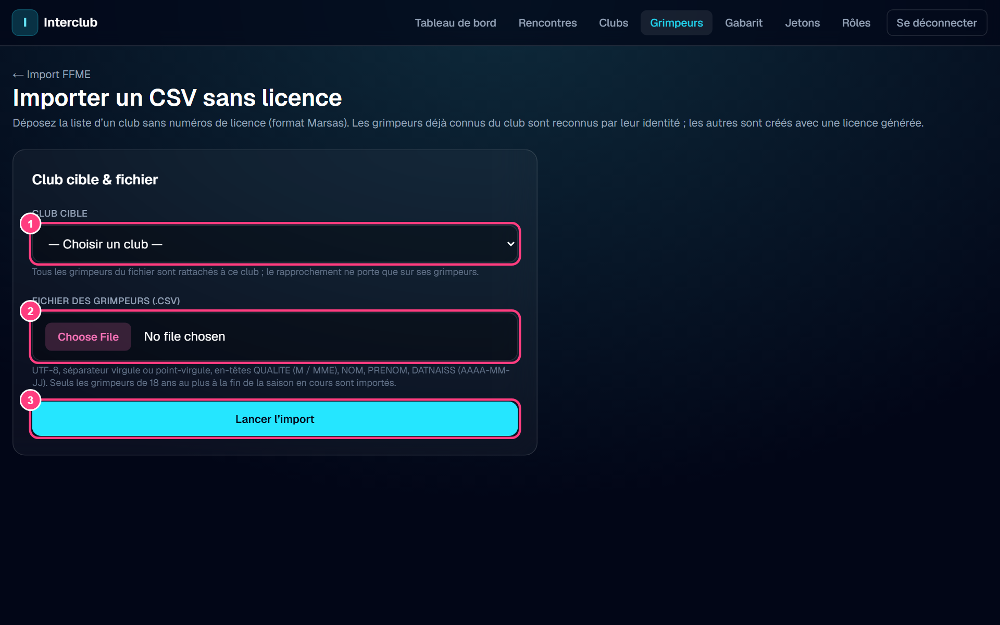

| N° | Élément | Effet |
| --- | --- | --- |
| 1 | Club cible | Club auquel les grimpeurs seront rattachés (obligatoire) |
| 2 | Fichier | Fichier `.csv` |
| 3 | Lancer l'import | Analyse le fichier puis importe les lignes valides |

- **Format** : un fichier `.csv` en UTF-8, séparé par des virgules ou des
  points-virgules, avec les colonnes `QUALITE`, `NOM`, `PRENOM`, `DATNAISS`.
  `M` donne un homme, `MME` une femme.
- **Accents perdus** : une ligne contenant le caractère `�` est rejetée ;
  corriger le fichier et relancer.
- **Déjà présents** : un grimpeur du club cible de même sexe, nom, prénom et
  année de naissance n'est pas recréé.
- **Licence** : chaque nouveau grimpeur reçoit une **licence générée**. Elle
  peut être remplacée plus tard par le vrai numéro (bouton **Modifier**).

Le compte-rendu indique les grimpeurs créés, déjà présents, ignorés pour l'âge,
les doublons du fichier, et les lignes en erreur ou ambiguës.

## 5. Gabarit de rencontre

Le gabarit est le **modèle** d'une rencontre, un par catégorie (Enfant, Ado) :
blocs et leurs paliers, voies de vitesse et barème, voies de difficulté et
leurs points. Il est **copié** dans chaque nouvelle rencontre ; le modifier ne
change pas les rencontres déjà créées.

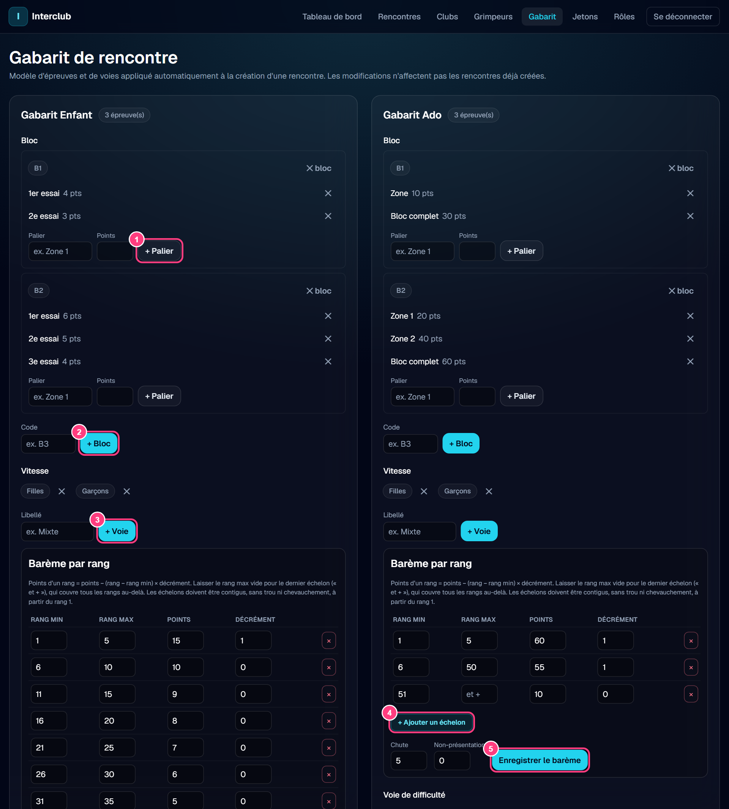

| N° | Élément | Effet |
| --- | --- | --- |
| 1 | + Palier | Ajoute un palier (libellé et points) à un bloc |
| 2 | + Bloc | Ajoute un bloc |
| 3 | + Voie (vitesse) | Ajoute une voie de vitesse (ex. « Filles », « Garçons ») |
| 4 | + Ajouter un échelon | Ajoute une ligne au barème de vitesse |
| 5 | Enregistrer le barème | Enregistre le barème de vitesse |

**Barème de vitesse** : les points dépendent du rang dans le classement de
vitesse de chaque sexe. Un échelon couvre une plage de rangs : `points − (rang −
rang min) × décrément`. Laisser le rang max vide pour le dernier échelon
(« et + »). Les échelons doivent se suivre à partir du rang 1, sans trou ni
chevauchement ; sinon l'enregistrement est refusé avec un message précis. Les
champs **Chute** et **Non-présentation** fixent les points de ces deux cas.

**Voies de difficulté** (bas de page) : niveau (`M1`–`M4` en moulinette pour les
enfants, `T1`–`T10` en tête), cotation et points (voie entière, prise valorisée
en Enfant, zones 1 et 2 en Ado).

## 6. Rencontres

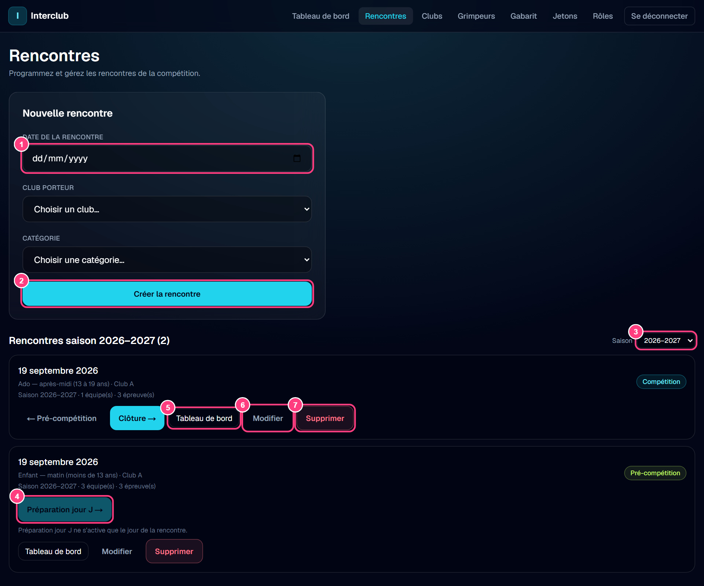

| N° | Élément | Effet |
| --- | --- | --- |
| 1 | Date de la rencontre | Date (obligatoire) ; avec le club porteur et la catégorie |
| 2 | Créer la rencontre | Crée la rencontre en ① pré-compétition, à partir du gabarit |
| 3 | Saison | Affiche les rencontres d'une autre saison |
| 4 | Bouton de phase | Fait avancer ou reculer la rencontre d'une phase |
| 5 | Tableau de bord | Ouvre le tableau de bord de la rencontre |
| 6 | Modifier | Modifie la date, le club porteur ou la catégorie |
| 7 | Supprimer | Supprime la rencontre |

La saison est calculée à partir de la date ; la saison en cours est affichée par
défaut.

**Attention** : supprimer une rencontre supprime aussi ses équipes, ses épreuves
et tous ses résultats ; la confirmation le signale.

## 7. Tableau de bord d'une rencontre

L'écran central de la préparation d'une rencontre : phase, structure, prêts et
équipes de tous les clubs.

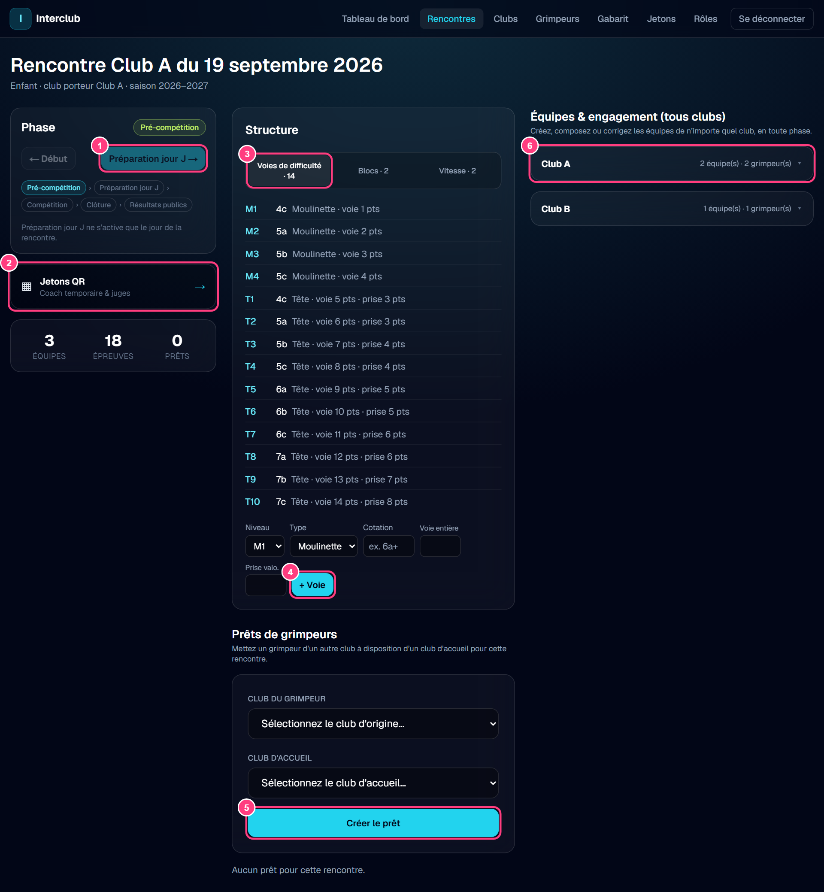

| N° | Élément | Effet |
| --- | --- | --- |
| 1 | Bouton de phase | Fait avancer la rencontre ; « ← » la fait reculer |
| 2 | Jetons QR | Ouvre les QR des coachs temporaires et des juges |
| 3 | Onglets de structure | Voies de difficulté, Blocs, Vitesse |
| 4 | + Voie | Ajoute une voie (ou un bloc, une voie de vitesse selon l'onglet) |
| 5 | Créer le prêt | Prête un grimpeur à un autre club pour cette rencontre |
| 6 | Bloc d'un club | Déplie les équipes de ce club |

**Structure** : modifiable **uniquement en ① pré-compétition**, par exemple pour
ajouter une 2ᵉ voie d'un niveau très demandé. Ensuite, elle est verrouillée.

**Prêts** : choisir le club du grimpeur, le grimpeur, puis le club d'accueil. Le
grimpeur apparaît alors chez les coachs du club d'accueil, qui l'engagent comme
les leurs. Seul l'administrateur crée ou met fin à un prêt. Un grimpeur prêté
compte pour l'équipe qui l'accueille, mais garde son club d'origine au
classement individuel.

### Équipes de tous les clubs

L'administrateur peut créer, composer ou corriger les équipes de n'importe quel
club, **en toute phase** (les coachs, eux, sont bloqués dès la ③).

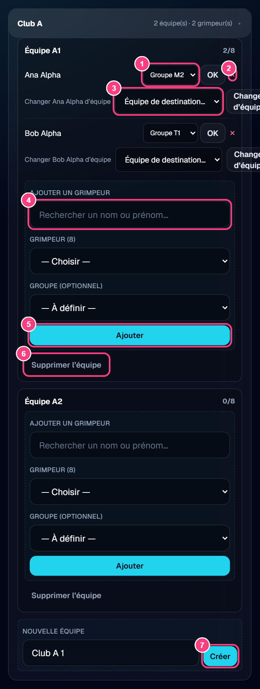

| N° | Élément | Effet |
| --- | --- | --- |
| 1 | Groupe | Groupe de départ du grimpeur (Enfant), validé par **OK** |
| 2 | × (Retirer) | Retire le grimpeur de l'équipe |
| 3 | Équipe de destination | Avec **Changer d'équipe** : déplace le grimpeur vers une autre équipe du même club |
| 4 | Rechercher | Filtre les grimpeurs proposés à l'ajout |
| 5 | Ajouter | Ajoute le grimpeur choisi à l'équipe |
| 6 | Supprimer l'équipe | Supprime l'équipe |
| 7 | Créer | Crée une nouvelle équipe pour ce club |

**Retirer ou changer d'équipe** : changer un grimpeur d'équipe **conserve** ses
résultats. Le **retirer** de la rencontre **supprime définitivement** ses
résultats, y compris sa vitesse, et recalcule les classements.

## 8. Jetons QR : coachs temporaires et juges

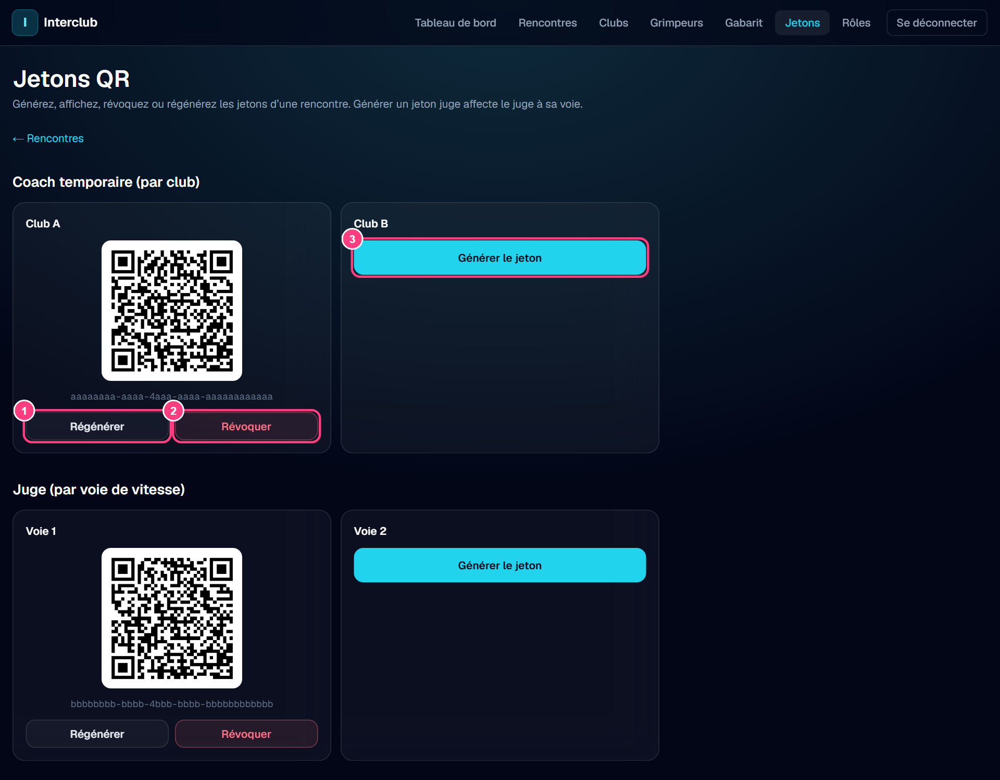

| N° | Élément | Effet |
| --- | --- | --- |
| 1 | Régénérer | Remplace le QR : l'ancien ne fonctionne plus, ses sessions sont fermées |
| 2 | Révoquer | Désactive le QR et ferme ses sessions |
| 3 | Générer le jeton | Crée le QR manquant |

Deux sortes de QR par rencontre :

- **Coach temporaire**, un par club : permet à une personne sans compte de tenir
  le rôle de coach de ce club, le jour J (② et ③). Les coachs permanents peuvent
  aussi le générer depuis leur espace.
- **Juge**, un par voie de vitesse : ouvre l'écran de saisie de la vitesse,
  pendant la ③ compétition uniquement. Tous les grimpeurs engagés y sont
  proposés, quel que soit le couloir.

Un QR peut être généré à l'avance ; il ne permet d'entrer que pendant sa
fenêtre. Plusieurs personnes peuvent utiliser le même QR. Les sessions se
ferment automatiquement à la fin de la fenêtre.

## 9. Le jour J : saisie et affichage

### Saisir ou corriger des résultats

En ③ compétition et en ④ clôture, l'administrateur saisit les résultats de
**n'importe quel grimpeur**, tous clubs confondus, en parallèle des coachs.

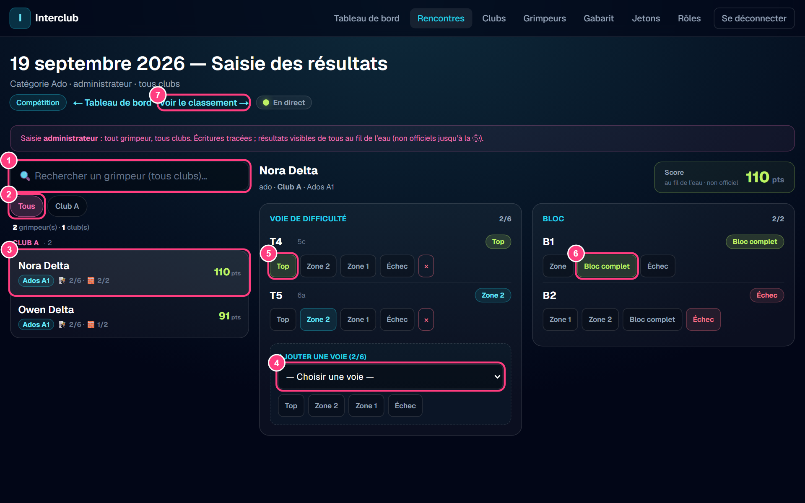

| N° | Élément | Effet |
| --- | --- | --- |
| 1 | Rechercher un grimpeur | Filtre la liste, tous clubs |
| 2 | Tous / un club | Restreint la liste à un club |
| 3 | Ligne d'un grimpeur | Ouvre sa saisie |
| 4 | Choisir une voie | Ajoute une voie (Ado) |
| 5 | Issue de la voie | Top, Zone 2, Zone 1, Échec (Ado) ; Top, Prise valorisée, Échec (Enfant) |
| 6 | Issue du bloc | Palier atteint ou Échec |
| 7 | Voir le classement | Ouvre le classement de la rencontre |

Les règles sont celles des coachs : une issue par voie et par bloc, la nouvelle
saisie remplace l'ancienne, 6 voies au plus en Ado. L'administrateur peut en
plus **remplacer un NP** posé à la clôture par le vrai résultat. Chaque
écriture garde son auteur (administrateur ou coach).

### Écran d'affichage (second écran)

Pour projeter le classement dans la salle, ouvrir **Écran d'affichage** depuis
le tableau de bord de la rencontre, sur l'ordinateur relié au projecteur, puis
passer le navigateur en plein écran (touche F11).

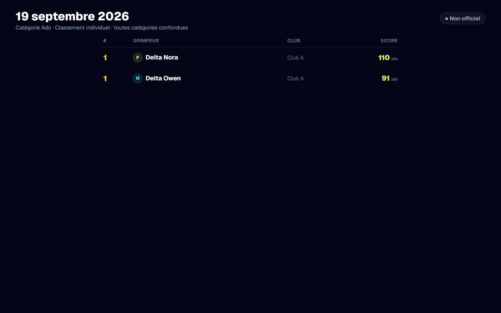

- Il affiche le **classement individuel**, filles et garçons mélangés par rang
  (étiquette F / H), avec le club et le score.
- La liste **défile toute seule** ; arrivée en bas, elle recharge les résultats
  et repart du début. Aucune action n'est nécessaire.
- Il indique si le classement est **officiel** ou non. Avant la ③, il affiche un
  écran d'attente.

## 10. Après la compétition : contrôle et publication

### Passer en clôture

Passer la rencontre en **④ clôture** ferme la saisie des coachs et des juges et
pose les NP automatiques. Le tableau de bord de la rencontre propose alors :

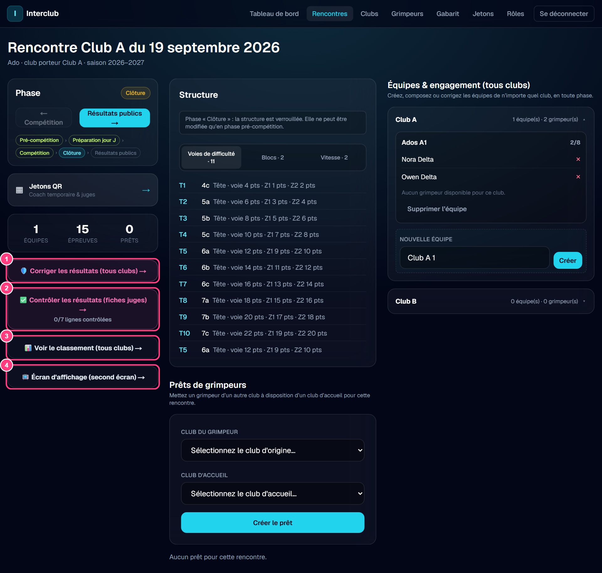

| N° | Élément | Effet |
| --- | --- | --- |
| 1 | Corriger les résultats | Ouvre la saisie administrateur |
| 2 | Contrôler les résultats | Ouvre le contrôle contre les fiches des juges, avec la progression |
| 3 | Voir le classement | Ouvre le classement de la rencontre |
| 4 | Écran d'affichage | Ouvre l'écran à projeter |

### Contrôler les résultats contre les fiches des juges

Fiche papier en main, l'administrateur coche chaque résultat qui concorde.

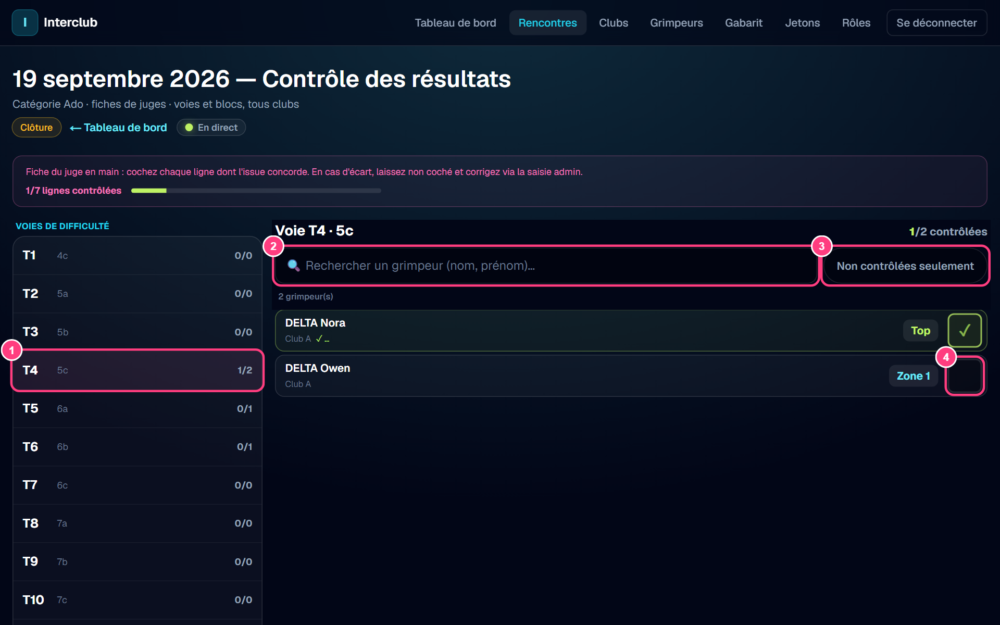

| N° | Élément | Effet |
| --- | --- | --- |
| 1 | Voie ou bloc | Affiche ses résultats ; la progression `n/m` s'affiche à droite |
| 2 | Rechercher un grimpeur | Filtre les lignes |
| 3 | Non contrôlées seulement | Masque les lignes déjà cochées |
| 4 | Case à cocher | Atteste que le résultat concorde avec la fiche |

- Les lignes sont triées par nom, avec l'issue telle que saisie (sans points).
  La vitesse n'apparaît pas.
- Chaque coche est **enregistrée immédiatement** et garde son auteur et
  l'heure. Plusieurs administrateurs peuvent contrôler en même temps : les
  coches des autres apparaissent en direct.
- **En cas d'écart** : laisser la ligne non cochée et corriger le résultat via
  **Corriger les résultats**. La coche d'une ligne corrigée est conservée.
- Le contrôle **ne bloque pas** la publication. En ⑤, l'écran passe en lecture
  seule.

### Publier et exporter le classement officiel

Passer la rencontre en **⑤ résultats publics** rend le classement **officiel**.
L'écran de classement propose alors l'export PDF.

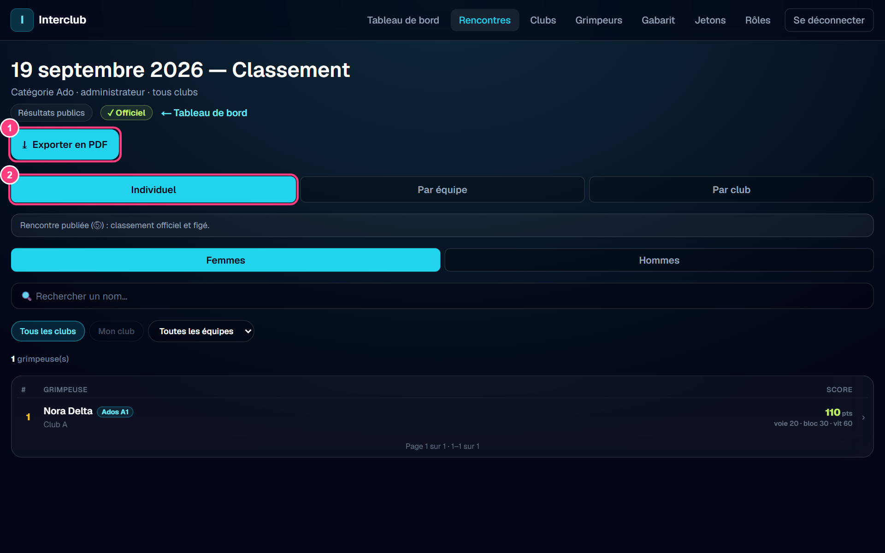

| N° | Élément | Effet |
| --- | --- | --- |
| 1 | Exporter en PDF | Télécharge le classement officiel |
| 2 | Individuel / Par équipe / Par club | Choix du classement affiché |

Le fichier `classement-AAAA-MM-JJ-categorie.pdf` contient quatre sections :
individuel filles, individuel garçons, équipes, clubs. Il est identique pour
tous ceux qui l'exportent (les coachs des clubs engagés y ont aussi accès).

Revenir en ④ retire le caractère officiel et l'export jusqu'à la prochaine
publication.

## 11. Rôles et comptes

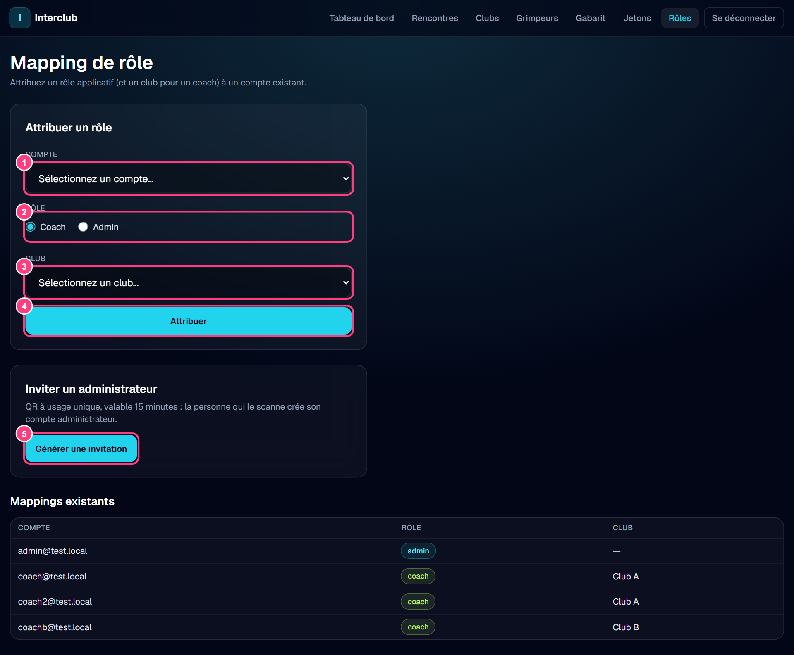

| N° | Élément | Effet |
| --- | --- | --- |
| 1 | Compte | Compte existant à qui attribuer un rôle |
| 2 | Rôle | Coach ou Admin |
| 3 | Club | Club du coach (rôle Coach uniquement) |
| 4 | Attribuer | Enregistre le rôle |
| 5 | Générer une invitation | Crée une invitation administrateur |

- Un compte **sans rôle** n'a accès à rien. Le rôle de coach est attribué
  automatiquement par l'invitation du club ([§ 3](#3-clubs-et-invitations-des-coachs)) ;
  cet écran sert à corriger ou compléter.
- **Invitation administrateur** : un QR et un lien **à usage unique, valables
  15 minutes**. La personne qui l'ouvre crée un compte administrateur. Générer
  une nouvelle invitation annule la précédente ; elle peut aussi être révoquée.
  L'écran indique si elle est valable (avec le temps restant), utilisée,
  expirée ou révoquée.
- La liste du bas récapitule les rôles attribués.

## 12. Questions fréquentes

**Le bouton « Préparation jour J » est inactif.**
Une rencontre n'entre en ② ou ③ que le jour de sa date. Vérifier la date de la
rencontre (bouton **Modifier** dans la liste des rencontres).

**Un coach ne voit pas son club ou n'a accès à rien.**
Vérifier dans **Rôles** que son compte a le rôle Coach et le bon club.

**Un QR de juge ou de coach temporaire est refusé.**
Vérifier la phase : ③ pour un juge, ② ou ③ pour un coach temporaire. Si le QR a
été régénéré, distribuer le nouveau.

**Je ne peux plus modifier la structure (voies, blocs).**
Elle n'est modifiable qu'en ① pré-compétition. Revenir en ① si la rencontre n'a
pas encore commencé.

**Un résultat est faux après la clôture.**
Le corriger via **Corriger les résultats** en ④ clôture. En ⑤, revenir d'abord
en ④.

**Un grimpeur importé a une « licence générée ».**
Il vient de l'import CSV sans licence. Remplacer le numéro par sa vraie licence
avec **Modifier** dès qu'elle est connue.

## Mettre à jour les captures

Les captures sont produites par `scripts/captures/guide-admin.captures.ts`
(Playwright, format ordinateur) à partir du jeu de données de test :

1. Stack Supabase locale démarrée avec le seed (`npm run db:reset`).
2. `npm run doc:captures` (lance l'application sur le port 3011 si besoin).
3. Les PNG de `docs/guides/admin/captures/` sont réécrits ; les rencontres de
   test sont remises dans leur état initial à la fin.
