# Guide utilisateur — Coach

> **Public** : coachs de club, permanents (avec compte) et temporaires (accès par
> QR le jour de la rencontre).
>
> **Captures** : générées automatiquement au format téléphone par
> `npm run doc:captures` (voir [Mettre à jour les captures](#mettre-à-jour-les-captures)).
> Les numéros roses sur les captures renvoient à la colonne « N° » des tableaux.

## Sommaire

1. [Avant de commencer](#1-avant-de-commencer)
2. [Créer son compte et se connecter](#2-créer-son-compte-et-se-connecter)
3. [Mes rencontres](#3-mes-rencontres)
4. [Engager ses équipes](#4-engager-ses-équipes)
5. [Jetons QR du coach temporaire](#5-jetons-qr-du-coach-temporaire)
6. [Saisir les résultats](#6-saisir-les-résultats)
7. [Consulter le classement](#7-consulter-le-classement)
8. [Coach temporaire (accès par QR)](#8-coach-temporaire-accès-par-qr)
9. [Questions fréquentes](#9-questions-fréquentes)

## 1. Avant de commencer

L'application sert à préparer et suivre une rencontre interclubs : le coach y
**engage les équipes** de son club, **saisit les résultats** de ses grimpeurs
pendant la compétition et **suit le classement** en direct. Elle s'utilise
depuis un téléphone, dans un navigateur ; il n'y a rien à installer.

Le coach n'agit que sur **son club** : il ne voit ni ne modifie les équipes ou
les résultats saisis par les autres clubs. Seuls les classements sont communs à
tous.

### Les deux profils de coach

| Profil | Comment il accède | Ce qu'il peut faire |
| --- | --- | --- |
| **Coach permanent** | Compte personnel (e-mail + mot de passe) | Toutes les rencontres de son club, engagement, jetons QR, résultats, classement |
| **Coach temporaire** | Scan d'un QR le jour J | Sa seule rencontre : engagement (en préparation), résultats, classement |

Le coach temporaire est une personne de confiance (parent, encadrant…) qui aide
le jour de la rencontre sans avoir de compte. Le coach permanent lui transmet le
QR de la rencontre (voir [§ 5](#5-jetons-qr-du-coach-temporaire)).

### Les phases d'une rencontre

Ce que le coach peut faire dépend de la **phase** affichée sur la rencontre :

| Phase | Engagement des équipes | Saisie des résultats | Classement |
| --- | --- | --- | --- |
| ① Pré-compétition | Coach permanent | — | — |
| ② Préparation (jour J) | Coach permanent et temporaire | — | — |
| ③ Compétition | Figé (admin uniquement) | Oui | Non officiel, en direct |
| ④ Clôture | Figé | Fermée | Non officiel |
| ⑤ Résultats publics | Figé | Fermée | Officiel |

C'est l'**organisateur** de la rencontre qui fait passer d'une phase à la
suivante ; le coach ne peut pas changer la phase. En pratique :

- **Avant le jour J (①)** : le coach permanent prépare ses équipes à distance.
- **Le jour J, avant les épreuves (②)** : dernier moment pour ajuster les
  équipes et les groupes de départ, avec l'aide éventuelle d'un coach
  temporaire.
- **Pendant les épreuves (③)** : les équipes sont figées, le coach saisit les
  résultats de ses grimpeurs.
- **À la clôture (④)** : la saisie est fermée. Toute voie ou tout bloc attendu
  et non saisi est automatiquement noté **NP** (non présenté, 0 point). Une
  erreur se signale alors à l'organisateur, seul à pouvoir corriger.
- **À la publication (⑤)** : les classements deviennent officiels.

## 2. Créer son compte et se connecter

### Créer son compte (première fois)

L'organisateur transmet au coach une **invitation propre à son club** (un lien
ou un QR code). En l'ouvrant, le coach arrive sur l'écran d'inscription ; le
compte créé est **automatiquement rattaché à ce club**, sans autre démarche.
Plusieurs coachs d'un même club peuvent utiliser la même invitation.

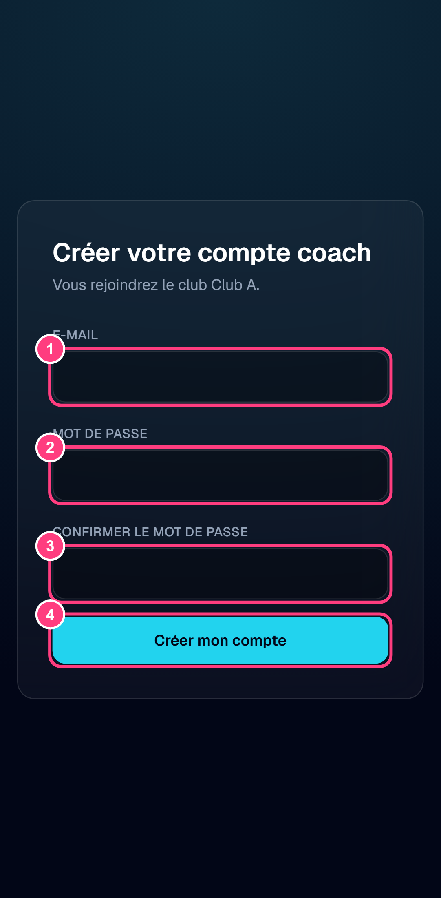

| N° | Élément | Effet |
| --- | --- | --- |
| 1 | E-mail | Adresse qui servira d'identifiant |
| 2 | Mot de passe | Au moins 6 caractères |
| 3 | Confirmer le mot de passe | Doit être identique au précédent |
| 4 | Créer mon compte | Crée le compte et renvoie vers la connexion |

Si l'e-mail a déjà un compte, l'inscription est refusée : il suffit de se
connecter. Si l'invitation a été révoquée ou remplacée par l'organisateur,
l'écran l'indique ; demander alors la nouvelle invitation.

### Se connecter

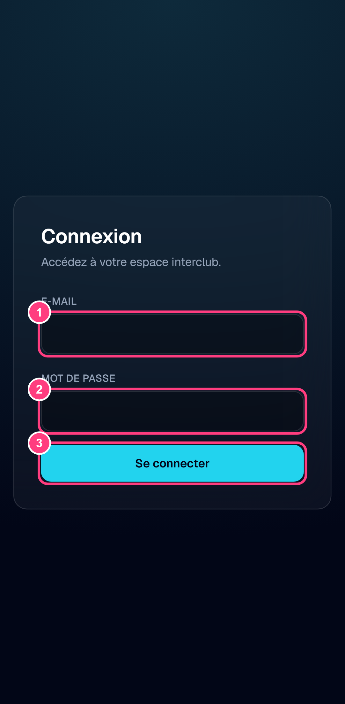

| N° | Élément | Effet |
| --- | --- | --- |
| 1 | E-mail | Identifiant du compte |
| 2 | Mot de passe | — |
| 3 | Se connecter | Ouvre « Mes rencontres » |

**Mot de passe oublié** : l'application ne propose pas de réinitialisation en
libre-service. Contacter l'organisateur.

## 3. Mes rencontres

Page d'accueil du coach : les rencontres où son club peut être ou est engagé,
les plus actionnables en premier.

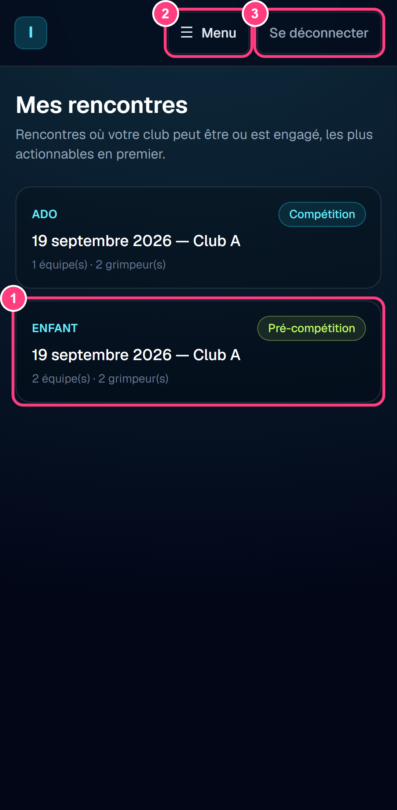

| N° | Élément | Effet |
| --- | --- | --- |
| 1 | Carte d'une rencontre | Ouvre l'engagement des équipes — ou directement la saisie des résultats si la rencontre est en ③ compétition |
| 2 | Menu | Ouvre la navigation (voir ci-dessous) |
| 3 | Se déconnecter | Ferme la session |

Chaque carte indique :

- la **catégorie** (Enfant ou Ado) et la **phase** en cours ;
- la **date** et le **club organisateur** ;
- le nombre d'**équipes** et de **grimpeurs** déjà engagés par votre club.

Les rencontres sont triées par urgence : d'abord celles en ② préparation, puis
③ compétition, ① pré-compétition, et enfin les rencontres terminées.

### Le menu

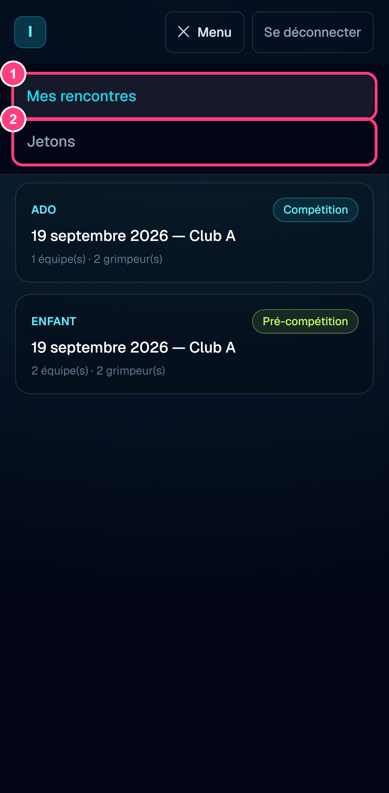

| N° | Élément | Effet |
| --- | --- | --- |
| 1 | Mes rencontres | Retour à la liste des rencontres |
| 2 | Jetons | Gestion des QR du coach temporaire ([§ 5](#5-jetons-qr-du-coach-temporaire)) |

## 4. Engager ses équipes

Disponible en ① pré-compétition (coach permanent) et ② préparation (coach
permanent et temporaire). Dès la ③ compétition, la composition est figée.

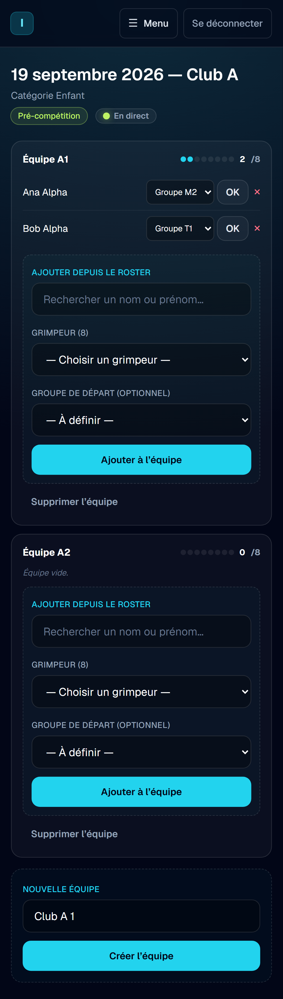

L'en-tête rappelle la rencontre (date, club organisateur, catégorie, phase).
L'écran présente ensuite **une carte par équipe** du club, avec ses grimpeurs et
son effectif : les pastilles et le compteur « 2 /8 » indiquent le nombre de
grimpeurs sur les **8 maximum** autorisés par équipe. Une équipe de moins de 8
grimpeurs est acceptée.

L'indicateur **« En direct »** signale que l'écran se met à jour tout seul : si
un autre coach du club ou l'organisateur modifie l'engagement, les changements
apparaissent sans recharger la page.

Hors des phases ① et ②, l'écran reste consultable mais les formulaires
disparaissent : la composition ne peut plus être modifiée que par
l'organisateur.

### Composer une équipe

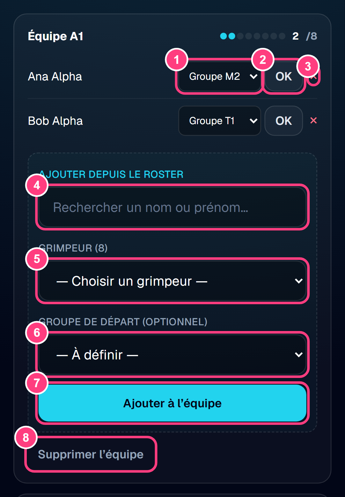

| N° | Élément | Effet |
| --- | --- | --- |
| 1 | Groupe de départ (liste) | Choisit le groupe du grimpeur (M1–M4, T1–T8) |
| 2 | OK | Enregistre le groupe choisi |
| 3 | × (Retirer) | Retire le grimpeur de l'équipe |
| 4 | Rechercher un nom ou prénom | Filtre la liste des grimpeurs du club |
| 5 | Grimpeur | Choisit un grimpeur du club non encore engagé |
| 6 | Groupe de départ (optionnel) | Groupe attribué dès l'ajout ; peut rester « À définir » |
| 7 | Ajouter à l'équipe | Ajoute le grimpeur choisi |
| 8 | Supprimer l'équipe | Supprime l'équipe et sa composition |

**Ajouter un grimpeur** : la liste ne propose que les grimpeurs du club
**éligibles à la catégorie** de la rencontre (Enfant : moins de 13 ans ; Ado :
13 à 19 ans ; les grimpeurs de 13 ans sont éligibles aux deux). Le champ de
recherche accepte plusieurs mots dans n'importe quel ordre, sans tenir compte
des majuscules ni des accents (« ana alp » trouve « Ana Alpha ») ; si un seul
grimpeur correspond, il est présélectionné.

**Un grimpeur, une équipe** : un grimpeur ne peut être engagé que dans **une
seule équipe** par rencontre. Pour le changer d'équipe, le retirer (×) puis
l'ajouter à l'autre équipe.

**Groupe de départ (catégorie Enfant uniquement)** : il détermine les **3 voies
de niveau croissant** que l'enfant va grimper. Par exemple, M2 donne M2, M3,
M4 ; M4 donne M4, T1, T2. Le groupe peut être laissé « À définir » à l'ajout,
mais il doit être fixé avant la compétition. Pour la catégorie Ado, il n'y a pas
de groupe de départ.

**Grimpeurs prêtés** : un grimpeur d'un autre club peut être prêté à votre club
pour compléter une équipe. C'est l'**organisateur** qui met en place le prêt ;
le grimpeur apparaît alors dans votre liste avec un badge « Prêté » et son club
d'origine, et se gère comme les vôtres. Le retirer d'une équipe le remet dans
votre liste, le prêt reste actif ; seul l'organisateur y met fin.

### Créer une équipe

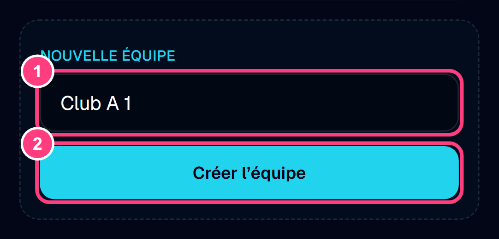

| N° | Élément | Effet |
| --- | --- | --- |
| 1 | Nom de l'équipe | Pré-rempli « &lt;club&gt; N », modifiable |
| 2 | Créer l'équipe | Ajoute une équipe vide à composer |

Un club peut engager plusieurs équipes dans la même rencontre, à condition
qu'elles aient des noms différents.

## 5. Jetons QR du coach temporaire

Réservé au coach permanent. Le jeton permet à une autre personne (parent,
encadrant…) de tenir le rôle de coach **le jour de la rencontre**, sans compte.

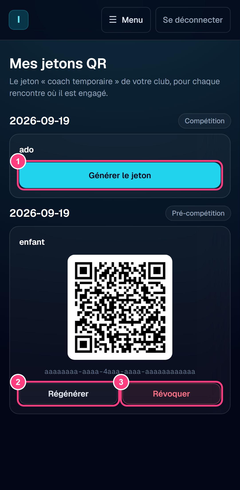

| N° | Élément | Effet |
| --- | --- | --- |
| 1 | Générer le jeton | Crée le QR de la rencontre |
| 2 | Régénérer | Remplace le QR : l'ancien ne fonctionne plus |
| 3 | Révoquer | Désactive le QR définitivement |

Il y a **un QR par rencontre** pour votre club. Il peut être généré à l'avance,
mais il ne permet d'entrer que le **jour J**, pendant les phases ② préparation
et ③ compétition. Plusieurs personnes peuvent scanner le même QR.

**Transmettre le QR** : montrer l'écran pour qu'il soit scanné, ou envoyer une
capture d'écran ou une impression. Toute personne qui possède le QR peut agir
comme coach de votre club pour cette rencontre : ne le diffusez qu'aux personnes
de confiance.

**Régénérer ou révoquer** : si le QR a circulé par erreur, **régénérez-le** pour
en obtenir un nouveau ; l'ancien cesse aussitôt de fonctionner et les personnes
connectées avec lui sont déconnectées. **Révoquer** désactive le QR sans le
remplacer.

## 6. Saisir les résultats

Disponible en ③ compétition uniquement. La vitesse est saisie par le juge et
apparaît ici en lecture seule.

### Liste des grimpeurs

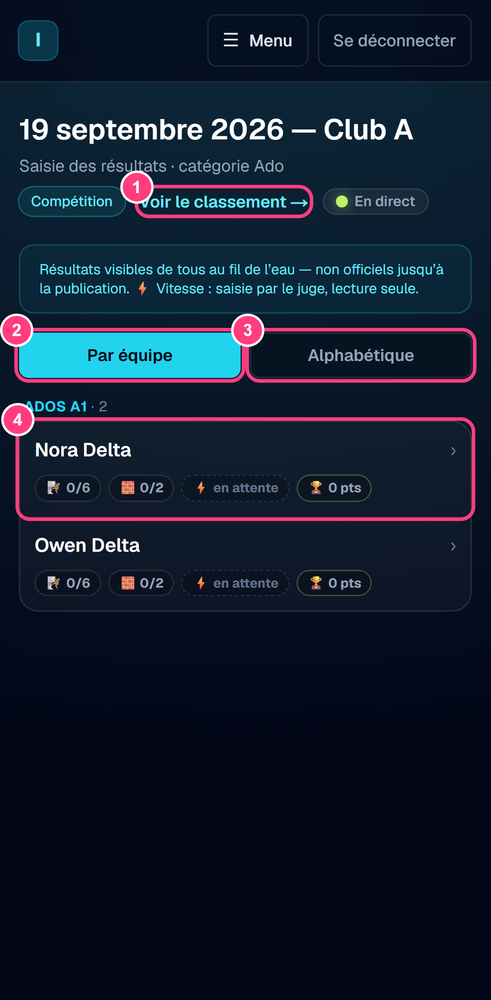

| N° | Élément | Effet |
| --- | --- | --- |
| 1 | Voir le classement | Ouvre le classement de la rencontre |
| 2 | Par équipe | Regroupe les grimpeurs par équipe |
| 3 | Alphabétique | Liste les grimpeurs par ordre alphabétique |
| 4 | Ligne d'un grimpeur | Ouvre sa fiche de saisie |

La vue **Alphabétique** permet de retrouver vite un grimpeur qui se présente.
Chaque ligne résume la progression du grimpeur :

| Pastille | Signification |
| --- | --- |
| 🧗 `0/6` | Voies de difficulté saisies (3 en Enfant, jusqu'à 6 en Ado) |
| 🧱 `0/2` | Blocs saisis (B1 et B2) |
| ⚡ | Vitesse : temps, chute, non présenté, ou « en attente » du juge |
| 🏆 | Score actuel (voie + bloc + vitesse), non officiel |

### Fiche d'un grimpeur

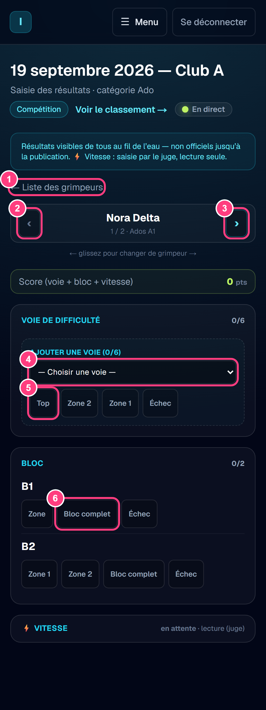

| N° | Élément | Effet |
| --- | --- | --- |
| 1 | ← Liste des grimpeurs | Retour à la liste |
| 2 | ‹ (Grimpeur précédent) | Passe au grimpeur précédent (ou glisser vers la droite) |
| 3 | › (Grimpeur suivant) | Passe au grimpeur suivant (ou glisser vers la gauche) |
| 4 | Choisir une voie | Sélectionne la voie de difficulté à saisir |
| 5 | Issue de la voie (Top, Zone 2, Zone 1, Échec) | Enregistre le résultat sur la voie |
| 6 | Issue du bloc (Zone, Bloc complet, Échec…) | Enregistre le résultat sur le bloc |

On saisit toujours la **meilleure tentative** du grimpeur : un seul résultat
par voie et par bloc.

**Voies de difficulté** :

- **Enfant** : les 3 voies découlent du groupe de départ et sont affichées
  directement ; l'ordre de saisie est libre. Issues : **Top**, **Prise
  valorisée** (voies en tête T1–T10 uniquement), **Échec**. Un enfant sans
  groupe de départ affiche « Groupe de départ à définir » : prévenir
  l'organisateur.
- **Ado** : le grimpeur choisit librement **jusqu'à 6 voies**. Choisir la voie
  dans la liste, puis l'issue : **Top**, **Zone 2**, **Zone 1** ou **Échec**.
  Une 7ᵉ voie est refusée.

**Blocs** : pour B1 et B2, toucher le palier atteint, ou **Échec**. En Enfant,
les paliers sont « 1er essai », « 2e essai » (et « 3e essai » pour B2) ; en Ado,
« Zone » / « Bloc complet » pour B1 et « Zone 1 » / « Zone 2 » / « Bloc complet »
pour B2.

**Corriger** : toucher simplement la bonne issue ; elle remplace la précédente.
En Ado, une voie saisie par erreur peut être retirée. Après la ④ clôture, seule
l'organisation peut corriger.

**Score** : le bandeau « Score (voie + bloc + vitesse) » se met à jour à chaque
saisie.

### Réseau faible ou coupé

Chaque saisie est d'abord gardée sur le téléphone, puis envoyée
automatiquement. Si le réseau est coupé, **continuez à saisir** :

- un bandeau indique « Hors ligne » et le nombre de saisies **en attente** ;
- les saisies partent toutes seules dès le retour du réseau, sans rien faire ;
- **ne fermez pas et ne rechargez pas la page** tant que des saisies sont en
  attente (le navigateur demande confirmation). Elles restent sur le téléphone
  et repartent à la prochaine ouverture de l'écran, mais l'écran de saisie ne
  peut pas s'ouvrir sans réseau.

Si deux personnes saisissent le même résultat, c'est la **saisie la plus
récente** qui compte. Une saisie peut être **rejetée**, par exemple si une
saisie plus récente existe déjà ou si la compétition a été clôturée entre-temps.
Les saisies rejetées sont listées avec leur motif depuis l'écran de saisie :
transmettez-les à l'organisateur.

Si la session a expiré, le bandeau invite à **se reconnecter** (coach permanent)
ou à **rescanner le QR** (coach temporaire) ; les saisies en attente sont
conservées et repartent ensuite.

## 7. Consulter le classement

Visible dès la ③ compétition, recalculé à chaque saisie, **non officiel**
jusqu'à la ⑤ publication des résultats.

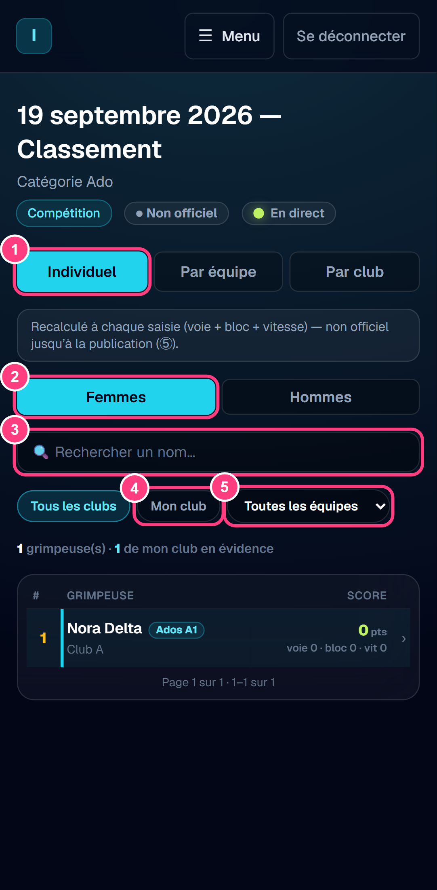

| N° | Élément | Effet |
| --- | --- | --- |
| 1 | Individuel / Par équipe / Par club | Choix du classement |
| 2 | Femmes / Hommes | Choix du classement individuel |
| 3 | Rechercher un nom | Filtre les grimpeurs affichés |
| 4 | Tous les clubs / Mon club | Restreint l'affichage à son club |
| 5 | Toutes les équipes | Restreint l'affichage à une équipe |

**Calcul du score** : le score d'un grimpeur est la somme de ses points en
**voie**, en **bloc** et en **vitesse**. Toucher une ligne du classement
individuel affiche ce détail. Le score d'une équipe est la somme des scores de
ses grimpeurs, celui d'un club la somme de ses équipes.

**Femmes / Hommes** : le classement individuel est établi séparément pour les
filles et les garçons, car les points de vitesse dépendent du rang dans chaque
sexe. Les classements par équipe et par club sont mixtes.

**Ex æquo** : deux scores égaux partagent le même rang, et le rang suivant est
sauté (1, 2, 2, 4).

**Mon club** : les grimpeurs de votre club sont mis en évidence dans la liste.
Un grimpeur prêté compte pour l'équipe qui l'accueille, mais apparaît sous son
club d'origine au classement individuel.

## 8. Coach temporaire (accès par QR)

Le coach temporaire scanne le QR fourni par le coach permanent avec l'appareil
photo de son téléphone. Il arrive directement sur sa rencontre.

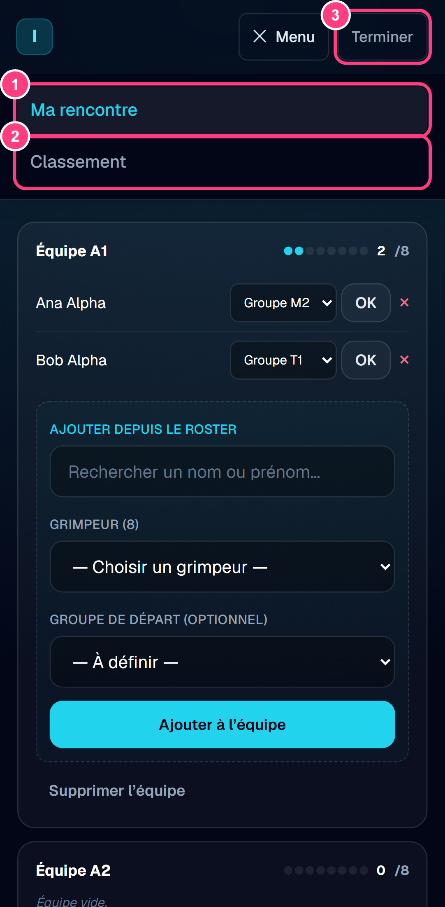

| N° | Élément | Effet |
| --- | --- | --- |
| 1 | Ma rencontre | Engagement (en ② préparation) ou saisie des résultats (en ③ compétition) |
| 2 | Classement | Classement de la rencontre, en lecture |
| 3 | Terminer | Ferme la session temporaire |

Le coach temporaire a les **mêmes droits** que le coach permanent, mais
uniquement pour **cette rencontre** et ce club. Il ne peut pas générer de QR.

Le QR ne fonctionne que **le jour J**, en ② préparation et ③ compétition. La
session se ferme automatiquement à la ④ clôture. Penser à toucher **Terminer**
en fin de journée sur un téléphone prêté ou partagé.

**Si le scan échoue**, l'écran affiche un message :

| Message | Que faire |
| --- | --- |
| « Ce QR n'est pas encore ouvert (ou la rencontre est terminée). » | La rencontre n'est pas en ② ou ③ : attendre que l'organisateur ouvre la préparation |
| « Ce QR a été révoqué. » | Demander le nouveau QR au coach permanent |
| « Ce QR n'est pas reconnu. » | Vérifier que le bon QR a été scanné ; sinon demander un nouveau QR |

## 9. Questions fréquentes

**Je ne vois pas ma rencontre dans « Mes rencontres ».**
La liste ne montre que les rencontres de la saison où votre club peut être
engagé. Si une rencontre manque, contactez l'organisateur.

**Je ne peux plus modifier mon équipe.**
La rencontre est passée en ③ compétition (ou au-delà) : la composition est
figée. Seul l'organisateur peut encore la modifier.

**Un grimpeur de mon club n'apparaît pas dans la liste d'ajout.**
Il est peut-être déjà engagé dans une autre équipe de la rencontre, ou il n'a
pas l'âge de la catégorie. S'il n'est pas du tout enregistré dans le club,
demandez à l'organisateur de l'ajouter.

**La saisie affiche « en attente » : le résultat est-il enregistré ?**
Il est gardé sur le téléphone et sera envoyé dès que possible. Laissez l'écran
ouvert jusqu'à ce que la mention disparaisse (voir
[Réseau faible ou coupé](#réseau-faible-ou-coupé)).

**Je ne peux pas saisir la vitesse.**
C'est normal : la vitesse est saisie par le juge. Le coach la consulte en
lecture seule.

**Je me suis trompé après la clôture.**
Signalez l'erreur à l'organisateur : lui seul peut corriger un résultat après
la ④ clôture.

## Mettre à jour les captures

Les captures sont produites par `scripts/captures/guide-coach.captures.ts`
(Playwright, format Pixel 7) à partir du jeu de données de test :

1. Stack Supabase locale démarrée avec le seed (`npm run db:reset`).
2. `npm run doc:captures` (lance l'application sur le port 3011 si besoin).
3. Les PNG de `docs/guides/coach/captures/` sont réécrits ; la rencontre de test
   est remise dans son état initial à la fin.

Pour ajouter une capture : ajouter une étape au script, numéroter les éléments
avec `numeroter(page, [...])`, puis reporter les numéros dans le tableau
de la section concernée.
