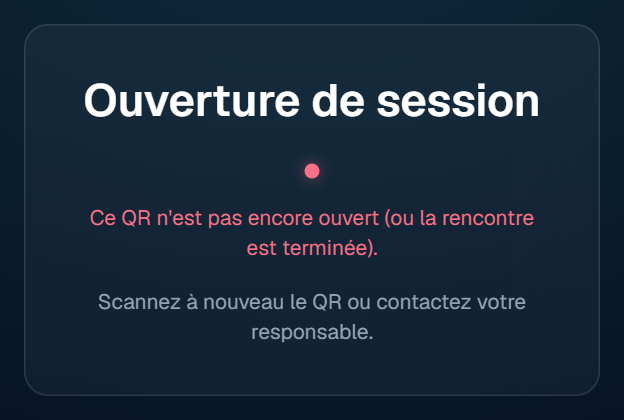
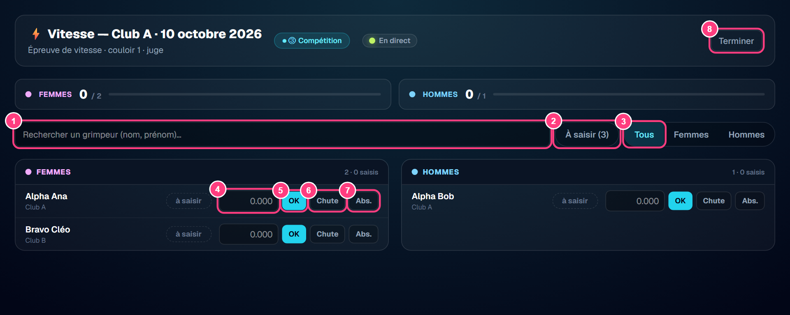
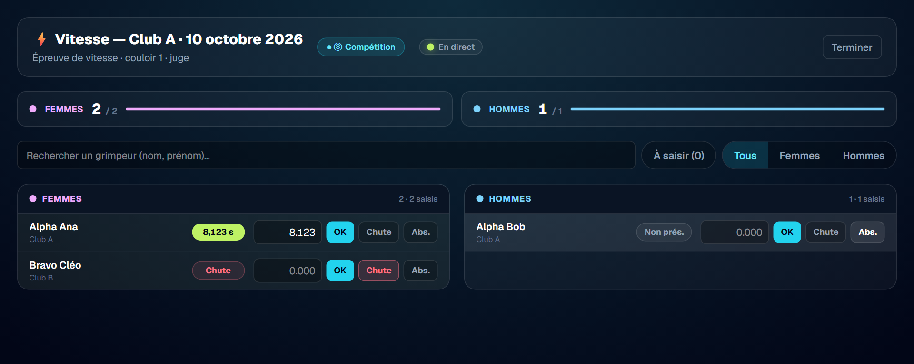
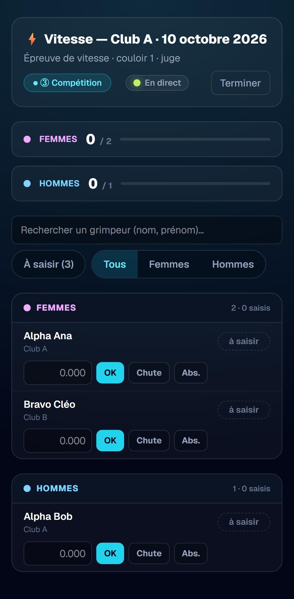

# Guide utilisateur — Juge de vitesse

> **Public** : juges de l'épreuve de vitesse, le jour de la rencontre.
>
> **Captures** : générées automatiquement par `npm run doc:captures` (voir
> [Mettre à jour les captures](#mettre-à-jour-les-captures)). Les numéros roses
> sur les captures renvoient à la colonne « N° » des tableaux.

## Sommaire

1. [Avant de commencer](#1-avant-de-commencer)
2. [Ouvrir sa session](#2-ouvrir-sa-session)
3. [Saisir les résultats](#3-saisir-les-résultats)
4. [Corriger un résultat](#4-corriger-un-résultat)
5. [Réseau faible ou coupé](#5-réseau-faible-ou-coupé)
6. [Terminer sa session](#6-terminer-sa-session)
7. [Questions fréquentes](#7-questions-fréquentes)

## 1. Avant de commencer

Le juge de vitesse enregistre, pour chaque grimpeur, le **résultat de son
passage** sur la voie de vitesse : un **temps**, une **chute** ou une **absence**
(non-présentation). Ces résultats alimentent automatiquement le classement.

- **Pas de compte** : le juge entre dans l'application en scannant un **QR**
  remis par l'organisateur. Il n'a ni identifiant ni mot de passe.
- **Le jour J, pendant la compétition uniquement** : le QR ne fonctionne que
  lorsque la rencontre est en phase **③ compétition**. Avant, ou après la
  clôture, il est refusé.
- **Sur ordinateur, tablette ou téléphone** : l'écran s'adapte. Sur un grand
  écran, les femmes et les hommes s'affichent côte à côte ; la saisie d'un temps
  se fait rapidement au clavier.
- **Une seule chose à faire** : le juge ne peut que saisir la vitesse. Il ne
  voit ni ne modifie les équipes, les voies ou les blocs.

## 2. Ouvrir sa session

Scanner le QR avec l'appareil photo du téléphone ou de la tablette, puis ouvrir
le lien proposé. L'écran de saisie s'affiche directement.

Le QR désigne une **voie de vitesse** (un couloir). Il sert à identifier le
poste du juge, mais **ne limite pas la liste** : tous les grimpeurs engagés dans
la rencontre, de tous les clubs, sont proposés. Plusieurs juges peuvent utiliser
le même QR en même temps.

Si le scan échoue, un message l'explique :

Les messages possibles :

| Message | Que faire |
| --- | --- |
| « Ce QR n'est pas encore ouvert (ou la rencontre est terminée). » | La rencontre n'est pas en ③ compétition : attendre que l'organisateur lance la compétition, puis scanner à nouveau |
| « Ce QR a été révoqué. » | Demander le nouveau QR à l'organisateur |
| « Ce QR n'est pas reconnu. » | Vérifier que le bon QR a été scanné ; sinon demander un nouveau QR |

## 3. Saisir les résultats

| N° | Élément | Effet |
| --- | --- | --- |
| 1 | Rechercher un grimpeur | Filtre la liste sur le nom ou le prénom |
| 2 | À saisir (n) | N'affiche que les grimpeurs sans résultat ; le nombre indique ce qu'il reste à saisir |
| 3 | Tous / Femmes / Hommes | Affiche les deux listes ou une seule |
| 4 | Temps | Temps du grimpeur, en secondes |
| 5 | OK | Enregistre le temps (ou touche **Entrée**) |
| 6 | Chute | Enregistre une chute (aucun temps) |
| 7 | Abs. | Enregistre une absence : le grimpeur ne s'est pas présenté |
| 8 | Terminer | Ferme la session du juge |

Les grimpeurs sont regroupés en **Femmes** et **Hommes**, triés par nom. En haut
de l'écran, un compteur par groupe indique le nombre de résultats saisis sur le
total.

**Saisir un temps** : taper le temps en secondes, au millième près, puis **OK**
ou **Entrée**. Le point et la virgule sont acceptés (`8.123` ou `8,123`). Un
temps nul, négatif ou qui n'est pas un nombre est refusé.

**Chute ou absence** : toucher **Chute** ou **Abs.**, sans remplir le temps.

Chaque résultat apparaît aussitôt sur la ligne du grimpeur :

| Pastille | Signification |
| --- | --- |
| `à saisir` | Aucun résultat pour l'instant |
| `8,123 s` | Temps enregistré |
| `Chute` | Chute enregistrée |
| `Non prés.` | Absence enregistrée |

Les saisies des autres juges et les corrections de l'organisateur apparaissent
sans recharger la page (indicateur **« En direct »**).

**Pour un grand nombre de grimpeurs** : utiliser la **recherche** pour retrouver
celui qui se présente, et le filtre **À saisir** pour voir d'un coup d'œil qui
n'est pas encore passé.

### Sur téléphone

Sur un écran étroit, les deux listes sont l'une sous l'autre ; les mêmes
boutons sont disponibles.

## 4. Corriger un résultat

Un grimpeur n'a **qu'un seul résultat** de vitesse. Pour corriger une erreur,
saisir simplement le bon résultat sur sa ligne : il **remplace** le précédent,
même s'il change de forme (une chute corrigée en temps, par exemple).

Après la **④ clôture**, le juge n'a plus accès à l'écran : toute correction se
demande à l'organisateur.

À savoir : un grimpeur sans résultat à la clôture compte **0 point** en vitesse,
comme une absence. Il n'y a pas d'absence posée automatiquement : pensez à
saisir **Abs.** pour un grimpeur qui ne se présente pas.

## 5. Réseau faible ou coupé

Chaque saisie est d'abord gardée sur l'appareil, puis envoyée automatiquement.
Si le réseau est coupé, **continuez à saisir** :

- un bandeau indique « Hors ligne » et le nombre de saisies **en attente** ;
- les saisies partent toutes seules dès le retour du réseau ;
- **ne fermez pas et ne rechargez pas la page** tant que des saisies sont en
  attente (le navigateur demande confirmation). L'écran ne peut pas s'ouvrir
  sans réseau.

Si deux juges saisissent le même grimpeur, c'est la **saisie la plus récente**
qui compte. Une saisie peut être **rejetée**, par exemple si une saisie plus
récente existe déjà ou si la compétition a été clôturée entre-temps. Les saisies
rejetées sont listées avec leur motif : transmettez-les à l'organisateur.

Si la session a expiré, le bandeau invite à **rescanner le QR** ; les saisies en
attente sont conservées et repartent ensuite.

## 6. Terminer sa session

En fin d'épreuve, toucher **Terminer** (en haut à droite) pour fermer la
session, surtout sur un appareil prêté ou partagé. La session se ferme aussi
automatiquement à la fin de la compétition.

## 7. Questions fréquentes

**Le QR affiche « pas encore ouvert ».**
La compétition n'a pas commencé (ou est déjà clôturée). Attendez le lancement
par l'organisateur, puis scannez à nouveau.

**Un grimpeur n'apparaît pas dans la liste.**
Seuls les grimpeurs engagés dans une équipe de la rencontre sont listés.
Vérifiez la recherche et les filtres (**À saisir**, **Femmes** / **Hommes**),
puis signalez l'oubli à l'organisateur.

**Je me suis trompé de grimpeur.**
Saisissez le résultat sur la ligne du bon grimpeur, puis corrigez la ligne du
premier lors de son passage. En cas de doute, signalez-le à l'organisateur.

**La saisie affiche « en attente ».**
Le résultat est gardé sur l'appareil et sera envoyé dès que possible. Laissez
l'écran ouvert jusqu'à ce que la mention disparaisse.

## Mettre à jour les captures

Les captures sont produites par `scripts/captures/guide-juge.captures.ts`
(Playwright) à partir du jeu de données de test :

1. Stack Supabase locale démarrée avec le seed (`npm run db:reset`).
2. `npm run doc:captures` (lance l'application sur le port 3011 si besoin).
3. Les PNG de `docs/guides/juge/captures/` sont réécrits ; la rencontre de test
   est remise dans son état initial à la fin.
