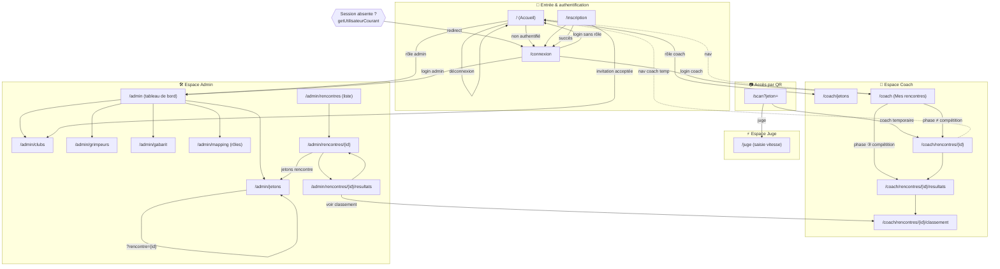
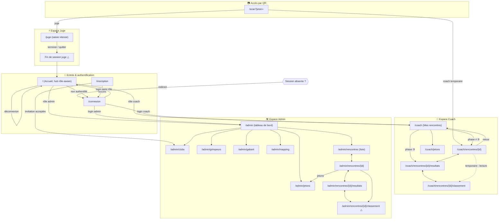

# Enchaînements de pages — état actuel & cible

- **Statut** : document de travail (cartographie du code au 2026-09-25 + cible).
  **Arbitrages produit tranchés le 2026-09-25** (voir §2). La cible n'est pas
  encore une spec validée : les changements marqués « △ » impactent des specs
  existantes et suivent l'ordre spec → tests → code.
- **Sources** : routes réelles de `src/app/**`, liens `Link`, redirections
  `redirect()` / `router.replace()`, helpers `liensCoach`
  (`src/lib/coach/navigation.ts`), `urlDeRedirection`
  (`src/domaine/session-qr.ts`), gardes de session (`src/lib/auth/*`).
- **Portée** : navigation applicative. Les pages `/design-system` et
  `/templates/nuit/*` (maquettes) sont hors flux et non représentées.

## 1. État actuel

Diagramme des enchaînements tels qu'ils existent dans le code.

### Constats

1. **Destination coach incohérente** : depuis `/` un coach connecté est envoyé
   vers `/coach/jetons`, mais depuis `/connexion` vers `/coach`. Deux points
   d'entrée, deux cibles.
2. **Pont admin → coach** : `/admin/rencontres/{id}/resultats` renvoie vers le
   **classement coach** (`/coach/rencontres/{id}/classement`) — seule route
   partagée entre les deux espaces, sans équivalent admin.
3. **Retour arrière irrégulier** : certains écrans profonds (classement coach,
   liste jetons admin) n'offrent pas de lien de remontée explicite ; on dépend du
   navigateur ou de la barre de nav.
4. **`/admin/rencontres` (liste)** est atteignable depuis `/admin` via le bloc
   `CarteRencontres`, mais **pas** via les « Liens d'accès rapide » (qui listent
   clubs, grimpeurs, gabarit, jetons, rôles — pas rencontres). Visibilité
   irrégulière, pas une route orpheline.
5. **Accès QR** court-circuite l'accueil : coach temporaire et juge n'ont pas de
   parcours de sortie clair (retour = `/` uniquement pour le coach temporaire).

## 2. Version cible (propositions à valider)

Objectif : un point d'entrée unique par rôle, des remontées cohérentes, et le
pont admin↔classement symétrique. **Chaque changement marqué « △ » impacte une
spec (#02 sessions/redirections, #04 tableau de bord, #05 coach) et doit être
validé avant spec → tests → code.**

### Changements proposés

- **△ C1 — Cible coach unique.** Depuis `/`, envoyer le coach vers `/coach`
  (comme `/connexion`), pas `/coach/jetons`. « Mes jetons QR » devient un lien
  interne de `/coach`. *Impacte* `src/app/page.tsx` + spec #05.
- **△ C2 — Classement côté admin (vue distincte).** Créer
  `/admin/rencontres/{id}/classement`, **vue admin propre** (périmètre tous
  clubs, droits admin), au lieu de renvoyer l'admin dans l'espace coach. Le lien
  actuel de `/admin/rencontres/{id}/resultats` pointera vers cette vue. *Impacte*
  specs #04 et #07.
- **C3 — Remontées systématiques.** Chaque écran profond expose un retour
  explicite (fil d'Ariane ou lien « ← »), y compris classement et liste jetons.
  *Impacte* composants de coquille, sans changement de route.
- **C4 — Entrée liste rencontres.** Ajouter un accès direct à
  `/admin/rencontres` depuis le tableau de bord `/admin`. *Impacte* spec #04.
- **△ C5 — Sortie de session juge.** Ajouter un lien « Terminer / Quitter » sur
  `/juge` menant à un écran de fin (ou retour `/`). Reste QR-only à l'entrée, mais
  gagne une sortie explicite. *Impacte* spec #02.
- **△ C6 — Classement en lecture pour le coach temporaire.** Ajouter à la nav
  bornée (R8bis) un accès **lecture seule** au classement de sa rencontre
  (`/coach/rencontres/{id}/classement`). Périmètre inchangé : uniquement sa
  rencontre. *Impacte* specs #02 et #05.
- **△ C7 — Déconnexion depuis les espaces.** Exposer la déconnexion
  (`seDeconnecter` → `/connexion`) depuis **chaque écran** admin et coach
  permanent (via la coquille), sans repasser par `/`. Sessions QR (coach temp /
  juge) exclues : elles relèvent de la fin de session. *Impacte* spec #02.

### Arbitrages (2026-09-25)

Questions initialement ouvertes, désormais tranchées :

1. **Classement admin** → **vue admin distincte** (`/admin/rencontres/{id}/classement`,
   tous clubs). Voir C2.
2. **Coach temporaire** → **reste borné à sa rencontre** mais **gagne le
   classement en lecture**. Voir C6.
3. **Juge** → **reste QR-only** mais gagne une **sortie de session** explicite.
   Voir C5.

## 3. Analyse de cohérence du routing (2026-09-25)

Revue du code de routage réel : gardes d'accès, redirections, joignabilité.

### Incohérence bloquante (bug avéré)

- 🔴 **B1 — Lien admin → classement coach = 404.**
  `/admin/rencontres/{id}/resultats` propose « Voir le classement → » vers
  `/coach/rencontres/{id}/classement`. Or cette page est protégée par
  `getContexteCoach()`, qui renvoie `null` pour un compte **admin** (ni coach
  permanent, ni session QR temporaire) → `notFound()`. **Le lien mène donc à un
  404 pour l'admin aujourd'hui.** C'est exactement ce que corrige **C2** (vue
  classement admin dédiée) : C2 n'est pas un confort mais une réparation.

### Incohérences de convention

- 🟠 **B2 — Deux patterns de garde.** Coach/juge passent par un helper de
  contexte (`getContexteCoach` / `getContexteJuge`) ; l'admin duplique
  `if (utilisateur?.role !== 'admin') notFound()` dans **9 pages**
  (`getUtilisateurCourant` inline). Pas de `getContexteAdmin()` symétrique →
  risque d'oubli sur une future page admin. *Piste : extraire `exigerAdmin()`
  côté route (il existe déjà côté Server Actions, dupliqué dans
  `lib/admin/resultats-actions.ts` et `lib/admin/engagement-actions.ts`).*
- 🟠 **B3 — Refus = 404, jamais redirection login.** Toutes les pages protégées
  répondent `notFound()` quand l'accès est refusé (y compris **non
  authentifié**), jamais `redirect('/connexion')`. C'est un choix *fail-closed*
  cohérent (on ne révèle pas l'existence des espaces), mais il contredit
  l'accueil (CTA « Se connecter ») et rend l'entrée peu guidée : un lien profond
  ouvert sans session donne un 404 muet, pas une invite à se connecter. **À
  trancher** : garder le 404 partout (masquage) ou rediriger vers `/connexion`
  quand la seule cause est l'absence de session.
- 🟡 **B4 — `exigerUtilisateur()` est du code mort.** Le seul helper qui redirige
  vers `/connexion` (`lib/auth/session.ts`) n'est **jamais appelé**. À supprimer,
  ou à réintroduire si B3 tranche pour la redirection.

### Points de vigilance

- 🟡 **B5 — `/coach` accessible au coach temporaire.** Sa nav ne l'expose pas
  (R8bis), mais l'URL reste ouverte : `getContexteCoach` renvoie un contexte
  `temporaire` et la page se contente de **filtrer** la liste à sa rencontre. La
  frontière tient par le filtre applicatif, pas par la garde. Acceptable, à
  documenter.
- 🟡 **B6 — `/connexion` et `/inscription` sans garde « déjà connecté ».** Un
  utilisateur authentifié y voit quand même le formulaire (pas de renvoi vers son
  espace). Mineur, mais incohérent avec le flux de login.
- 🟠 **B7 — Déconnexion inaccessible hors accueil.** L'action `seDeconnecter`
  n'est présente que sur `/`. La `Coquille` (admin + coach permanent) n'a **aucun
  contrôle de déconnexion** : un admin/coach doit revenir à `/` pour se
  déconnecter. → **C7**.

### Cohérences confirmées (OK)

- ✅ **Anti-traversée d'`id`** : les 3 routes `coach/rencontres/[id]/*` vérifient
  toutes `type === 'temporaire' && rencontreId !== id → notFound()`.
- ✅ **Scan QR** fail-closed : anonyme → RPC `ouvrir_session_qr` → redirection
  selon la nature ; jeton absent/révoqué/hors fenêtre = message d'erreur, pas
  d'accès.
- ✅ **RLS = frontière ultime** rappelée et respectée dans chaque espace ; les
  gardes de route ne sont qu'une première barrière UX.
- ✅ **Aucune route orpheline** : toutes les pages applicatives sont joignables
  (voir correction du constat §1.4 : `/admin/rencontres` l'est via
  `CarteRencontres`).

### Conséquences sur la cible

- **B1 promeut C2 de « amélioration » à « correctif ».** À traiter en priorité.
- **B2/B3/B4** ne sont pas dans la cible §2 : ce sont des **arbitrages de
  convention** à trancher séparément (helper de garde unifié + politique
  404-vs-redirection). Proposition : les regrouper dans une révision de la
  **spec #02** (sessions & redirections).

## 4. Plan d'action

Ordre imposé par les conventions : **spec → tests → code → cahier**. Les points
touchant une spec **validée** passent par la règle de changement (validation
explicite avant modification).

### Phase 0 — Arbitrages de convention (tranchés le 2026-09-25)

| # | Décision | Impacte |
|---|----------|---------|
| B2 | ✅ **Helper unifié** `getContexteAdmin`/`exigerAdmin` de route, symétrique de `getContexteCoach`/`getContexteJuge` | Spec #02 + refactor 9 pages |
| B3 | ✅ **Hybride** : non authentifié → `redirect('/connexion')` ; authentifié mais mauvais rôle → **404** (masquage conservé) | Spec #02 |
| B4 | ✅ **`exigerUtilisateur()` réutilisé** (conséquence de B3 = redirect), plus de code mort | conséquence de B3 |

### Phase 1 — Spec « Navigation & routing » (ce document → `docs/specs/`)

Nouvelle spec dédiée, source de vérité des enchaînements, intégrant C1–C6 et les
arbitrages B2–B4. Cross-référence les specs impactées.

### Phase 2 — Révision des specs validées (règle de changement)

| Spec | Points | Nature |
|------|--------|--------|
| #02 sessions & redirections | C5, B2, B3, B4, B5, B6 | redirections & gardes |
| #04 tableau de bord admin | C2, C4 | lien classement + visibilité liste |
| #05 espace coach | C1, C6, B5 | entrée unique + classement coach temp |
| #07 classement | C2 | vue classement admin dédiée |

### Phase 3 — Tests (`cycle-tdd`, domaine pur)

`urlDeRedirection`, résolution des liens de nav (`liensCoach`), toute logique de
garde extraite et testable.

### Phase 4 — Code ✅

Tout livré :

- **B1/C2** : route `/admin/rencontres/{id}/classement` (vue admin, tous clubs),
  liens admin repointés + remontée « ← Tableau de bord ».
- **B2/B3/B4** : helpers `exigerUtilisateur` (redirect), `exigerAdmin`,
  `exigerContexteCoach`, `exigerContexteJuge` (politique hybride) ; pages admin,
  coach et juge migrées.
- **C1** : accueil coach → `/coach` ; **B6** : `/connexion` & `/inscription`
  redirigent si déjà connecté (`redirigerSiConnecte`).
- **C7** : déconnexion dans la `Coquille` (admin + coach permanent).
- **C5** : bouton « Terminer » sur `/juge` (`terminerSession` → `/`).
- **C6** : nav coach temporaire + classement ; nav coach permanent + « Jetons »
  (garantit la joignabilité après C1).
- **C4** : « Rencontres » dans les accès rapides `/admin`.
- **C3** : remontées via barre de nav + liens parent explicites.
- **C8** : bandeau centralisé par rôle (`liensAdmin` / `liensCoach`), identique
  sur toutes les pages d'un espace (fin des `const liens` ad hoc par page) ;
  `NavPrincipale` surligne le lien le plus spécifique ; `/coach/jetons` retrouve
  « Mes rencontres ». Spec #12 R23.
- **C9** : `/` devient un **routeur** (non connecté → `/connexion` ; rôle → son
  espace ; connecté sans rôle → écran minimal). Lien « Accueil » supprimé des
  bandeaux ; sortie coach temporaire par « Terminer ». Spec #12 R7 (révisée).

### Phase 5 — Cahier de test ✅

- **23-navigation-routing.cahier.md** (CT-01→CT-10) : redirections par rôle,
  garde hybride (redirect/404), déconnexion, sortie juge, nav coach temporaire.
- **18-classement.cahier.md** CT-13 : vue classement admin (B1/C2).

> Reste à **dérouler** ces cahiers sur base réelle (validation finale manuelle).
