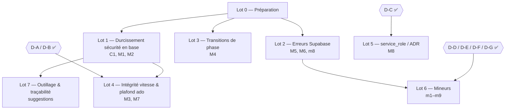

# Plan d'action — revue globale du 2026-10-03

Plan de traitement des constats de la
[revue globale du 2026-10-03](./2026-10-03-revue-globale.md). Chaque lot suit
le workflow du projet : **spec → tests → code → cahier de test**. Les
migrations sont validées sur la stack locale, puis **appliquées à la main** en
recette (prod à la bascule sur `main`).

Statuts : ✅ fait · 🔄 en cours · ⏳ en attente (à faire) · ❓ décision requise ·
🚫 bloqué (dépendance non levée)

Dernière mise à jour : 2026-10-03.

## Décisions

Ces points relèvent de la **règle de changement** : validation explicite avant
de toucher une spec. **Toutes tranchées le 2026-10-03** par julleroyfr ; chaque
changement de spec suit ensuite l'ordre spec → tests → code.

| # | Question | Décision (2026-10-03) | Constat | Lot | Spec touchée |
| --- | --- | --- | --- | --- | --- |
| D-A | Plafond de 6 voies ado (spec #6 R14) : « règle applicative » ou garantie en base ? | ✅ **Trigger SQL** : la base refuse une 7ᵉ voie par grimpeur et épreuve ado (en plus de la Server Action) | M7 | 4 | #6 (modèle, R14) |
| D-B | Temps de vitesse d'un grimpeur retiré de la composition ? | ✅ **Purger** : retirer un grimpeur supprime ses temps de vitesse de la rencontre (trigger) ; la saisie reste refusée pour un non-engagé (#10 R7) | M3 | 4 | #10 (et #7 si besoin) |
| D-C | `service_role` en lecture transverse ? | ✅ **ADR 0005 + garde dans chaque loader** `service_role` (pas de retour aux lectures RLS) | M8 | 5 | — (ADR) |
| D-D | Session anonyme sans QR : lit-elle clubs, rencontres, résultats ③+ ? | ✅ **Fermer** : helper `est_acteur_identifie()` (compte mappé OU session QR active) dans les policies de lecture | m2 | 6 | #1 (matrice) / #12 à vérifier |
| D-E | Un coach peut-il réactiver un jeton QR révoqué ? | ✅ **Révocation définitive** : pour le coach, une mise à jour ne peut que révoquer (`actif` true → false), ni réactiver ni changer de rencontre ; rétablir = régénérer (R23) | m4 | 6 | aucune (application de #2 R20–R23) |
| D-F | Pages `/design-system` et `/templates/*` publiques ? | ✅ **Exclure de la prod** : `notFound()` hors développement local (invisibles en recette et en prod) | m1 | 6 | #12 (exception de routage) |
| D-G | Écran d'erreur technique (`error.tsx`) ? | ✅ **Oui, écran sobre** : message en français + « Réessayer » + lien vers l'accueil (`error.tsx` + `global-error.tsx`) | M6 | 6 | #12 (nouvelle règle) |

## Ordre des lots

Le lot 1 est prioritaire (faille critique exploitable avec la clé anon).
Les lots 2 et 3 n'ont besoin d'aucune décision et peuvent avancer en parallèle.

## Lot 0 — Préparation

- [x] ✅ Créer la branche `feature/durcissement-securite` depuis `develop`
  (worktree séparé pour permettre du travail en parallèle).
- [x] ✅ Commiter le rapport de revue et ce plan sur `develop` (`14792ec`).
- [ ] ⏳ Trancher les décisions D-A à D-F (au fil de l'eau, sans bloquer les
  lots 1 à 3).

## Lot 1 — Durcissement sécurité en base (C1, M1, M2) — 🔴 prioritaire — 🔄 en cours

Migration `202610031100_durcissement_securite`, branche
`feature/durcissement-securite`. Validée en transaction annulée sur la base
locale le 2026-10-03 (C1, M1, M2, fermeture par défaut).

Aucune spec ne change : on impose en base ce que les specs exigent déjà
(#3 R12, #2 R30–R33, #16 R11/R13, #9 R14).

### C1 — `creer_rencontre_avec_gabarit`

- [x] ✅ Migration : garde `if not interclub.est_admin() then raise exception
  'acces_refuse'` dans la fonction (réécriture `create or replace`).
- [x] ✅ Migration : `revoke execute … from public` puis
  `grant execute … to authenticated`.

### M1 — `finaliser_inscription_coach`

- [x] ✅ Migration : `revoke execute … from public, anon, authenticated`
  (seul `service_role` garde EXECUTE).
- [x] ✅ Migration : `set search_path = ''` et noms de tables qualifiés.

### M2 — Colonnes d'audit et de contrôle

- [x] ✅ Migration : trigger `before insert or update` sur `resultat_voie` et
  `resultat_bloc` — si non admin, `controle_le` / `controle_par` reprennent
  leur ancienne valeur (`null` à l'insertion).
- [x] ✅ Migration : même trigger force `auteur_utilisateur_id = auth.uid()` et
  `auteur_role` au rôle réel, sur `resultat_voie`, `resultat_bloc` et
  `temps_vitesse`.
- [ ] ⏳ Vérifier que les Server Actions admin (contrôle, saisie admin) et coach
  continuent de fonctionner (E2E cahiers 17, 19, 20, 27).

### Fermeture par défaut (suggestion 1)

- [x] ✅ Migration : `alter default privileges for role postgres revoke
  execute on functions from public;` (la variante `in schema` ne peut
  qu'ajouter aux privilèges globaux : inopérante pour révoquer).
- [x] ✅ Inventorier toutes les fonctions `security definer` existantes et
  ré-accorder explicitement EXECUTE au strict nécessaire.

### Validation et livraison

- [ ] ⏳ Valider sur la stack locale (`db reset`, prévenir avant : réinitialise
  la base locale) : appels `curl` avec la clé anon et un compte coach → refus.
- [x] ✅ Rédiger le cahier `28-securite-appels-directs.cahier.md` (suggestion
  2) : RPC en anonyme, PATCH des colonnes d'audit, rôle forgé.
- [ ] ⏳ Faire passer `npm test`, `typecheck`, `lint`, `lint:md` et les E2E
  concernés.
- [x] ✅ Mettre à jour `supabase/migrations/JOURNAL.md`.
- [x] ✅ Contrôle permanent dans `npm run db:verifier` : aucune fonction
  ouverte à PUBLIC, `anon` limité aux 4 RPC des sessions QR.
- [x] ✅ Appliquer la migration **à la main** en recette (SQL Editor) —
  2026-10-03.
- [x] ✅ Automatiser le cahier 28 : `npm run test:cahier:securite`
  (`e2e/securite-appels-directs.spec.ts`, 9 tests, stack locale).
- [ ] ⏳ Dérouler le cahier 28 en recette.

## Lot 2 — Erreurs Supabase avalées (M5, M6, m8) — 🔄 en cours

Aucune spec ne change (convention 02 §7, spec #6 R18). Branche
`feature/erreurs-supabase`. Helper pur `verifierLecture(reponse, quoi)`
(`src/lib/supabase/lecture.ts`, 4 tests Vitest) : une lecture en échec lève
`LectureImpossibleError` au lieu d'être lue comme « aucune donnée ».

### M6 — Loader du classement

- [x] ✅ `src/lib/classement/classement.ts` : les 14 lectures passent par
  `verifierLecture`.
- [ ] ❓ Affichage d'erreur côté écran : **aucun `error.tsx` dans l'app**. Une
  erreur technique affiche la page d'erreur générique de Next (bruyante, mais
  plus jamais un classement faux). Écran d'erreur dédié = nouvel écran, à
  décider (décision D-G).

### M5 — NP automatique de clôture

- [x] ✅ `src/lib/rencontres/cloture.ts` : chaque lecture vérifiée, les deux
  `upsert` lèvent une erreur en cas d'échec.
- [x] ✅ `src/lib/rencontres/actions.ts` : `catch {}` vide retiré ; si le NP
  échoue, la phase reste changée et l'admin reçoit un message d'erreur
  explicite (« repassez en compétition puis en clôture ») au lieu d'un succès.
- [ ] ⏳ Évaluer une RPC transactionnelle « changement de phase + NP »
  (si retenue : migration + cahier). Non fait : le message suffit à ne plus
  masquer l'échec ; à reconsidérer avec le lot 3 (garde de transition).

### Les autres lectures

> Recensement corrigé : `prets.ts`, `clubs.ts`, `rencontres.ts`,
> `tableau-de-bord.ts`, `jetons.ts`, `invitations.ts`, `grimpeurs.ts`,
> `export-classement.ts`, `auth/mapping.ts` et l'essentiel d'`engagement.ts`
> vérifiaient **déjà** leurs erreurs (`if (xxxRes.error) throw`) : la revue les
> avait comptés à tort.

- [x] ✅ `src/lib/coach/resultats-actions.ts` (9 lectures, dont `existantes` du
  plafond ado — M7, partie indépendante de D-A).
- [x] ✅ `src/lib/admin/resultats-actions.ts` (9 lectures).
- [x] ✅ `src/lib/admin/controle.ts` (11 lectures, dont la résolution des
  auteurs) et `controle-actions.ts` (4 lectures ; m8 : `type`, `coche` et
  `resultatId` validés à l'exécution).
- [x] ✅ Reste de `src/lib` : `admin/resultats.ts`, `coach/resultats.ts`,
  `coach/actions.ts`, `coach/engagement.ts` (`clubRes` + noms des clubs
  prêteurs), `rencontres/structure(-actions).ts`, `gabarit/actions.ts`,
  `jetons/actions.ts`, `invitations/actions.ts`, `auth/actions.ts`. Scan final :
  plus aucune lecture `const { data } = await` ni `xxxRes.data` non vérifiée.

### Validation

- [x] ✅ Typecheck, lint, Vitest (330 tests) ; **suite E2E complète** (117 tests,
  chromium) au vert sur le code de la branche.
- [ ] ⏳ Le chemin « NP en échec → message à l'admin » n'est pas couvert par un
  test automatisé (il faut provoquer une panne de lecture) : cas à ajouter au
  cahier 17.

## Lot 3 — Transitions de phase (M4)

La spec #3 R17 impose déjà les transitions adjacentes : seuls tests et code
changent.

- [ ] ⏳ Test Vitest rouge `peutTransiter(courante, cible)` citant
  « spec #3 R17 » (avancer, revenir, saut interdit, bornes).
- [ ] ⏳ Implémenter `peutTransiter` dans `src/domaine/rencontre.ts` (vert).
- [ ] ⏳ `src/lib/rencontres/actions.ts:133,159` : relire la phase courante en
  base et refuser toute transition non adjacente.
- [ ] ⏳ Optionnel : trigger SQL de garde sur `rencontre.phase`.
- [ ] ⏳ Ajouter au cahier de la spec #3/#4 le cas « deux onglets admin
  désynchronisés » et « POST direct d'un saut de phase ».

## Lot 4 — Intégrité vitesse et plafond ado (M3, M7)

Débloqué : D-A (trigger) et D-B (purge) tranchés le 2026-10-03. Révision des
specs #6 et #10 d'abord.

### M3 — Temps de vitesse bornés aux grimpeurs engagés

- [ ] ⏳ Réviser la spec #10 (et #7 si besoin) : retrait d'un grimpeur ⇒ ses
  temps de vitesse sont supprimés (D-B), rang et points recalculés.
- [ ] ⏳ Migration : `peut_ecrire_temps_vitesse` exige que le grimpeur soit
  composé dans la rencontre.
- [ ] ⏳ Migration : trigger sur `composition` (suppression) qui purge les
  `temps_vitesse` du grimpeur pour la rencontre (le trigger existant recalcule
  `points_vitesse`).
- [ ] ⏳ Cahier 20/21 : cas « grimpeur retiré après chronométrage ».

### M7 — Plafond de 6 voies ado garanti en base

- [ ] ⏳ Réviser la spec #6 (section modèle de données, R14) : plafond garanti
  en base par trigger, en plus de la Server Action (D-A).
- [ ] ⏳ Migration : trigger `count(*) < 6` par grimpeur et épreuve ado.
- [x] ✅ `src/lib/coach/resultats-actions.ts` : `error` vérifiée sur
  `existantes` (fait au lot 2).
- [ ] ⏳ Cahier 17 : cas « 7ᵉ voie par upsert direct → refus ».

### Livraison

- [ ] ⏳ Validation locale, `JOURNAL.md`, application manuelle en recette,
  déroulage des cahiers.

## Lot 5 — `service_role` et ADR (M8)

Débloqué : D-C tranché le 2026-10-03 (option a).

- [ ] ⏳ Rédiger l'ADR `0005-…` actant la lecture transverse via
  `service_role`, et ajouter une garde (`exigerAdmin` ou contexte) dans chacun
  des 12 loaders concernés.
- ~~Option (b) : retour aux lectures RLS~~ — écartée (D-C).
- [ ] ⏳ Mettre à jour le commentaire périmé de `src/lib/supabase/admin.ts`.

## Lot 6 — Mineurs (m1–m9)

- [ ] ⏳ m1 — Pages `/design-system` et `/templates/*` : `notFound()` hors
  développement local (D-F) ; exception tracée dans la spec #12.
- [ ] ⏳ m2 — Helper `est_acteur_identifie()` dans les policies de lecture
  (D-D ; vérifier la matrice de la spec #1 ; migration + cahier).
- [ ] ⏳ m3 — Redirection ouverte : n'accepter que les chemins relatifs
  commençant par `/` (`jetons/actions.ts:34,41`, `invitations/actions.ts:83,87`).
- [ ] ⏳ m4 — Policy de mise à jour de `jeton_qr` : pour le coach, révocation
  seule (D-E) ; migration + cahier 04.
- [ ] ⏳ D-G — Écran d'erreur technique : règle ajoutée à la spec #12, puis
  `error.tsx` + `global-error.tsx` (design system), cas au cahier 23.
- [ ] ⏳ m5 — `/scan` : ne pas ouvrir de session anonyme si l'utilisateur est
  déjà connecté (à vérifier contre la spec #2 avant de coder).
- [ ] ⏳ m6 — `inscrireCoach` : distinguer les causes d'erreur de `createUser`.
- [ ] ⏳ m7 — Factoriser le code commun admin/coach de `resultats-actions` et
  renommer la fonction locale `exigerAdmin`.
- [ ] ⏳ m8 — Traité dans le lot 2.
- [ ] ⏳ m9 — Corriger l'avertissement de lint dans `grimpeur.test.ts:36`.

## Lot 7 — Outillage et traçabilité (suggestions)

- [ ] ⏳ Suggestion 1 — traitée dans le lot 1.
- [ ] ⏳ Suggestion 2 — cahier 28, lot 1.
- [ ] ⏳ Suggestion 3 — Préfixer les `describe` des tests par leur spec
  (`spec #7 R8 …`) dans les 19 fichiers de `src/domaine/`.
- [ ] ❓ Suggestion 4 — Tester les règles calculées en SQL : pgTAP sur la stack
  locale, ou copie dans le domaine + tests d'équivalence (à décider).
- [ ] ⏳ Relancer l'agent `revue-code-architecture` après les lots 1 à 4 pour
  vérifier la fermeture des constats.
