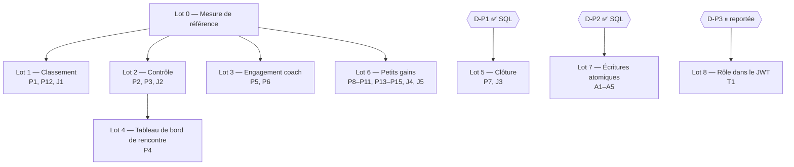

# Plan d'action — appels Supabase par écran et par action (2026-10-09)

Plan de traitement des constats de
[l'analyse du 2026-10-09](./2026-10-09-analyse-appels-supabase.md). Objectif :
**réduire le nombre de vagues séquentielles** par écran et par action, et
**corriger les lectures tronquées** (J1–J5).

Statuts : ✅ fait · 🔄 en cours · ⏳ en attente (à faire) · ❓ décision requise ·
🚫 bloqué (dépendance non levée) · ⏸ reporté

Dernière mise à jour : 2026-10-10.

## Principes

- **Modèle de référence** : `chargerSaisie` (`src/lib/coach/resultats.ts`), qui
  fait une seule vague, filtre chaque table sur la rencontre par jointure
  `!inner`, embarque les noms (`grimpeur:grimpeur_id(nom, prenom, club:club_id(nom))`)
  et pagine avec `lireToutesLesPages`.
- **Pas de changement de comportement** dans les lots 1 à 6 : mêmes données,
  même affichage. Les specs ne changent pas. Les E2E existants sont le filet de
  sécurité ; chaque lot doit les garder au vert.
- **J1/J2 sont des corrections**, qui rendent le code conforme aux specs #7 et
  #16. Elles se prouvent par un test qui échoue **avant** la correction (rouge),
  au-delà de 1000 lignes.
- **Les lots 7 et 8 touchent la base ou une spec** : validation explicite
  d'abord (règle de changement), puis spec → tests → code, migration validée sur
  la stack locale et appliquée **à la main** en recette.
- Toute lecture passe par `verifierLecture` (convention 02 §7) ; toute lecture
  qui peut dépasser 1000 lignes est paginée.
- **Une branche par lot** (`feature/perf-…`), fusionnée dans `develop`.

## Décisions

| # | Question | Recommandation | Constats | Lot | Spec touchée |
| --- | --- | --- | --- | --- | --- |
| D-P1 | Clôture : refactoring TypeScript (~5 vagues) ou RPC SQL transactionnelle « changement de phase + NP » (1 appel, atomique) ? | ✅ **Fonction SQL** (2026-10-09) — règle aussi le point laissé ouvert au lot 2 de la revue du 2026-10-03 | P7, J3 | 5 | aucune (migration) |
| D-P2 | Écritures en plusieurs étapes : une RPC par opération ? | ✅ **Fonction SQL** par opération (2026-10-09) : atomicité + 1 appel | A1–A5 | 7 | aucune (migrations) |
| D-P3 | Rôle et club dans le JWT (Custom Access Token Hook) pour supprimer la vague 0 ? | ⏸ **Reportée** (2026-10-09) : à reconsidérer après les lots 0–3 et une décision sur la région d'hébergement ; si reprise, option « délai court inscrit dans la spec » | T1 | 8 | #1, #2, ADR 0005 |

## Ordre des lots



## Tableau de suivi

| Lot | Constats | Vagues avant → cible | Branche | Statut |
| --- | --- | --- | --- | --- |
| 0 | — | — | `feature/perf-mesure` | ✅ |
| 1 | P1, P12, J1 | classement 8 → 2 | `feature/perf-classement` | ⏳ |
| 2 | P2, P3, J2 | contrôle 8 → 2 ; coche 6 → 3 | `feature/perf-controle` | ⏳ |
| 3 | P5, P6 | engagement 5 → 2 ; actions −1 | `feature/perf-engagement-coach` | ⏳ |
| 4 | P4 | 7 → 2–3 (④/⑤) | `feature/perf-tdb-rencontre` | 🚫 (lot 2) |
| 5 | P7, J3 | ≤ 10 → 2 (RPC) | `feature/perf-cloture` | ⏳ |
| 6 | P8–P11, P13–P15, J4, J5 | −1 vague par écran ou action | `feature/perf-petits-gains` | ⏳ |
| 7 | A1–A5 | 3–5 → 2 | `feature/rpc-ecritures-atomiques` | ⏳ |
| 8 | T1 | −1 sur **toutes** les requêtes | — | ⏸ reportée |

## Lot 0 — Mesure de référence — ✅

Rendre le nombre d'appels et de vagues **observable** : c'est ce qui permettra
de vérifier chaque lot.

- [x] ✅ Traçage optionnel des appels Supabase côté serveur
  (`src/lib/supabase/trace.ts`, testé dans `trace.test.ts`) : `fetch`
  personnalisé (`global.fetch`) dans `createClient` et `createAdminClient`,
  activé par `SUPABASE_TRACE=1`. Une ligne par appel (séquence, vague, rang,
  décalage, durée, statut, table ou RPC), puis un résumé par séquence. Inactif
  par défaut, jamais en production (`NODE_ENV=production`).
- [x] ✅ Référence relevée en local le 2026-10-10 (base au seed) : voir
  « Mesures » ci-dessous.
- [x] ✅ Typecheck, lint, Vitest, `lint:md`.

### Mode opératoire

1. Base locale au seed, puis `SUPABASE_TRACE=1 npm run dev` (un seul `next dev`
   par dossier : arrêter celui qui tourne).
2. Se connecter, attendre 1 s, puis ouvrir **un seul écran à la fois**, en
   laissant au moins 1 s entre deux écrans. Mesurer la **deuxième** visite (la
   première peut inclure la compilation de la route).
3. Lire les lignes `[supabase]` du terminal :

   ```text
   [supabase] #13 v2 a2 +7ms 6ms 200 GET rencontre
   [supabase] #13 terminée : 8 vagues, 16 appels, 113 ms
   ```

   `#13` est la séquence (une requête), `v2` la vague, `a2` le rang de l'appel.

Limites de l'heuristique : une vague est un ensemble d'appels lancés pendant que
d'autres sont en vol. Deux chaînes indépendantes lancées en parallèle (par
exemple les deux catégories du gabarit) peuvent donc se chevaucher et compter
moins de vagues que leur chemin critique. Une Server Action compte l'action, le
re-rendu (`revalidatePath`) et, le cas échéant, le rafraîchissement déclenché
par le temps réel, dans une même séquence ou dans la suivante.

## Lot 1 — Classement (P1, P12, J1) — ⏳

Fichiers : `src/lib/classement/classement.ts`,
`src/lib/export/export-classement.ts`.

- [ ] ⏳ **Rouge (J1)** : E2E (ou script SQL de stack locale) qui crée une
  rencontre avec plus de 1000 résultats (voie + bloc). Il vérifie que le
  classement compte **tous** les grimpeurs et les bons totaux. Il doit échouer
  sur le code actuel.
- [ ] ⏳ Réécrire `getClassementRencontre` en **une vague** : rencontre,
  épreuves, voies et blocs via `epreuve!inner(rencontre_id)`, paliers via
  `bloc!inner(epreuve!inner(...))`, équipes avec `club:club_id(nom)`,
  compositions (paginées) avec `grimpeur:grimpeur_id(nom, prenom, sexe, club_id, club:club_id(nom))`,
  `resultat_voie` / `resultat_bloc` (paginés, filtrés par jointure sur la
  rencontre), `points_vitesse` / `temps_vitesse` (filtrés par jointure sur
  l'épreuve).
- [ ] ⏳ Garder la sortie **à l'identique** (types `ClassementRencontre`,
  décomposition R13, phases R10/R11) ; la phase est connue dans la même vague.
- [ ] ⏳ P12 : `exportDisponible` / `reponseExportPdf` ne relisent plus la
  rencontre en série. Ils la lisent en parallèle du classement, ou la déduisent
  des données qu'il charge déjà (phase, clubs engagés).
- [ ] ⏳ Vert : test J1 + `npm run test:cahier:classement`,
  `test:cahier:vitesse`, E2E PDF et affichage.
- [ ] ⏳ Mesure après (lot 0) : classement ≤ 2 vagues.

## Lot 2 — Contrôle (P2, P3, J2) — ⏳

Fichiers : `src/lib/admin/controle.ts`, `src/lib/admin/controle-actions.ts`.

- [ ] ⏳ **Rouge (J2)** : même jeu de plus de 1000 résultats → l'écran de
  contrôle liste tous les résultats et la progression est juste.
- [ ] ⏳ `getControleRencontre` en une vague (même découpage que le lot 1),
  pagination des résultats et des compositions, `verifierLecture` sur toutes les
  lectures (dont `grimpeur`).
- [ ] ⏳ Auteurs du contrôle : remplacer les N `auth.admin.getUserById` par un
  seul appel (`listUsers`, comme `chargerContexteMapping`), lancé dans la même
  vague que le reste.
- [ ] ⏳ P3 : dans `basculerControle`, **une seule lecture embarquée**
  `resultat → voie/bloc → epreuve → rencontre(phase)`, sur le modèle de
  `chargerContexteVoie` / `chargerContexteBloc`.
- [ ] ⏳ Vert : test J2 + E2E `admin-controle` (cahier 27).
- [ ] ⏳ Mesure après : contrôle ≤ 2 vagues, coche ≤ 3.

## Lot 3 — Engagement coach (P5, P6) — ⏳

Fichiers : `src/lib/coach/engagement.ts`, `src/lib/coach/actions.ts`.

- [ ] ⏳ `getEngagementRencontre` : la rencontre embarque son club porteur
  (`club:club_porteur_id(nom)`) ; les compositions embarquent le grimpeur et son
  club ; les prêts embarquent le club d'origine. Plus de 3ᵉ ni de 4ᵉ vague.
  Cible : contexte + 1 vague.
  - Variante à évaluer : lire la rencontre dans la même vague que le reste
    (le filtre ne dépend que de `rencontreId` et `clubId`), puis renvoyer
    `null` si elle est absente.
- [ ] ⏳ Actions : fusionner `equipeDuClub` et `chargerRencontre` en une lecture
  `equipe` + `rencontre:rencontre_id(phase, date_rencontre, categorie)`
  (−1 vague sur chaque action).
- [ ] ⏳ `ajouterGrimpeurEquipe` : lancer les 4 contrôles en parallèle de la
  lecture équipe + rencontre lorsqu'ils n'en dépendent pas.
- [ ] ⏳ Vert : `npm run test:cahier:coach`, `test:cahier:integrite`, E2E
  `temps-reel-engagement`.
- [ ] ⏳ Mesure après.

## Lot 4 — Tableau de bord de rencontre admin (P4) — 🚫 (dépend du lot 2)

Fichier : `src/app/admin/rencontres/[id]/page.tsx` et ses loaders.

- [ ] ⏳ Remplacer l'appel à `getControleRencontre` par une lecture légère de
  **progression** : nombre de résultats contrôlés sur total, par support. Le
  domaine (`progressionGlobale`) reste inchangé.
- [ ] ⏳ Partager les lectures communes (rencontre, liste des clubs) entre
  `getStructureRencontre`, `chargerPretsRencontre` et
  `chargerEngagementTousClubs`, via des lecteurs mis en `cache()` comme
  `lireGrimpeursEligibles`.
- [ ] ⏳ Vert : E2E `admin-equipes`, `admin-prets`, `pilotage-phase`.
- [ ] ⏳ Mesure après : ④/⑤ ≤ 3 vagues.

## Lot 5 — Clôture (P7, J3) — ⏳

D-P1 tranchée le 2026-10-09 : **fonction SQL**.

- [ ] ⏳ Migration `…_cloture_np` : RPC `changer_phase_rencontre(id, phase)`
  (garde admin, transition adjacente R17, garde jour J, NP automatique R18,
  le tout dans une transaction) ; `revoke` / `grant` explicites,
  `db:verifier`.
- [ ] ⏳ Tests SQL (stack locale) : passage ③ → ④ → NP posés ; relance
  idempotente ; refus non admin.
- [ ] ⏳ `changerPhaseRencontre` appelle la RPC ; `cloture.ts` est retiré.
- [ ] ⏳ JOURNAL des migrations, application à la main en recette.
- [ ] ⏳ Vert : E2E `pilotage-phase`, cahier 17 (NP de clôture).

## Lot 6 — Petits gains (P8–P11, P13–P15, J4, J5) — ⏳

- [ ] ⏳ P8 `/coach/jetons` : une seule lecture `jeton_qr`
  `.in('rencontre_id', ids)` (ou embarquée dans la lecture des rencontres).
- [ ] ⏳ P9 `listerGabarit` : une lecture imbriquée de `gabarit_epreuve` avec ses
  voies, blocs (avec paliers), voies de vitesse et échelons, pour les deux
  catégories en un appel.
- [ ] ⏳ P10 `/admin/jetons` : lancer `listerRencontres` et les sections de la
  rencontre en parallèle (l'id vient de l'URL).
- [ ] ⏳ P11 `getSaisieAdminRencontre` : nom du club embarqué dans la lecture des
  équipes de `chargerSaisie` (`club:club_id(nom)`).
- [ ] ⏳ P13 structure : la phase et le prochain ordre sont lus en parallèle.
- [ ] ⏳ P14 saisie admin bloc : le contexte du bloc et le palier sont lus en
  parallèle.
- [ ] ⏳ P15 `regenererJeton` : réutiliser la ligne lue par `jetonGerable`.
- [ ] ⏳ J4 compteurs : `select('id', { count: 'exact', head: true })` pour les
  totaux ; pour le nombre par club, une RPC d'agrégat ou un comptage embarqué
  (`grimpeur(count)`).
- [ ] ⏳ J5 prêts : vérifier en E2E si l'écran se rafraîchit après la création
  ou la révocation d'un prêt. Corriger le chemin (`/admin/rencontres/[id]`).
- [ ] ⏳ Vert : E2E concernés (`admin-prets`, `navigation-routing`, jetons).

## Lot 7 — Écritures atomiques (A1–A5) — ⏳

D-P2 tranchée le 2026-10-09 : **une fonction SQL par opération**.

- [ ] ⏳ Migration : RPC `mettre_a_jour_bareme_vitesse` (rencontre et
  gabarit), `regenerer_jeton`, `regenerer_invitation_coach`,
  `generer_invitation_admin`. Gardes de rôle dans la fonction, `grant` au strict
  nécessaire, `db:verifier`.
- [ ] ⏳ Tests SQL : succès, refus, atomicité (un échec à mi-parcours ne laisse
  rien).
- [ ] ⏳ Les actions appellent les RPC.
- [ ] ⏳ E2E jetons, invitations (`inscription-coach`, `invitation-admin`).
- [ ] ⏳ JOURNAL, application à la main en recette.

## Lot 8 — Rôle dans le JWT (T1) — ⏸ reporté

D-P3 reportée le 2026-10-09. Gain : une vague par requête admin ou coach
permanent (aucun pour les sessions QR). Contrepartie : un retrait de rôle ne
prend effet qu'au renouvellement du jeton (`jwt_expiry` = 1 h), ce qui ouvre une
fenêtre sur les loaders `service_role`, dont la seule garde est côté Next
(ADR 0005).

- [ ] ⏸ À reconsidérer après les mesures des lots 0–3 et une décision sur la
  région d'hébergement (Vercel `dub1`, Supabase `us-east-2`), qui réduit le coût
  de **chaque** vague.
- [ ] ⏸ Si reprise : option « délai court » (`jwt_expiry` réduit + fermeture des
  sessions au retrait de rôle), révision des specs #2 R4/R5 et #1 et de
  l'ADR 0005 validée, migration du hook, activation manuelle du hook en recette
  et en prod.

## Mesures

Relevées après chaque lot sur la base locale au seed, en vagues / appels, vague 0
(`compte`) comprise. La référence a été mesurée le 2026-10-10 avec le traceur du
lot 0 ; l'estimation tirée de la lecture du code figure entre parenthèses.

| Écran ou action | Référence | Après | Lot |
| --- | --- | --- | --- |
| Classement admin | 8 / 16 (8 / ~15) | | 1 |
| Classement coach | 8 / 17 (8 / ~15) | | 1 |
| Affichage | 7 / 14 (7 / ~13) | | 1 |
| PDF classement admin (⑤) | 9 / 17 (8 / ~15) | | 1 |
| PDF classement coach (⑤) | 10 / 20 (8 / ~15) | | 1 |
| Contrôle (④), 0 auteur · 1 auteur | 6 / 11 · 8 / 14 (8 / ~14 + N) | | 2 |
| `basculerControle` : action · + re-rendu · + écho temps réel | 6 / 6 · 14 / 16 · 22 / 32 | | 2 |
| Engagement coach | 4 / 8 (5 / 8) | | 3 |
| `ajouterGrimpeurEquipe` : action · + re-rendu · + écho temps réel | 5 / 8 · 9 / 17 · 13 / 25 | | 3 |
| Tableau de bord de rencontre ①–③ · ④/⑤ | 2 / 18 · 3 / 27 (3 · 7 / ~28) | | 4 |
| `changerPhaseRencontre` ③ → ④ : action · + re-rendu | 9 / 11 · 13 / 39 (≤ 10) | | 5 |
| `/coach/jetons` (2 rencontres) | 3 / 4 (3 / 2 + N) | | 6 |
| `/admin/gabarit` | 2–3 / 13 (4 / ~11) | | 6 |
| `/admin/rencontres/[id]/resultats` | 3 / 12 (3 / ~12) | | 6 |
| `/admin/jetons?rencontre=` | 3 / 5 (3 / 5) | | 6 |
| `/admin` · `/coach` | 2 / 5 · 2 / 5 | | — |

Points relevés par la mesure :

- **Écho temps réel** : après `basculerControle` et `ajouterGrimpeurEquipe`,
  l'écran de l'auteur est rendu **deux fois**. Le premier rendu vient du
  `revalidatePath` de l'action, le second du `router.refresh()` de `TempsReel`
  sur l'évènement que l'auteur vient lui-même de provoquer. Le coût du loader
  est donc payé deux fois par clic. `TempsReel` sait déjà ignorer l'écho de ses
  propres écritures (`ignorerMesEcritures`, spec #11 R6bis), mais seulement sur
  les écrans de saisie. L'étendre au contrôle et à l'engagement **change la
  spec #11** : décision à prendre (validation explicite) avant les lots 2 et 3.
- Le PDF coûte **1 à 2 vagues de plus** que l'écran de classement (P12) : 9 et
  10 vagues au lieu de 8.
- Le tableau de bord ④/⑤ ne fait que **3 vagues**, mais **27 appels** : P4 porte
  surtout sur le volume d'appels, pas sur les vagues.
- Les durées locales (5 à 50 ms par appel) ne sont pas représentatives. En
  recette, chaque vague coûte 150 à 1000 ms (Ohio ↔ Dublin) ; c'est le nombre de
  vagues qui compte.
