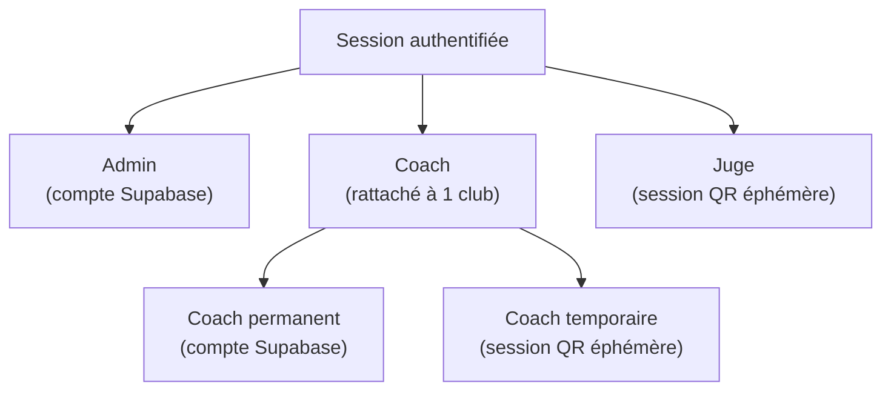
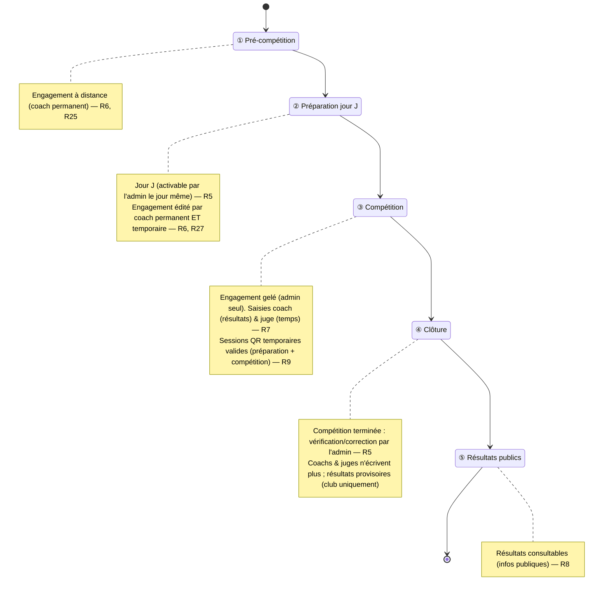

# Spec : Rôles & autorisations

- **Statut** : validée (le 2026-07-12)
- **Sources** : décision produit du 2026-07-12 (rôles, droits, cycle de vie
  d'une rencontre) ; règlement CT33 FFME 2025-2026 **enfant/ado** et v3.1 Adultes
  (épreuves voie / bloc / vitesse, résultat de vitesse, catégories matin /
  après-midi, prêts de grimpeurs). ⚠️ La dernière version du règlement prime
  toujours (cf. `docs/conventions/01-workflow-spec-first-tdd.md` §4).
- **Révision** : 2026-07-22 — intégration du règlement enfant/ado (validée le
  2026-07-22) : résultat de vitesse temps/chute/non-présentation (R30–R31),
  catégorie de rencontre & demi-journées (R34), grimpeurs prêtés (R35–R36).
- **Révision** : 2026-07-25 — précisions d'implémentation RLS (T6), validées le
  2026-07-25 : périmètre de saisie du juge borné à l'**épreuve de vitesse de sa
  rencontre** (précision R30) ; le **roster `grimpeur` d'un club reste éditable
  hors phase**, le gating de phase ① ne portant que sur l'engagement en
  rencontre (équipes/compositions) (précision R6). Ces précisions n'altèrent pas
  la matrice ; elles lèvent deux ambiguïtés face au modèle de données.
- **Révision** : 2026-08-29 — le **cycle de vie passe de 3 à 4 phases** (validée
  le 2026-08-29) : insertion d'une phase **④ clôture** entre la compétition et les
  résultats publics. La compétition terminée, **l'admin vérifie et corrige la
  saisie** (résultats non encore publics) ; coachs et juges ne saisissent plus
  (leurs sessions/écritures étaient déjà bornées à la phase ③ compétition, R7/R9,
  donc exclues de la clôture sans changement de RLS). Chaque coach peut consulter
  les résultats **de son club** (marqués **provisoires**) ; rien n'est public
  cross-club avant la phase ⑤. La phase « résultats publics » devient **⑤**.
- **Révision** : 2026-09-01 — **phase « préparation jour J »** (validée le
  2026-09-01) : insertion d'une phase **② préparation** entre pré-compétition et
  compétition. Le cycle passe à **5 phases**. La préparation n'est **activable par
  l'admin que le jour de la rencontre** (garde-fou date). C'est la fenêtre
  d'édition **sur place** : coach **permanent ET temporaire** y modifient
  l'engagement (équipes, compositions, groupes de départ) avec des **droits
  identiques** — le coach temporaire ne peut toutefois **pas générer** de QR de
  coach temporaire (réservé permanent/admin, R26). L'engagement reste éditable par
  le **permanent** dès la **pré-compétition** (prépa à distance) ; il est **gelé
  dès la compétition** (③) : seul l'admin corrige alors. La **session QR** du coach
  temporaire est valable **préparation + compétition** (« la journée »), révoquée
  en clôture. Impact RLS : helpers `est_coach_temp_actif_club` /
  `est_coach_temp_engagement` ; `peut_ecrire_equipe` = permanent (pré-compét/prépa)
  OU temporaire (prépa) ; résultats inchangés (compétition).

## Objectif

Définir **qui peut faire quoi**, et **quand**, dans l'application interclub.
Cette spec est la source de vérité pour l'authentification, le modèle de données
(rattachements, affectations) et les policies **RLS**. Elle fournit la **matrice
rôles × actions** de référence et le **cycle de vie d'une rencontre** qui
conditionne les accès temporels.

## Vocabulaire

- **Rôle** : ensemble de droits attribué à une session authentifiée.
- **Admin** : rôle disposant de tous les droits ; administre la compétition.
- **Coach** : rôle rattaché à un club, responsable de ses équipes et grimpeurs.
- **Coach permanent** : coach disposant d'un compte Supabase (connexion à tout
  moment).
- **Coach temporaire** : coach authentifié par une **session QR éphémère**, le
  temps d'une rencontre.
- **Juge** : rôle authentifié par une **session QR éphémère**, affecté à
  l'épreuve de vitesse d'une rencontre.
- **Session QR éphémère** : authentification temporaire liée à une rencontre,
  obtenue via un QR code, valable uniquement pendant la fenêtre de la rencontre.
- **QR code** : jeton d'accès affiché par l'admin (ou par un coach permanent pour
  ses coachs temporaires) ouvrant une session éphémère.
- **Club** : structure regroupant des équipes et des grimpeurs.
- **Équipe** : groupe de grimpeurs engagé par un club.
- **Grimpeur** (compétiteur) : membre d'une équipe.
- **Rencontre** : confrontation programmée entre équipes, déroulée en trois
  phases (voir R5). Porte exactement une **catégorie** (voir R34).
- **Catégorie** : tranche d'âge d'une rencontre — **matin** (moins de 13 ans) ou
  **après-midi** (13/19 ans) — déterminée par l'année de naissance rapportée à
  l'**année de la saison** au sens de R37 (borne dynamique, pas une année
  figée). L'année-pivot (les « 13 ans ») peut concourir dans les deux
  catégories.
- **Épreuve** : discipline évaluée lors d'une rencontre — **voie**, **bloc** ou
  **vitesse**.
- **Vitesse** : épreuve chronométrée ; sa saisie porte, par grimpeur, sur un
  **résultat de vitesse** (voir ci-dessous).
- **Résultat de vitesse** : issue saisie par le juge pour un grimpeur sur
  l'épreuve de vitesse, prenant exactement une des trois formes : un **temps
  chronométré**, une **chute**, ou une **non-présentation**.
- **Prêt (grimpeur prêté)** : grimpeur d'un club engagé ponctuellement dans
  l'équipe d'un autre club ou dans l'**équipe CT33**, tout en restant rattaché à
  son club d'origine (il y conserve ses résultats individuels).
- **Équipe CT33** : équipe gérée par l'organisation, regroupant des participants
  en surnombre ou prêtés.
- **Infos publiques** : données de compétition consultables tous clubs confondus
  (calendrier, résultats, classements).
- **Saison** : période de compétition allant du **1er septembre** au **31 août**
  de l'année suivante, identifiée par son **année de début** (ex. saison 2025 =
  2025-09-01 → 2026-08-31). L'appartenance d'une rencontre à une saison est
  calculée dynamiquement à partir de sa date (R37) — aucun champ supplémentaire
  en base.

## Règles fonctionnelles

### Rôles et authentification

- **R1.** Il existe exactement trois rôles : `admin`, `coach`, `juge`.
- **R2.** Le rôle `coach` a deux modes d'authentification : **permanent** (compte
  Supabase) et **temporaire** (session QR éphémère).
- **R3.** Le rôle `juge` s'authentifie uniquement par session QR éphémère (aucun
  compte permanent).
- **R4.** Une session authentifiée porte exactement un rôle.

### Cycle de vie d'une rencontre

- **R5.** Une rencontre se déroule en **cinq phases successives** : **①
  pré-compétition** (pré-saisie de l'engagement à distance par le coach permanent),
  **② préparation** (fenêtre d'édition **sur place le jour J**, ouverte par
  l'admin, où coach permanent **et** temporaire finalisent l'engagement), **③
  compétition** (déroulement et saisies des résultats ; engagement gelé), **④
  clôture** (compétition terminée : vérification et correction de la saisie par
  l'**admin**, résultats non encore publics), **⑤ résultats publics** (rendu
  public des résultats).
  - **Précision (rév. 2026-09-01)** : la phase **② préparation** n'est
    **activable par l'admin que le jour de la rencontre** (date du jour) ; c'est
    un garde-fou « jour J ». Hors de ce jour, la rencontre reste en pré-compétition.
  - **Précision (rév. 2026-09-02)** : le garde-fou « jour J » couvre **aussi la
    phase ③ compétition**. Les deux phases **② préparation** et **③ compétition**
    se déroulent le jour J : l'admin ne peut les activer que **le jour de la
    rencontre**. Hors jour J, la rencontre ne peut être **ni en préparation ni en
    compétition**. En conséquence, **reculer depuis la ③ compétition** ramène en
    **② préparation le jour J**, mais **hors jour J** — la préparation étant
    elle-même bornée au jour J — ramène directement en **① pré-compétition**.
  - **Précision (rév. 2026-08-29)** : en phase ④ **clôture**, **seul l'admin**
    peut saisir/corriger les résultats et temps ; coachs et juges n'y écrivent
    plus (leurs droits étaient bornés à la phase ③ compétition, R7/R9). Chaque
    coach peut **consulter** les résultats **de son club** (statut
    **provisoire**), mais aucune donnée n'est publique cross-club avant la phase
    ⑤ (R8).
- **R6.** L'édition de l'**engagement** (équipes, compositions, groupes de départ)
  n'est possible qu'en phases **① pré-compétition** et **② préparation**.
  - **Précision (rév. 2026-07-25)** : « grimpeurs » désigne ici leur
    **engagement dans une rencontre** (compositions d'équipe). Le **roster de
    grimpeurs d'un club** (licenciés, indépendant d'une rencontre) reste
    consultable et éditable par le coach de ce club **hors phase** ; seul
    l'engagement en rencontre (équipes et compositions) est borné aux phases
    d'édition.
  - **Précision (rév. 2026-09-01)** : en **① pré-compétition**, seul le coach
    **permanent** édite l'engagement (prépa à distance). En **② préparation**
    (jour J), coach **permanent et temporaire** l'éditent avec des **droits
    identiques**. Dès la **③ compétition** et au-delà (④, ⑤), l'engagement est
    **verrouillé pour les coachs** ; **seul l'admin** peut le corriger.
- **R7.** La saisie des résultats (coach) et des temps de vitesse (juge) n'est
  possible qu'en phase ③ compétition.
- **R8.** Les résultats deviennent consultables comme **infos publiques** en
  phase ⑤ résultats publics.
- **R9.** Les sessions QR éphémères ne sont valides que pendant la **fenêtre du
  jour de la rencontre** : pour le **coach temporaire**, phases **② préparation**
  et **③ compétition** ; pour le **juge**, phase **③ compétition**. Hors de cette
  fenêtre (avant la préparation, ou dès la ④ clôture), la session est invalide
  (révocation recalculée à chaque requête).
- **R34.** Une rencontre porte exactement une **catégorie** (matin < 13 ans, ou
  après-midi 13/19 ans). Une journée d'interclub à deux demi-journées se
  modélise en **deux rencontres distinctes**, chacune avec ses propres phases,
  jetons QR et affectations. Un grimpeur de l'année-pivot peut être engagé dans
  les deux rencontres. L'**âge** est rapporté à la **saison** (année de la saison
  moins l'année de naissance). L'**engagement** d'un grimpeur dans une rencontre
  (composition d'équipe, y compris un prêté) est **limité aux grimpeurs éligibles à
  sa catégorie** : **enfant** = âge ≤ 13 (moins de 13 ans **et** pivot) ; **ado** =
  13 à 19 ans. Un grimpeur hors tranche d'âge ne peut y être engagé (cf. spec #5 R12).

### Admin

- **R10.** L'admin dispose de tous les droits : aucune action de l'application ne
  lui est interdite.
- **R11.** Seul l'admin peut créer, modifier ou supprimer un **club**.
- **R12.** Seul l'admin peut créer, modifier ou supprimer une **rencontre**.
- **R13.** Seul l'admin peut accéder au **paramétrage** de l'application
  (structure de la compétition, catégories enfant/ado, etc.).
- **R14.** L'admin peut afficher les **QR** de toutes les sessions éphémères
  (coachs temporaires et juges).
- **R15.** Seul l'admin peut **affecter un juge** à l'épreuve de vitesse d'une
  rencontre.

### Coach — droits communs (permanent et temporaire)

- **R16.** Un coach est rattaché à exactement un club.
- **R17.** Un coach peut créer, modifier et supprimer les **équipes** de son
  club, et uniquement celles-ci.
- **R18.** Un coach peut ajouter, modifier et supprimer les **grimpeurs** de ses
  équipes, et uniquement ceux-ci (le rattachement d'un grimpeur **prêté** d'un
  autre club relève de l'admin, cf. R35).
- **R19.** Un coach peut saisir et modifier les **résultats** des grimpeurs de
  ses équipes (en phase ③ compétition, cf. R7).
- **R20.** Un coach ne peut ni consulter en écriture ni modifier les données
  d'un autre club (équipes, grimpeurs, résultats).
- **R21.** Un coach peut consulter les **infos publiques** de la compétition,
  tous clubs confondus (calendrier, résultats, classements).
- **R22.** Un coach ne peut pas créer de club ni de rencontre, ni accéder au
  paramétrage (réservés à l'admin, cf. R11–R13).

### Coach — permanent vs temporaire

- **R23.** Le coach permanent peut se connecter à tout moment, indépendamment
  d'une rencontre et de sa phase.
- **R24.** Le coach permanent peut consulter les résultats des rencontres
  passées.
- **R25.** Le coach permanent peut éditer l'engagement de ses équipes (équipes,
  compositions, groupes de départ) en phases **① pré-compétition** (prépa à
  distance) et **② préparation** (jour J, aux côtés du coach temporaire) — R6.
- **R26.** Le coach permanent peut afficher les **QR** des coachs temporaires de
  **son** club. Le **coach temporaire**, lui, **ne peut pas** générer ni afficher
  de QR de coach temporaire (réservé au permanent et à l'admin).
- **R27.** Le coach temporaire agit **uniquement le jour de la rencontre**, pendant
  la validité de sa session QR (phases ② préparation et ③ compétition, R9). En **②
  préparation**, il édite l'**engagement** (équipes, compositions, groupes de
  départ) avec les **mêmes droits que le coach permanent** (R17, R18), **sauf**
  générer des QR de coach temporaire (R26). En **③ compétition**, l'engagement est
  **gelé** (précision R6) et il **saisit les résultats** de ses grimpeurs (R19). Il
  consulte son périmètre (R21).
- **R28.** Hors de la fenêtre du jour de la rencontre (avant la préparation, ou
  dès la ④ clôture), le coach temporaire n'a **aucun accès** : pas de session, pas
  de consultation de rencontres passées (par opposition à R23–R25).

### Juge

- **R29.** Un juge est affecté par l'admin (R15) à l'épreuve de **vitesse** d'une
  rencontre.
- **R30.** Le juge saisit uniquement les **résultats de vitesse** (temps, chute
  ou non-présentation) de l'épreuve de vitesse à laquelle il est affecté ; il
  n'intervient pas sur les épreuves de voie ni de bloc.
  - **Précision (rév. 2026-07-25)** : en RLS, le périmètre d'écriture du juge est
    **l'épreuve de vitesse de sa rencontre** (le résultat de vitesse porte
    l'épreuve + le grimpeur, pas le couloir). Le **couloir (`voie_vitesse`)**
    auquel le jeton juge est rattaché reste une **information d'organisation
    physique** ; il ne subdivise pas le périmètre d'écriture en base.
- **R31.** Pour saisir, le juge **sélectionne un grimpeur** (compétiteur) puis
  enregistre son **résultat de vitesse**, qui prend exactement une des trois
  formes : un **temps chronométré**, une **chute**, ou une **non-présentation**.
  Un grimpeur a **un seul résultat de vitesse** par rencontre (pas d'autre
  passage).
- **R32.** Le juge ne peut effectuer aucune autre action que la saisie définie en
  R30–R31 (aucun CRUD club, équipe, grimpeur ou rencontre).
- **R33.** Le juge n'a accès qu'à la fenêtre de la rencontre (session QR
  éphémère, phase ③ compétition, R9).

### Grimpeurs prêtés (prêt inter-clubs / équipe CT33)

- **R35.** Le **prêt** d'un grimpeur — la **mise à disposition** d'un grimpeur
  issu d'un autre club (ou de l'**équipe CT33**) à un **club d'accueil**, pour une
  **rencontre donnée** — est **créé et révoqué par l'admin seul**. Le prêt est une
  **relation distincte de l'affectation en équipe** : il exprime « ce grimpeur est
  disponible pour le club d'accueil sur cette rencontre », indépendamment de
  l'équipe où il est (ou n'est pas) composé. Un coach ne peut ni **créer** ni
  **révoquer** un prêt. Un grimpeur **déjà engagé** dans une équipe de la rencontre
  (R14) **ne peut être prêté** — il ne joue que pour **une** équipe par rencontre ;
  seuls les grimpeurs **disponibles** (non engagés, non déjà prêtés) sont proposés
  au prêt. Il doit aussi être **éligible à la catégorie** de la rencontre (R34).
- **R36.** Tant qu'un prêt est actif (R35), le **coach du club d'accueil gère le
  grimpeur prêté comme un grimpeur de son club** pour cette rencontre : il peut
  l'**affecter à une équipe, l'en retirer, le déplacer** entre ses équipes
  (espace coach, R12/R18) et **saisir ses résultats** (R19) en phase ③ compétition
  (R7), dans son périmètre. Le **retrait d'une équipe ne met pas fin au prêt** : le
  grimpeur **redevient disponible** (roster) et peut être ré-affecté par le coach ;
  seul l'**admin** met fin au prêt (R35). Le grimpeur reste rattaché à son **club
  d'origine** pour ses résultats individuels (classement — hors périmètre).

### Saison

- **R37.** La **saison** d'une rencontre est calculée dynamiquement à partir de
  sa **date** sans champ supplémentaire en base :
  - date entre le **1er septembre** et le **31 décembre** inclus → année de la
    saison = **année de la date** ;
  - date entre le **1er janvier** et le **31 août** inclus → année de la saison
    = **année de la date − 1**.
  - Exemple : rencontre le 2025-11-15 → saison 2025 ; rencontre le 2026-03-10
    → saison 2025 également.
- **R38.** Les **résultats individuels**, **par équipe** et **par club** sont
  calculés et agrégés **par saison** (R37) : seules les rencontres d'une même
  saison contribuent aux classements de cette saison. Le détail du calcul est
  couvert par la spec de classement (hors périmètre de cette spec).

## Matrice rôles × actions

Légende : ✅ autorisé · ❌ interdit · 🔒 limité à son périmètre (son club / ses
grimpeurs / l'épreuve affectée) · ⏱️ uniquement pendant la phase ③ compétition ·
les exposants **①②** indiquent les **phases** où l'action est permise (① pré-
compétition, ② préparation jour J). L'engagement est **figé dès la ③ compétition**
(seul l'admin corrige, précision R6/R27).

| Action | Admin | Coach permanent | Coach temporaire | Juge |
| ------ | :---: | :-------------: | :--------------: | :--: |
| Paramétrage de l'application | ✅ | ❌ | ❌ | ❌ |
| CRUD clubs | ✅ | ❌ | ❌ | ❌ |
| CRUD rencontres | ✅ | ❌ | ❌ | ❌ |
| Affecter un juge à la vitesse | ✅ | ❌ | ❌ | ❌ |
| Afficher les QR (coachs temp. + juges) | ✅ | 🔒 | ❌ | ❌ |
| CRUD équipes (de son club) — engagement | ✅ | 🔒①② | 🔒② | ❌ |
| CRUD compositions/groupes de départ (de ses équipes) — engagement | ✅ | 🔒①② | 🔒② | ❌ |
| Saisir les résultats de ses grimpeurs | ✅ | 🔒⏱️ | 🔒⏱️ | ❌ |
| Saisir les résultats de vitesse (temps/chute/non-prés.) de la voie affectée | ✅ | ❌ | ❌ | 🔒⏱️ |
| Rattacher un grimpeur prêté (autre club / équipe CT33) | ✅ | ❌ | ❌ | ❌ |
| Consulter les infos publiques (tous clubs) | ✅ | ✅ | ⏱️ | ❌ |
| Consulter les rencontres passées | ✅ | ✅ | ❌ | ❌ |
| Pré-saisir équipes/grimpeurs (phase ①) | ✅ | ✅ | ❌ | ❌ |
| Se connecter hors rencontre | ✅ | ✅ | ❌ | ❌ |

Pour un coach permanent, « Afficher les QR » est limité (🔒) aux coachs
temporaires de son club (R26). Un grimpeur prêté est rattaché par l'admin (R35),
puis saisi par le coach de son équipe d'accueil comme un grimpeur de son
périmètre (R36) — d'où l'absence de ligne dédiée « saisie » pour le prêt.

## Diagrammes

### Typologie des rôles



### Cycle de vie d'une rencontre



### Accès du coach temporaire et du juge (session QR)

```mermaid
sequenceDiagram
  actor U as Coach temp. / Juge
  participant App
  participant DB as Supabase (RLS)
  U->>App: Scan du QR de la rencontre
  App->>DB: Ouverture session éphémère (rôle + périmètre + rencontre)
  DB-->>App: Session valide le jour J — coach temp. : ② préparation + ③ compétition ; juge : ③ compétition (R9)
  U->>App: Action (saisie / CRUD selon rôle et phase)
  App->>DB: Requête filtrée par périmètre (club / épreuve de vitesse)
  DB-->>App: Autorisé si périmètre + phase OK, sinon refus
  Note over U,DB: Hors de la fenêtre du jour (dès ④ clôture) → aucun accès (R28, R33)
```

## Scénarios

### Nominal — coach permanent

Étant donné un coach permanent rattaché au club A, quand il se connecte en phase
① pré-compétition et pré-saisit une équipe et ses grimpeurs pour le club A, alors
la création est acceptée (R17, R18, R23, R25).

### Nominal — coach temporaire

Étant donné un coach temporaire du club A ayant scanné le QR le **jour de la
rencontre** : en **② préparation**, quand il ajoute une équipe et compose son
roster (groupes de départ inclus), l'opération est **acceptée** — mêmes droits
que le coach permanent (R6, R17, R18, R27) ; puis en **③ compétition**, quand il
**saisit les résultats** de ses grimpeurs, c'est **accepté** (R19, R27), mais s'il
tente alors de **modifier la composition**, c'est **refusé** — l'engagement est
gelé, seul l'admin corrige (R6/R27).

### Nominal — juge

Étant donné un juge affecté à l'épreuve de vitesse d'une rencontre en phase ③
compétition, quand il sélectionne un grimpeur et saisit son **résultat de
vitesse** (un temps, ou une chute, ou une non-présentation), alors la saisie est
acceptée (R29, R30, R31).

### Nominal — grimpeur prêté

Étant donné un grimpeur du club B **prêté au club A** par l'admin (R35), quand le
coach du club A l'**affecte** à une équipe puis **saisit ses résultats** en phase ③
compétition, alors c'est accepté (R36) ; le coach du club A ne pouvait pas **créer
le prêt** lui-même (R35).

### Cas limites / erreurs

- Un coach du club A tente de modifier une équipe du club B → refusé (R20).
- Un coach temporaire tente d'agir **hors de la fenêtre du jour** (avant la ②
  préparation, ou dès la ④ clôture) → refusé (R9, R28).
- Un coach temporaire tente de **modifier l'engagement en ③ compétition** →
  refusé (engagement gelé, R6/R27).
- Un coach temporaire tente de **générer un QR de coach temporaire** → refusé
  (réservé permanent/admin, R26).
- Un coach temporaire tente de consulter une rencontre passée → refusé (R28).
- Un coach tente de pré-saisir en phase ③ compétition → refusé (R6).
- Un juge tente de saisir un résultat sans avoir sélectionné de grimpeur, ou un
  second résultat pour un grimpeur déjà saisi → refusé (R31).
- Un juge tente de saisir un résultat sur une épreuve de vitesse à laquelle il
  n'est pas affecté → refusé (R30).
- Un coach tente de rattacher à son équipe un grimpeur d'un autre club (prêt) →
  refusé, réservé à l'admin (R35).
- Un juge tente de saisir un résultat de voie ou de bloc → refusé (R30).
- Un juge tente de créer/modifier une équipe ou un grimpeur → refusé (R32).
- Un coach tente de créer un club, une rencontre, ou d'accéder au paramétrage →
  refusé (R22).
- Un coach permanent tente d'afficher le QR d'un coach temporaire d'un autre
  club → refusé (R26).

## Contraintes de données

- Un coach est lié à **exactement un club** (rattachement obligatoire, R16).
- Une **rencontre** porte une **phase** courante parmi ①/②/③/④/⑤ (R5) qui
  conditionne les écritures (R6–R9).
- Une **session QR éphémère** est liée à **une rencontre** et porte son périmètre
  (club pour un coach temporaire ; épreuve de vitesse pour un juge) ; elle n'est
  valide qu'en phase ③ compétition (R9, R28, R33).
- Une affectation de juge relie un juge à l'**épreuve de vitesse** d'une
  rencontre (R15, R29).
- Une **rencontre** porte exactement une **catégorie** (matin / après-midi) ;
  les deux demi-journées d'une journée sont **deux rencontres** distinctes (R34).
- Un grimpeur a **au plus un résultat de vitesse** pour l'épreuve de vitesse
  d'une rencontre (unicité), ce résultat étant un temps, une chute ou une
  non-présentation (R31).
- Un grimpeur est rattaché à un **club d'origine** ; son engagement dans une
  équipe d'accueil ou l'équipe CT33 (**prêt**) est posé par l'admin (R35), et la
  saisie de ses résultats suit le coach de l'équipe d'accueil (R36).
- La **saison** d'une rencontre est une valeur **dérivée** de sa date (R37) —
  pas de colonne `saison` en base ; elle est calculée à la lecture. Les
  classements sont partitionnés par saison (R38).
- **RLS attendue** :
  - lecture/écriture des équipes, grimpeurs et résultats **restreinte au club**
    du coach (R17–R20) ;
  - lecture des infos publiques ouverte aux coachs, tous clubs (R21) ;
  - écriture des **résultats de vitesse** d'un juge **restreinte à la voie de
    l'épreuve de vitesse qui lui est affectée** (R30) ;
  - rattachement d'un grimpeur **prêté** à une équipe d'accueil / équipe CT33
    **réservé à l'admin** (R35) ; ensuite saisie par le coach de cette équipe
    (R36) ;
  - opérations admin (clubs, rencontres, paramétrage, affectation juge, QR)
    **réservées au rôle admin** (R11–R15) — hors affichage QR des coachs
    temporaires de son club par le coach permanent (R26) ;
  - écritures **conditionnées par la phase** de la rencontre (R6–R9) ;
  - accès des sessions éphémères **borné à la phase ③ compétition** (R9, R28,
    R33).

## Hors périmètre

Cette spec ne couvre pas (à traiter dans des specs dédiées) :

- Le **mécanisme d'authentification** détaillé (génération/scan du QR, durée de
  validité, révocation) et le mapping utilisateur ↔ rôle ↔ joueur.
- L'accès **visiteur non authentifié** aux infos publiques.
- Le modèle détaillé de **scoring et de classement** (barèmes voie / bloc /
  vitesse, classements filles / garçons, cotations par catégorie).
- Le **calcul d'éligibilité par âge** d'un grimpeur à une catégorie (matin /
  après-midi) au-delà du fait qu'une rencontre porte une catégorie (R34).
- Le **workflow de saisie/validation des résultats** au-delà de « qui peut
  saisir, et dans quelle phase » (états fins, verrouillage, correction
  post-rencontre).
- Les **transitions de phase** d'une rencontre (qui les déclenche, conditions) —
  au-delà du fait qu'elles existent (R5).
- Le cas d'une **même personne cumulant plusieurs rôles** (au-delà de R4 : une
  session = un rôle).
