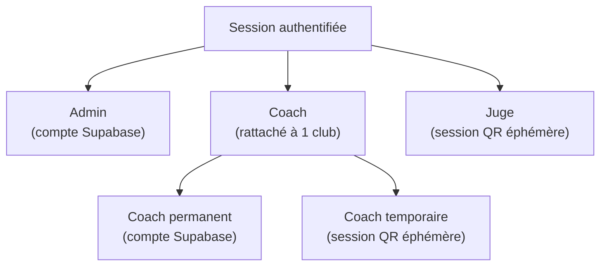
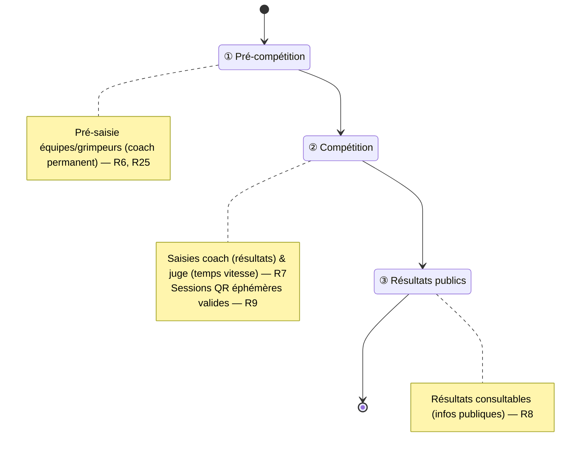
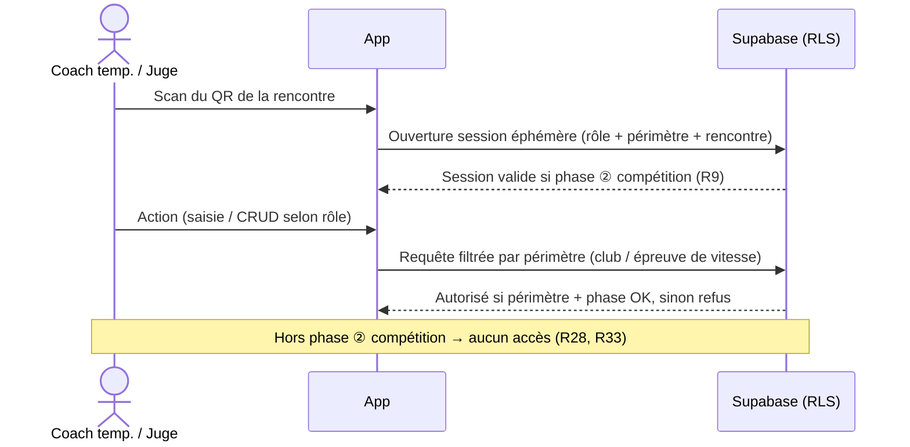

# Spec : Rôles & autorisations

- **Statut** : validée (le 2026-07-12)
- **Sources** : décision produit du 2026-07-12 (rôles, droits, cycle de vie
  d'une rencontre) ; règlement 2025 v3.1 Adultes (contexte des épreuves voie /
  bloc / vitesse). ⚠️ La dernière version du règlement prime toujours (cf.
  `docs/conventions/01-workflow-spec-first-tdd.md` §4).

## Objectif

Définir **qui peut faire quoi**, et **quand**, dans l'application interclub.
Cette spec est la source de vérité pour l'authentification, le modèle de données
(rattachements, affectations) et les policies **RLS**. Elle fournit la **matrice
rôles × actions** de référence et le **cycle de vie d'une rencontre** qui
conditionne les accès temporels.

## Vocabulaire

- **Rôle** : ensemble de droits attribué à une session authentifiée.
- **Admin** : rôle disposant de tous les droits ; administre la compétition.
- **Coach** : rôle rattaché à un club, responsable de ses équipes et grimpeurs.
- **Coach permanent** : coach disposant d'un compte Supabase (connexion à tout
  moment).
- **Coach temporaire** : coach authentifié par une **session QR éphémère**, le
  temps d'une rencontre.
- **Juge** : rôle authentifié par une **session QR éphémère**, affecté à
  l'épreuve de vitesse d'une rencontre.
- **Session QR éphémère** : authentification temporaire liée à une rencontre,
  obtenue via un QR code, valable uniquement pendant la fenêtre de la rencontre.
- **QR code** : jeton d'accès affiché par l'admin (ou par un coach permanent pour
  ses coachs temporaires) ouvrant une session éphémère.
- **Club** : structure regroupant des équipes et des grimpeurs.
- **Équipe** : groupe de grimpeurs engagé par un club.
- **Grimpeur** (compétiteur) : membre d'une équipe.
- **Rencontre** : confrontation programmée entre équipes, déroulée en trois
  phases (voir R5).
- **Épreuve** : discipline évaluée lors d'une rencontre — **voie**, **bloc** ou
  **vitesse**.
- **Vitesse** : épreuve chronométrée ; sa saisie porte sur des **temps**.
- **Infos publiques** : données de compétition consultables tous clubs confondus
  (calendrier, résultats, classements).

## Règles fonctionnelles

### Rôles et authentification

- **R1.** Il existe exactement trois rôles : `admin`, `coach`, `juge`.
- **R2.** Le rôle `coach` a deux modes d'authentification : **permanent** (compte
  Supabase) et **temporaire** (session QR éphémère).
- **R3.** Le rôle `juge` s'authentifie uniquement par session QR éphémère (aucun
  compte permanent).
- **R4.** Une session authentifiée porte exactement un rôle.

### Cycle de vie d'une rencontre

- **R5.** Une rencontre se déroule en trois phases successives : **①
  pré-compétition** (pré-saisie des équipes), **② compétition** (déroulement et
  saisies des résultats), **③ résultats publics** (rendu public des résultats).
- **R6.** La pré-saisie des équipes et grimpeurs n'est possible qu'en phase ①
  pré-compétition.
- **R7.** La saisie des résultats (coach) et des temps de vitesse (juge) n'est
  possible qu'en phase ② compétition.
- **R8.** Les résultats deviennent consultables comme **infos publiques** en
  phase ③ résultats publics.
- **R9.** Les sessions QR éphémères (coach temporaire, juge) ne sont valides que
  pendant la phase ② compétition de leur rencontre.

### Admin

- **R10.** L'admin dispose de tous les droits : aucune action de l'application ne
  lui est interdite.
- **R11.** Seul l'admin peut créer, modifier ou supprimer un **club**.
- **R12.** Seul l'admin peut créer, modifier ou supprimer une **rencontre**.
- **R13.** Seul l'admin peut accéder au **paramétrage** de l'application
  (structure de la compétition, catégories enfant/ado, etc.).
- **R14.** L'admin peut afficher les **QR** de toutes les sessions éphémères
  (coachs temporaires et juges).
- **R15.** Seul l'admin peut **affecter un juge** à l'épreuve de vitesse d'une
  rencontre.

### Coach — droits communs (permanent et temporaire)

- **R16.** Un coach est rattaché à exactement un club.
- **R17.** Un coach peut créer, modifier et supprimer les **équipes** de son
  club, et uniquement celles-ci.
- **R18.** Un coach peut ajouter, modifier et supprimer les **grimpeurs** de ses
  équipes, et uniquement ceux-ci.
- **R19.** Un coach peut saisir et modifier les **résultats** des grimpeurs de
  ses équipes (en phase ② compétition, cf. R7).
- **R20.** Un coach ne peut ni consulter en écriture ni modifier les données
  d'un autre club (équipes, grimpeurs, résultats).
- **R21.** Un coach peut consulter les **infos publiques** de la compétition,
  tous clubs confondus (calendrier, résultats, classements).
- **R22.** Un coach ne peut pas créer de club ni de rencontre, ni accéder au
  paramétrage (réservés à l'admin, cf. R11–R13).

### Coach — permanent vs temporaire

- **R23.** Le coach permanent peut se connecter à tout moment, indépendamment
  d'une rencontre et de sa phase.
- **R24.** Le coach permanent peut consulter les résultats des rencontres
  passées.
- **R25.** Le coach permanent peut pré-saisir ses équipes et grimpeurs en phase
  ① pré-compétition (R6).
- **R26.** Le coach permanent peut afficher les **QR** des coachs temporaires de
  **son** club.
- **R27.** Le coach temporaire dispose des mêmes droits fonctionnels que le
  coach permanent (R17–R21), mais **uniquement pendant la validité de sa session
  QR** (phase ② compétition, R9).
- **R28.** Hors de la fenêtre de la rencontre, le coach temporaire n'a aucun
  accès : pas de connexion, pas de consultation de rencontres passées, pas de
  pré-saisie (par opposition à R23–R25).

### Juge

- **R29.** Un juge est affecté par l'admin (R15) à l'épreuve de **vitesse** d'une
  rencontre.
- **R30.** Le juge saisit uniquement les **temps** de l'épreuve de vitesse à
  laquelle il est affecté ; il n'intervient pas sur les épreuves de voie ni de
  bloc.
- **R31.** Pour saisir, le juge **sélectionne un grimpeur** (compétiteur) puis
  enregistre son temps. Un grimpeur a **un seul temps** pour l'épreuve de vitesse
  (pas d'autre passage).
- **R32.** Le juge ne peut effectuer aucune autre action que la saisie définie en
  R30–R31 (aucun CRUD club, équipe, grimpeur ou rencontre).
- **R33.** Le juge n'a accès qu'à la fenêtre de la rencontre (session QR
  éphémère, phase ② compétition, R9).

## Matrice rôles × actions

Légende : ✅ autorisé · ❌ interdit · 🔒 limité à son périmètre (son club / ses
grimpeurs / l'épreuve affectée) · ⏱️ uniquement pendant la phase ② compétition.

| Action | Admin | Coach permanent | Coach temporaire | Juge |
| ------ | :---: | :-------------: | :--------------: | :--: |
| Paramétrage de l'application | ✅ | ❌ | ❌ | ❌ |
| CRUD clubs | ✅ | ❌ | ❌ | ❌ |
| CRUD rencontres | ✅ | ❌ | ❌ | ❌ |
| Affecter un juge à la vitesse | ✅ | ❌ | ❌ | ❌ |
| Afficher les QR (coachs temp. + juges) | ✅ | 🔒 | ❌ | ❌ |
| CRUD équipes (de son club) | ✅ | 🔒 | 🔒⏱️ | ❌ |
| CRUD grimpeurs (de ses équipes) | ✅ | 🔒 | 🔒⏱️ | ❌ |
| Saisir les résultats de ses grimpeurs | ✅ | 🔒⏱️ | 🔒⏱️ | ❌ |
| Saisir les temps de l'épreuve de vitesse affectée | ✅ | ❌ | ❌ | 🔒⏱️ |
| Consulter les infos publiques (tous clubs) | ✅ | ✅ | ⏱️ | ❌ |
| Consulter les rencontres passées | ✅ | ✅ | ❌ | ❌ |
| Pré-saisir équipes/grimpeurs (phase ①) | ✅ | ✅ | ❌ | ❌ |
| Se connecter hors rencontre | ✅ | ✅ | ❌ | ❌ |

Pour un coach permanent, « Afficher les QR » est limité (🔒) aux coachs
temporaires de son club (R26).

## Diagrammes

### Typologie des rôles

### Cycle de vie d'une rencontre

### Accès du coach temporaire et du juge (session QR)

## Scénarios

### Nominal — coach permanent

Étant donné un coach permanent rattaché au club A, quand il se connecte en phase
① pré-compétition et pré-saisit une équipe et ses grimpeurs pour le club A, alors
la création est acceptée (R17, R18, R23, R25).

### Nominal — coach temporaire

Étant donné un coach temporaire du club A ayant scanné le QR d'une rencontre en
phase ② compétition, quand il modifie la composition de son équipe et saisit les
résultats de ses grimpeurs, alors les opérations sont acceptées (R19, R27).

### Nominal — juge

Étant donné un juge affecté à l'épreuve de vitesse d'une rencontre en phase ②
compétition, quand il sélectionne un grimpeur et saisit son temps, alors la
saisie est acceptée (R29, R30, R31).

### Cas limites / erreurs

- Un coach du club A tente de modifier une équipe du club B → refusé (R20).
- Un coach temporaire tente d'agir hors phase ② compétition → refusé (R28).
- Un coach temporaire tente de consulter une rencontre passée → refusé (R28).
- Un coach tente de pré-saisir en phase ② compétition → refusé (R6).
- Un juge tente de saisir un temps sans avoir sélectionné de grimpeur, ou un
  second temps pour un grimpeur déjà chronométré → refusé (R31).
- Un juge tente de saisir un temps sur une épreuve de vitesse à laquelle il n'est
  pas affecté → refusé (R30).
- Un juge tente de saisir un résultat de voie ou de bloc → refusé (R30).
- Un juge tente de créer/modifier une équipe ou un grimpeur → refusé (R32).
- Un coach tente de créer un club, une rencontre, ou d'accéder au paramétrage →
  refusé (R22).
- Un coach permanent tente d'afficher le QR d'un coach temporaire d'un autre
  club → refusé (R26).

## Contraintes de données

- Un coach est lié à **exactement un club** (rattachement obligatoire, R16).
- Une **rencontre** porte une **phase** courante parmi ①/②/③ (R5) qui conditionne
  les écritures (R6–R9).
- Une **session QR éphémère** est liée à **une rencontre** et porte son périmètre
  (club pour un coach temporaire ; épreuve de vitesse pour un juge) ; elle n'est
  valide qu'en phase ② compétition (R9, R28, R33).
- Une affectation de juge relie un juge à l'**épreuve de vitesse** d'une
  rencontre (R15, R29).
- Un grimpeur a **au plus un temps** pour l'épreuve de vitesse d'une rencontre
  (unicité, R31).
- **RLS attendue** :
  - lecture/écriture des équipes, grimpeurs et résultats **restreinte au club**
    du coach (R17–R20) ;
  - lecture des infos publiques ouverte aux coachs, tous clubs (R21) ;
  - écriture des temps d'un juge **restreinte à l'épreuve de vitesse qui lui est
    affectée** (R30) ;
  - opérations admin (clubs, rencontres, paramétrage, affectation juge, QR)
    **réservées au rôle admin** (R11–R15) — hors affichage QR des coachs
    temporaires de son club par le coach permanent (R26) ;
  - écritures **conditionnées par la phase** de la rencontre (R6–R9) ;
  - accès des sessions éphémères **borné à la phase ② compétition** (R9, R28,
    R33).

## Hors périmètre

Cette spec ne couvre pas (à traiter dans des specs dédiées) :

- Le **mécanisme d'authentification** détaillé (génération/scan du QR, durée de
  validité, révocation) et le mapping utilisateur ↔ rôle ↔ joueur.
- L'accès **visiteur non authentifié** aux infos publiques.
- Le modèle détaillé de **scoring et de classement**.
- Le **workflow de saisie/validation des résultats** au-delà de « qui peut
  saisir, et dans quelle phase » (états fins, verrouillage, correction
  post-rencontre).
- Les **transitions de phase** d'une rencontre (qui les déclenche, conditions) —
  au-delà du fait qu'elles existent (R5).
- Le cas d'une **même personne cumulant plusieurs rôles** (au-delà de R4 : une
  session = un rôle).
