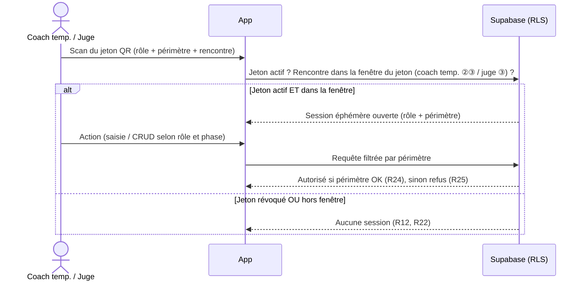
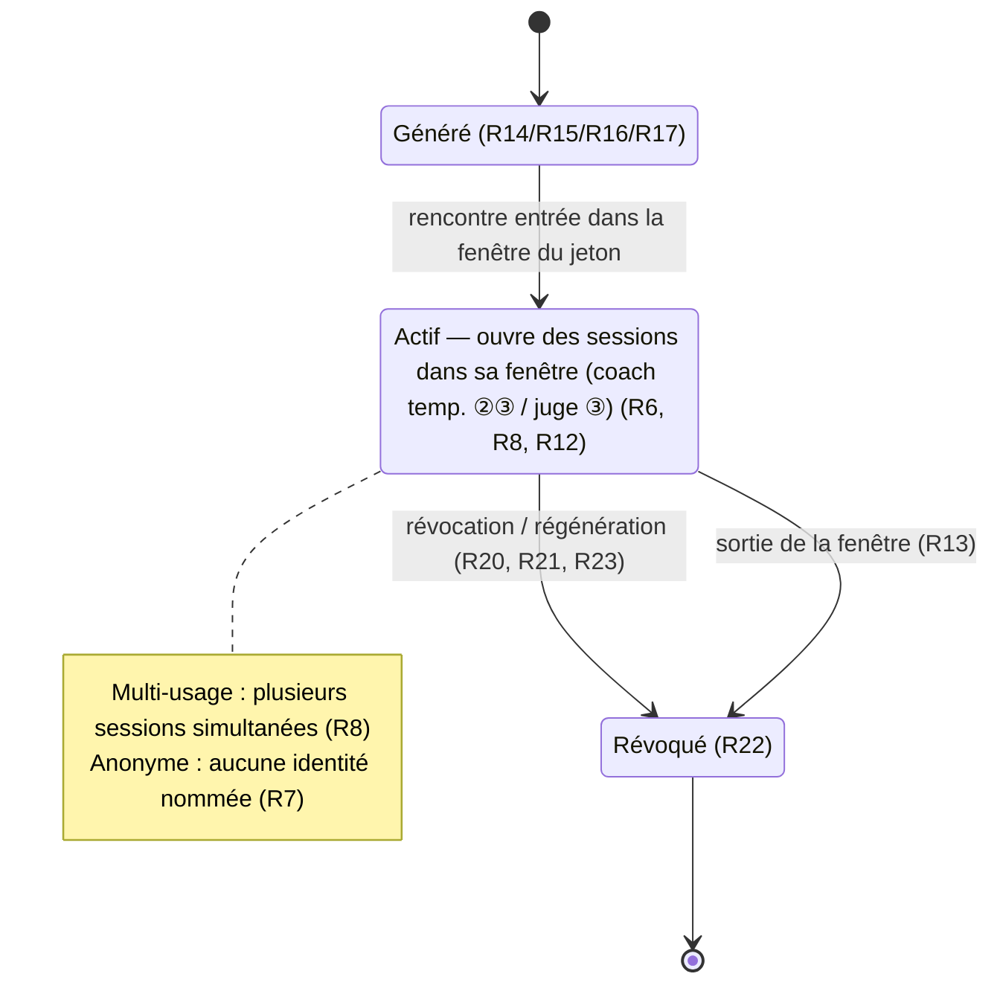
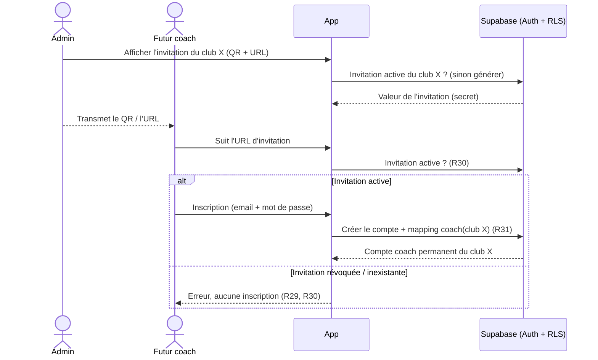

# Spec : Authentification & sessions QR

- **Statut** : validée (le 2026-07-22)
- **Révision** : 2026-09-25 — gardes & redirections (règle de changement, spec
  #12) : politique de refus **hybride** — pas de session → `redirect('/connexion')`,
  session au mauvais rôle → 404 (R2/R3) ; gardes unifiées `exigerUtilisateur` /
  `exigerAdmin` / `exigerContexteCoach` / `exigerContexteJuge` (R1/R4/R5) ; pages
  d'auth qui **redirigent un utilisateur déjà connecté** (R8) ; **déconnexion**
  des comptes permanents depuis chaque écran (R20/R21) ; **fin de session** QR
  juge/coach temporaire (R17/R22). Détails : `12-navigation-et-routing.md`.
- **Sources** : décision produit du 2026-07-22 (mécanisme d'authentification,
  cycle de vie des sessions QR éphémères, affectation juge) ; règlement CT33 FFME
  2025-2026 **enfant/ado** (voies de vitesse filles / garçons, résultat de
  vitesse). S'appuie sur la **spec #1 — Rôles & autorisations**
  (`01-roles-et-autorisations.md`), qui reste la vérité pour « qui peut faire
  quoi ».
- **Révision** : 2026-07-22 — intégration du règlement enfant/ado (validée le
  2026-07-22) : la saisie juge porte sur un **résultat de vitesse**
  (temps/chute/non-présentation) et la **voie cloisonne** cette saisie (R11,
  R18, R24) ; jeton QR propre à chaque demi-journée/rencontre.
- **Révision** : 2026-09-04 — ajout de l'**invitation coach permanent** (R26–R33) :
  l'admin affiche, par club, un QR/URL durable d'onboarding permettant à un futur
  coach de créer son compte email + mot de passe, **automatiquement** rattaché à
  ce club. Fait entrer la **création de compte permanent** dans le périmètre
  (décision du 2026-09-04).

## Objectif

Détailler **comment** une session obtient son rôle et son périmètre : comptes
permanents (admin, coach) via Supabase Auth, et **sessions QR éphémères** (coach
temporaire, juge) le temps d'une rencontre. Cette spec précise la génération,
la validité, la révocation des jetons QR, et l'**affectation d'un juge** à
l'épreuve de vitesse. Elle est la source de vérité pour l'authentification et
alimente le modèle de données (mapping, jetons) et les policies **RLS**.

## Vocabulaire

- **Compte permanent** : compte Supabase Auth, réutilisable, portant un rôle
  applicatif (admin ou coach). Cf. spec #1 R2, R23.
- **Mapping de rôle** : association administrée reliant un compte permanent à son
  rôle applicatif (et, pour un coach, à son club).
- **Invitation coach permanent** : lien d'onboarding **durable**, propre à **un
  club**, matérialisé par un **QR code** et une **URL** équivalents ; suivre une
  invitation active permet de créer un **compte coach permanent** rattaché à ce
  club (R26–R33). À ne pas confondre avec le **jeton QR** (session éphémère liée à
  une rencontre).
- **Session QR éphémère** : session authentifiée, temporaire, ouverte en scannant
  un jeton QR, valide uniquement pendant la fenêtre d'une rencontre (spec #1 R9).
- **Jeton QR** : jeton d'accès anonyme, matérialisé par un QR code, ouvrant des
  sessions éphémères d'un **rôle** et d'un **périmètre** donnés pour une
  rencontre.
- **Périmètre** : ce qu'une session éphémère a le droit de toucher — un **club**
  (coach temporaire) ou une **voie de vitesse** d'une rencontre (juge).
- **Voie de vitesse** : couloir/ligne de l'épreuve de vitesse d'une rencontre,
  portant un **libellé** de classement (ex. « Filles », « Garçons »). Pour la
  catégorie enfant, les 2 voies sont créées automatiquement (spec #3 R29–R31) ;
  pour la catégorie ado le nombre est paramétrable. Un juge est affecté à
  **une** voie. (À ne pas confondre avec l'épreuve « voie » = difficulté.)
- **Affectation juge** : mise à disposition, par l'admin, du jeton QR « juge »
  d'une **voie de vitesse** d'une rencontre (spec #1 R15, R29).
- **Révocation** : invalidation d'un jeton QR (et des sessions qu'il a ouvertes).
- **Régénération** : remplacement d'un jeton QR par un nouveau jeton distinct,
  l'ancien étant révoqué.

## Règles fonctionnelles

### Comptes permanents & mapping de rôle

- **R1.** Un **compte permanent** est un compte Supabase Auth portant **exactement
  un** rôle applicatif parmi `admin` ou `coach` (une session = un rôle, spec #1
  R4).
- **R2.** Les rôles `admin` et `coach` (mode permanent) disposent d'un compte
  permanent ; le rôle `juge` n'a **jamais** de compte permanent (spec #1 R3).
- **R3.** Un compte de rôle `coach` est rattaché à **exactement un club** (spec #1
  R16) ; ce rattachement est porté par le mapping de rôle et ne change pas au
  cours d'une session.
- **R4.** Seul l'**admin** administre le mapping d'un compte permanent (attribuer
  le rôle, et le club pour un coach). C'est une action de paramétrage (spec #1
  R13). **Exception** : le rôle `coach` d'un club peut aussi être **attribué
  automatiquement** à l'inscription via une **invitation coach permanent** émise
  par l'admin (R26–R33) — l'admin garde la maîtrise puisqu'il émet et révoque
  l'invitation.
- **R5.** Un compte permanent sans mapping de rôle n'a **aucun droit applicatif**
  (fail-closed) : il ne peut agir qu'après attribution d'un rôle par l'admin.

### Sessions QR éphémères — nature

- **R6.** Une **session QR éphémère** s'ouvre en scannant un **jeton QR** ; elle
  est authentifiée et porte un **rôle** (`coach` ou `juge`), un **périmètre** et
  la **rencontre** associée.
- **R7.** Un jeton QR est **anonyme** : il n'est lié à aucune personne nommée.
  Toute personne qui le scanne ouvre une session de même rôle et même périmètre.
- **R8.** Un jeton QR est **multi-usage** : il peut ouvrir **plusieurs sessions
  simultanées** (plusieurs personnes / appareils) tant qu'il est valide.
- **R9.** Il existe exactement deux natures de jeton QR :
  - **(a) coach temporaire** — périmètre = **un club**, pour une rencontre ;
  - **(b) juge** — périmètre = **une voie de vitesse** d'une rencontre.
- **R10.** Une session ouverte par un jeton « coach temporaire » a les droits
  fonctionnels du coach de ce club (spec #1 R27), **bornés à cette rencontre**.
- **R11.** Une session ouverte par un jeton « juge » a les droits du juge (spec #1
  R30–R31) : saisir les **résultats de vitesse** (un temps chronométré, une chute
  ou une non-présentation) des grimpeurs de **la voie à laquelle le juge est
  affecté** (R9b, R17), et rien d'autre. Chaque grimpeur concourt sur **une seule
  voie** — celle de son classement (p. ex. filles ou garçons, R18) — et n'y a
  **qu'un seul résultat** (spec #1 R31). La voie **cloisonne** donc la saisie du
  juge : un juge ne saisit que les résultats des grimpeurs de sa voie.

### Validité (fenêtre temporelle)

- **R12.** Une session QR éphémère n'est valide que pendant la **fenêtre du jour
  de la rencontre**, qui **dépend de la nature du jeton** (spec #1 R9, rév.
  2026-09-01) :
  - jeton **coach temporaire** : phases **② préparation** et **③ compétition** ;
  - jeton **juge** : phase **③ compétition**.

  Hors de cette fenêtre, scanner le jeton **n'ouvre aucune session**.
- **R13.** Le passage de la rencontre **hors de la fenêtre** d'un jeton — pour le
  coach temporaire, dès la **④ clôture** ; pour le juge, dès la fin de la **③
  compétition** — **met fin** immédiatement à ses sessions QR éphémères (spec #1
  R28, R33).
- **R14.** Un jeton QR peut être généré **avant** sa fenêtre (ex. jeton coach
  temporaire préparé pendant la ① pré-compétition), mais il n'ouvre de session
  **qu'une fois** la rencontre entrée dans la fenêtre du jeton (② ou ③ selon sa
  nature).

### Génération & affichage

- **R15.** L'**admin** peut générer et afficher le jeton QR de **tout** périmètre
  (coach temporaire de n'importe quel club, juge) de **toute** rencontre (spec #1
  R14).
- **R16.** Un **coach permanent** peut générer et afficher le jeton QR « coach
  temporaire » de **son** club, et **uniquement** le sien (spec #1 R26).
- **R17.** Générer/afficher un jeton QR « juge » pour **une voie de vitesse** d'une
  rencontre vaut **affectation du juge** à cette voie ; **seul l'admin** peut le
  faire (spec #1 R15).
- **R18.** Une rencontre peut avoir **plusieurs** jetons QR « juge » actifs, car
  l'épreuve de vitesse comporte **plusieurs voies** correspondant à des
  **classements distincts** (p. ex. une voie filles et une voie garçons, chacune
  avec son classement) : un juge par voie. Il y a **au plus un** jeton « juge »
  actif **par voie de vitesse** (le multi-usage, R8, couvre plusieurs personnes
  sur une même voie).
- **R19.** Une rencontre a **au plus un** jeton QR « coach temporaire » actif
  **par club** : l'admin peut générer un jeton pour **tout club** de la
  compétition, qu'il ait ou non des équipes enregistrées pour cette rencontre
  (un club sans coach permanent a besoin du jeton pour inscrire ses équipes).

### Révocation & régénération

- **R20.** L'**admin** peut **révoquer** ou **régénérer** n'importe quel jeton QR.
- **R21.** Un **coach permanent** peut révoquer ou régénérer le jeton « coach
  temporaire » de **son** club (même périmètre qu'en R16), et aucun autre.
- **R22.** La **révocation** d'un jeton invalide **immédiatement** ce jeton et
  **toutes les sessions** ouvertes avec lui.
- **R23.** La **régénération** produit un **nouveau** jeton, distinct de
  l'ancien, et **révoque** l'ancien (R22 s'applique à l'ancien).

### Périmètre & sécurité

- **R24.** Une session éphémère ne peut agir que **dans son périmètre** : coach
  temporaire → équipes / grimpeurs / résultats de **son club** pour **cette
  rencontre** (spec #1 R20, R27) ; juge → **résultats de vitesse des grimpeurs de
  sa voie** pour cette rencontre (spec #1 R30, R11).
- **R25.** Toute action d'une session éphémère **hors de son périmètre** ou **hors
  de sa fenêtre de validité** (R12) est **refusée** (spec #1 R28, R33).

### Invitation coach permanent (onboarding)

- **R26.** L'admin peut, **pour un club**, générer et afficher une **invitation
  coach permanent**, matérialisée par un **QR code** et une **URL** équivalents
  (le QR encode l'URL). Suivre cette invitation ouvre l'inscription d'un nouveau
  **coach permanent rattaché à ce club**.
- **R27.** Une invitation coach permanent est **durable et multi-usage** :
  réutilisable tant qu'elle est **active**, plusieurs personnes peuvent créer
  chacune leur compte via la **même** invitation. Sa validité **ne dépend ni
  d'une rencontre ni d'une phase** (contrairement aux sessions QR éphémères, R12) :
  elle dépend **uniquement** de son état actif.
- **R28.** Une invitation est liée à **exactement un club** et porte une **valeur**
  (secret de l'URL/QR) **unique** et non devinable. Il existe **au plus une**
  invitation **active par club**.
- **R29.** **Seul l'admin** génère, affiche, **révoque** ou **régénère** une
  invitation coach permanent. La **révocation** l'invalide immédiatement (elle
  n'ouvre plus d'inscription) ; la **régénération** produit une **nouvelle**
  valeur et **révoque** l'ancienne.
- **R30.** Suivre une invitation **active** mène à un **écran d'inscription
  public** où la personne crée un **compte permanent email + mot de passe**
  (spec #1 R2/R23). Suivre une invitation **révoquée ou inexistante** n'ouvre
  **aucune** inscription (message d'erreur) et **ne crée aucun compte**.
- **R31.** À l'issue d'une inscription **réussie** via une invitation active, le
  compte se voit attribuer **automatiquement** le rôle **coach** rattaché au
  **club de l'invitation** (mapping créé sans action manuelle supplémentaire de
  l'admin, cf. exception R4). C'est un **coach permanent** ordinaire ensuite
  (spec #1 R23–R25).
- **R32.** Un email **déjà associé à un compte** existant **ne crée pas** de
  doublon : l'inscription est **refusée** avec un message invitant à se connecter.
  Le rattachement d'un compte **déjà existant** reste du ressort du **mapping**
  admin (R4).
- **R33.** Une invitation **ne confère aucun droit par elle-même** avant
  inscription : tant qu'aucun compte n'est créé, aucune session ni aucun rôle
  n'existe (fail-closed, cohérent avec R5).

## Scénarios

### Nominal — attribution d'un compte coach

Étant donné un nouveau compte Supabase, quand l'admin lui attribue le rôle
`coach` rattaché au club A, alors le titulaire peut se connecter et agir sur le
périmètre du club A (R1, R3, R4), et pas avant (R5).

### Nominal — invitation coach permanent

Étant donné le club A, quand l'admin affiche l'**invitation coach permanent** du
club A (QR + URL) et qu'un futur coach la suit, alors il arrive sur l'écran
d'inscription (R26, R30), crée son compte email + mot de passe, et se retrouve
**coach permanent du club A** sans autre action de l'admin (R31). Une **deuxième**
personne peut suivre la **même** invitation et créer aussi son compte (R27).

### Nominal — session coach temporaire

Étant donné une rencontre en phase **② préparation** (le jour J) et un jeton QR
« coach temporaire » du club A généré par l'admin ou par le coach permanent du
club A, quand deux bénévoles du club A scannent ce même jeton, alors deux sessions
éphémères s'ouvrent avec les droits coach bornés au club A et à cette rencontre —
édition de l'engagement en préparation, puis saisie des résultats en ③ compétition
(R6–R10, R8, spec #1 R27).

### Nominal — affectation & saisie juge

Étant donné une rencontre en phase **③ compétition**, quand l'admin génère le
jeton QR « juge » de son épreuve de vitesse (affectation à une voie, R17) et qu'un
juge le scanne,
alors une session juge s'ouvre et permet de saisir les **résultats de vitesse**
(temps, chute ou non-présentation) des grimpeurs de **cette voie** (R11, R24).

### Cas limites / erreurs

- Scanner un jeton QR **hors de sa fenêtre** (coach temp. avant la ② préparation ;
  juge hors ③ compétition) → aucune session (R12).
- Une session coach temporaire en cours quand la rencontre **passe en ④ clôture**
  (ou une session juge à la fin de la ③ compétition) → session terminée (R13).
- Un coach permanent tente d'afficher/révoquer le jeton « coach temporaire »
  d'**un autre club** → refusé (R16, R21).
- Un coach permanent tente de générer un jeton « juge » → refusé (R17).
- Après **révocation/régénération**, une personne rescanne l'**ancien** QR →
  aucune session (R22, R23).
- Un compte permanent **sans mapping** tente d'agir → aucun droit (R5).
- Tentative de créer un **second** jeton « juge » actif sur la **même voie** →
  refusé (R18) ; idem un second jeton « coach temporaire » actif pour le même
  club (R19).
- Suivre une invitation coach permanent **révoquée/régénérée** (ancienne valeur)
  → aucune inscription, aucun compte créé (R29, R30).
- Inscription via une invitation avec un email **déjà utilisé** → refusée, invite
  à se connecter ; aucun doublon (R32).
- Régénérer l'invitation d'un club **ne déconnecte pas** les coachs déjà créés :
  leurs comptes restent valides (l'invitation ne sert qu'à l'onboarding, R31/R33).

## Diagrammes

### Ouverture d'une session QR éphémère

### Cycle de vie d'un jeton QR

### Onboarding par invitation coach permanent

## Contraintes de données

- **Mapping de rôle** : un compte permanent porte **au plus un** rôle applicatif
  (`admin` ou `coach`) ; un mapping `coach` porte un `club_id` **obligatoire**,
  un mapping `admin` n'en porte pas (R1, R3).
- **Rencontre & demi-journée** : chaque demi-journée (catégorie matin /
  après-midi) est une **rencontre distincte** (spec #1 R34) ; un jeton QR est lié
  à **une** rencontre et ne vaut **pas** pour l'autre demi-journée.
- **Voie de vitesse** : une rencontre a **0..n** voies de vitesse ; pour la
  catégorie enfant, les 2 voies (Filles / Garçons) sont auto-créées (spec #3
  R29–R31). Chaque voie appartient à une rencontre, porte un identifiant unique
  dans la rencontre et un **libellé** de classement (R9b, R17, R31).
- **Jeton QR** : valeur **unique** ; lié à **une** rencontre ; de nature
  `coach_temporaire` (avec un `club_id`, sans voie) **ou** `juge` (avec une
  `voie_vitesse`, sans club) ; état **actif / révoqué** (R6, R9, R22).
- **Unicité** : au plus **un** jeton `juge` actif par **voie de vitesse** (R18) ;
  au plus **un** jeton `coach_temporaire` actif par couple (club, rencontre) (R19).
- **Validité** : la validité d'une session se **calcule** (phase de la rencontre
  dans la fenêtre du jeton — coach temp. ②③ / juge ③ — + jeton non révoqué), elle
  n'est pas figée en base (R12, R22).
- **Invitation coach permanent** : liée à **un** club ; **valeur unique** et non
  devinable ; état **actif / révoqué** ; **au plus une** invitation active par
  club (R26–R29). **Indépendante** de toute rencontre/voie. La régénération crée
  une nouvelle valeur et révoque l'ancienne (R29).
- **RLS attendue** :
  - administration du mapping de rôle **réservée à l'admin** (R4) ;
  - génération / affichage / révocation des jetons `coach_temporaire` d'un club
    **réservée à l'admin ou au coach permanent de ce club** (R15, R16, R21) ;
  - génération / révocation des jetons `juge` **réservée à l'admin** (R17, R20) ;
  - génération / affichage / révocation / régénération des **invitations coach
    permanent** **réservée à l'admin** (R29) ; la **lecture** d'une invitation par
    sa valeur (résolution de l'URL) et la **création du compte + mapping** relèvent
    d'une **RPC dédiée** (droits élevés côté serveur), pas d'un accès direct
    `authenticated` (R30, R31) ;
  - une session éphémère n'agit **que** dans son périmètre et **que** dans sa
    fenêtre de validité (R24, R25), en cohérence avec les policies de la spec #1.

## Hors périmètre

Cette spec ne couvre pas (à traiter ailleurs) :

- Le **mécanisme technique** d'authentification éphémère (Supabase Anonymous,
  JWT/claims custom, magic link…) : choix d'**architecture**, pas de spec.
  → **Tranché** par l'[ADR 0001](../decisions/0001-authentification-sessions-ephemeres-qr.md)
  (connexions anonymes + table `session_qr` + RPC `ouvrir_session_qr`, autorisation
  recalculée en RLS).
- Le **format graphique** et le **canal d'affichage** du QR (écran, impression).
- Les **transitions de phase** d'une rencontre — qui les déclenche et à quelles
  conditions (hors périmètre déjà posé par la spec #1).
- La **gestion des comptes permanents** au-delà du mapping de rôle et de
  l'**onboarding par invitation** (R26–R33) : réinitialisation de mot de passe,
  e-mails transactionnels, modification/suppression d'un compte existant.
- L'accès **visiteur non authentifié** aux infos publiques.
- Le **cumul de rôles** par une même personne (spec #1 R4 : une session = un
  rôle).
