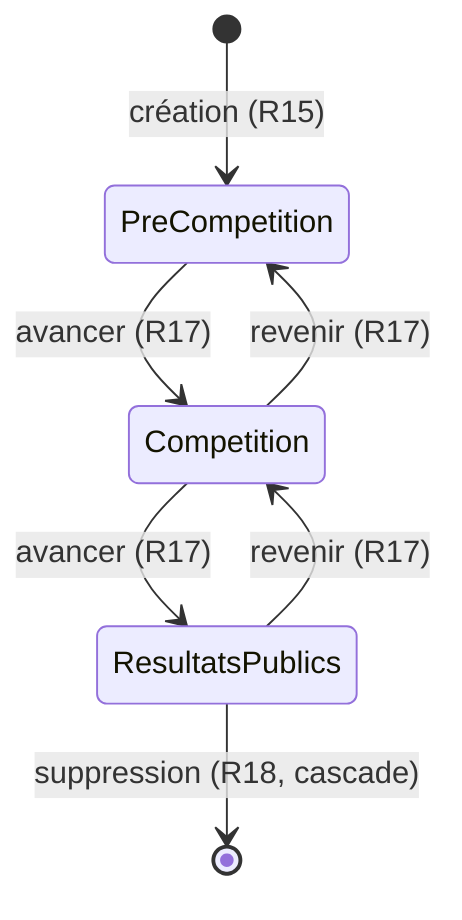

# Spec : Écrans de paramétrage (admin)

- **Statut** : brouillon (à valider)
- **Sources** : décision produit du 2026-07-25 (tranche T8 — premiers écrans
  d'administration). S'appuie sur la **spec #1 — Rôles & autorisations**
  (`01-roles-et-autorisations.md`), qui reste la vérité pour « qui peut faire
  quoi » (R11, R12, R13, R18, R5, R34), et sur le modèle de données socle
  (migration `202607221100`) + les policies **RLS** (migration `202607251000`).
- **Note de rédaction** : cette spec est rédigée pour **documenter et cadrer** le
  fonctionnement des écrans de paramétrage livrés en T8 (Clubs, Rencontres,
  Grimpeurs), et combler un manquement au workflow spec-first (le comportement
  d'écran n'avait pas de spec dédiée). Elle décrit le **quoi** ; les choix qui
  demandent un arbitrage produit sont signalés « (à valider) ».

## Objectif

Décrire le comportement fonctionnel des **écrans d'administration** permettant à
l'admin de paramétrer la structure de la compétition : les **clubs**, les
**rencontres** (avec leur cycle de vie) et le **roster des grimpeurs**. Ces
écrans matérialisent les droits d'écriture réservés à l'admin (spec #1
R11–R13). La spec fixe, pour chaque écran : les champs, les validations de
saisie, les flux CRUD, et les règles de suppression (dépendances / cascade).

## Vocabulaire

- **Écran de paramétrage** : page d'administration (`/admin/…`) offrant la
  gestion (création, modification, suppression) d'une entité de la compétition.
- **Garde applicative** : contrôle du rôle effectué par l'écran (rendu) et par
  chaque Server Action (écriture), en complément de la **RLS** (frontière réelle).
- **Roster** : ensemble des grimpeurs licenciés rattachés à un club (spec #1 R18),
  indépendant d'une rencontre.
- **Dépendance** : enregistrement qui référence l'entité visée (p. ex. une
  rencontre référence son club porteur ; une composition référence un grimpeur).
- **Cascade** : suppression automatique des enregistrements dépendants quand la
  clé étrangère est déclarée `on delete cascade`.
- **Phase** : état courant du cycle de vie d'une rencontre (spec #1 R5).
- **Catégorie** : tranche d'âge d'une rencontre — `enfant` / `ado` (spec #1 R34).

## Règles fonctionnelles

### Généralités (tous les écrans)

- **R1.** Les écrans de paramétrage sont **réservés à l'admin**. Un utilisateur
  non-admin (coach, anonyme, non connecté) reçoit une réponse **404** (l'écran
  est masqué, pas seulement interdit). (Source : spec #1 R11–R13, R22.)
- **R2.** Chaque écriture passe par une **Server Action** qui **revérifie** le
  rôle admin côté serveur, indépendamment de l'UI (défense en profondeur). Un
  appel direct par un non-admin est **refusé** avec un message explicite, sans
  écriture. La **RLS** reste la frontière ultime.
- **R3.** La saisie est **normalisée et validée avant écriture** ; une saisie
  invalide n'écrit rien et affiche un message d'erreur relié au formulaire.
- **R4.** Les libellés texte sont normalisés : espaces de début/fin retirés,
  espaces internes multiples réduits à un seul.
- **R5.** Une violation de contrainte en base (unicité, clé étrangère) est
  **traduite en message lisible** (jamais une erreur technique brute).
- **R6.** Après une écriture réussie, la liste affichée **reflète** l'état à jour
  (revalidation), et le formulaire de création se vide.
- **R7.** L'accueil admin propose un lien vers chaque écran de paramétrage
  (Clubs, Rencontres, Grimpeurs).

### Écran Clubs (`/admin/clubs`)

- **R8.** Un club porte un **nom** obligatoire, unique, d'au plus **100**
  caractères. (Source : spec #1 R11 ; contrainte SQL `club.nom text not null
  unique`.)
- **R9.** L'admin peut **créer**, **renommer** et **supprimer** un club.
- **R10.** La création/renommage d'un club portant un nom **déjà utilisé** est
  refusée avec le message d'**unicité**.
- **R11.** Un club n'est **supprimable que s'il n'a aucune dépendance** : ni
  rencontre portée, ni grimpeur rattaché. Sinon le bouton de suppression est
  **désactivé** (avec explication) et un appel forcé est refusé.
  - *Justification (à valider)* : la rencontre et l'équipe référencent le club en
    `on delete restrict` (blocage réel) ; le grimpeur le référence en
    `on delete cascade`. On **bloque aussi** sur présence de grimpeurs pour
    **protéger le roster** d'une suppression en cascade accidentelle.
- **R12.** La liste affiche, pour chaque club, son **nombre de rencontres** et de
  **grimpeurs** (information de suppression).

### Écran Rencontres (`/admin/rencontres`)

- **R13.** Une rencontre porte : une **date**, un **club porteur** (obligatoire,
  club existant), une **catégorie** (`enfant` ou `ado`), et une **phase**
  courante. (Source : spec #1 R12, R34, R5 ; modèle socle.)
- **R14.** La **date** est obligatoire et doit être une date calendaire réelle
  (format `AAAA-MM-JJ` ; une date impossible comme le 30 février est rejetée).
- **R15.** À la création, la phase vaut **pré-compétition** (première phase du
  cycle, spec #1 R5). L'admin ne choisit pas la phase initiale.
- **R16.** L'admin peut **modifier** une rencontre (date, club porteur,
  catégorie) et la **supprimer**.
- **R17.** L'admin fait évoluer la **phase** pas à pas entre phases **adjacentes**
  du cycle : `pré-compétition → compétition → résultats publics` (avancer), et
  réciproquement (revenir). Aucune transition ne saute une phase ; on n'avance
  pas au-delà de la dernière ni ne recule avant la première. (Source : spec #1
  R5.)
- **R18.** Supprimer une rencontre **supprime en cascade** ses **équipes** et
  **épreuves** (et, par transitivité, leurs compositions/résultats/temps). La
  demande de confirmation **signale** cette cascade lorsque la rencontre a des
  dépendances.
- **R19.** La liste affiche, pour chaque rencontre, sa date, sa catégorie, son
  club porteur, sa phase, et son **nombre d'équipes/épreuves**.

### Écran Grimpeurs (`/admin/grimpeurs`)

- **R20.** Cet écran est le **volet admin** du roster : l'admin gère les
  grimpeurs de **n'importe quel club**. (Source : spec #1 R11/R13.) Le **volet
  coach** — un coach gère le roster de **son seul** club (spec #1 R18) — est
  **hors périmètre** de cette spec (tranche coach ultérieure) ; la RLS
  `grimpeur_*` l'autorise déjà.
- **R21.** Un grimpeur porte : un **club** de rattachement (obligatoire), un
  **nom**, un **prénom**, et une **année de naissance**. (Source : modèle socle.)
- **R22.** Nom et prénom sont obligatoires, d'au plus **100** caractères
  (normalisés, R4).
- **R23.** L'année de naissance est un **entier à 4 chiffres** compris entre
  **1900 et 2100**. (Source : contrainte SQL `annee_naissance int check between
  1900 and 2100`.) La catégorie (enfant/ado) en **découle** au niveau rencontre
  (spec #1 R34) et n'est pas saisie ici.
- **R24.** L'admin peut **ajouter**, **modifier** (y compris changer le club) et
  **supprimer** un grimpeur.
- **R25.** Supprimer un grimpeur **supprime en cascade** ses **compositions**,
  **résultats** et **temps de vitesse**. La confirmation **signale** cette
  cascade lorsque le grimpeur a des engagements.
- **R26.** La liste affiche, pour chaque grimpeur, son identité, son club, son
  année de naissance et son **nombre d'engagements** (compositions).

## Cycle de vie d'une rencontre (R15, R17)

## Scénarios

### Nominal — créer une rencontre puis la faire avancer

Étant donné un admin connecté et au moins un club existant, quand il saisit une
date valide, choisit un club porteur et une catégorie puis valide, alors la
rencontre est créée en phase **pré-compétition** (R15) et apparaît dans la liste.
Quand il clique « avancer », alors la phase passe à **compétition** (R17).

### Nominal — gérer le roster

Étant donné un admin connecté, quand il choisit un club, saisit prénom/nom et une
année à 4 chiffres valide, alors le grimpeur est ajouté au roster de ce club
(R21–R24) et le formulaire se vide (R6).

### Cas limites / erreurs

- Nom de club déjà utilisé → refus, message d'unicité (R10).
- Suppression d'un club portant une rencontre ou un grimpeur → bloquée (R11).
- Date de rencontre impossible (30 février) → refus (R14).
- Année de naissance non numérique ou hors bornes → refus (R23).
- Un coach appelle directement une Server Action de paramétrage → refus (R2).
- Suppression d'une rencontre / d'un grimpeur avec dépendances → confirmée, puis
  cascade appliquée (R18, R25).

## Contraintes de données

- Unicité du **nom de club** (R8, R10).
- `rencontre.club_porteur_id` et `equipe.club_id` → club en **`on delete
  restrict`** (fondent le blocage R11 côté rencontres/équipes).
- `grimpeur.club_id` → club en **`on delete cascade`** (le blocage R11 sur
  présence de grimpeurs est un **choix produit**, pas une contrainte SQL).
- `equipe`/`epreuve` → rencontre en **`on delete cascade`** (fondent R18).
- `composition`/`resultat`/`temps_vitesse` → grimpeur en **`on delete cascade`**
  (fondent R25).
- **RLS** : écriture des `club` et `rencontre` réservée à l'admin
  (`*_admin`) ; écriture du `grimpeur` ouverte à l'admin **ou** au coach du club
  (`grimpeur_*`), cet écran n'exposant que le volet admin (R20).
- Bornes de saisie : `club.nom` ≤ 100 ; `grimpeur.nom`/`prenom` ≤ 100 ;
  `annee_naissance` ∈ [1900, 2100].

## Hors périmètre

- Le **volet coach** du roster (écran permettant à un coach d'éditer les
  grimpeurs de son club, spec #1 R18) — tranche coach ultérieure.
- La gestion des **équipes** et **compositions** (engagement en rencontre, spec
  #1 R6, R17), des **épreuves**, des **voies de vitesse** et des **jetons QR**
  (couverts par la spec #2).
- Le **scoring** et le classement (hors spec #1).
- La détermination automatique de la **catégorie** d'un grimpeur d'après son
  année de naissance et la saison (spec #1 R34) — non calculée par ces écrans.
