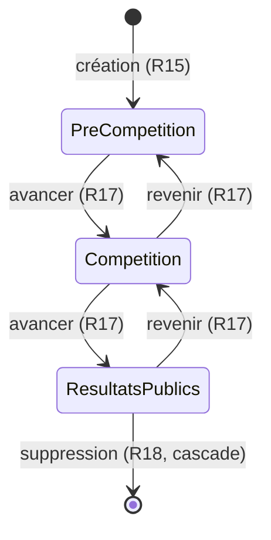

# Spec : Écrans de paramétrage (admin)

- **Statut** : brouillon (à valider)
- **Sources** : décision produit du 2026-07-25 (tranche T8 — premiers écrans
  d'administration). S'appuie sur la **spec #1 — Rôles & autorisations**
  (`01-roles-et-autorisations.md`), qui reste la vérité pour « qui peut faire
  quoi » (R11, R12, R13, R18, R5, R34), et sur le modèle de données socle
  (migration `202607221100`) + les policies **RLS** (migration `202607251000`).
- **Note de rédaction** : cette spec est rédigée pour **documenter et cadrer** le
  fonctionnement des écrans de paramétrage livrés en T8 (Clubs, Rencontres,
  Grimpeurs), et combler un manquement au workflow spec-first (le comportement
  d'écran n'avait pas de spec dédiée). Elle décrit le **quoi** ; les choix qui
  demandent un arbitrage produit sont signalés « (à valider) ».

## Objectif

Décrire le comportement fonctionnel des **écrans d'administration** permettant à
l'admin de paramétrer la structure de la compétition : les **clubs**, les
**rencontres** (avec leur cycle de vie) et le **roster des grimpeurs**. Ces
écrans matérialisent les droits d'écriture réservés à l'admin (spec #1
R11–R13). La spec fixe, pour chaque écran : les champs, les validations de
saisie, les flux CRUD, et les règles de suppression (dépendances / cascade).

## Vocabulaire

- **Écran de paramétrage** : page d'administration (`/admin/…`) offrant la
  gestion (création, modification, suppression) d'une entité de la compétition.
- **Garde applicative** : contrôle du rôle effectué par l'écran (rendu) et par
  chaque Server Action (écriture), en complément de la **RLS** (frontière réelle).
- **Roster** : ensemble des grimpeurs licenciés rattachés à un club (spec #1 R18),
  indépendant d'une rencontre.
- **Dépendance** : enregistrement qui référence l'entité visée (p. ex. une
  rencontre référence son club porteur ; une composition référence un grimpeur).
- **Cascade** : suppression automatique des enregistrements dépendants quand la
  clé étrangère est déclarée `on delete cascade`.
- **Phase** : état courant du cycle de vie d'une rencontre (spec #1 R5).
- **Catégorie** : tranche d'âge d'une rencontre — `enfant` / `ado` (spec #1 R34).
- **Niveau de voie** : identifiant réglementaire d'une voie de difficulté —
  `M1`–`M4` pour les voies moulinette (enfant uniquement), `T1`–`T10` pour les
  voies tête (enfant et ado). Le niveau désigne la difficulté cible ; plusieurs
  voies peuvent partager le même niveau dans une épreuve (voies doublées ou
  triplées). Le niveau est toujours dans ces plages réglementaires.
- **Gabarit** : modèle de format stocké en base pour une catégorie donnée
  (`enfant` ou `ado`), définissant les épreuves et leurs voies. L'admin peut le
  modifier via l'IHM ; les rencontres futures en héritent par copie. Toute
  modification du gabarit est sans effet sur les rencontres déjà créées.

## Règles fonctionnelles

### Généralités (tous les écrans)

- **R1.** Les écrans de paramétrage sont **réservés à l'admin**. Un utilisateur
  non-admin (coach, anonyme, non connecté) reçoit une réponse **404** (l'écran
  est masqué, pas seulement interdit). (Source : spec #1 R11–R13, R22.)
- **R2.** Chaque écriture passe par une **Server Action** qui **revérifie** le
  rôle admin côté serveur, indépendamment de l'UI (défense en profondeur). Un
  appel direct par un non-admin est **refusé** avec un message explicite, sans
  écriture. La **RLS** reste la frontière ultime.
- **R3.** La saisie est **normalisée et validée avant écriture** ; une saisie
  invalide n'écrit rien et affiche un message d'erreur relié au formulaire.
- **R4.** Les libellés texte sont normalisés : espaces de début/fin retirés,
  espaces internes multiples réduits à un seul.
- **R5.** Une violation de contrainte en base (unicité, clé étrangère) est
  **traduite en message lisible** (jamais une erreur technique brute).
- **R6.** Après une écriture réussie, la liste affichée **reflète** l'état à jour
  (revalidation), et le formulaire de création se vide.
- **R7.** L'accueil admin propose un lien vers chaque écran de paramétrage
  (Clubs, Rencontres, Grimpeurs).

### Écran Clubs (`/admin/clubs`)

- **R8.** Un club porte un **nom** obligatoire, unique, d'au plus **100**
  caractères. (Source : spec #1 R11 ; contrainte SQL `club.nom text not null
  unique`.)
- **R9.** L'admin peut **créer**, **renommer** et **supprimer** un club.
- **R10.** La création/renommage d'un club portant un nom **déjà utilisé** est
  refusée avec le message d'**unicité**.
- **R11.** Un club n'est **supprimable que s'il n'a aucune dépendance** : ni
  rencontre portée, ni grimpeur rattaché. Sinon le bouton de suppression est
  **désactivé** (avec explication) et un appel forcé est refusé.
  - *Justification (à valider)* : la rencontre et l'équipe référencent le club en
    `on delete restrict` (blocage réel) ; le grimpeur le référence en
    `on delete cascade`. On **bloque aussi** sur présence de grimpeurs pour
    **protéger le roster** d'une suppression en cascade accidentelle.
- **R12.** La liste affiche, pour chaque club, son **nombre de rencontres** et de
  **grimpeurs** (information de suppression).

### Écran Rencontres (`/admin/rencontres`)

- **R13.** Une rencontre porte : une **date**, un **club porteur** (obligatoire,
  club existant), une **catégorie** (`enfant` ou `ado`), et une **phase**
  courante. (Source : spec #1 R12, R34, R5 ; modèle socle.)
- **R14.** La **date** est obligatoire et doit être une date calendaire réelle
  (format `AAAA-MM-JJ` ; une date impossible comme le 30 février est rejetée).
- **R15.** À la création, la phase vaut **pré-compétition** (première phase du
  cycle, spec #1 R5). L'admin ne choisit pas la phase initiale.
- **R16.** L'admin peut **modifier** une rencontre (date, club porteur,
  catégorie) et la **supprimer**.
- **R17.** L'admin fait évoluer la **phase** pas à pas entre phases **adjacentes**
  du cycle : `pré-compétition → compétition → résultats publics` (avancer), et
  réciproquement (revenir). Aucune transition ne saute une phase ; on n'avance
  pas au-delà de la dernière ni ne recule avant la première. (Source : spec #1
  R5.)
- **R18.** Supprimer une rencontre **supprime en cascade** ses **équipes** et
  **épreuves** (et, par transitivité, leurs compositions/résultats/temps). La
  demande de confirmation **signale** cette cascade lorsque la rencontre a des
  dépendances.
- **R19.** La liste affiche, pour chaque rencontre, sa date, sa catégorie, son
  club porteur, sa phase, sa **saison** (calculée, R27) et son **nombre
  d'équipes/épreuves**.

### Écran Grimpeurs (`/admin/grimpeurs`)

- **R20.** Cet écran est le **volet admin** du roster : l'admin gère les
  grimpeurs de **n'importe quel club**. (Source : spec #1 R11/R13.) Le **volet
  coach** — un coach gère le roster de **son seul** club (spec #1 R18) — est
  **hors périmètre** de cette spec (tranche coach ultérieure) ; la RLS
  `grimpeur_*` l'autorise déjà.
- **R21.** Un grimpeur porte : un **club** de rattachement (obligatoire), un
  **nom**, un **prénom**, et une **année de naissance**. (Source : modèle socle.)
- **R22.** Nom et prénom sont obligatoires, d'au plus **100** caractères
  (normalisés, R4).
- **R23.** L'année de naissance est un **entier à 4 chiffres** compris entre
  **1900 et 2100**. (Source : contrainte SQL `annee_naissance int check between
  1900 and 2100`.) La catégorie (enfant/ado) en **découle** au niveau rencontre
  (spec #1 R34) et n'est pas saisie ici.
- **R24.** L'admin peut **ajouter**, **modifier** (y compris changer le club) et
  **supprimer** un grimpeur.
- **R25.** Supprimer un grimpeur **supprime en cascade** ses **compositions**,
  **résultats** et **temps de vitesse**. La confirmation **signale** cette
  cascade lorsque le grimpeur a des engagements.
- **R26.** La liste affiche, pour chaque grimpeur, son identité, son club, son
  année de naissance et son **nombre d'engagements** (compositions).

### Saison des rencontres

- **R27.** La **saison** d'une rencontre est **dérivée automatiquement** de sa
  date selon la règle de la spec #1 R37 ; aucun champ « saison » n'est saisi ni
  stocké. L'écran de gestion des rencontres affiche la saison calculée à titre
  informatif (ex. « Saison 2025 ») sur chaque ligne de la liste (R19).
- **R28.** La liste des rencontres propose un **filtre par saison** ;
  par défaut la **saison courante** (calculée à partir de la date du jour, spec
  #1 R37) est pré-sélectionnée. L'admin peut choisir une autre saison pour
  consulter l'historique.

### Gabarit de rencontre (`/admin/gabarit`)

- **R29.** Il existe **un gabarit par catégorie** (`enfant` et `ado`),
  persistent en base. Chaque gabarit définit les **épreuves** (voie de
  difficulté, bloc, vitesse) et leurs **voies** associées. L'admin peut
  consulter et modifier ces gabarits via l'IHM.
- **R30.** À la **création** d'une rencontre, le gabarit de sa catégorie est
  **copié** dans la rencontre : épreuves et voies sont instanciées telles
  qu'elles sont au moment de la création. Toute modification ultérieure du
  gabarit est **sans effet** sur les rencontres déjà créées.
- **R31.** L'admin peut, dans un gabarit, **ajouter**, **modifier** ou
  **supprimer** des épreuves, des voies de difficulté, des blocs et des voies de
  vitesse. Pour une voie de difficulté, il choisit son **niveau** (parmi les
  niveaux réglementaires de la catégorie) et sa **cotation** (libellé libre, ex.
  « 5c+ »). Plusieurs voies peuvent partager le même niveau (doublées, triplées).
- **R32.** Une **voie de vitesse** (dans le gabarit ou dans une rencontre) porte
  un **libellé** indiquant le classement concerné (ex. « Filles »,
  « Garçons »). Ce libellé est utilisé dans les écrans de jetons QR et
  d'affectation juge (spec #2 R17–R18).
- **R33.** Le gabarit **enfant** est pré-initialisé avec le format du règlement
  CT33 FFME 2025-2026 (§ Matin) lors du déploiement (via seed) :

  | Épreuve | Contenu | Détail |
  |---------|---------|--------|
  | Voie de difficulté | 14 voies | M1 (4c), M2 (5a), M3 (5b), M4 (5c) moulinette · T1 (4c) à T10 (7c) tête |
  | Bloc | 2 blocs | B1, B2 |
  | Vitesse | 2 voies | Libellées « Filles » et « Garçons » |

- **R34.** Le gabarit **ado** est pré-initialisé avec le format du règlement CT33
  FFME 2025-2026 (§ Après-midi) :

  | Épreuve | Contenu | Détail |
  |---------|---------|--------|
  | Voie de difficulté | 10 voies en tête | T1 (4c) à T10 (7c) — 1 voie par niveau |
  | Bloc | 2 blocs | B1, B2 |
  | Vitesse | 2 voies | Libellées « Filles » et « Garçons » |

  Les voies ado sont **exclusivement en tête** (pas de moulinette) et leur niveau
  est **toujours dans T1–T10**. L'admin peut doubler ou tripler certains niveaux
  selon les effectifs (ex. : ajouter une 2ᵉ voie T6 pour accueillir deux groupes
  au même niveau) — via R36 après la création ou en modifiant le gabarit via R31.
- **R35.** Si le gabarit de la catégorie est vide au moment de la création d'une
  rencontre, aucune épreuve ni voie n'est créée automatiquement — la rencontre
  est créée sans format (l'admin les ajoute manuellement).
- **R36.** Une fois une rencontre créée, l'admin peut **modifier sa structure** :
  ajouter des voies de difficulté, des blocs ou des voies de vitesse à une
  rencontre existante, indépendamment du gabarit. Le cas d'usage courant est
  l'ajout de voies sur un niveau donné (ex. : 2ᵉ voie T6 pour un groupe de
  niveau supplémentaire). La modification de structure n'est possible qu'en phase
  **pré-compétition** (avant la saisie de résultats).
- **R37.** Le **niveau** d'une voie de difficulté est contraint aux valeurs
  réglementaires de la catégorie :
  - Catégorie **enfant** — moulinette : `M1`–`M4` ; tête : `T1`–`T10`.
  - Catégorie **ado** — tête uniquement : `T1`–`T10` (aucune moulinette).
  Un niveau hors de ces plages est **refusé**, aussi bien dans le gabarit que
  dans la structure d'une rencontre.

## Cycle de vie d'une rencontre (R15, R17)

## Scénarios

### Nominal — créer une rencontre enfant (gabarit enfant non vide)

Étant donné un admin connecté, un club existant, et le gabarit enfant configuré
avec le format CT33 (R33), quand l'admin saisit une date valide, choisit un club
porteur et la catégorie **enfant** puis valide, alors la rencontre est créée en
phase **pré-compétition** (R15) et le gabarit enfant est copié dans la rencontre
(R30) : 3 épreuves, 14 voies de difficulté, 2 blocs, 2 voies de vitesse.

### Nominal — modifier le gabarit puis créer une rencontre

Étant donné un admin qui modifie le gabarit ado (ex. : ajoute une 2ᵉ voie au
niveau T7), quand il crée ensuite une rencontre ado, alors la rencontre reprend
le gabarit modifié (2 voies T7, R30, R31). Les rencontres créées avant la
modification conservent leur format d'origine (R30).

### Nominal — créer une rencontre ado

Étant donné le gabarit ado configuré (T1–T10, B1/B2, Filles/Garçons, R34),
quand l'admin crée une rencontre ado, alors la rencontre est créée en phase
pré-compétition (R15) avec le gabarit copié (R30).

### Nominal — modifier la structure d'une rencontre existante

Étant donné une rencontre en phase pré-compétition, quand l'admin ajoute des
voies de difficulté (ex. : 2 voies supplémentaires T11 et T12 pour un groupe de
niveau), alors ces voies sont créées pour cette rencontre sans toucher au gabarit
ni aux autres rencontres (R36).

### Nominal — gérer le roster

Étant donné un admin connecté, quand il choisit un club, saisit prénom/nom et une
année à 4 chiffres valide, alors le grimpeur est ajouté au roster de ce club
(R21–R24) et le formulaire se vide (R6).

### Cas limites / erreurs

- Nom de club déjà utilisé → refus, message d'unicité (R10).
- Suppression d'un club portant une rencontre ou un grimpeur → bloquée (R11).
- Date de rencontre impossible (30 février) → refus (R14).
- Année de naissance non numérique ou hors bornes → refus (R23).
- Un coach appelle directement une Server Action de paramétrage → refus (R2).
- Suppression d'une rencontre / d'un grimpeur avec dépendances → confirmée, puis
  cascade appliquée (R18, R25).
- Création d'une rencontre : si la copie du gabarit échoue partiellement, la
  transaction est annulée dans son intégralité (la rencontre n'est pas créée)
  (R30).
- Suppression d'une épreuve ou voie dans le gabarit → sans effet sur les
  rencontres déjà créées (R30).
- Tentative d'ajout de voies sur une rencontre en phase compétition ou résultats
  publics → refusée (R36).
- Saisie d'un niveau hors plage réglementaire (ex. T11 pour ado, M5 pour enfant,
  ou toute moulinette pour ado) → refusée (R37).

## Contraintes de données

- Unicité du **nom de club** (R8, R10).
- `rencontre.club_porteur_id` et `equipe.club_id` → club en **`on delete
  restrict`** (fondent le blocage R11 côté rencontres/équipes).
- `grimpeur.club_id` → club en **`on delete cascade`** (le blocage R11 sur
  présence de grimpeurs est un **choix produit**, pas une contrainte SQL).
- `equipe`/`epreuve` → rencontre en **`on delete cascade`** (fondent R18).
- `composition`/`resultat`/`temps_vitesse` → grimpeur en **`on delete cascade`**
  (fondent R25).
- **RLS** : écriture des `club` et `rencontre` réservée à l'admin
  (`*_admin`) ; écriture du `grimpeur` ouverte à l'admin **ou** au coach du club
  (`grimpeur_*`), cet écran n'exposant que le volet admin (R20).
- Bornes de saisie : `club.nom` ≤ 100 ; `grimpeur.nom`/`prenom` ≤ 100 ;
  `annee_naissance` ∈ [1900, 2100].
- La **saison** d'une rencontre est une valeur **calculée** à partir de la date
  (spec #1 R37) — pas de colonne `saison` en base.
- **Entités gabarit** (schéma à créer par migration) :
  - `gabarit_epreuve(id, categorie, type)` — `categorie` ∈ `enfant | ado` ;
    `type` ∈ `voie | bloc | vitesse` ; unicité `(categorie, type)`.
  - `gabarit_voie_difficulte(id, gabarit_epreuve_id, niveau, type_voie, cotation, ordre)` —
    `type_voie` ∈ `moulinette | tete` ; `niveau` ∈ `M1..M4` (moulinette) ou
    `T1..T10` (tête), contraint par R37 ; **`niveau` n'est pas unique** dans
    l'épreuve (voies doublées/triplées autorisées).
  - `gabarit_bloc(id, gabarit_epreuve_id, code, ordre)` — code unique dans
    l'épreuve (B1, B2).
  - `gabarit_voie_vitesse(id, gabarit_epreuve_id, libelle, ordre)` — libellé
    libre (ex. « Filles », « Garçons »).
- **Entités rencontre instanciées** (déjà en base pour voie_vitesse ; nouvelles
  pour voie_difficulte et bloc) :
  - `voie_difficulte(id, epreuve_id, niveau, type_voie, cotation, ordre)` —
    même structure et contraintes que le gabarit ; copie au moment de la
    création (R30) ou ajout post-création (R36).
  - `bloc(id, epreuve_id, code, ordre)` — idem.
  - Colonne `libelle text` ajoutée sur `voie_vitesse` (ex. « Filles »,
    « Garçons »).
- La **cascade de suppression** d'une rencontre supprime ses épreuves et, par
  transitivité, ses voies de difficulté, blocs et voies de vitesse (R18).
- La **cascade de suppression** d'un gabarit_epreuve supprime ses voies/blocs
  gabarit, sans effet sur les rencontres existantes.

## Hors périmètre

- Le **volet coach** du roster (écran permettant à un coach d'éditer les
  grimpeurs de son club, spec #1 R18) — tranche coach ultérieure.
- La **suppression** de voies ou d'épreuves d'une rencontre existante (seul
  l'ajout est couvert par R36 ; suppression = hors périmètre pour l'instant).
- La gestion des **équipes / compositions** (engagement en rencontre, spec #1
  R6, R17) et des **jetons QR** (spec #2).
- Le **scoring** et le classement (hors spec #1).
- La détermination automatique de la **catégorie** d'un grimpeur d'après son
  année de naissance et la saison (spec #1 R34) — non calculée par ces écrans.
