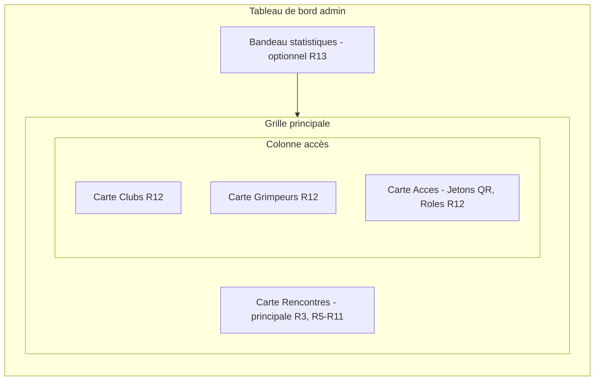
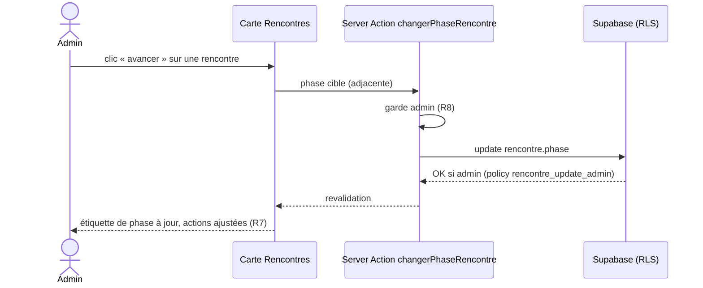

# Spec : Tableau de bord admin

- **Statut** : validée (le 2026-07-25)
- **Sources** : décision produit du 2026-07-25 (refonte de l'accueil admin en
  tableau de bord à cartes, action sur l'état des rencontres depuis la carte).
  S'appuie sur la **spec #1 — Rôles & autorisations** (R5, R11–R13),
  la **spec #3 — Écrans de paramétrage (admin)** (CRUD clubs/rencontres/
  grimpeurs, cycle de phases R17), et la **spec #2** (jetons QR / rôles).
- **Note de rédaction** : rédigée **avant** les tests et la réalisation. Design
  et arbitrages **validés le 2026-07-25** : tableau de bord sur une **route
  dédiée `/admin`** ; action de phase par **boutons avancer/revenir** ; contenu
  secondaire = **bandeau statistiques + cartes Clubs, Grimpeurs, Accès**.

## Objectif

Donner à l'admin une **page d'accueil orientée action** : un tableau de bord
composé de **cartes** qui donnent l'aperçu de la compétition et l'accès aux
écrans de paramétrage. L'élément central est la carte **Rencontres**, depuis
laquelle l'admin peut **agir directement sur la phase** d'une rencontre sans
ouvrir l'écran de gestion. Le tableau de bord ne crée aucune règle métier
nouvelle : il **réagence** et **met en avant** des actions déjà spécifiées
(notamment la transition de phase, spec #3 R17).

## Vocabulaire

- **Tableau de bord** : page d'accueil de l'admin, composée de cartes.
- **Carte** : conteneur visuel (design system « Nuit ») regroupant un thème
  (rencontres, clubs, grimpeurs, accès).
- **Carte principale** : la carte **Rencontres**, mise en avant (taille et
  position prioritaires).
- **Action de phase** : avancer / revenir d'une phase à l'autre pour une
  rencontre (spec #3 R17 ; cycle spec #1 R5).
- **Carte d'accès** : carte secondaire menant à un écran (compteur + lien).

## Règles fonctionnelles

### Structure et accès

- **R1.** Le tableau de bord vit sur une **route dédiée `/admin`**. L'accueil
  `/`, pour un admin connecté, propose un accès **« Ouvrir le tableau de bord »**
  vers `/admin` (et n'a plus besoin d'empiler les liens vers chaque écran, repris
  par les cartes du tableau de bord).
- **R2.** Le tableau de bord (`/admin`) est **réservé à l'admin** : un non-admin
  (coach, session éphémère, non connecté) reçoit **404** (écran masqué). Les
  autres rôles conservent leur accueil actuel, sans carte d'administration.
  (Source : spec #1 R11–R13, R22 ; même garde que spec #3 R1.)
- **R3.** Le tableau de bord est composé de **cartes**. La carte **Rencontres**
  est l'élément **principal** : mise en avant visuelle et position prioritaire
  (première carte sur mobile ; colonne large sur grand écran).
- **R4.** L'agencement est **mobile-first** : une seule colonne sur mobile, la
  carte Rencontres en tête ; passage à plusieurs colonnes sur grand écran
  (conv. 08). Cibles tactiles ≥ 44 px, focus visible, libellés accessibles.

### Carte Rencontres (principale)

- **R5.** La carte Rencontres liste des rencontres avec, pour chacune : la
  **date**, la **catégorie**, le **club porteur** et la **phase courante**
  (étiquette de statut).
- **R6.** Depuis la carte, l'admin peut **faire évoluer la phase** d'une
  rencontre **directement** — avancer/revenir pas à pas entre phases adjacentes
  (`pré-compétition ↔ compétition ↔ résultats publics`) — **sans quitter** le
  tableau de bord. (Réutilise spec #3 R17 ; cycle spec #1 R5.)
- **R7.** Après une action de phase, la carte **reflète** la nouvelle phase
  (revalidation), et les actions proposées s'ajustent (pas de bouton « avancer »
  au-delà de la dernière phase, ni « revenir » avant la première).
- **R8.** L'action de phase respecte la **garde admin + RLS** déjà en place :
  seule l'écriture d'un admin est acceptée (défense en profondeur, spec #3 R2).
- **R9.** La carte offre un **accès à l'écran de gestion complet**
  (`/admin/rencontres`) pour la création/modification/suppression (non
  dupliquées sur le tableau de bord).
- **R10.** La carte affiche les rencontres de la **saison courante** (calculée
  à partir de la date du jour, spec #1 R37), triées par **date décroissante**,
  toutes phases confondues. Elle n'en affiche que les **5 plus récentes** de
  cette saison ; au-delà, un lien **« voir tout »** mène à
  `/admin/rencontres`.
- **R11.** Si aucune rencontre n'existe **pour la saison courante**, la carte
  affiche un état vide invitant à en **créer une** (lien vers
  `/admin/rencontres`).

### Cartes secondaires

- **R12.** Le tableau de bord propose des **cartes d'accès**, chacune affichant
  un **compteur** pertinent et un **lien** : **Clubs** (nombre de clubs, →
  `/admin/clubs`), **Grimpeurs** (nombre de grimpeurs, → `/admin/grimpeurs`), et
  **Accès** (raccourcis **Jetons QR** et **Rôles**, spec #2).
- **R13.** Un **bandeau de statistiques** en tête affiche : nombre de **clubs**,
  de **rencontres**, de **grimpeurs**, et de **rencontres en phase compétition**.

## Cartes du tableau de bord (agencement grand écran)

## Action de phase depuis la carte (R6, R7)

## Scénarios

### Nominal — avancer une rencontre depuis le tableau de bord

Étant donné un admin sur son tableau de bord et une rencontre en
**pré-compétition**, quand il clique « avancer » sur la carte Rencontres, alors
la phase passe à **compétition**, l'étiquette se met à jour et le bouton
« revenir » apparaît — sans changement de page (R6, R7).

### Nominal — naviguer vers un écran

Étant donné un admin sur son tableau de bord, quand il clique la carte
**Clubs**, alors il arrive sur `/admin/clubs` (R12).

### Cas limites / erreurs

- Rencontre en **résultats publics** → pas de bouton « avancer » (R7).
- Rencontre en **pré-compétition** → pas de bouton « revenir » (R7).
- Aucune rencontre pour la saison courante → carte en état vide avec invitation à créer (R11).
- Un non-admin atteint la page → aucune carte d'administration (R2).

## Contraintes de données

- Aucune nouvelle table ni migration. Lecture des rencontres (avec club porteur)
  et des compteurs clubs/grimpeurs via le client `authenticated` (l'admin voit
  tout).
- La **saison courante** est calculée côté serveur à partir de la date du jour
  (spec #1 R37) — aucune colonne `saison` en base ; le filtre s'applique sur
  `rencontre.date`.
- L'action de phase réutilise la Server Action **existante**
  `changerPhaseRencontre` et la policy **`rencontre_update_admin`** (spec #3).

## Hors périmètre

- La **création / modification / suppression** de rencontres, clubs, grimpeurs
  (restent sur leurs écrans dédiés, spec #3) : le tableau de bord n'en offre que
  l'**accès** et l'action de **phase**.
- Le tableau de bord des **autres rôles** (coach, juge) — hors périmètre.
- Tout **indicateur avancé** (classements, scoring) — hors spec #1.
