# Spec : Espace Coach — engagement en rencontre

- **Statut** : validée (arbitrages produit R8/R13/R14/R15 tranchés le 2026-08-29 ;
  groupe de départ R19–R21 ajouté le 2026-08-29 ; **phase « préparation jour J »**
  — engagement éditable par coach permanent en ① pré-compétition et par permanent
  **et** temporaire en ② préparation, gelé dès ③ compétition, R16 — validé le
  2026-09-01)
- **Sources** :
  - **Spec #1 — Rôles & autorisations** (`01-roles-et-autorisations.md`), vérité
    pour « qui peut faire quoi » : coach rattaché à un club (R16), CRUD équipes
    (R17), CRUD grimpeurs de ses équipes (R18), périmètre inter-club interdit
    (R20), pas de CRUD club/rencontre (R22), édition de l'engagement en **①
    pré-compétition** (permanent) et **② préparation** (permanent + temporaire,
    R6/R25/R27), coach temporaire actif **le jour J** (préparation + compétition,
    R9/R28), rattachement des **prêtés** réservé à l'admin (R35/R36).
  - **Règlement** « 2025 Interclubs — Reglement v3 » §6 (Clubs et équipes) :
    « constitution d'**équipes de 8 participants** pour chaque club ; les
    participants en surnombre constituent une **équipe incomplète (CT33)** OU
    s'inscrivent dans une équipe incomplète d'un autre club (**prêt ponctuel**) ».
  - **Modèle de données socle** (migration `202607221100`) : tables
    `interclub.equipe` (une équipe par `rencontre × club`, `nom` unique) et
    `interclub.composition` (liaison `equipe ↔ grimpeur`).
  - **RLS T6** (migration `202607251000`) : helpers `peut_ecrire_equipe`,
    `peut_ecrire_composition`, `voit_composition`, `est_coach_de_club`, avec
    gating de phase encapsulé.
- **Note de rédaction** : cette spec décrit le **quoi** de l'espace coach. Les
  arbitrages produit ont été tranchés le 2026-08-29 (R8, R13, R14, R15, et le
  groupe de départ R19–R21). Le socle données/RLS existe déjà (T6) ; cette spec
  nécessite **une migration** sur `composition` : contrainte d'unicité de R14 +
  colonne `groupe_depart` de R19 (voir « Contraintes de données »).

## Objectif

Permettre à un **coach** d'**engager son club dans une rencontre** : constituer
une ou plusieurs **équipes** et **composer leur roster** en y affectant les
grimpeurs de son club. C'est le pendant « côté club » du paramétrage admin : sans
équipes composées, une rencontre n'a pas de participants à faire concourir.

Le coach agit dans un **périmètre strictement limité à son club** (spec #1 R16,
R20) et **borné dans le temps** : l'engagement (équipes, compositions, groupes de
départ) s'édite en **① pré-compétition** (prépa à distance par le coach
**permanent**) et en **② préparation** — la fenêtre **du jour J**, ouverte par
l'admin, où coach **permanent et temporaire** l'éditent avec des **droits
identiques**. Dès la **③ compétition**, l'engagement est **figé** : seul l'**admin**
peut le corriger. La **saisie des résultats** (③ compétition) est hors périmètre de
cette spec. (Spec #1 R6/R27, rév. 2026-09-01.)

## Vocabulaire

- **Coach** : rôle rattaché à **exactement un club** (spec #1 R16), responsable de
  ses équipes et de ses grimpeurs.
- **Coach permanent** : coach disposant d'un compte, connecté à tout moment
  (spec #1 R23).
- **Coach temporaire** : coach authentifié par une **session QR éphémère**, actif
  **le jour de la rencontre** (phases ② préparation + ③ compétition, spec #1
  R9/R27/R28). Il édite l'engagement en préparation (mêmes droits que le
  permanent, sauf générer des QR de coach temporaire, R26).
- **Roster de club** : ensemble des **grimpeurs** rattachés au club (table
  `grimpeur`), éditable par le coach **hors phase** (précision spec #1 R6). C'est
  le **vivier** dans lequel on pioche pour composer une équipe.
- **Équipe** : groupe de grimpeurs qu'un club engage **pour une rencontre
  donnée**. Une équipe appartient à un couple `(rencontre, club)` et porte un
  **nom** distinct au sein de ce couple. La **catégorie** n'est pas portée par
  l'équipe : elle découle de la rencontre.
- **Composition** : liaison **équipe ↔ grimpeur**. Composer une équipe = y
  ajouter/retirer des grimpeurs du roster du club.
- **Groupe de départ** *(rencontres **enfant** uniquement)* : niveau de voie à
  partir duquel un enfant démarre, choisi sur l'échelle ordonnée
  **`M1 → M2 → M3 → M4 → T1 → … → T10`**. Il fixe la **voie de départ**, l'enfant
  enchaînant ensuite **3 voies de niveau croissant** (ex. `M2` ⇒ M2, M3, M4 ;
  `M4` ⇒ M4, T1, T2). Déterminé à l'enregistrement (règlement, catégorie enfant).
  Les rencontres **ado n'ont pas** de groupe de départ.
- **Équipe incomplète** : équipe de moins de 8 grimpeurs (règlement §6),
  **autorisée**.
- **Grimpeur prêté** : grimpeur d'un autre club (ou de l'équipe CT33) rattaché à
  une équipe d'accueil ; ce rattachement est **réservé à l'admin** (spec #1 R35).
  Une fois rattaché, le coach d'accueil le gère comme les siens (spec #1 R36).
- **Phase** de la rencontre : ① `pre_competition`, ② `preparation` (jour J,
  activable par l'admin le jour même), ③ `competition`, ④ `cloture` (vérification
  admin), ⑤ `resultats_publics` (cf. spec #1 R5, cycle de vie).

## Règles fonctionnelles

### Accès et périmètre

- **R1.** L'espace coach (`/coach`) est **réservé au rôle `coach`** (permanent ou
  temporaire). Un utilisateur non-coach (admin, juge, anonyme sans session coach,
  non connecté) reçoit une réponse **404** — l'espace est **masqué**, pas
  seulement interdit. (Source : spec #1 R1, R22 ; aligné sur la convention des
  écrans admin, spec #3 R1.)
- **R2.** Le coach n'agit que sur **son club de rattachement** (spec #1 R16). Il
  ne voit ni ne modifie les équipes, compositions ou grimpeurs d'un **autre club**
  (spec #1 R20). Toute tentative hors périmètre est **refusée** (RLS frontière
  ultime).
- **R3.** Chaque écriture passe par une **Server Action** qui **revérifie** le
  rôle coach et le club côté serveur, indépendamment de l'UI (défense en
  profondeur). Un appel hors périmètre est refusé sans écriture. (Aligné spec #3
  R2.)
- **R4.** Les libellés texte (nom d'équipe) sont **normalisés** avant écriture :
  espaces de début/fin retirés, espaces internes multiples réduits à un seul ;
  une saisie invalide n'écrit rien et affiche un message relié au formulaire.
  (Aligné spec #3 R3/R4.)
- **R5.** Une violation de contrainte en base (unicité, clé étrangère) est
  **traduite en message lisible** (jamais une erreur technique brute). (Aligné
  spec #3 R5.)

### Écran d'accueil coach — liste des rencontres

- **R6.** L'accueil coach liste les **rencontres** dans lesquelles le club **peut
  être ou est engagé**. Chaque ligne rappelle les infos publiques de la rencontre
  (date, catégorie, club organisateur, **phase** courante) et le **nombre
  d'équipes déjà engagées par le club** pour cette rencontre.
- **R7.** Depuis chaque ligne, le coach accède à l'**écran d'engagement** de la
  rencontre (composition des équipes du club pour cette rencontre).
- **R8.** La liste affiche les rencontres **triées par priorité** : d'abord la
  **préparation** (② jour J, la plus actionnable), puis les **compétitions en
  cours** (③), puis les **pré-compétitions** (①), enfin les rencontres
  **terminées** — ④ **clôture** puis ⑤ **résultats publics**. L'engagement est
  éditable par le coach en **① et ②** ; ailleurs la rencontre est en **lecture
  seule** côté coach. L'état (éditable / lecture seule) est signalé sur chaque
  ligne (R16/R17).

### Écran d'engagement — équipes du club pour une rencontre

- **R9.** L'écran d'engagement présente un **en-tête récapitulatif** de la
  rencontre (date, catégorie, club organisateur, phase) et la **liste des équipes
  du club** engagées dans cette rencontre, chacune avec sa **composition**
  (grimpeurs) et son **effectif** (n/8).
- **R10.** Le coach peut **créer**, **renommer** et **supprimer** une équipe de
  son club pour cette rencontre (spec #1 R17). Le **nom** d'équipe est
  **obligatoire** et **unique** au sein du couple `(rencontre, club)`
  (contrainte SQL `equipe unique (rencontre_id, club_id, nom)`).
- **R11.** Un club peut engager **plusieurs équipes** dans une même rencontre (à
  noms distincts, R10).
- **R12.** Le coach **compose** une équipe en y **ajoutant** ou **retirant** des
  grimpeurs. Les grimpeurs proposés à l'ajout sont ceux du **roster disponible**
  pour la rencontre, non encore affectés à cette équipe : les grimpeurs **de son
  club** (spec #1 R18) **et** les grimpeurs **prêtés à son club** pour cette
  rencontre (spec #1 R35). Dans tous les cas, seuls les grimpeurs **éligibles à la
  catégorie** de la rencontre (tranche d'âge, spec #1 R34) sont proposés ; l'ajout
  d'un grimpeur **hors tranche d'âge** est **refusé**. La catégorie **enfant**
  admet « moins de 13 ans » **et** l'année-pivot (13 ans) ; **ado**, « 13 à 19 ans »
  (le pivot est éligible aux deux, R34).
- **R13.** Le coach **ne peut pas créer de prêt** : mettre à disposition un
  grimpeur d'un **autre club** (ou de l'équipe CT33) est **réservé à l'admin**
  (spec #1 R35) ; l'ajout d'un grimpeur ni du club ni prêté est **refusé**. En
  revanche, un grimpeur **prêté** au club (prêt admin actif) **apparaît dans le
  roster** avec un badge « prêté · club d'origine » et le coach le **gère comme
  les siens** : il l'**affecte**, le **retire**, le **déplace** entre équipes et
  fixe son **groupe de départ** (spec #1 R36). Le **retrait le renvoie au roster**
  (le prêt persiste) ; seul l'**admin** met fin au prêt (R35).
- **R14.** Un grimpeur ne peut appartenir qu'à **une seule équipe** de son club
  **par rencontre** : le **double engagement** dans deux équipes de la même
  rencontre est **interdit**. L'ajout d'un grimpeur déjà engagé dans une autre
  équipe de cette rencontre est **refusé** avec un message explicite. Cette
  unicité est **garantie en base** (cf. « Contraintes de données »).
- **R15.** L'**effectif d'une équipe est plafonné à 8 grimpeurs** (règlement §6).
  Une équipe de moins de 8 (**incomplète**) est **autorisée** ; tout ajout qui
  porterait l'effectif **au-delà de 8** est **refusé** avec un message explicite.

### Bornage temporel (phases)

- **R16.** L'**édition** de l'engagement par un coach (créer/renommer/supprimer
  une équipe, ajouter/retirer un grimpeur, fixer un groupe de départ) est possible
  en **phase ① pré-compétition** (coach **permanent** seul, prépa à distance) et
  en **phase ② préparation** (coach **permanent et temporaire**, mêmes droits, le
  jour J — spec #1 R6/R25/R27). Dès la **phase ③ compétition** et au-delà (④, ⑤),
  l'engagement est **figé pour tous les coachs** : **seul l'admin** peut encore le
  modifier (spec #1 R6/R27). Le **coach temporaire** ne peut **jamais générer** de
  QR de coach temporaire (R26). (Gating par la **RLS** — `peut_ecrire_equipe` =
  permanent en ①/② ou temporaire en ② ; cf. « Contraintes de données » ; l'IHM le
  **reflète** en masquant les formulaires hors ①/②.)
- **R17.** **Hors des phases d'édition** (① pré-compétition, ② préparation), côté
  coach l'écran d'engagement est en **lecture seule** : la composition est
  **consultable** (spec #1 R21) mais aucun formulaire d'ajout/retrait/CRUD n'est
  affiché, et toute écriture directe d'un coach est **refusée** par la RLS.
- **R18.** Après une écriture réussie, l'écran **reflète l'état à jour**
  (revalidation) et le formulaire de saisie se vide/réinitialise. (Aligné spec #3
  R6.)

### Groupe de départ (rencontres enfant)

- **R19.** Pour une rencontre de catégorie **enfant**, chaque grimpeur engagé
  (composition) peut porter un **groupe de départ** choisi par le coach dans une
  **liste**. L'échelle des niveaux est `M1 → M2 → M3 → M4 → T1 → … → T10`, mais la
  liste **exclut `T9` et `T10`** : le dernier départ possible est **`T8`**, seul
  moyen de garantir **3 voies croissantes** (R20). La liste proposée est donc
  `M1, M2, M3, M4, T1, T2, T3, T4, T5, T6, T7, T8`. Le groupe de départ est
  **optionnel** : un enfant peut être ajouté **sans** (état « à définir »), à
  compléter avant le début de la compétition. Pour une rencontre **ado**, le
  groupe de départ **ne s'applique pas** (aucune saisie, aucun affichage).
- **R20.** Le groupe de départ **détermine les 3 voies** de niveau **croissant**
  que l'enfant enchaîne, à partir du niveau choisi, en suivant l'échelle
  ordonnée : `groupe X` ⇒ `X` puis les **deux niveaux suivants** (ex. `M2` ⇒
  M2, M3, M4 ; `M4` ⇒ M4, T1, T2 ; `T8` ⇒ T8, T9, T10). Cette dérivation est une
  **fonction pure** du domaine (testable). Comme la liste de R19 s'arrête à `T8`,
  la dérivation renvoie **toujours exactement 3 voies** — `T9`/`T10` ne peuvent
  pas être un groupe de départ, ils n'apparaissent qu'en **fin** d'un
  enchaînement.
- **R21.** Dans la composition, le groupe de départ est **affiché** par grimpeur
  (badge du niveau, ou « à définir » s'il n'est pas fixé). Il **remplace l'année
  de naissance** dans cet écran (la date de naissance reste gérée au roster,
  spec #3, hors de l'engagement).

## Scénarios

### Nominal — engager une équipe en phase ①

Étant donné un **coach permanent** du club A et une rencontre en **phase ①**,
quand il ouvre l'accueil coach (R6), sélectionne la rencontre (R7), crée une
équipe « A1 » (R10) puis y ajoute 6 grimpeurs de son roster (R12), alors l'équipe
A1 apparaît avec un effectif 6/8 (R9) et la composition est persistée.

### Nominal — plusieurs équipes d'un même club

Étant donné 11 grimpeurs inscrits au club A pour une rencontre, quand le coach
crée « A1 » (8 grimpeurs) puis « A2 » (3 grimpeurs) (R10/R11/R12), alors les deux
équipes coexistent ; A2 est **incomplète** (3/8), ce qui est autorisé (R15).

### Nominal — préparation jour J (coach temporaire)

Étant donné une rencontre passée en **phase ② préparation** (ouverte par l'admin
le jour même) et un **coach temporaire** du club A muni d'une session QR active,
quand il ajoute une équipe et compose son roster (groupes de départ inclus), alors
les opérations sont **acceptées** — mêmes droits que le coach permanent
(R10/R12/R16, spec #1 R27).

### Nominal — engagement figé en compétition

Étant donné une rencontre passée en **phase ③ compétition**, quand un coach
(permanent **ou** temporaire) ouvre l'écran d'engagement, alors celui-ci est en
**lecture seule** : aucun formulaire d'ajout/retrait/CRUD ni de groupe de départ
n'est affiché (R16/R17). Seul l'**admin** peut encore corriger l'engagement
(spec #1 R6/R27).

### Nominal — grimpeur prêté (prêt admin persistant)

Étant donné un grimpeur du club B **prêté au club A** par l'**admin** pour la
rencontre (spec #1 R35), quand le coach du club A ouvre l'écran, alors le grimpeur
prêté **apparaît dans le roster** avec le badge « prêté · Club B » (R12/R13). Quand
le coach l'**affecte** à l'équipe A1, alors il apparaît dans la composition et
compte dans l'effectif. Quand le coach le **retire** de A1, alors il **revient au
roster** (le prêt persiste) et peut être ré-affecté (ex. à A2) — sans intervention
de l'admin (R13, spec #1 R36).

### Nominal — groupe de départ d'un enfant

Étant donné une rencontre **enfant** en phase ①, quand le coach ajoute un enfant
et lui choisit le groupe **`M2`** (R19), alors la composition affiche « Groupe
M2 » et le système en dérive les 3 voies **M2, M3, M4** (R20). Un autre enfant
peut être ajouté **sans** groupe (« à définir ») et complété plus tard (R19).

### Cas limites / erreurs

- Ouverture de `/coach` par un **admin**, un **juge** ou un **non connecté** →
  **404** (R1).
- Rencontre **ado** : aucun champ ni affichage de groupe de départ (R19).
- Enfant ajouté **sans** groupe de départ → autorisé, affiché « à définir » (R19).
- Un coach du club A tente de voir/éditer une équipe du club B → **refusé** (R2).
- Création d'une équipe portant un **nom déjà utilisé** dans la même rencontre
  pour le même club → refusée avec message d'**unicité** (R10/R5).
- Ajout d'un grimpeur **d'un autre club NON prêté** à une équipe → **refusé**
  (R13) ; un grimpeur **prêté** au club, lui, est **autorisé** (R12/R13).
- Ajout d'un grimpeur **déjà engagé** dans une autre équipe de la **même
  rencontre** → refusé (R14).
- Ajout d'un **9ᵉ** grimpeur à une équipe déjà à 8 → refusé (R15).
- **Coach permanent** tentant d'éditer l'engagement en **③ compétition** ou
  au-delà (④, ⑤) → **refusé** par la RLS ; formulaires **non affichés** (R16/R17).
- **Coach temporaire** tentant d'éditer l'engagement **hors ② préparation** —
  avant (①, sa session n'est pas ouverte) ou dès la ③ compétition (gelé) →
  **refusé** (spec #1 R9/R27).
- **Coach temporaire** tentant de **générer un QR de coach temporaire** → refusé
  (réservé permanent/admin, R26).

## Cycle de vie de l'édition (rappel, spec #1 R5/R6)

```mermaid
stateDiagram-v2
  [*] --> Pre_competition
  Pre_competition --> Preparation : ouverture jour J (admin)
  Preparation --> Competition : lancement compétition
  Competition --> Cloture : fin de compétition
  Cloture --> ResultatsPublics : publication

  state Pre_competition {
    [*] --> Editable_permanent
    note right of Editable_permanent
      Coach permanent : édition de l'engagement à distance (R16)
    end note
  }
  state Preparation {
    [*] --> Editable_jour_j
    note right of Editable_jour_j
      Coach permanent ET temporaire : édition de l'engagement, droits identiques (R16)
    end note
  }
  state Competition {
    [*] --> Engagement_fige
    note right of Engagement_fige
      Engagement figé pour les coachs (R16/R17)
      Seul l'admin corrige ; coach temporaire = saisie résultats (hors spec)
    end note
  }
  state Cloture {
    [*] --> Lecture_seule_cloture
    note right of Lecture_seule_cloture
      Coach : consultation seule (R17) ; correction = admin (spec #1 R5)
    end note
  }
  state ResultatsPublics {
    [*] --> Lecture_seule_publics
    note right of Lecture_seule_publics
      Consultation uniquement (R17, R21)
    end note
  }
```

## Contraintes de données

- **Réutilise** les tables `interclub.equipe` et `interclub.composition`
  (migration `202607221100`) et les policies/helpers **RLS T6** (`202607251000`) —
  **aucune nouvelle table**. Deux évolutions de schéma sur `composition` (une
  **migration**, appliquée à la main) : la colonne + contrainte de R14, et la
  colonne `groupe_depart` de R19 (voir ci-dessous).
- Unicité déjà garantie : `equipe unique (rencontre_id, club_id, nom)` (R10) ;
  `composition primary key (equipe_id, grimpeur_id)` (pas de doublon dans une même
  équipe).
- **R14 impose une garantie en base** (décision 2026-08-29) : « un grimpeur = une
  seule équipe **par rencontre** » n'est **pas** couvert par la PK de
  `composition` (qui borne au sein d'**une** équipe, pas d'une rencontre). Une
  **migration** est requise. Approche retenue : **dénormaliser `rencontre_id` sur
  `composition`** (rempli par trigger depuis `equipe`, cohérence garantie) + une
  **contrainte `unique (rencontre_id, grimpeur_id)`**. Ainsi la base **rejette**
  tout double engagement, et la Server Action **traduit** l'erreur d'unicité en
  message lisible (R5/R14). La validation applicative reste un **premier filtre**
  (défense en profondeur), la contrainte étant la garantie ultime.
- **R15 (plafond 8)** est une **règle applicative** vérifiée en Server Action
  (compte des membres avant insertion) : pas de contrainte base dédiée.
- **R19 (groupe de départ)** : colonne **`groupe_depart text null`** sur
  `composition`, **nullable** (optionnel, et sans objet pour l'ado). Les valeurs
  admises sont les niveaux de **départ** `M1–M4 / T1–T8` (T9/T10 exclus, R19) ;
  leur **validation** (appartenance à la liste, et non-pertinence en catégorie
  ado) est portée par le **domaine + Server Action**, et **doublée d'une contrainte
  SQL `check`** `groupe_depart in (M1…M4, T1…T8) or null` (migration
  `202609011100`). La dérivation groupe → 3 voies (R20) ne se stocke pas : c'est
  une fonction calculée.
- **RLS — modèle jour J (rév. 2026-09-01, migration `202609011400`)** : deux
  helpers dédiés au coach temporaire — `est_coach_temp_actif_club` (session active
  en préparation **ou** compétition, pour les **lectures** de périmètre) et
  `est_coach_temp_engagement` (session active en **préparation**, pour l'**écriture**
  de l'engagement). `peut_ecrire_equipe` = coach **permanent** en
  `pre_competition`/`preparation` **OU** coach **temporaire** en `preparation` ;
  `peut_ecrire_composition` en hérite. Le helper `est_coach_temp_de` (compétition)
  reste réservé à la **saisie des résultats/temps** — les résultats **ne s'ouvrent
  pas** en préparation. Admin : écriture en toute phase (`est_admin()`).
- La RLS T6 garantit par ailleurs : rattachement d'un grimpeur **hors club**
  interdit hors admin (R13), lecture limitée au club (`voit_composition`,
  `est_coach_de_club`).

## Hors périmètre

- **Saisie des résultats** (coach en phase ③ compétition, spec #1 R19) et **temps
  de vitesse** (juge) → **specs dédiées** ultérieures.
- **Rattachement des grimpeurs prêtés** (autre club / équipe CT33) → **admin**
  (spec #1 R35), écran à préciser hors de cette spec.
- **Gestion du roster de club** (CRUD grimpeurs hors engagement) → déjà couverte
  par l'écran admin Grimpeurs (spec #3) ; l'édition coach du roster **hors phase**
  (spec #1 R18/R6) pourra être ajoutée mais **n'est pas** l'objet de cette spec,
  centrée sur l'**engagement en rencontre**.
- **Classements / scoring** (individuel, équipe, club) → hors périmètre (spec
  dédiée).
- **Affichage des QR des coachs temporaires** par le coach permanent (spec #1
  R26) → déjà couvert par l'écran `/coach/jetons` (T5c).
