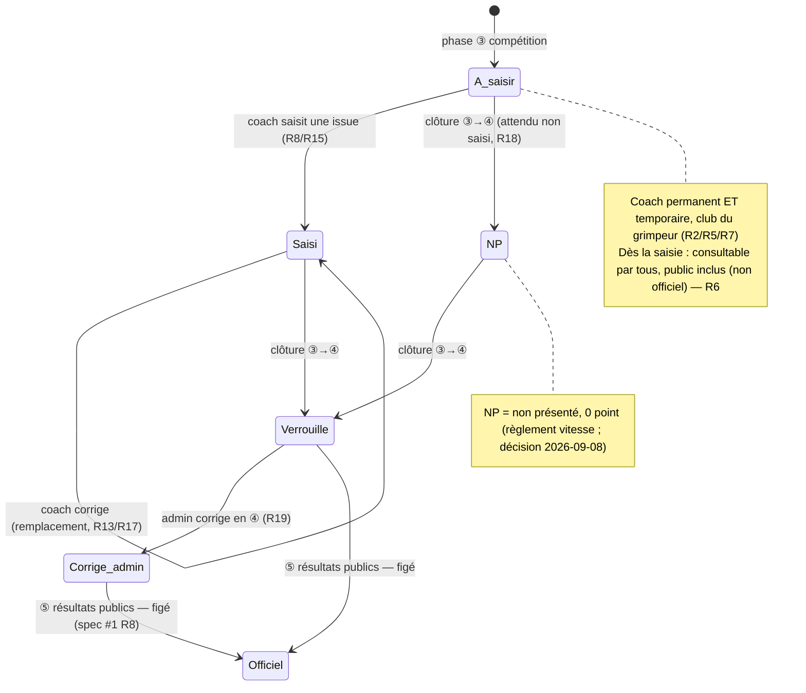
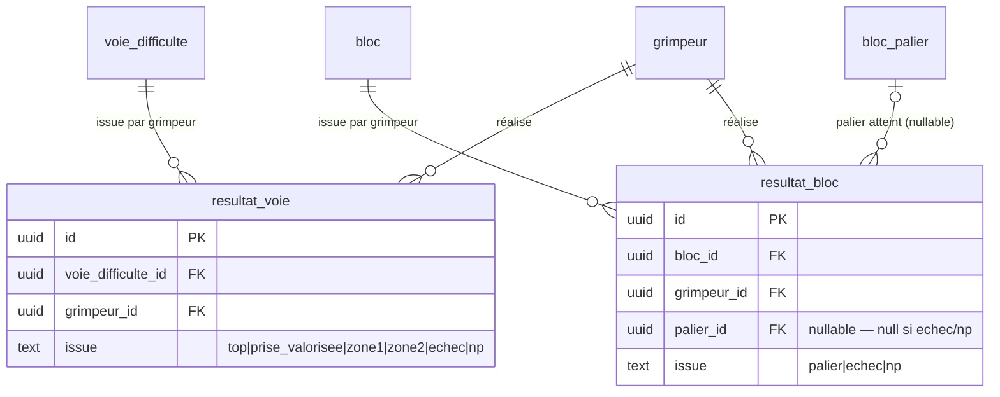

# Spec : Saisie des résultats — voie & bloc (coach)

- **Statut** : validée (le 2026-09-08) — décisions produit tranchées : NP ado sans
  ligne (compteur `n/6`, R18) ; visibilité des résultats **au fil de l'eau pour
  tous** dès la ③, ⑤ = officialisation (spec #1 R8, rév. 2026-09-08)
- **Sources** :
  - **Spec #1 — Rôles & autorisations** (`01-roles-et-autorisations.md`), vérité
    pour « qui peut faire quoi » : un coach **saisit et modifie les résultats des
    grimpeurs de son club** (R19), **uniquement en phase ③ compétition** (R7/R27),
    périmètre **inter-club interdit** (R20) ; en **④ clôture** l'**admin** vérifie
    et corrige (résultats **non encore officiels**, R6) ; les résultats et
    classements sont **consultables au fil de l'eau par tous** (public inclus) dès
    la ③, la **⑤ résultats publics** ne faisant que les **officialiser / figer**
    (R8, rév. 2026-09-08). Le **coach temporaire**
    saisit les résultats en compétition (R27/R28). La **vitesse** relève du **juge**
    (R30) — **hors** de cette spec.
  - **Spec #5 — Espace Coach** (`05-espace-coach.md`) : engagement (équipes /
    compositions / **groupe de départ** R19–R21) figé dès la ③ compétition ; la
    **saisie des résultats** y est explicitement renvoyée à une **spec dédiée**
    (celle-ci). Le **groupe de départ** d'un enfant détermine ses **3 voies**
    croissantes (spec #5 R20).
  - **Spec #3 — Écrans de paramétrage admin** (`03-ecrans-de-parametrage-admin.md`) :
    **points des voies** (voie entière + prise valorisée enfant / zones ado, R38)
    et **paliers de blocs** (R39), stockés et éditables par voie/bloc de la
    rencontre. La saisie ne stocke pas de points : elle stocke l'**issue** (le
    niveau atteint), les points en découlant par lecture de la config.
  - **Règlement** « 2025 Interclubs — Reglement v3 » (CT33 FFME) :
    - **Matin (enfants < 13 ans)**, p. 3–4 : « chaque compétiteur s'engage selon
      son niveau pour **3 voies de niveau croissant** » (Groupe de départ) ; « les
      voies en tête proposent une **prise valorisée** qui donne la **moitié** des
      points de la voie complète (arrondie au supérieur) » ; « l'ordre des voies
      est libre » ; blocs **B1** (2 essais) / **B2** (3 essais).
    - **Après-midi (13/19 ans)**, p. 6–7 : « les jeunes ont **6 (six) voies** de
      difficulté à réaliser » ; « le niveau et l'ordre des voies est **libre** » ;
      « **un seul essai par voie** » ; « une voie ne peut être réalisée qu'**une
      fois** ; faire **2 voies de même niveau est autorisé** » ; chaque voie
      propose **Zone 1** et **Zone 2** (points **non cumulatifs**) ; blocs **B1**
      (Zone / Bloc complet) / **B2** (Zone 1 / Zone 2 / Bloc complet).
    - **Vitesse** (p. 5, p. 8) : « **non présentation** à la voie = **0 pt** » —
      base de l'issue **NP** retenue ici pour voie et bloc (décision produit
      2026-09-08).
  - **Modèle de données socle** (migration `202607221100`) : table placeholder
    `interclub.resultat` (`valeur text`, un par `epreuve × grimpeur`), **explicitement
    provisoire** — cette spec en définit le modèle réel (voir « Modèle de données »).
- **Note de rédaction** : cette spec décrit le **quoi** de la **saisie des
  résultats** par le coach (épreuves **voie** et **bloc**). Le **calcul du score /
  classement** (individuel, équipe, club) et l'épreuve de **vitesse** (juge) sont
  **hors périmètre** (specs dédiées). Le socle existe (épreuves, voies, blocs,
  points, paliers, compositions, groupe de départ) ; cette spec nécessite **une
  migration** remplaçant le placeholder `resultat` par des tables de résultats de
  voie et de bloc (voir « Modèle de données »).

## Objectif

Permettre à un **coach** d'**enregistrer, pendant la compétition, ce que chacun de
ses grimpeurs a réalisé** sur les épreuves de **voie de difficulté** et de **bloc**.
Les grimpeurs enchaînent leurs voies et blocs dans l'ordre qu'ils veulent puis
viennent déclarer leur résultat au coach, qui le saisit **au fur et à mesure**
(règlement : « le/la responsable du club reporte au fur et à mesure les résultats
des tentatives »). C'est la matière première du **classement** (calculé
ultérieurement, hors de cette spec) : sans résultats saisis, une rencontre n'a rien
à classer.

La saisie est **bornée au club** du coach (spec #1 R19/R20) et **à la phase ③
compétition** (spec #1 R7/R27). Les résultats et classements sont **consultables
au fil de l'eau par tout compte authentifié** — tous clubs confondus — dès leur
saisie en ③ (spec #1 R8, rév. 2026-09-09) ; le **visiteur non authentifié** ne les
voit qu'**une fois la rencontre publiée (⑤)** (surface publique, spec #8). À la
**④ clôture**, la saisie coach se ferme et l'**admin** vérifie/corrige ; la **⑤
résultats publics** **officialise** (fige) les résultats **et** ouvre la lecture
au public (spec #1 R6/R8).

## Vocabulaire

- **Épreuve de voie (difficulté)** : épreuve de type `voie` d'une rencontre,
  composée de **voies de difficulté** (niveaux `M1`–`M4` moulinette / `T1`–`T10`
  tête, spec #3). Chaque voie porte ses **points** (voie entière + prise valorisée
  ou zones, spec #3 R38).
- **Épreuve de bloc** : épreuve de type `bloc`, composée des **blocs** `B1` et `B2`,
  chacun avec ses **paliers** de points (meilleure tentative, spec #3 R39).
- **Épreuve de vitesse** : chronométrée, saisie par le **juge** — **hors** de cette
  spec (spec #1 R30, spec dédiée).
- **Résultat de voie** : issue enregistrée pour **un grimpeur sur une voie de
  difficulté**, prenant exactement une des valeurs (meilleure tentative, pas de
  cumul) :
  - **Top** : voie entière réalisée (points voie entière).
  - **Prise valorisée** *(enfant, voies **tête** uniquement)* : prise stratégique
    atteinte sans top (moitié des points, arrondie au supérieur — spec #3 R38).
  - **Zone 2** / **Zone 1** *(ado)* : prise de zone atteinte sans top ; **non
    cumulatives** (Zone 2 > Zone 1).
  - **Échec** : voie tentée, aucune validation (0 point).
  - **NP** (non présenté) : voie **attendue** non tentée (0 point) — posé
    **automatiquement à la clôture** (R18).
- **Résultat de bloc** : issue enregistrée pour **un grimpeur sur un bloc** :
  le **palier atteint** (meilleure tentative, spec #3 R39), **Échec** (bloc tenté,
  aucun palier) ou **NP**.
- **Voies attendues** d'un grimpeur :
  - **Enfant** : les **3 voies** de niveau croissant déterminées par son **groupe
    de départ** (spec #5 R19/R20 ; règlement Matin).
  - **Ado** : **jusqu'à 6 voies** qu'il **choisit librement** parmi les voies de
    l'épreuve (règlement Après-midi).
- **Blocs attendus** d'un grimpeur : **B1 et B2** (les deux, pour tous les
  grimpeurs engagés — décision produit 2026-09-08).
- **État de vitesse** *(lecture seule)* : issue de l'épreuve de vitesse d'un
  grimpeur — **temps**, **chute**, **non-présentation** ou **en attente** — saisie
  par le **juge** (spec #1 R30) et **affichée** ici sans être modifiable (R22).
- **Score** *(lecture seule)* : total de points d'un grimpeur, **calculé au fil de
  l'eau** (voie + bloc + vitesse) et **affiché** ici ; son **calcul** relève d'une
  **spec classement dédiée** (R23).
- **Résultat non officiel** : résultat saisi en ③/④, **consultable par tous**
  (public inclus) mais **pas encore figé** — l'**admin** peut le corriger en ④.
  La **⑤ résultats publics** le rend **officiel / définitif** (spec #1 R8).
- **Phase** : ① `pre_competition`, ② `preparation`, ③ `competition`, ④ `cloture`,
  ⑤ `resultats_publics` (spec #1 R5, spec #5).

## Règles fonctionnelles

### Accès et périmètre

- **R1.** La saisie des résultats se fait dans l'**espace coach** (sous `/coach`),
  **réservé au rôle `coach`** (permanent ou temporaire). Un utilisateur non-coach
  (admin, juge, anonyme sans session coach, non connecté) reçoit **404** — l'espace
  est **masqué** (aligné spec #5 R1, spec #1 R1/R22).
- **R2.** Le coach ne saisit et ne consulte que les résultats des **grimpeurs de
  son club** engagés dans la rencontre (composition d'une de ses équipes), grimpeurs
  **prêtés** à son club inclus (spec #1 R36). Il ne voit ni ne modifie les résultats
  d'un **autre club** (spec #1 R20) — refus par la **RLS** (frontière ultime).
- **R3.** Chaque écriture passe par une **Server Action** qui **revérifie** côté
  serveur le **rôle coach**, le **club** du grimpeur et la **phase** de la rencontre,
  indépendamment de l'UI (défense en profondeur). Un appel hors périmètre est refusé
  **sans écriture** (aligné spec #5 R3).
- **R4.** Une violation de contrainte en base (unicité, valeur d'issue invalide,
  clé étrangère) est **traduite en message lisible** (jamais une erreur technique
  brute) (aligné spec #5 R5).

### Fenêtre temporelle (phase)

- **R5.** La **saisie et la modification** d'un résultat par un coach sont possibles
  **uniquement en phase ③ compétition**, pour le coach **permanent** comme
  **temporaire**, avec des **droits identiques** (spec #1 R7/R19/R27). En **①
  pré-compétition** et **② préparation**, aucune saisie de résultat (rien à saisir
  avant la compétition). Dès la **④ clôture** et au-delà (⑤), la saisie coach est
  **fermée** : seul l'**admin** corrige (spec #1 R6). Gating par la **RLS** ; l'IHM
  le **reflète** en n'affichant les formulaires de saisie qu'en ③.
- **R6.** Les résultats (et classements dérivés) sont **consultables au fil de
  l'eau par tout compte authentifié** dès leur saisie en **③ compétition** (tous
  clubs confondus). Le **visiteur non authentifié** ne les voit qu'**une fois la
  rencontre publiée (⑤)** (surface publique, spec #8). Rien n'est visible **avant**
  la ③ (aucun résultat n'existe). La **⑤ résultats publics** **officialise** (fige)
  les résultats **et** ouvre la lecture au **public** ; en **④ clôture** ils
  restent visibles **des authentifiés** mais **non officiels ni publics**
  (correction admin, R19). (Spec #1 R8, rév. 2026-09-09 ; garanti par la **RLS** :
  lecture **authentifiée dès la ③**, `anon` **à la ⑤**.)
- **R7.** Le **coach temporaire** (session QR) saisit les résultats **en compétition**
  uniquement : sa session est valable en préparation **et** compétition, mais les
  **résultats ne s'ouvrent qu'en ③** (spec #1 R27/R28, spec #5 « Contraintes de
  données »). Toute saisie de résultat par un coach temporaire hors ③ est **refusée**.

### Saisie — épreuve de voie de difficulté

- **R8.** Pour l'épreuve de type **voie**, le coach saisit, **par grimpeur** de son
  club, le **résultat de chacune des voies de difficulté** que ce grimpeur réalise.
  Le résultat d'une voie est la **meilleure tentative** : une **seule** issue par
  voie (pas de cumul).
- **R9.** *(Enfant)* Chaque grimpeur est engagé sur ses **3 voies** de niveau
  croissant déterminées par son **groupe de départ** (spec #5 R20 ; règlement
  Matin). Le coach saisit le **résultat de chacune de ces 3 voies**. L'ordre de
  saisie est **libre** (règlement : « l'ordre des voies est libre »).
- **R10.** *(Enfant)* Les issues admises pour une voie sont : **Top**, **Prise
  valorisée** *(voies **tête** T1–T10 uniquement)*, **Échec**, **NP**. Les voies
  **moulinette** (`M1`–`M4`) n'admettent **pas** la prise valorisée (issues : Top,
  Échec, NP).
- **R11.** *(Ado)* Chaque grimpeur réalise **jusqu'à 6 voies** de difficulté qu'il
  **choisit librement** parmi les voies de l'épreuve (`T1`–`T10`, voies doublées
  incluses). Contraintes du règlement Après-midi : **un seul résultat par voie et
  par grimpeur** (une voie n'est réalisée qu'une fois) ; **deux voies de niveau
  identique** sont autorisées (voies distinctes). Le coach saisit le résultat de
  chaque voie réalisée.
- **R12.** *(Ado)* Les issues admises pour une voie sont : **Top**, **Zone 2**,
  **Zone 1**, **Échec**, **NP**. Zone 1 et Zone 2 sont **non cumulatives** (une
  seule s'applique — la meilleure atteinte).
- **R13.** Une **même voie** ne peut porter qu'**un seul résultat par grimpeur**
  (unicité `(voie, grimpeur)`, garantie en base). Une seconde saisie sur la même
  voie pour le même grimpeur **remplace** la première (correction), elle n'en
  **ajoute pas** une seconde.
- **R14.** *(Ado)* Le nombre de voies réalisées par un grimpeur est **plafonné à 6**
  (règlement). Toute saisie d'une **7ᵉ** voie pour un grimpeur est **refusée** avec
  un message explicite. *(Enfant : les voies sont bornées aux 3 du groupe de départ,
  R9 — aucune autre voie n'est saisissable.)*

### Saisie — épreuve de bloc

- **R15.** Pour l'épreuve de type **bloc**, chaque grimpeur engagé est attendu sur
  **B1 et B2**. Le coach saisit, **par grimpeur et par bloc**, le **palier atteint**
  (meilleure tentative, pas de cumul, spec #3 R39), ou **Échec** (bloc tenté sans
  palier), ou **NP**.
- **R16.** Les **paliers** proposés proviennent de la **configuration de la
  rencontre** (spec #3 R39), selon la catégorie :
  - **Enfant** (par essai) : **B1** → « 1er essai », « 2e essai » ; **B2** → « 1er
    essai », « 2e essai », « 3e essai ».
  - **Ado** (par zone) : **B1** → « Zone », « Bloc complet » ; **B2** → « Zone 1 »,
    « Zone 2 », « Bloc complet ».
  L'issue « meilleure tentative » désigne le **palier le plus élevé** atteint ; la
  saisie ne stocke **pas** le nombre d'essais (décision produit 2026-09-08).
- **R17.** Un **bloc** ne peut porter qu'**un seul résultat par grimpeur** (unicité
  `(bloc, grimpeur)`, garantie en base) ; une nouvelle saisie **remplace** la
  précédente (correction).

### NP automatique à la clôture

- **R18.** Au passage **③ compétition → ④ clôture**, le système pose
  **automatiquement l'issue NP** (non présenté, **0 point**) sur tout **attendu sans
  résultat saisi** :
  - **Enfant** : chacune des **3 voies** du groupe de départ non saisie ;
  - **Blocs (tous)** : chaque bloc (**B1**, **B2**) non saisi, pour chaque grimpeur
    engagé ;
  - **Ado (voies)** : **aucune ligne NP** n'est matérialisée (les 6 voies sont
    choisies librement, sans identité figée — décision 2026-09-08). L'écran affiche
    un **compteur `n/6`** ; les **`6 − n`** voies non réalisées **comptent 0** au
    classement (équivalent NP), sans `resultat_voie`.
  Cette opération est **idempotente** (ne touche pas les résultats déjà saisis) et
  déclenchée par la transition de phase (spec #1 R5).
- **R19.** Après la clôture, un **NP** (comme tout résultat) n'est plus modifiable
  par le coach ; seul l'**admin** peut le **corriger** — y compris repasser un NP en
  Top/Zone/palier si le grimpeur avait bien concouru (spec #1 R6).

### Retour et cohérence IHM

- **R20.** Après une saisie réussie, l'écran **reflète l'état à jour**
  (revalidation) : l'issue enregistrée est visible immédiatement, le compteur de
  progression est actualisé (ex. enfant *« 2/3 voies saisies »*, ado *« n/6 »*,
  blocs *« 1/2 »*) (aligné spec #5 R18).
- **R21.** L'écran présente la saisie **par grimpeur** puis **par épreuve** (voies,
  blocs) ; pour chaque voie/bloc attendu, il affiche l'issue courante ou l'état
  « à saisir ».
- **R22.** L'écran affiche, **en lecture seule**, l'**état de la vitesse** de chaque
  grimpeur — **temps chronométré**, **chute**, **non-présentation**, ou **en
  attente** (pas encore saisi) — tel qu'il remonte de la **saisie du juge** (spec #1
  R30). Le coach ne saisit **jamais** la vitesse ici : c'est une **consultation**
  (cohérente avec la visibilité au fil de l'eau, R6). La **saisie** de la vitesse
  reste **hors périmètre** (spec dédiée).
- **R23.** L'écran affiche, **en lecture seule**, le **score** du grimpeur (total de
  points), **calculé au fil de l'eau** à partir de ses résultats de voie, de bloc et
  de vitesse. Le **calcul** (barèmes, agrégation, classement) n'est **pas** défini
  par cette spec (**spec classement dédiée**) : spec #6 ne fait que **restituer** la
  valeur, qui évolue à chaque saisie et reste **non officielle** jusqu'à la ⑤ (R6).
- **R24.** L'écran d'entrée de la saisie propose **deux vues** des grimpeurs **du
  club engagés** dans la rencontre, au choix du coach : **(a) par équipe** —
  grimpeurs regroupés sous chaque équipe du club ; **(b) alphabétique** — **tous**
  les grimpeurs engagés du club, **triés par ordre alphabétique** (nom), à plat
  (utile pour retrouver vite un grimpeur qui se présente). Les deux vues donnent
  accès à la même **saisie par grimpeur** ; le choix de vue est une **préférence
  d'affichage** sans effet sur les données. Chaque grimpeur y montre sa progression
  (voies, blocs) et, en lecture seule, son **état de vitesse** (R22) et son **score**
  (R23), quelle que soit la catégorie (enfant **et** ado).
- **R25.** Depuis l'écran de saisie d'un grimpeur, le coach accède directement au
  grimpeur **précédent** et **suivant** — dans l'**ordre de la vue courante** (R24)
  — **sans repasser par la liste**, afin d'enchaîner les saisies. (Le procédé
  d'interaction — balayage/swipe, flèches — relève de l'IHM.)

## Scénarios

### Nominal — saisie enfant (3 voies + 2 blocs)

Étant donné une rencontre **enfant** en **phase ③ compétition** et un **coach**
(permanent ou temporaire) du club A, quand un de ses grimpeurs, de groupe de départ
`5` (voies **T1, T2, T3**), déclare avoir topé T1, atteint la prise valorisée en T2
et échoué T3 (R9/R10), puis réalisé le « 1er essai » en B1 et échoué B2 (R15/R16),
alors l'écran enregistre : T1 = Top, T2 = Prise valorisée, T3 = Échec, B1 = 1er
essai, B2 = Échec, et affiche « 3/3 voies · 2/2 blocs » (R20).

### Nominal — saisie ado (choix libre, plafond 6)

Étant donné une rencontre **ado** en **phase ③** et un coach du club A, quand un
grimpeur réalise successivement **T5 (Top)**, **T4 (Zone 2)**, **T5 (une seconde
voie de même niveau, Zone 1)**, **T6 (Échec)** (R11/R12), alors les 4 résultats
sont enregistrés (2 voies de niveau `T5` autorisées car voies distinctes). Quand le
coach tente d'enregistrer une **7ᵉ** voie, alors c'est **refusé** (R14).

### Nominal — correction d'un résultat

Étant donné une voie déjà saisie « Échec » pour un grimpeur en phase ③, quand le
coach ressaisit « Top » sur la **même** voie (R13), alors l'unique résultat de cette
voie passe à « Top » (remplacement, pas de doublon).

### Nominal — NP automatique à la clôture

Étant donné une rencontre **enfant** où un grimpeur n'a **aucun** résultat saisi sur
sa voie T3 ni sur B2, quand l'admin passe la rencontre en **④ clôture** (R18), alors
T3 et B2 reçoivent l'issue **NP** (0 point) automatiquement, sans toucher aux
résultats déjà saisis.

### Nominal — visibilité au fil de l'eau puis officialisation

Étant donné des résultats saisis en ③ pour le club A, quand un coach du **club B**
(compte **authentifié**) consulte la rencontre, alors il **voit** les résultats et
le classement à jour, marqués **non officiels** (R6). Un **visiteur non
authentifié**, lui, ne voit à ce stade que les **informations de tête** (pas de
résultats). Quand la rencontre passe en **⑤ résultats publics**, alors les mêmes
résultats deviennent **officiels / figés** **et** accessibles au **public** non
authentifié (spec #1 R8, spec #8).

### Cas limites / erreurs

- Ouverture de la saisie par un **admin**, un **juge** ou un **non connecté** →
  **404** (R1).
- Coach du club A tentant de saisir un résultat pour un grimpeur du **club B** →
  **refusé** (R2).
- Saisie d'un résultat **hors phase ③** (en ①/②, ou après ④/⑤) par un coach →
  **refusée**, formulaires **non affichés** (R5/R7).
- *(Enfant)* Tentative de saisir une **prise valorisée** sur une voie **moulinette**
  → **refusée** (R10).
- *(Enfant)* Tentative de saisir une voie **hors** des 3 du groupe de départ →
  **refusée** (R9/R14).
- *(Ado)* Tentative de saisir une **7ᵉ** voie pour un grimpeur → **refusée** (R14).
- *(Ado)* Deux voies de **même niveau** mais **voies distinctes** → **autorisées**
  (R11) ; deux résultats sur la **même** voie → le second **remplace** (R13).
- Saisie d'une issue **incohérente** avec la catégorie (ex. « Zone 1 » en enfant,
  « Prise valorisée » en ado) → **refusée** (R10/R12).
- Saisie d'un **résultat de voie/bloc sur l'épreuve de vitesse** → **hors
  périmètre**, non proposé (la vitesse est au juge, spec #1 R30).

## Cycle de vie d'un résultat

## Modèle de données

- Le placeholder `interclub.resultat` (`valeur text`, un par `epreuve × grimpeur`,
  migration `202607221100`) est **inadapté** : le résultat porte sur une **voie**
  précise (issue enum) ou un **bloc** précis (palier). Une **migration** (appliquée
  à la main) le **remplace** par deux tables dédiées. La table `temps_vitesse`
  **reste inchangée** (épreuve de vitesse, juge — spec dédiée).

- **`resultat_voie`** — un résultat de voie par `(voie_difficulte_id, grimpeur_id)` :
  - `issue text not null check (issue in ('top','prise_valorisee','zone1','zone2','echec','np'))` ;
  - `unique (voie_difficulte_id, grimpeur_id)` (R13) ;
  - **cohérence issue ↔ catégorie/type** (R10/R12) : `prise_valorisee` seulement
    pour une voie **tête enfant** ; `zone1`/`zone2` seulement pour une voie **ado**.
    Portée par le **domaine + Server Action**, **doublée d'un `check`** en base
    (via la catégorie de la rencontre / le `type_voie`, à raccorder dans la
    migration).
- **`resultat_bloc`** — un résultat de bloc par `(bloc_id, grimpeur_id)` :
  - `palier_id uuid null references interclub.bloc_palier` (le palier atteint) ;
  - `issue text not null check (issue in ('palier','echec','np'))` avec
    `check ((issue = 'palier') = (palier_id is not null))` (palier ⇔ palier_id
    renseigné) ;
  - `unique (bloc_id, grimpeur_id)` (R17) ;
  - le `palier_id` doit référencer un palier **du bloc** (`bloc_palier.bloc_id =
    resultat_bloc.bloc_id`) — garanti par trigger/`check`.
- **Plafond 6 voies ado** (R14) : **règle applicative** (Server Action compte les
  `resultat_voie` du grimpeur sur l'épreuve avant insertion). *(Enfant : borné aux
  3 voies du groupe de départ côté domaine/Action.)*
- **NP automatique à la clôture** (R18) : opération **serveur** déclenchée par la
  transition ③→④ (RPC `SECURITY DEFINER` ou étape de `changerPhaseRencontre`),
  **idempotente** : insère les `resultat_voie`/`resultat_bloc` **manquants** avec
  `issue = 'np'` pour les attendus. Ne modifie **jamais** un résultat existant.
- **RLS** : réutilise les helpers de périmètre (spec #1 T6, spec #5) —
  `est_coach_de_club`, `est_coach_temp_de` (**compétition**), `est_admin`, gating
  de **phase**. Un **helper dédié** `peut_ecrire_resultat` = coach **permanent** OU
  **temporaire** en **③ compétition**, pour le **club du grimpeur** ; **admin** en
  ④ (correction, R19). **Lecture** : ouverte à **tout compte authentifié dès la ③**
  (tous clubs) ; pour `anon` (visiteur non authentifié), la lecture n'est ouverte
  qu'**à la ⑤ résultats publics** (spec #1 R8, rév. 2026-09-09) ; la ⑤ **fige** les
  résultats **et** ouvre la lecture publique. Écriture coach **interdite** hors ③.
  *(Les policies `select` des tables `voie_difficulte`/`bloc`/`bloc_palier` —
  aujourd'hui restreintes à `resultats_publics`/admin — sont **élargies** à une
  lecture **authentifiée dès la ③** ; l'ouverture `anon` (⑤) relève de la surface
  publique, spec #8.)*

## Points à valider

- **NP automatique des voies ADO (R18)** — **tranché le 2026-09-08** : pas de ligne
  NP par voie pour l'ado (voies choisies librement, sans identité figée) ; l'écran
  affiche un **compteur `n/6`** et les **`6 − n`** voies non réalisées **comptent 0**
  au classement, sans `resultat_voie`. *(Conservé ici pour mémoire de la décision.)*
- **Barème / arrondis** : les points (voie entière, prise valorisée « moitié
  arrondie au supérieur », zones, paliers) sont déjà **stockés** par voie/bloc
  (spec #3 R38/R39). Cette spec **ne recalcule rien** — à confirmer que le **calcul
  du score** reste bien dans une **spec dédiée** (voir « Hors périmètre »).

## Hors périmètre

- **Saisie de l'épreuve de vitesse** (temps / chute / non-présentation) : par le
  **juge** (spec #1 R30) → **spec dédiée**. Seul l'**affichage en lecture seule** de
  l'état de vitesse figure ici (R22).
- **Calcul du score et classements** (barèmes voie/bloc/vitesse, agrégation,
  individuel/équipe/club, ex-æquo, départage) → **spec dédiée** (spec #1 R38 renvoie
  déjà « classements » hors périmètre). Cette spec s'arrête à la **saisie de
  l'issue** et à l'**affichage en lecture seule** du score déjà calculé (R23) ;
  résultats et classements sont **consultables au fil de l'eau par les
  authentifiés** dès la ③ (R6, spec #1 R8).
- **Surface publique de consultation** (écrans/routes lisibles par un **visiteur
  non authentifié**) : **spécifiée en spec #8** (`08-espace-public.md`). Le
  **droit** est fixé par spec #1 R8 (public seulement à la ⑤).
- **Officialisation en ⑤** (figement des résultats) et **correction admin** en ④ :
  relèvent de la spec #1 (R6/R8) et de l'espace **admin** — l'IHM de correction
  admin n'est pas détaillée ici.
- **Engagement** (équipes, compositions, groupe de départ) : couvert par la
  **spec #5**, figé dès la ③ (hors saisie de résultats).
