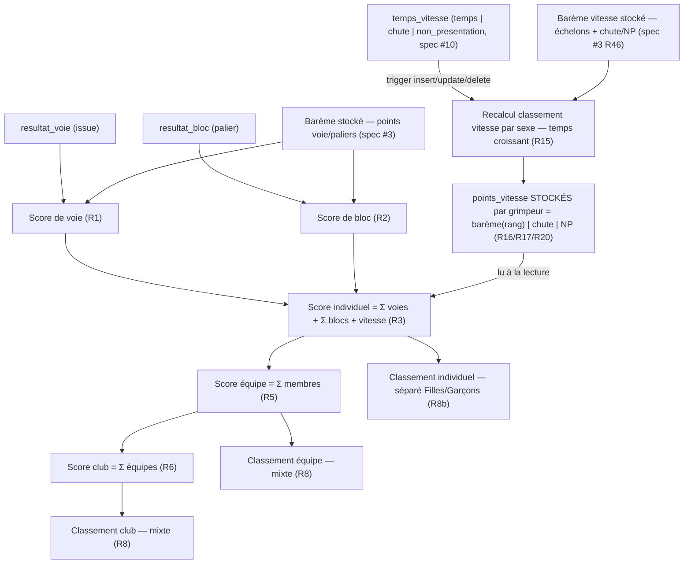

# Spec : Classement — score individuel, par équipe, par club

- **Statut** : **validée** (le 2026-09-18) — points à valider tranchés :
  séparation par sexe R8b (conséquence de l'attribution des points de vitesse par
  sexe, cf. note ci-dessous), départage ex æquo R8 (classement standard), cadrage
  `grimpeur.sexe` (obligatoire).
- **Révision du 2026-09-22 — intégration de la vitesse au score** (règle de
  changement appliquée, validée le 2026-09-22). La **saisie vitesse** étant
  désormais livrée (spec #10), la composante **vitesse** **entre dans le score
  individuel** (`voie + bloc + vitesse`) : R3, R13 et R14 sont révisées et une
  section **« Score de vitesse »** (R15–R20) est ajoutée. Le **barème de vitesse**
  (points par rang, chute, non-présentation) est **stocké et éditable par
  rencontre** (ajout **spec #3 R46**, seed par catégorie) — le calcul ici s'appuie
  dessus. **Exception au « rien n'est stocké »** (décision 2026-09-22) : les
  **points de vitesse par grimpeur** sont **matérialisés** et **recalculés par un
  trigger en base** à chaque changement de temps (R19–R20), pour la cohérence et le
  **realtime** ; **voie et bloc restent calculés à la lecture** (R10).
- **Sources** :
  - **Règlement** « CT33 FFME — 2025-2026 » (dernière version, `docs/reglement/`)
    §8 (« Classements ») : « un classement **individuel** et **d'équipes de clubs**
    est établi et communiqué ». Le règlement **ne détaille pas** la formule
    d'agrégation équipe/club → arbitrages produit (décision du 2026-09-08). Le
    règlement établit un **classement Filles et un classement Garçons pour la
    vitesse** (Matin p. 5, Après-midi p. 8), avec attribution des **points par
    rang** ; ces points de vitesse **entrent dans le score individuel** (voie +
    bloc + vitesse). La séparation par sexe du classement **individuel** (R8b) en
    est donc la **conséquence** : le total contient une composante attribuée par
    sexe, deux totaux de sexes différents ne se comparent pas. De même, l'**ex
    æquo** n'est réglé par le règlement que pour la vitesse (« rang partagé, saut
    de rang ») ; le classement standard retenu ici (R8) en est l'exacte
    transposition. Le barème chiffré des voies/blocs vient du règlement
    (Matin/Après-midi) et est **stocké** (spec #3 R38/R39).
  - **Spec #6 — Saisie des résultats** (`06-saisie-des-resultats.md`) : source des
    **issues** par voie (`top`/`prise_valorisee`/`zone1`/`zone2`/`echec`/`np`) et
    par bloc (`palier`/`echec`/`np`) ; le **score** y est affiché en lecture seule
    (R23) et **calculé par la présente spec**. Visibilité **au fil de l'eau dès la
    ③**, non officiel jusqu'à ⑤ (spec #6 R6, spec #1 R8).
  - **Spec #3 — Paramétrage** (`03-ecrans-de-parametrage-admin.md`) : **points**
    par voie (voie entière + prise valorisée enfant / zones ado, R38) et **paliers**
    de blocs (R39), stockés et éditables par rencontre.
  - **Spec #1 — Rôles** (`01-roles-et-autorisations.md`) : résultats/classements
    consultables au fil de l'eau, tous clubs, dès la ③ (R8, rév. 2026-09-08).
- **Maquette** : [`docs/maquettes/classement.html`](../maquettes/classement.html)
  (3 vues, décomposition R13, état non officiel/officiel).
- **Note de rédaction** : décision produit du **2026-09-08** — le score de cette
  spec porte sur **voie + bloc** ; la **vitesse** (points par rang filles/garçons)
  est **intégrée ultérieurement** (dépendance : saisie vitesse complète). Précision
  du **2026-09-09** — le **classement individuel est séparé par sexe** (Filles /
  Garçons, R8/R12) ; le champ **`sexe`** sur `grimpeur` devient donc un
  **prérequis de schéma** (et n'est plus propre à la vitesse). Ce champ est
  **mutualisé** avec l'itération vitesse/sexe (à traiter avant l'implémentation).
  **Aucune table de score/classement** : les scores/rangs restent **calculés à la
  volée**, rien n'est stocké ; la seule dépendance de schéma est `grimpeur.sexe`.
  Décision du **2026-09-18** (validation de la spec) — après relecture du
  règlement CT33 2025-2026 : la séparation Filles / Garçons du classement
  individuel découle de ce que le **score individuel intègre les points de
  vitesse**, eux‑mêmes attribués **par rang dans un classement Filles / Garçons**
  (règlement §5/§8) ; un total individuel contient donc une composante propre au
  sexe, et les totaux de deux sexes ne se comparent pas. La séparation (R8b)
  s'applique à **toutes les catégories** (enfant **et** ado). En conséquence, le
  champ **`grimpeur.sexe`** est **obligatoire** (`not null`, valeurs `'F'` /
  `'G'`) : tout grimpeur est classé dans l'un des deux classements (pas de cas
  « sans sexe »). Le **départage des ex æquo** (R8) retient le **classement
  standard** (rangs partagés, saut de rang — 1, 2, 2, 4), sans critère de
  départage fin (transposition de la règle vitesse du règlement).
  **Séquencement** — la **saisie vitesse** (juge) n'existant pas encore, le score
  livré par cette itération reste **voie + bloc** (R14) ; les classements par sexe
  sont néanmoins établis dès maintenant pour que leur **structure soit stable**
  quand la vitesse s'y ajoutera (voir « Note d'architecture — composante vitesse »).

## Objectif

Situer les grimpeurs, les équipes et les clubs dans une rencontre en **calculant
leur score** à partir des résultats saisis (spec #6) et du **barème** de la
rencontre (spec #3), et en présentant les **classements** (individuel, par équipe,
par club) **au fil de l'eau**. C'est ce qui donne du sens à la saisie : sans
classement, les résultats ne sont qu'une liste d'issues.

## Vocabulaire

- **Barème** : points attribués selon l'issue, **stockés** par voie/bloc de la
  rencontre (spec #3). Voie : *points voie entière* (top), *prise valorisée*
  (enfant tête), *zone 1* / *zone 2* (ado). Bloc : points par **palier**.
- **Score de voie** *(d'un grimpeur sur une voie)* : points de sa **meilleure
  tentative** selon l'issue enregistrée (R1).
- **Score de bloc** : points du **palier atteint** (R2).
- **Score individuel** : somme des scores de **voie**, de **bloc** et de
  **vitesse** d'un grimpeur pour la rencontre (R3).
- **Score de vitesse** *(d'un grimpeur)* : points attribués selon sa forme de
  résultat de vitesse (spec #10) — par **rang** dans le **classement de vitesse
  de son sexe** s'il a un **temps**, ou points fixes de **chute** /
  **non-présentation** sinon (R15–R18).
- **Classement de vitesse** : classement **par sexe** des grimpeurs ayant un
  **temps**, par **temps croissant** (le plus rapide = rang 1, R15). Sert
  uniquement à attribuer les **points de vitesse** ; ce n'est pas une des trois
  vues de l'écran de classement (R12).
- **Score d'équipe** : somme des scores individuels des grimpeurs de l'équipe (R5).
- **Score de club** : somme des scores des équipes du club dans la rencontre (R6).
- **Rang** : position dans un classement trié par score décroissant, avec gestion
  des **ex æquo** (R8).
- **Classement** : liste ordonnée (individuel / équipe / club) d'une rencontre.
  L'**individuel** est **scindé par sexe** (deux classements Filles / Garçons,
  R8b) ; **équipe** et **club** sont **mixtes**.
- **Au fil de l'eau** : recalculé à chaque lecture depuis les résultats courants ;
  **non officiel** avant ⑤, **officiel/figé** ensuite (spec #6 R6, spec #1 R8).

## Règles fonctionnelles

### Score individuel (voie + bloc)

- **R1.** Le **score de voie** d'un grimpeur est fonction de l'issue enregistrée
  (spec #6) et du barème de la voie (spec #3 R38) :
  - `top` → **points voie entière** ;
  - `prise_valorisee` → **points prise valorisée** ;
  - `zone2` → **points zone 2** ; `zone1` → **points zone 1** ;
  - `echec`, `np`, **aucun résultat** → **0**.
  Si le champ de points correspondant est absent (`null`), le score vaut **0**.
- **R2.** Le **score de bloc** d'un grimpeur vaut les **points du palier atteint**
  (issue `palier` → points du `bloc_palier` référencé, spec #3 R39) ; `echec`, `np`
  et **aucun résultat** → **0**.
- **R3.** Le **score individuel** d'un grimpeur pour la rencontre est la **somme**
  de tous ses scores de voie, de tous ses scores de bloc **et de son score de
  vitesse** (R15–R18). *(Révision 2026-09-22 : la vitesse est désormais incluse ;
  cf. R14.)*
- **R4.** Une voie ou un bloc **sans résultat** (avant clôture) compte **0** dans
  le total au fil de l'eau — comme `echec`/`np`. Le total évolue à chaque saisie.

### Score d'équipe et de club

- **R5.** Le **score d'une équipe** est la **somme des scores individuels** de
  **tous** les grimpeurs qui la composent (composition de l'équipe, spec #5),
  y compris un grimpeur **prêté** rattaché à cette équipe d'accueil (R7).
- **R6.** Le **score d'un club** dans la rencontre est la **somme des scores de
  toutes ses équipes** engagées (un club peut aligner plusieurs équipes, spec #5
  R11).
- **R7.** Un grimpeur **prêté** compte, pour les scores d'**équipe** et de **club**,
  dans son **équipe d'accueil** (là où il est composé). Son **score individuel**
  lui reste attribué et, au **classement individuel**, il est rattaché à son
  **club d'origine** (règlement §6 : le prêt permet de « conserver ses résultats
  individuels »). *(Tranché le 2026-09-08.)*

### Classements et rangs

- **R8.** Chaque classement (individuel, équipe, club) est **trié par score
  décroissant**. Les **ex æquo** (scores égaux) partagent le **même rang** ; le
  rang suivant est **décalé du nombre d'ex æquo** (classement standard : 1, 2, 2,
  4).
- **R8b.** Le **classement individuel est établi séparément par sexe** : **deux
  classements distincts, Filles et Garçons** (chacun trié et rangé selon R8/R9,
  les rangs repartant de 1 dans chaque). Cette séparation s'applique à **toutes
  les catégories** — **enfant et ado** (décision 2026-09-18). Elle **découle** de
  ce que le score individuel intègre les **points de vitesse**, attribués **par
  rang dans un classement Filles / Garçons** (règlement §5/§8) : deux totaux de
  sexes différents ne sont pas comparables. *(Depuis la révision 2026-09-22, la
  vitesse entre effectivement dans le total, R15–R18 — ce qui **confirme** cette
  séparation.)* Prérequis : champ **`grimpeur.sexe`** **obligatoire**
  (`'F'` / `'G'`, `not null`) — tout grimpeur relève donc de l'un des deux
  classements (aucun cas « sans sexe »). Les classements **par équipe** et **par club** restent
  **mixtes** (une équipe mélange les sexes) — **pas** de séparation (R5/R6).
- **R9.** À score égal, l'**ordre d'affichage** est **déterministe** (par nom, puis
  prénom pour l'individuel ; par nom d'équipe / club sinon), mais le **rang** reste
  identique pour les ex æquo (R8).
- **R10.** Les classements sont **recalculés à la volée** depuis les résultats
  courants — **aucun stockage** — et évoluent donc **à chaque saisie** (au fil de
  l'eau). Ils sont **non officiels** tant que la rencontre n'est pas en ⑤ résultats
  publics, **officiels/figés** ensuite (spec #6 R6, spec #1 R8).
- **R11.** Les classements sont **visibles dès la ③ compétition** (rien avant :
  aucun résultat n'existe), pour **tout compte authentifié**, **tous clubs
  confondus** (spec #1 R8). Le **visiteur non authentifié** n'y accède qu'**une
  fois la rencontre publiée (⑤)**, et alors **individuel + équipe** seulement (pas
  le classement par club) — surface publique détaillée en **spec #8**
  (`08-espace-public.md`).

### Score de vitesse (points par rang, par sexe)

*(Ajout de la révision 2026-09-22. Source : règlement CT33 §5/§8, Matin p. 5 /
Après-midi p. 8 ; barème stocké et éditable par rencontre, spec #3 R46 ; matière
première = résultats de vitesse saisis par le juge, spec #10.)*

- **R15.** Un **classement de vitesse** est établi **par sexe** : les grimpeurs
  ayant un **temps** (spec #10 R8) sont classés par **temps croissant** (le plus
  rapide = **rang 1**). Les **ex æquo** (temps strictement égaux) partagent le
  **même rang** avec **saut de rang** (classement standard 1, 2, 2, 4 — R8),
  transposition directe de la règle d'ex æquo du règlement (« les n concurrents
  marquent les points de leur rang ; le suivant reprend au rang qu'il aurait eu
  sans ex æquo »). **Seuls** les grimpeurs **avec un temps** y prennent un rang :
  **chute** et **non-présentation** n'y participent pas.
- **R16.** Les **points de vitesse** d'un grimpeur **classé** (R15) valent le
  **barème de la rencontre** (spec #3 R46) appliqué à son **rang** : dans
  l'échelon `[rang_min, rang_max]` couvrant ce rang,
  `points = points − (rang − rang_min) × décrément` (`décrément = 0` ⇒ palier
  plat). L'échelon **au-delà** (`rang_max` nul) s'applique à **tout rang
  supérieur** à son `rang_min`. Le barème (points par rang) est **identique F et
  G** — seul le **classement** est séparé par sexe ; il ne dépend que de la
  **catégorie** de la rencontre (enfant / ado).
- **R17.** Une **chute** rapporte les **points de chute** du barème (spec #3 R46 ;
  par défaut **1** enfant, **5** ado) ; une **non-présentation** rapporte les
  **points de non-présentation** (par défaut **0**). Un grimpeur **sans aucun
  résultat de vitesse** à la lecture compte **0** — équivalent non-présentation
  (spec #10 R17) — **sans** ligne `temps_vitesse` matérialisée.
- **R18.** Le **score de vitesse** d'un grimpeur est la valeur **unique**
  déterminée par sa forme de résultat : par rang s'il a un temps (R16), sinon
  points fixes de chute / non-présentation / absence (R17). Il **s'ajoute** à ses
  scores de voie et de bloc dans le **score individuel** (R3).
- **R19.** Le calcul de la composante vitesse est **field-dependent** : il dépend
  de **l'ensemble des temps du même sexe** d'une rencontre — un **nouveau temps**
  peut modifier le **rang, donc les points, de plusieurs grimpeurs** du même sexe
  (au fil de l'eau au sens fort). C'est pourquoi, contrairement à voie/bloc, la
  composante vitesse n'est **pas** recalculée à la lecture mais **matérialisée**
  (R20).
- **R20.** *(Décision 2026-09-22.)* Les **points de vitesse par grimpeur** sont
  **stockés** dans une table dédiée et **recalculés automatiquement en base par un
  trigger** à chaque **insert / update / delete** d'un `temps_vitesse` de
  l'épreuve, **pour tous les grimpeurs du même sexe** de la rencontre (le rang de
  plusieurs peut changer, R15). Le recalcul applique R15–R17 et lit le **barème
  stocké** (spec #3 R46). C'est la **seule** composante matérialisée : **voie et
  bloc restent calculés à la lecture** (R10), et le **score individuel** = voie +
  bloc (agrégés à la lecture) **+ points de vitesse (lus depuis la table)** (R3).
  Motivations : **cohérence** garantie quel que soit le chemin d'écriture et
  **compatibilité realtime** (un écran coach/public peut s'abonner à la table des
  points de vitesse). Le trigger est **borné à la rencontre** de l'épreuve.

### Écran de classement

- **R12.** Un **écran de classement** d'une rencontre présente **trois vues** :
  **individuel**, **par équipe**, **par club**. Chaque ligne affiche le **rang**,
  le **libellé** (grimpeur + club d'origine / équipe + club / club) et le **score**.
  La vue **individuel** est scindée en **deux classements, Filles et Garçons**
  (R8b) — présentés séparément (bascule ou deux sections). L'écran indique
  clairement l'état **« non officiel »** hors ⑤ (R10).
- **R12b.** **Volumétrie d'affichage.** Un classement peut compter **≈ 50 lignes
  par sexe** (≈ 100 grimpeurs par rencontre). La liste ordonnée **complète** est
  **paginée** : la navigation se fait par **pages** au **bas de la liste** (façon
  résultats de moteur de recherche — **‹ Précédent · numéros de page · Suivant ›**),
  la **page défilant naturellement** avec le reste de l'écran (**pas** de zone à
  **barre de défilement interne**). S'y ajoutent : (a) une **recherche par nom**,
  (b) des **filtres rapides** (tous / un **club** / une **équipe**), (c) la **mise
  en évidence** des grimpeurs du **club consulté**, et (d) le **compte total**
  affiché. L'en-tête de colonnes accompagne **chaque page**.
- **R13.** Depuis le classement individuel, la **décomposition** d'un score
  (**total voie + total bloc + vitesse**) est consultable, pour tracer le calcul
  (R1–R3, R15–R18). La composante **vitesse** est présentée comme une **3e ligne**
  de la décomposition (avec, à titre indicatif, le **rang de vitesse** du grimpeur
  ou la mention **chute / non-présentation / à saisir**).
- **R14.** *(Révisé le 2026-09-22 — la vitesse est désormais intégrée.)* La
  **vitesse entre dans le score individuel** (`voie + bloc + vitesse`, R3) selon
  les règles **R15–R19** : points **par rang** dans un **classement de vitesse
  Filles / Garçons**, points fixes pour **chute / non-présentation**. Cette
  intégration confirme la séparation par sexe du classement individuel (R8b).
  *Historique : jusqu'au 2026-09-18, la vitesse était hors périmètre (décision
  2026-09-08, en l'absence de saisie vitesse) ; les classements par sexe avaient
  été établis dès cette étape pour rester stables à l'intégration — c'est
  maintenant chose faite (saisie vitesse livrée, spec #10).*

## Scénarios

### Nominal — score individuel enfant

Étant donné une rencontre **enfant** en ③ et un grimpeur de groupe **M2** (voies
M2·M3·M4) ayant **M2 = Top** (points voie entière de M2), **M3 = Prise valorisée**
(moitié des points de M3) et **M4 = Échec** (0), plus **B1 = 1er essai** (points du
palier) et **B2 = Échec** (0), quand on calcule son score (R1–R3), alors il vaut la
**somme** des points de M2 (top) + M3 (prise valorisée) + B1 (palier), les autres à 0.

### Nominal — score individuel ado

Étant donné un grimpeur **ado** ayant réalisé 4 voies (Top, Zone 2, Zone 1, Échec)
et un bloc (Bloc complet), quand on calcule son score, alors il vaut points(top) +
points(zone 2) + points(zone 1) + 0 + points(palier « Bloc complet ») (R1–R3).

### Nominal — équipe et club

Étant donné une équipe A1 (8 grimpeurs) et A2 (3 grimpeurs) du Club A, quand on
calcule les scores (R5/R6), alors score(A1) = somme des 8, score(A2) = somme des 3,
et score(Club A) = score(A1) + score(A2).

### Nominal — individuel séparé par sexe

Étant donné une rencontre avec des grimpeurs des deux sexes, quand on établit le
classement **individuel** (R8b), alors **deux** classements sont produits — **Filles**
et **Garçons** — chacun trié par score décroissant avec des **rangs repartant de 1**.
Un score de fille et un score de garçon **ne se comparent pas** entre eux. Les
classements par **équipe** et par **club** restent **mixtes** (R5/R6).

### Nominal — points de vitesse (ado)

Étant donné une rencontre **ado** en ③ dont l'épreuve de vitesse a des temps saisis
(spec #10) et un barème par défaut (1er = 60, −1/rang… chute = 5, NP = 0), quand on
calcule la composante vitesse par sexe (R15–R18), alors le grimpeur au **meilleur
temps garçon** obtient **60 pts**, le 2e **59**, une **chute** vaut **5**, une
**non-présentation** ou une **absence de résultat** vaut **0**, et ces points
**s'ajoutent** aux scores voie + bloc dans le score individuel (R3).

### Nominal — ex æquo de temps

Étant donné deux filles au **même temps** (ex. 8,120 s), classées **1res ex æquo**
(R15), quand on attribue les points (R16), alors **chacune** reçoit les points du
**rang 1** (60 en ado / 15 en enfant) et la fille suivante est **rang 3** (le rang
2 est sauté), avec les points du rang 3.

### Nominal — ex æquo

Étant donné trois grimpeurs à **12, 12 et 9** points, quand on établit le classement
individuel (R8), alors les deux premiers sont **rang 1** ex æquo et le troisième est
**rang 3** (le rang 2 est sauté).

### Nominal — au fil de l'eau

Étant donné un classement affiché en ③, quand le coach saisit une nouvelle issue,
alors le classement **recalculé** reflète le nouveau total (R10), toujours marqué
**« non officiel »** jusqu'à la ⑤.

### Cas limites / erreurs

- Voie/bloc **sans résultat** → compte 0 (R4).
- Issue `np`/`echec` → 0 (R1/R2).
- Barème `null` (champ de points absent) → 0 pour cette issue (R1).
- Rencontre **avant ③** → aucun classement (aucun résultat, R11).
- Grimpeur **prêté** → compte pour l'équipe/club d'accueil ; individuel rattaché à
  l'origine (R7).
- Vitesse **sans résultat** / **non-présentation** → **0** pt (R17) ; **chute** →
  points de chute du barème (R17).
- Grimpeur avec un **temps** mais **rang au-delà** du dernier échelon borné →
  points de l'échelon **au-delà** (`rang_max` nul, R16).
- **Aucun temps saisi** dans un sexe → **aucun rang** attribué ; tous comptent 0 à
  la vitesse (chute exceptée), sans erreur (R15/R17).

## Calcul (vue d'ensemble)

## Note d'architecture — composante vitesse

*(Intégrée depuis la révision 2026-09-22 — R14/R15–R19. Cette note, d'abord
prospective, décrit désormais l'intégration effective et pourquoi le classement
individuel est séparé par sexe.)*

- **Le score individuel complet est `voie + bloc + vitesse`.** Les points de
  vitesse sont attribués **par rang** dans un **classement Filles / Garçons**
  (barème du règlement : Matin 15 → 0 pt, Après-midi 60 → 0 pt, chute / non
  présentation). C'est cette composante par sexe qui **fonde la séparation par
  sexe** du classement individuel (R8b) : deux totaux de sexes différents
  contiennent des points de vitesse issus de **classements distincts** et ne se
  comparent pas.
- **Nature différente du calcul.** Les scores de **voie** et de **bloc** sont
  **indépendants par grimpeur** (fonction de sa seule issue + barème). Les points
  de **vitesse** sont **field-dependent** : ils dépendent du **rang** parmi
  **tous les grimpeurs du même sexe** ayant un temps. Le calcul de la composante
  vitesse a donc besoin du **champ complet des temps par sexe**, pas d'une seule
  ligne de résultat.
- **« Au fil de l'eau » au sens fort.** Une nouvelle saisie de temps peut
  **modifier le rang — donc le score — de plusieurs grimpeurs** du même sexe
  (« le classement de vitesse évolue à chaque nouveau temps »). C'est plus large
  que voie/bloc, où une saisie n'affecte que le grimpeur concerné.
- **Implémentation (décision 2026-09-22).** Les **points de vitesse par grimpeur**
  sont **matérialisés** dans une table dédiée et **recalculés par un trigger en
  base** (R20) : à chaque changement d'un `temps_vitesse`, le trigger reclasse par
  temps croissant les grimpeurs du **même sexe** (ex æquo standard), applique le
  **barème par échelons** (spec #3 R46) et écrit leurs points ; chute / NP /
  absence prennent les points fixes (R17). Le **score individuel** est ensuite
  **assemblé à la lecture** : voie + bloc (agrégés depuis `resultat_*`) + points de
  vitesse **lus** depuis la table (R3). Voie et bloc restent donc **calculés à la
  lecture** ; seule la vitesse est stockée (motivations : cohérence tous chemins
  d'écriture, realtime). Le domaine `score.ts` reste la référence de l'agrégation
  voie+bloc et de la sémantique de rang/ex æquo (R8) ; la **logique du trigger**
  (rang + barème vitesse) est validée via **Supabase local (Docker)** et le
  **cahier de test**.

## Contraintes de données

- **Une seule table de score : les points de vitesse** (`points_vitesse`, R20). Les
  scores/rangs de **voie et bloc** restent **dérivés à la lecture** depuis
  `resultat_voie` / `resultat_bloc` (spec #6) et les barèmes
  (`voie_difficulte.points/…`, `bloc_palier.points`, spec #3 R38/R39) — **rien de
  stocké** pour eux. La **composante vitesse**, elle, est **matérialisée** :
  `points_vitesse(epreuve_id, grimpeur_id, rang, points)`, recalculée par **trigger**
  sur `temps_vitesse` (spec #10) à partir du **barème stocké**
  (`bareme_vitesse_echelon` + `epreuve.points_chute/points_non_presentation`, spec
  #3 R46). Le figement officiel en ⑤ relève de la phase (spec #1).
  - Colonnes : `epreuve_id` (FK épreuve vitesse), `grimpeur_id` (FK), `rang int
    null` (null si chute/NP/absence — non classé), `points int not null default 0`,
    unicité `(epreuve_id, grimpeur_id)`. Une ligne par grimpeur **avec un
    `temps_vitesse`** ; la **chute** y figure avec ses points fixes et `rang null` ;
    **NP et absence** valent 0 (une ligne NP possible, l'absence n'en crée pas — le
    score assemblé traite « pas de ligne » comme 0, R17).
  - **Trigger** (`AFTER INSERT/UPDATE/DELETE` sur `temps_vitesse`, `FOR EACH
    STATEMENT` ou `ROW` avec recalcul de tout le sexe) : SECURITY DEFINER, borné à
    l'`epreuve_id` concernée, réécrit les `points_vitesse` des grimpeurs du **même
    sexe**. Idempotent (recalcul complet du sexe à chaque appel).
- **Barème de vitesse (spec #3 R46).** Contrairement aux barèmes voie/bloc, il
  n'est **pas porté par les voies/blocs** : c'est un barème **par rang** propre à
  l'épreuve de vitesse de la rencontre (échelons `rang_min/rang_max/points/
  décrément` + points de **chute** et de **non-présentation**), seedé par catégorie
  et éditable. Le loader le charge avec les résultats et le passe au calcul.
- **Prérequis de schéma : `grimpeur.sexe`** (R8b). Le classement individuel étant
  séparé Filles / Garçons, le calcul a besoin du **sexe** du grimpeur. C'est la
  **seule** évolution de schéma requise ; elle est **mutualisée** avec l'itération
  vitesse/sexe (migration dédiée, à appliquer avant l'implémentation de cette
  spec). Cadrage (décision 2026-09-18) : colonne **`sexe text not null check (sexe
  in ('F','G'))`** sur `interclub.grimpeur` — **obligatoire**. La migration doit
  **renseigner le sexe des grimpeurs existants** (backfill) avant de poser la
  contrainte `not null`, et la **saisie** d'un grimpeur devient un champ requis
  (couvert par la spec/écran de gestion des grimpeurs, hors de la présente spec).
- Le **calcul voie/bloc** est une **fonction pure** du domaine (testable Vitest) :
  `(issue, barème) → points`, agrégations et rangs. Le **calcul des points de
  vitesse** est, lui, réalisé par le **trigger en base** (R20) et validé via
  Supabase local + cahier (pas de Vitest sur le SQL). Le domaine garde la sémantique
  de **rang/ex æquo** (R8) partagée par les deux mondes.
- **Performance (décision 2026-09-08).** Volume cible ≈ **100 grimpeurs** par
  rencontre → ≈ **800 lignes** de résultats ; l'agrégation (somme par grimpeur →
  équipe → club + rangs) coûte **< 1 ms** en mémoire. On **calcule à la lecture,
  côté application** (fonction domaine appelée par les loaders) : c'est fidèle au
  « au fil de l'eau », garde la logique **testée en Vitest**, et évite toute double
  source de vérité. Pour **voie/bloc**, **ni vue matérialisée ni trigger de
  score** : optimisation **prématurée** à cette échelle. *(Révision 2026-09-22 : ce
  choix « rien de stocké » est **maintenu pour voie/bloc** mais **levé pour la
  vitesse** — un `trigger` matérialise `points_vitesse`, R20. Le motif n'est **pas**
  la performance mais l'activation du **realtime** et la cohérence de cette
  composante par rang, field-dependent.)* **Évolution possible** côté voie/bloc si
  le besoin apparaît : une **vue SQL non matérialisée** (agrégation + `RANK()` côté
  Postgres)
  centralisant le calcul pour la saisie, le classement et la surface publique —
  changement local, non bloquant.
- **Insensible au nombre de rencontres de la saison.** Le calcul d'un classement
  est **borné à une rencontre** (`rencontre_id`) et s'appuie sur des **index**
  existants (`epreuve(rencontre_id)`, `voie_difficulte(epreuve_id)`,
  `bloc(epreuve_id)`, `resultat_voie(voie_difficulte_id)`,
  `resultat_bloc(grimpeur_id)`, `equipe(rencontre_id)`, `composition(equipe_id)`).
  Qu'il y ait 1 ou 200 rencontres en base, une lecture ne parcourt que les ≈ 800
  lignes de **la** rencontre concernée : la performance reste **plate** au fil de
  l'année (à condition de toujours filtrer par rencontre — ce que fait le loader).
- **Lecture cross-club** : la RLS ouvre déjà la lecture des `resultat_*` à tout
  authentifié dès la ③ (spec #6). L'assemblage du classement (noms des grimpeurs /
  équipes / clubs de **tous** les clubs) se fait via le **client `service_role`**
  côté serveur (lecture de catalogues, ADR 0002/0003) — comme les autres écrans
  transverses. L'ouverture à `anon` (visiteur non authentifié), **restreinte à la ⑤
  et aux vues individuel + équipe**, relève de la **surface publique (spec #8)**.

## Décisions tranchées

*(Historique des arbitrages ayant conduit à la validation de la spec le
2026-09-18 — conservés pour mémoire.)*

- **Attribution du grimpeur prêté (R7)** — **tranché le 2026-09-08** : il compte
  pour l'**équipe/club d'accueil** (où il est composé) au classement par
  équipe/club, et son **score individuel** est rattaché à son **club d'origine**
  (règlement §6).
- **Départage des ex æquo (R8)** — **tranché le 2026-09-18** : **classement
  standard** (rangs partagés, saut de rang — 1, 2, 2, 4), sans critère de
  départage fin. Le règlement n'en donne pas pour l'individuel/équipe de
  difficulté ; c'est la transposition de sa règle d'ex æquo de la vitesse.
- **Séparation par sexe (R8b)** — **tranché le 2026-09-18** : classement
  individuel **Filles / Garçons** pour **toutes les catégories** (enfant **et**
  ado) ; équipe/club **mixtes**. **Conséquence du règlement**, non arbitrage
  arbitraire : le score individuel intègre les **points de vitesse**, attribués
  **par rang dans un classement Filles / Garçons** (règlement §5/§8) — un total
  contient donc une composante propre au sexe et deux totaux de sexes différents
  ne se comparent pas. Prérequis : champ **`grimpeur.sexe`** **obligatoire**
  (`'F'` / `'G'`, `not null`), migration mutualisée vitesse/sexe (cf. Contraintes
  de données).

## Hors périmètre

- **Vitesse dans le score** — **désormais dans le périmètre** (révision
  2026-09-22, R14/R15–R19). En revanche, le **stockage et l'édition du barème de
  vitesse** relèvent de la **spec #3** (R46) ; la **saisie du résultat brut** de
  vitesse relève de la **spec #10**.
- **Champ `sexe`** sur `grimpeur` : **plus hors périmètre** — c'est désormais un
  **prérequis** de cette spec (R8b), livré par la migration mutualisée
  vitesse/sexe (cf. Contraintes de données).
- **Surface publique** (consultation par visiteur **non authentifié** : accès à la
  ⑤, vues individuel + équipe) → **spec #8** (`08-espace-public.md`).
- **Officialisation/figement** des classements en ⑤ (mécanique de phase) → spec #1.
- **Classement cumulé de la saison** (somme des scores d'un grimpeur / club **sur
  toutes ses rencontres** de la saison) → **fonctionnalité distincte**, spec
  dédiée. Cette spec ne traite que le classement **d'une rencontre**. *(Volume
  saison ≈ 8 000 lignes/an → calcul à la volée encore adapté ; un cache/vue ne se
  justifierait que pour un écran saison très sollicité, à réévaluer alors.)*
- **Stockage / historisation** des classements et **export** (PDF, communication
  CT33) → hors périmètre.
- **Temps réel (rafraîchissement en direct)** — *évolution future, différée (notée
  le 2026-09-22).* Le classement est **recalculé à la lecture** (R10) : il reflète
  l'état courant à chaque chargement/revalidation, mais n'est **pas poussé en
  direct** vers un écran déjà ouvert. Un rafraîchissement **live** (le classement
  d'un spectateur bouge quand un coach saisit) nécessitera **Supabase Realtime**
  (abonnement à `resultat_voie` / `resultat_bloc`) — commun avec la saisie
  (spec #6/#9). Hors périmètre ici. *(Note 2026-09-22 : la table
  **`points_vitesse`** matérialisée par trigger (R20) est **prête pour un abonnement
  Realtime** — elle a été introduite en partie pour cela ; l'abonnement lui-même
  reste différé.)*
