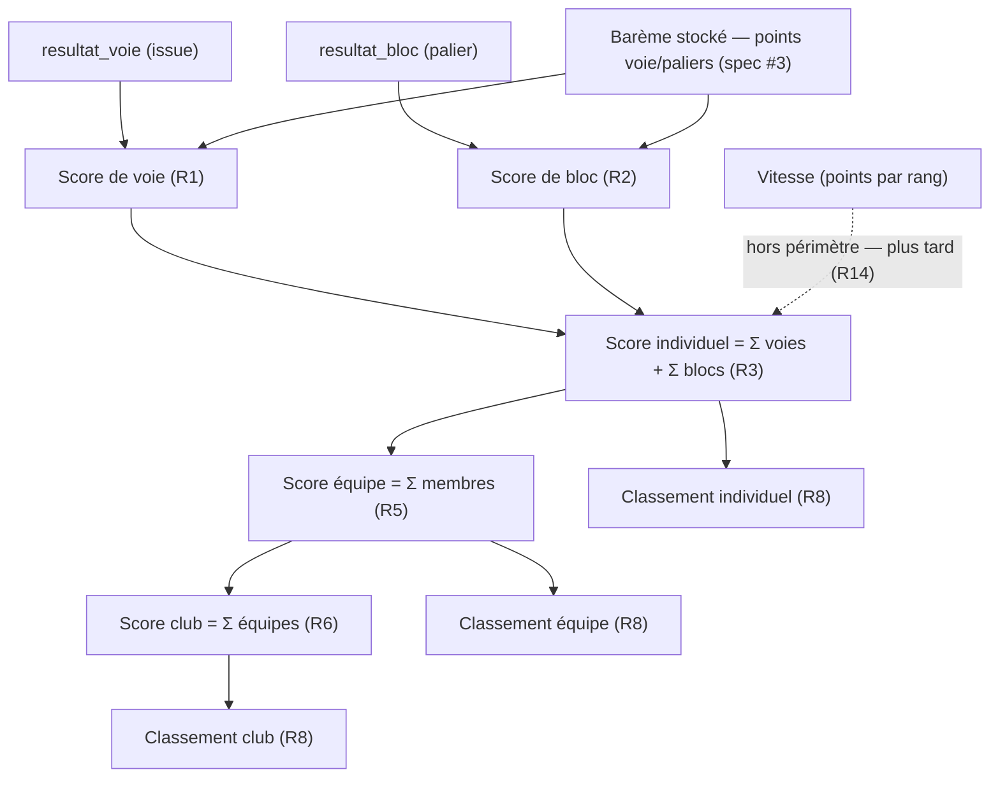

# Spec : Classement — score individuel, par équipe, par club

- **Statut** : brouillon (à valider — voir « Points à valider », notamment
  l'attribution du **grimpeur prêté**)
- **Sources** :
  - **Règlement** « 2025 Interclubs — Reglement v3 » (CT33 FFME) §8
    (« Classements ») : « un classement **individuel** et **d'équipes de clubs**
    est établi et communiqué ». Le règlement **ne détaille pas** la formule
    d'agrégation équipe/club → arbitrages produit (décision du 2026-09-08). Le
    barème chiffré des voies/blocs vient du règlement (Matin/Après-midi) et est
    **stocké** (spec #3 R38/R39).
  - **Spec #6 — Saisie des résultats** (`06-saisie-des-resultats.md`) : source des
    **issues** par voie (`top`/`prise_valorisee`/`zone1`/`zone2`/`echec`/`np`) et
    par bloc (`palier`/`echec`/`np`) ; le **score** y est affiché en lecture seule
    (R23) et **calculé par la présente spec**. Visibilité **au fil de l'eau dès la
    ③**, non officiel jusqu'à ⑤ (spec #6 R6, spec #1 R8).
  - **Spec #3 — Paramétrage** (`03-ecrans-de-parametrage-admin.md`) : **points**
    par voie (voie entière + prise valorisée enfant / zones ado, R38) et **paliers**
    de blocs (R39), stockés et éditables par rencontre.
  - **Spec #1 — Rôles** (`01-roles-et-autorisations.md`) : résultats/classements
    consultables au fil de l'eau, tous clubs, dès la ③ (R8, rév. 2026-09-08).
- **Maquette** : [`docs/maquettes/classement.html`](../maquettes/classement.html)
  (3 vues, décomposition R13, état non officiel/officiel).
- **Note de rédaction** : décision produit du **2026-09-08** — le score de cette
  spec porte sur **voie + bloc** ; la **vitesse** (points par rang filles/garçons)
  est **intégrée ultérieurement** (dépendance : saisie vitesse complète). Précision
  du **2026-09-09** — le **classement individuel est séparé par sexe** (Filles /
  Garçons, R8/R12) ; le champ **`sexe`** sur `grimpeur` devient donc un
  **prérequis de schéma** (et n'est plus propre à la vitesse). Ce champ est
  **mutualisé** avec l'itération vitesse/sexe (à traiter avant l'implémentation).
  **Aucune table de score/classement** : les scores/rangs restent **calculés à la
  volée**, rien n'est stocké ; la seule dépendance de schéma est `grimpeur.sexe`.

## Objectif

Situer les grimpeurs, les équipes et les clubs dans une rencontre en **calculant
leur score** à partir des résultats saisis (spec #6) et du **barème** de la
rencontre (spec #3), et en présentant les **classements** (individuel, par équipe,
par club) **au fil de l'eau**. C'est ce qui donne du sens à la saisie : sans
classement, les résultats ne sont qu'une liste d'issues.

## Vocabulaire

- **Barème** : points attribués selon l'issue, **stockés** par voie/bloc de la
  rencontre (spec #3). Voie : *points voie entière* (top), *prise valorisée*
  (enfant tête), *zone 1* / *zone 2* (ado). Bloc : points par **palier**.
- **Score de voie** *(d'un grimpeur sur une voie)* : points de sa **meilleure
  tentative** selon l'issue enregistrée (R1).
- **Score de bloc** : points du **palier atteint** (R2).
- **Score individuel** : somme des scores de voie et de bloc d'un grimpeur pour la
  rencontre (R3). *(Vitesse non incluse — hors périmètre, R14.)*
- **Score d'équipe** : somme des scores individuels des grimpeurs de l'équipe (R5).
- **Score de club** : somme des scores des équipes du club dans la rencontre (R6).
- **Rang** : position dans un classement trié par score décroissant, avec gestion
  des **ex æquo** (R8).
- **Classement** : liste ordonnée (individuel / équipe / club) d'une rencontre.
  L'**individuel** est **scindé par sexe** (deux classements Filles / Garçons,
  R8b) ; **équipe** et **club** sont **mixtes**.
- **Au fil de l'eau** : recalculé à chaque lecture depuis les résultats courants ;
  **non officiel** avant ⑤, **officiel/figé** ensuite (spec #6 R6, spec #1 R8).

## Règles fonctionnelles

### Score individuel (voie + bloc)

- **R1.** Le **score de voie** d'un grimpeur est fonction de l'issue enregistrée
  (spec #6) et du barème de la voie (spec #3 R38) :
  - `top` → **points voie entière** ;
  - `prise_valorisee` → **points prise valorisée** ;
  - `zone2` → **points zone 2** ; `zone1` → **points zone 1** ;
  - `echec`, `np`, **aucun résultat** → **0**.
  Si le champ de points correspondant est absent (`null`), le score vaut **0**.
- **R2.** Le **score de bloc** d'un grimpeur vaut les **points du palier atteint**
  (issue `palier` → points du `bloc_palier` référencé, spec #3 R39) ; `echec`, `np`
  et **aucun résultat** → **0**.
- **R3.** Le **score individuel** d'un grimpeur pour la rencontre est la **somme**
  de tous ses scores de voie et de tous ses scores de bloc. *(La vitesse n'entre
  pas encore dans ce total, R14.)*
- **R4.** Une voie ou un bloc **sans résultat** (avant clôture) compte **0** dans
  le total au fil de l'eau — comme `echec`/`np`. Le total évolue à chaque saisie.

### Score d'équipe et de club

- **R5.** Le **score d'une équipe** est la **somme des scores individuels** de
  **tous** les grimpeurs qui la composent (composition de l'équipe, spec #5),
  y compris un grimpeur **prêté** rattaché à cette équipe d'accueil (R7).
- **R6.** Le **score d'un club** dans la rencontre est la **somme des scores de
  toutes ses équipes** engagées (un club peut aligner plusieurs équipes, spec #5
  R11).
- **R7.** Un grimpeur **prêté** compte, pour les scores d'**équipe** et de **club**,
  dans son **équipe d'accueil** (là où il est composé). Son **score individuel**
  lui reste attribué et, au **classement individuel**, il est rattaché à son
  **club d'origine** (règlement §6 : le prêt permet de « conserver ses résultats
  individuels »). *(Tranché le 2026-09-08.)*

### Classements et rangs

- **R8.** Chaque classement (individuel, équipe, club) est **trié par score
  décroissant**. Les **ex æquo** (scores égaux) partagent le **même rang** ; le
  rang suivant est **décalé du nombre d'ex æquo** (classement standard : 1, 2, 2,
  4).
- **R8b.** Le **classement individuel est établi séparément par sexe** : **deux
  classements distincts, Filles et Garçons** (chacun trié et rangé selon R8/R9,
  les rangs repartant de 1 dans chaque). *(Précision 2026-09-09 ; prérequis :
  champ `grimpeur.sexe`.)* Les classements **par équipe** et **par club** restent
  **mixtes** (une équipe mélange les sexes) — **pas** de séparation (R5/R6).
- **R9.** À score égal, l'**ordre d'affichage** est **déterministe** (par nom, puis
  prénom pour l'individuel ; par nom d'équipe / club sinon), mais le **rang** reste
  identique pour les ex æquo (R8).
- **R10.** Les classements sont **recalculés à la volée** depuis les résultats
  courants — **aucun stockage** — et évoluent donc **à chaque saisie** (au fil de
  l'eau). Ils sont **non officiels** tant que la rencontre n'est pas en ⑤ résultats
  publics, **officiels/figés** ensuite (spec #6 R6, spec #1 R8).
- **R11.** Les classements sont **visibles dès la ③ compétition** (rien avant :
  aucun résultat n'existe), pour **tout compte authentifié**, **tous clubs
  confondus** (spec #1 R8). Le **visiteur non authentifié** n'y accède qu'**une
  fois la rencontre publiée (⑤)**, et alors **individuel + équipe** seulement (pas
  le classement par club) — surface publique détaillée en **spec #8**
  (`08-espace-public.md`).

### Écran de classement

- **R12.** Un **écran de classement** d'une rencontre présente **trois vues** :
  **individuel**, **par équipe**, **par club**. Chaque ligne affiche le **rang**,
  le **libellé** (grimpeur + club d'origine / équipe + club / club) et le **score**.
  La vue **individuel** est scindée en **deux classements, Filles et Garçons**
  (R8b) — présentés séparément (bascule ou deux sections). L'écran indique
  clairement l'état **« non officiel »** hors ⑤ (R10).
- **R12b.** **Volumétrie d'affichage.** Un classement peut compter **≈ 50 lignes
  par sexe** (≈ 100 grimpeurs par rencontre). La liste ordonnée **complète** est
  **paginée** : la navigation se fait par **pages** au **bas de la liste** (façon
  résultats de moteur de recherche — **‹ Précédent · numéros de page · Suivant ›**),
  la **page défilant naturellement** avec le reste de l'écran (**pas** de zone à
  **barre de défilement interne**). S'y ajoutent : (a) une **recherche par nom**,
  (b) des **filtres rapides** (tous / un **club** / une **équipe**), (c) la **mise
  en évidence** des grimpeurs du **club consulté**, et (d) le **compte total**
  affiché. L'en-tête de colonnes accompagne **chaque page**.
- **R13.** Depuis le classement individuel, la **décomposition** d'un score
  (total voie + total bloc) est consultable, pour tracer le calcul (R1–R3).
- **R14.** **La vitesse n'entre pas dans le score** de cette spec (périmètre
  voie + bloc, décision 2026-09-08). Son intégration future (points **par rang**,
  classement de vitesse **filles / garçons**, chute/non-présentation) nécessitera
  au préalable la **saisie vitesse complète** (spec vitesse/juge) ; elle fera
  l'objet d'une **révision** de cette spec. *(Le champ `sexe`, autrefois listé ici,
  est désormais un prérequis de la présente spec du fait de R8b, non plus propre à
  la vitesse.)*

## Scénarios

### Nominal — score individuel enfant

Étant donné une rencontre **enfant** en ③ et un grimpeur de groupe **M2** (voies
M2·M3·M4) ayant **M2 = Top** (points voie entière de M2), **M3 = Prise valorisée**
(moitié des points de M3) et **M4 = Échec** (0), plus **B1 = 1er essai** (points du
palier) et **B2 = Échec** (0), quand on calcule son score (R1–R3), alors il vaut la
**somme** des points de M2 (top) + M3 (prise valorisée) + B1 (palier), les autres à 0.

### Nominal — score individuel ado

Étant donné un grimpeur **ado** ayant réalisé 4 voies (Top, Zone 2, Zone 1, Échec)
et un bloc (Bloc complet), quand on calcule son score, alors il vaut points(top) +
points(zone 2) + points(zone 1) + 0 + points(palier « Bloc complet ») (R1–R3).

### Nominal — équipe et club

Étant donné une équipe A1 (8 grimpeurs) et A2 (3 grimpeurs) du Club A, quand on
calcule les scores (R5/R6), alors score(A1) = somme des 8, score(A2) = somme des 3,
et score(Club A) = score(A1) + score(A2).

### Nominal — individuel séparé par sexe

Étant donné une rencontre avec des grimpeurs des deux sexes, quand on établit le
classement **individuel** (R8b), alors **deux** classements sont produits — **Filles**
et **Garçons** — chacun trié par score décroissant avec des **rangs repartant de 1**.
Un score de fille et un score de garçon **ne se comparent pas** entre eux. Les
classements par **équipe** et par **club** restent **mixtes** (R5/R6).

### Nominal — ex æquo

Étant donné trois grimpeurs à **12, 12 et 9** points, quand on établit le classement
individuel (R8), alors les deux premiers sont **rang 1** ex æquo et le troisième est
**rang 3** (le rang 2 est sauté).

### Nominal — au fil de l'eau

Étant donné un classement affiché en ③, quand le coach saisit une nouvelle issue,
alors le classement **recalculé** reflète le nouveau total (R10), toujours marqué
**« non officiel »** jusqu'à la ⑤.

### Cas limites / erreurs

- Voie/bloc **sans résultat** → compte 0 (R4).
- Issue `np`/`echec` → 0 (R1/R2).
- Barème `null` (champ de points absent) → 0 pour cette issue (R1).
- Rencontre **avant ③** → aucun classement (aucun résultat, R11).
- Grimpeur **prêté** → compte pour l'équipe/club d'accueil ; individuel rattaché à
  l'origine (R7).

## Calcul (vue d'ensemble)

## Contraintes de données

- **Aucune table de score/classement** : les scores et rangs sont **dérivés** à la
  lecture depuis `resultat_voie` / `resultat_bloc` (spec #6) et le barème
  (`voie_difficulte.points/…`, `bloc_palier.points`, spec #3). Rien n'est stocké ni
  historisé (le figement officiel en ⑤ relève de la phase, spec #1).
- **Prérequis de schéma : `grimpeur.sexe`** (R8b). Le classement individuel étant
  séparé Filles / Garçons, le calcul a besoin du **sexe** du grimpeur. C'est la
  **seule** évolution de schéma requise ; elle est **mutualisée** avec l'itération
  vitesse/sexe (migration dédiée, à appliquer avant l'implémentation de cette spec).
- Le **calcul** est une **fonction pure** du domaine (testable Vitest) : `(issue,
  barème) → points`, agrégations et rangs.
- **Performance (décision 2026-09-08).** Volume cible ≈ **100 grimpeurs** par
  rencontre → ≈ **800 lignes** de résultats ; l'agrégation (somme par grimpeur →
  équipe → club + rangs) coûte **< 1 ms** en mémoire. On **calcule à la lecture,
  côté application** (fonction domaine appelée par les loaders) : c'est fidèle au
  « au fil de l'eau », garde la logique **testée en Vitest**, et évite toute double
  source de vérité. **Ni vue matérialisée ni trigger de score** : optimisation
  **prématurée** à cette échelle (utile seulement pour des volumes 2–3 ordres de
  grandeur au-dessus, ou des lectures massives). **Évolution possible** si le besoin
  apparaît : une **vue SQL non matérialisée** (agrégation + `RANK()` côté Postgres)
  centralisant le calcul pour la saisie, le classement et la surface publique —
  changement local, non bloquant.
- **Insensible au nombre de rencontres de la saison.** Le calcul d'un classement
  est **borné à une rencontre** (`rencontre_id`) et s'appuie sur des **index**
  existants (`epreuve(rencontre_id)`, `voie_difficulte(epreuve_id)`,
  `bloc(epreuve_id)`, `resultat_voie(voie_difficulte_id)`,
  `resultat_bloc(grimpeur_id)`, `equipe(rencontre_id)`, `composition(equipe_id)`).
  Qu'il y ait 1 ou 200 rencontres en base, une lecture ne parcourt que les ≈ 800
  lignes de **la** rencontre concernée : la performance reste **plate** au fil de
  l'année (à condition de toujours filtrer par rencontre — ce que fait le loader).
- **Lecture cross-club** : la RLS ouvre déjà la lecture des `resultat_*` à tout
  authentifié dès la ③ (spec #6). L'assemblage du classement (noms des grimpeurs /
  équipes / clubs de **tous** les clubs) se fait via le **client `service_role`**
  côté serveur (lecture de catalogues, ADR 0002/0003) — comme les autres écrans
  transverses. L'ouverture à `anon` (visiteur non authentifié), **restreinte à la ⑤
  et aux vues individuel + équipe**, relève de la **surface publique (spec #8)**.

## Points à valider

- **Attribution du grimpeur prêté (R7)** — **tranché le 2026-09-08** : il compte
  pour l'**équipe/club d'accueil** (où il est composé) au classement par
  équipe/club, et son **score individuel** est rattaché à son **club d'origine**
  (règlement §6). *(Conservé ici pour mémoire de la décision.)*
- **Départage des ex æquo** : la spec retient le **classement standard** (rangs
  partagés, saut de rang, R8) sans critère de départage fin (le règlement n'en
  donne pas pour l'individuel/équipe). À confirmer.
- **Séparation par sexe (R8b)** — **précisé le 2026-09-09** : classement individuel
  Filles / Garçons ; équipe/club mixtes. **À confirmer** : la séparation s'applique-t-elle
  à **toutes les catégories** (y compris les plus jeunes en enfant) ou seulement à
  certaines ? Source à vérifier dans le règlement CT33. Prérequis technique :
  champ `grimpeur.sexe` (valeurs et obligatoire/optionnel à cadrer dans la spec sexe/vitesse).

## Hors périmètre

- **Vitesse dans le score** (points par rang, classement de vitesse
  **filles/garçons**, chute/non-présentation) → **révision ultérieure** (R14) ;
  dépend de la saisie vitesse (spec vitesse/juge).
- **Champ `sexe`** sur `grimpeur` : **plus hors périmètre** — c'est désormais un
  **prérequis** de cette spec (R8b), livré par la migration mutualisée
  vitesse/sexe (cf. Contraintes de données).
- **Surface publique** (consultation par visiteur **non authentifié** : accès à la
  ⑤, vues individuel + équipe) → **spec #8** (`08-espace-public.md`).
- **Officialisation/figement** des classements en ⑤ (mécanique de phase) → spec #1.
- **Classement cumulé de la saison** (somme des scores d'un grimpeur / club **sur
  toutes ses rencontres** de la saison) → **fonctionnalité distincte**, spec
  dédiée. Cette spec ne traite que le classement **d'une rencontre**. *(Volume
  saison ≈ 8 000 lignes/an → calcul à la volée encore adapté ; un cache/vue ne se
  justifierait que pour un écran saison très sollicité, à réévaluer alors.)*
- **Stockage / historisation** des classements et **export** (PDF, communication
  CT33) → hors périmètre.
