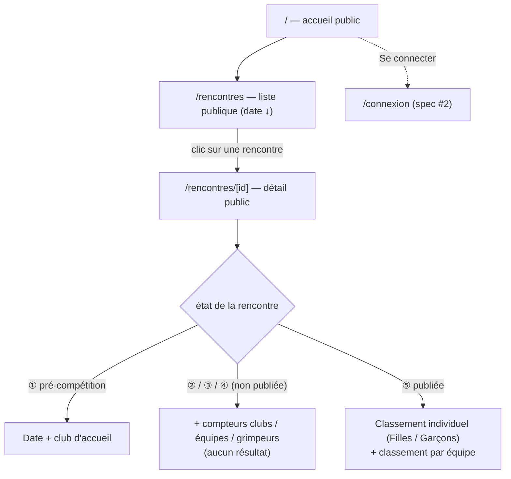

# Spec : Espace public — liste des rencontres & consultation (visiteur non authentifié)

- **Statut** : brouillon (à valider)
- **Sources** :
  - **Décision produit du 2026-09-09** : contenu et navigation de l'espace public
    (visiteur **non authentifié**) ; visibilité selon l'**état** de la rencontre ;
    tri par **date décroissante** ; classement public **individuel + équipe** (pas
    par club) une fois la rencontre **publiée**.
  - **Spec #1 — Rôles** (`01-roles-et-autorisations.md`) R8 (rév. 2026-09-09) :
    le visiteur **non authentifié** ne voit résultats/classements qu'**à la ⑤** ;
    avant, seulement les **informations de tête**. Cette spec décrit **ce qu'il
    voit** et **comment il navigue**.
  - **Spec #6 — Saisie** (`06-saisie-des-resultats.md`) : source des résultats
    (visibilité au fil de l'eau **pour les authentifiés** dès la ③).
  - **Spec #7 — Classement** (`07-classement.md`) : R8b (individuel **Filles /
    Garçons**), R12/R12b (vues, longue liste). Le public réutilise le **même
    calcul** ; il n'a **pas** la vue par club (R11, rév. 2026-09-09).
- **Maquette** : [`docs/maquettes/espace-public.html`](../maquettes/espace-public.html).
- **Note de rédaction** : l'espace public est **en lecture seule** et **sans
  authentification**. Les pages sont **rendues côté serveur** via le client
  `service_role` (ADR 0002/0003) ; le **gating par état** est appliqué **dans le
  loader** — aucune ouverture de RLS à `anon` (voir « Contraintes de données »).

## Objectif

Offrir à **tout visiteur, sans compte**, une vue d'ensemble des rencontres du
championnat et, pour les rencontres **publiées**, leurs **classements** (individuel
et par équipe). C'est la vitrine du championnat : informer le grand public
(dates, clubs engagés) et diffuser les résultats **officiels**.

## Vocabulaire

- **Visiteur / public** : utilisateur **non authentifié** (`anon`), sans rôle.
- **Publiée** : rencontre en phase **⑤ résultats publics** — résultats
  **officiels et figés** (spec #1 R8).
- **Informations de tête** : données non sensibles d'une rencontre visibles avant
  publication — **date**, **club d'accueil**, et (dès les engagements) **nombre de
  clubs / d'équipes / de grimpeurs** engagés.
- **Compteurs d'engagement** : nombre de **clubs** distincts engagés, d'**équipes**
  engagées, de **grimpeurs** composés dans la rencontre.

## Routes & navigation

- **R1.** La **liste publique des rencontres** est accessible **sans
  authentification** à la route **`/rencontres`** ; c'est l'entrée de l'espace
  public. La racine `/` conduit à cette liste (et offre un accès **« Se
  connecter »**, spec #2).
- **R2.** Le **détail public d'une rencontre** est accessible **sans
  authentification** à **`/rencontres/[id]`**. Ces routes sont **en lecture seule**
  et **n'exposent aucune action** d'écriture.

## Règles fonctionnelles

### Liste des rencontres

- **R3.** La liste présente **toutes** les rencontres (à venir **et** passées),
  triées par **date décroissante** (la plus **récente** en premier, donc les
  rencontres **à venir** en tête puis les passées). *(Pas de séparation en
  sections : une seule liste continue.)*
- **R4.** Chaque ligne affiche au minimum la **date** et le **club d'accueil** ;
  le complément dépend de l'**état** (R6). Un repère visuel distingue **à venir /
  en cours / publiée**.

### Contenu visible selon l'état

- **R5.** **① pré-compétition** (« à venir ») : le public ne voit que la **date**
  et le **club d'accueil**. Aucun compteur (les engagements ne sont pas figés),
  aucun résultat.
- **R6.** **② préparation / ③ compétition / ④ clôture** (non publiée) : le public
  voit la **date**, le **club d'accueil** et les **compteurs d'engagement**
  (nombre de **clubs**, d'**équipes**, de **grimpeurs**) — **sans aucun résultat
  ni classement**.
- **R7.** **⑤ résultats publics** (publiée) : le public voit les informations de
  tête **et** les **classements** de la rencontre (R9).

### Classements publics

- **R8.** Les classements publics ne sont exposés **qu'à la ⑤** (R7). Avant, toute
  tentative d'accès au détail d'une rencontre non publiée ne renvoie **aucun
  résultat** (informations de tête uniquement).
- **R9.** À la ⑤, le détail public expose **deux classements** :
  - **individuel**, **séparé Filles / Garçons** (spec #7 R8b) ;
  - **par équipe** (spec #7 R5).
  Le **classement par club** **n'est pas** exposé au public (décision
  2026-09-09). La **vitesse** n'entre pas dans le score (spec #7 R14).
- **R10.** Les classements publics affichent le **rang**, le **libellé** (grimpeur
  et club d'origine ; ou équipe et club) et le **score**, comme en interne (spec #7
  R12), et sont marqués **officiels** (la ⑤ fige, spec #1 R8). Les listes longues
  suivent le même traitement qu'en interne (recherche, **pagination** en bas de
  liste, spec #7 R12b).

### Accès & sécurité

- **R11.** L'espace public **ne requiert jamais** de connexion et **n'expose
  aucune donnée** au-delà de ce qui précède : en particulier, **aucun résultat
  nominatif** n'est accessible au public **avant la ⑤**.
- **R12.** L'espace public est **cohérent avec les droits** (spec #1 R8) : un
  **compte authentifié** dispose, lui, de la consultation **au fil de l'eau dès la
  ③** via ses espaces (coach/admin, specs #4–#7). La présente spec ne traite que la
  vue **non authentifiée**.

## Scénarios

### Nominal — liste publique

Étant donné un visiteur non connecté, quand il ouvre `/rencontres`, alors il voit
toutes les rencontres triées de la plus récente à la plus ancienne (R3), chacune
avec sa date et son club d'accueil (R4).

### Nominal — rencontre à venir

Étant donné une rencontre en **① pré-compétition**, quand le visiteur ouvre son
détail, alors il voit **uniquement** la **date** et le **club d'accueil** (R5) —
ni compteurs, ni résultats.

### Nominal — rencontre en cours non publiée

Étant donné une rencontre en **③ compétition**, quand le visiteur ouvre son détail,
alors il voit la date, le club d'accueil et les **compteurs** (clubs / équipes /
grimpeurs) mais **aucun résultat ni classement** (R6). *(Un coach authentifié,
lui, verrait le classement au fil de l'eau — spec #1 R8.)*

### Nominal — rencontre publiée

Étant donné une rencontre en **⑤ résultats publics**, quand le visiteur ouvre son
détail, alors il voit le **classement individuel Filles / Garçons** et le
**classement par équipe**, marqués **officiels** (R7/R9/R10), **sans** classement
par club.

### Cas limites / erreurs

- Accès direct à `/rencontres/[id]` d'une rencontre **non publiée** → **informations
  de tête** selon l'état (R5/R6), jamais de résultats (R8/R11).
- Rencontre en **② préparation** sans engagement encore saisi → compteurs à **0**
  (ou masqués) ; aucun résultat (R6).
- `id` inexistant → **404**.

## Contraintes de données

- **Rendu côté serveur, `service_role`, pas d'ouverture `anon`.** Les pages
  publiques sont des **composants serveur** : le **loader** lit via le client
  **`service_role`** (cross-club, ADR 0002/0003) et **applique lui-même le gating
  par état** (R5–R8). Le navigateur du visiteur **n'interroge jamais** Supabase
  directement → **aucune policy RLS n'est ouverte à `anon`** (la RLS reste
  « authentifié dès ③ », spec #6). Cela évite toute fuite de résultats avant la ⑤,
  quel que soit le chemin d'accès.
- **Gating = état de la rencontre**, pas la date calendaire : la date ne sert qu'au
  **tri** (R3). Le contenu dépend de la **phase** (`rencontre.phase`).
- **Compteurs** : dérivés par le loader (nombre de **clubs** distincts, d'**équipes**,
  de **grimpeurs** composés). Requête **bornée à la rencontre** (index
  `equipe(rencontre_id)`, `composition(equipe_id)`), coût négligeable.
- **Classements publics** : réutilisent la **fonction domaine** de la spec #7
  (aucun recalcul spécifique), filtrés aux vues **individuel + équipe**.
- **Aucune migration propre** attendue (lecture seule, calcul à la volée) ; la
  seule dépendance de schéma héritée est `grimpeur.sexe` (spec #7 R8b) pour la
  séparation Filles / Garçons.

## Points à valider

- **Racine `/`** : la liste publique est-elle rendue **directement** à `/`, ou `/`
  reste-t-il un accueil qui **redirige/lie** vers `/rencontres` ? *(Proposé :
  `/rencontres` canonique, `/` y conduit.)*
- **Compteurs en ② préparation** : afficher **0** tant qu'aucun engagement, ou
  **n'afficher les compteurs qu'à partir du moment où au moins une équipe est
  engagée** ? *(Proposé : afficher dès qu'il existe des engagements, sinon masquer.)*
- **Filtre / recherche** sur la liste publique (par club d'accueil, par période) :
  utile à terme ? *(Hors périmètre de cette itération sauf demande.)*

## Hors périmètre

- **Classement par club** au public → **exclu** (décision 2026-09-09).
- **Consultation au fil de l'eau** (dès la ③) → réservée aux **authentifiés**
  (specs #4–#7), hors espace public.
- **Vitesse** dans les classements publics → suit la spec #7 (R14, ultérieur).
- **Export / partage** (PDF, liens sociaux, flux) → itération dédiée.
- **Détail nominatif** d'un grimpeur au-delà du classement (fiche, historique) →
  hors périmètre.
