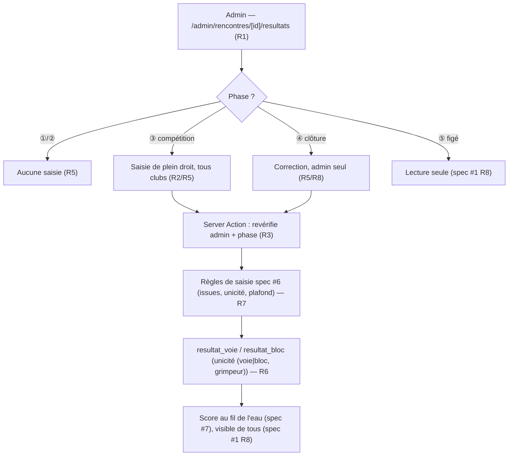

# Spec : Saisie & correction des résultats par l'admin (tous clubs)

- **Statut** : **validée** (le 2026-09-22) — décisions tranchées : saisie admin
  ouverte **dès la ③** (répercutée dans spec #1 R7), **traçabilité de l'auteur**
  via migration, vitesse admin **hors périmètre** (voir « Décisions tranchées »).
- **Sources** :
  - **Décision produit du 2026-09-22** : l'**administrateur** peut **saisir et
    modifier** les résultats de **n'importe quel grimpeur, tous clubs confondus**,
    d'une rencontre, **dès la ③ compétition** (pas seulement corriger en ④). Motif :
    dépanner un club **sans coach présent**, saisir à la place d'un coach, ou
    corriger une erreur. Ce périmètre **étend** les specs existantes (voir ci-dessous).
  - **Maquette validée** : [`docs/maquettes/admin-saisie-resultats.html`](../maquettes/admin-saisie-resultats.html)
    (desktop responsive, maître-détail liste tous clubs / saisie ; repli mobile).
  - **Spec #6 — Saisie des résultats (coach)** (`06-saisie-des-resultats.md`) :
    **réutilisée intégralement** pour les **règles de saisie** (issues admises par
    catégorie/type R10/R12, unicité `(voie, grimpeur)` / `(bloc, grimpeur)`
    R13/R17, plafond 6 voies ado R14, paliers de blocs R16, NP automatique à la
    clôture R18/R19, score/vitesse en lecture seule R22/R23). Cette spec **ne
    redéfinit pas** ces règles : elle **change l'acteur et le périmètre** (admin,
    tous clubs), pas la sémantique d'un résultat.
  - **Spec #1 — Rôles & autorisations** (`01-roles-et-autorisations.md`) :
    **R5** (phase ④ clôture — *« seul l'admin peut saisir/corriger les résultats »*,
    rév. 2026-08-29) fonde déjà la **correction admin en ④** ; **R7** (*« la saisie
    des résultats — coach — n'est possible qu'en ③ »*) **ne mentionne pas l'admin**
    en ③ : la présente spec **étend R7** pour y admettre l'**admin** (décision
    2026-09-22). **R8** (visibilité au fil de l'eau) et **R12** (écrans admin)
    inchangées.
  - **Spec #3 — Paramétrage** (`03-ecrans-de-parametrage-admin.md`) : barème
    (points voie/paliers) source des scores affichés (lecture seule).
  - **Spec #7 — Classement** (`07-classement.md`) : réutilise l'**assemblage
    cross-club** (`service_role`, ADR 0002/0003) déjà en place pour lire les
    grimpeurs/équipes/clubs de tous les clubs.
- **Note de rédaction** : cette spec décrit le **quoi** d'un **écran admin de
  saisie/correction des résultats**, transverse (tous clubs). Elle réutilise
  `resultat_voie` / `resultat_bloc` (spec #6) et la **branche `est_admin()`** déjà
  présente dans leurs policies RLS (migration `202609081000`). Seule évolution de
  schéma : une **migration** ajoutant les colonnes d'**auteur** (traçabilité R14).
  La **saisie de la vitesse** (juge) et le **calcul du score** (spec #7) restent
  hors périmètre.

## Objectif

Donner à l'**administrateur** un moyen de **saisir et corriger les résultats de
voie et de bloc de n'importe quel grimpeur, tous clubs confondus**, pendant une
rencontre. Le coach est **borné à son club** (spec #6 R2) et n'est pas toujours
présent : sans filet admin, un club **sans coach** sur place ne pourrait pas faire
enregistrer ses résultats. L'admin comble ce manque — en **③ compétition** (saisie
de plein droit, décision 2026-09-22) et en **④ clôture** (correction, spec #1 R5).

## Vocabulaire

- **Saisie admin** : enregistrement ou modification, par l'administrateur, d'un
  **résultat de voie** ou de **bloc** (issue, spec #6) pour un grimpeur donné.
- **Périmètre transverse (cross-club)** : contrairement au coach (un seul club),
  l'admin agit sur **tous les clubs engagés** dans la rencontre.
- **Correction** : saisie admin en **④ clôture** — remplacement d'un résultat
  existant, y compris repasser un **NP automatique** (R18 spec #6) en résultat réel.
- **Phase** : ① `pre_competition`, ② `preparation`, ③ `competition`, ④ `cloture`,
  ⑤ `resultats_publics` (spec #1 R5).

## Règles fonctionnelles

### Accès et périmètre

- **R1.** La saisie/correction admin se fait sur un **écran admin dédié**, sous
  `/admin/rencontres/[id]/resultats`, **réservé au rôle `admin`**. Tout autre rôle
  (coach, juge, non connecté) reçoit **404**. Cet écran est **distinct** de
  l'espace coach (spec #6 R1 inchangée : l'écran `/coach/...` reste réservé au
  coach) ; les deux coexistent.
- **R2.** L'admin saisit et modifie les résultats de **tout grimpeur engagé** dans
  la rencontre, **quel que soit son club** (transverse). Il n'est **pas borné à un
  club** (différence essentielle avec le coach, spec #6 R2). Le grimpeur reste
  attribué à **son** club ; son score compte pour son **équipe/club** selon le
  rattachement (prêté → équipe/club d'accueil, spec #7 R7).
- **R3.** Chaque écriture passe par une **Server Action** qui **revérifie côté
  serveur** le **rôle admin** et la **phase** de la rencontre (③ ou ④),
  indépendamment de l'UI (défense en profondeur). Un appel hors périmètre est
  refusé **sans écriture** (aligné spec #6 R3).
- **R4.** Une violation de contrainte en base (unicité, issue invalide, cohérence
  catégorie/type, clé étrangère) est **traduite en message lisible** (jamais une
  erreur technique brute) (aligné spec #6 R4).

### Fenêtre temporelle (phase)

- **R5.** La saisie/correction admin est possible en **③ compétition** **et** en
  **④ clôture**. En **③**, l'admin saisit **de plein droit** (décision 2026-09-22,
  extension de spec #1 R7) — **en parallèle** des coachs. En **④**, l'admin est le
  **seul** à pouvoir écrire (coachs/juges bornés à la ③ ; spec #1 R5). **Avant la
  ③** (①/②), aucune saisie de résultat (rien à saisir). **Dès la ⑤** résultats
  publics, les résultats sont **figés** : plus aucune écriture (spec #1 R8).
- **R6.** En ③, admin et coach écrivent sur les **mêmes** résultats sans verrou
  applicatif entre eux : l'unicité `(voie, grimpeur)` / `(bloc, grimpeur)` (spec #6
  R13/R17) garantit **un seul résultat** par voie/bloc ; une nouvelle saisie
  (admin **ou** coach) **remplace** la précédente (dernière écriture gagnante,
  correction). Aucun doublon n'est créé.

### Règles de saisie (réutilisées de la spec #6)

- **R7.** Les **règles de saisie sont celles de la spec #6**, sans changement :
  issues admises par **catégorie et type de voie** (enfant tête : Top / Prise
  valorisée / Échec ; enfant moulinette : Top / Échec ; ado : Top / Zone 2 / Zone 1
  / Échec — R10/R12) ; **une seule issue par voie/bloc** (remplacement, R13/R17) ;
  **plafond 6 voies** ado (R14) ; **paliers** de blocs selon la config (R16). Ces
  invariants sont portés par le **domaine** (`src/domaine/resultat.ts`) et les
  **triggers/contraintes** BDD (spec #6), **partagés** avec la saisie coach.
- **R8.** L'admin peut **écraser un résultat existant**, y compris repasser un
  **NP** (posé automatiquement à la clôture, spec #6 R18) en résultat réel — quand
  le grimpeur avait bien concouru (spec #6 R19, ici **étendu à la ③** en plus de la
  ④). Une saisie admin n'est jamais bloquée par un résultat déjà présent : elle le
  **corrige**.
- **R9.** Le **NP automatique à la clôture** (spec #6 R18) reste inchangé : au
  passage ③→④, les attendus non saisis passent NP. L'admin les corrige ensuite en
  ④ si besoin (R8). Cette spec n'en modifie **pas** le déclenchement.

### Présentation et cohérence IHM

- **R10.** L'écran présente les grimpeurs **regroupés par club** (tous clubs
  engagés), avec **recherche par nom** et **filtre par club** (maquette). Pour
  chaque grimpeur : sa **progression** (voies n/3 ou n/6, blocs n/2), son **score**
  au fil de l'eau (lecture seule, spec #6 R23) et son **état de vitesse** (lecture
  seule, spec #6 R22). La sélection d'un grimpeur ouvre sa **saisie** (voies +
  blocs), sans quitter la liste sur desktop (maître-détail).
- **R11.** L'écran est **responsive** : maître-détail **deux colonnes** sur
  ordinateur (liste + saisie, voies et blocs côte à côte), **une colonne** empilée
  sur téléphone/tablette (mobile-first, cf. maquette et conv. 08). L'admin
  travaillant surtout sur **ordinateur**, l'écran **exploite la largeur** sans
  largeur figée.
- **R12.** L'accès se fait depuis le **tableau de bord d'une rencontre**
  (`/admin/rencontres/[id]`) via une action **« Saisir les résultats »** (③) /
  **« Corriger les résultats »** (④), **visible dès la ③**. Rien avant la ③.
- **R13.** Après une saisie réussie, l'écran **reflète l'état à jour**
  (revalidation) : issue enregistrée visible, progression et score actualisés
  (aligné spec #6 R20).

### Traçabilité

- **R14.** Chaque écriture d'un résultat de voie/bloc **conserve son auteur** — le
  **compte** ayant écrit et son **rôle** (`admin` ou `coach`) — à des fins d'audit
  (« qui a saisi/corrigé quoi »). L'auteur est **mis à jour à chaque écriture**
  (dernière écriture, cohérent avec le remplacement R6). Cette traçabilité
  s'applique **aux deux acteurs** : les écritures **coach** (spec #6) comme
  **admin** renseignent l'auteur. *(Prérequis de schéma : colonnes
  `auteur_utilisateur_id` (→ `auth.users`) et `auteur_role` sur `resultat_voie` /
  `resultat_bloc` — voir Contraintes de données.)*

## Scénarios

### Nominal — saisie admin pour un club sans coach (③)

Étant donné une rencontre **enfant** en **③**, un club **sans coach présent**, et
un administrateur, quand l'admin ouvre `/admin/rencontres/[id]/resultats`,
sélectionne un grimpeur de **ce club** et saisit ses voies (ex. T2 = Top, T3 =
Prise valorisée) et blocs (R7), alors les résultats sont **enregistrés** pour ce
grimpeur, son **score** se met à jour au fil de l'eau, et ils sont **consultables
de tous** (non officiels, spec #1 R8).

### Nominal — correction admin en clôture (④)

Étant donné une rencontre passée en **④ clôture** où un grimpeur a un **NP
automatique** sur M2 (attendu non saisi, spec #6 R18), quand l'admin corrige M2 en
**Top** (le grimpeur avait bien grimpé, R8/spec #6 R19), alors le NP est **remplacé
par Top**, le score est recalculé, et aucun autre résultat n'est touché.

### Nominal — coexistence admin / coach en ③

Étant donné une rencontre en **③**, quand un **coach** saisit une voie pour son
grimpeur puis que l'**admin** corrige cette même voie (ou l'inverse), alors il n'y
a **qu'un seul** résultat pour cette voie (unicité, R6) : la **dernière écriture**
l'emporte, sans doublon.

### Cas limites / erreurs

- Ouverture de `/admin/rencontres/[id]/resultats` par un **coach**, un **juge** ou
  un **non connecté** → **404** (R1).
- Saisie admin **hors phase ③/④** (en ①/② ou après ⑤) → **refusée** sans écriture
  (R3/R5).
- Issue **incohérente** avec la catégorie/type (ex. « Zone 1 » en enfant, « Prise
  valorisée » en ado, prise valorisée sur une moulinette) → **refusée** (R7, mêmes
  règles que spec #6 R10/R12).
- **7ᵉ** voie ado → **refusée** (plafond 6, R7/spec #6 R14).
- Saisie d'un **résultat de vitesse** → **hors périmètre** (vitesse au juge ; non
  proposé ici).

## Flux (vue d'ensemble)

## Contraintes de données

- **Aucune table nouvelle.** Réutilise `resultat_voie` / `resultat_bloc` (spec #6,
  migration `202609081000`) et leur **unicité** `(voie_difficulte_id, grimpeur_id)`
  / `(bloc_id, grimpeur_id)` (R6). Les **triggers** de cohérence issue↔catégorie
  et palier↔bloc (spec #6) s'appliquent **à l'identique** (partagés).
- **RLS — écriture admin déjà autorisée.** Les policies `resultat_voie_insert/
  update` et `resultat_bloc_insert/update` comportent **déjà** la branche
  `interclub.est_admin()` (migration `202609081000`) : l'admin écrit **sans gating
  de phase RLS** (comme pour ses autres corrections). Le **gating ③/④** est porté
  par la **Server Action** (R3/R5) — l'admin ne devant pas écrire en ①/②/⑤.
- **Lecture cross-club** : l'assemblage de la liste (grimpeurs/équipes/clubs de
  **tous** les clubs) réutilise le client **`service_role`** côté serveur (ADR
  0002/0003), comme le classement (spec #7) et l'engagement admin. Le grant
  `select` sur `interclub.epreuve` au `service_role` (migration `202609181100`)
  est un **prérequis** déjà en place.
- **Domaine réutilisé** : `issuesVoieSaisissables`, `validerIssueVoie`,
  `validerResultatBloc`, `verifierAjoutVoieAdo` (`src/domaine/resultat.ts`) —
  **aucune nouvelle règle** de domaine, la validation est celle de la spec #6.
- **Prérequis de schéma : auteur des écritures (R14).** Une **migration**
  (`202609221000_resultat_auteur`) ajoute sur `resultat_voie` **et**
  `resultat_bloc` des colonnes d'**auteur** : **`auteur_utilisateur_id`**
  (référence **`auth.users(id)`**, `on delete set null`) et
  `auteur_role text check (auteur_role in ('admin','coach'))`. On référence
  `auth.users` **et non `interclub.compte`** car le **coach temporaire** écrit via
  une session **anonyme** (QR) **sans ligne `compte`** (spec #1 R9/R27) : seul
  `auth.users` couvre tous les auteurs (admin, coach permanent, coach temporaire).
  Elles sont **renseignées par les Server Actions** d'écriture — celle de l'**admin**
  (cette spec) **et** celle du **coach** (spec #6, action mise à jour pour peupler
  l'auteur ; aucun changement de règle de saisie côté #6). Colonnes **nullable**
  (pas de rétro-remplissage requis). Audit en lecture seule ; l'auteur n'entre ni
  dans le score ni dans les classements.

## Décisions tranchées

- **Ouverture de la saisie admin dès la ③ (R5)** — **tranché le 2026-09-22** :
  ouverte, et **répercutée dans spec #1 R7** (rév. 2026-09-22 : l'admin s'ajoute au
  coach comme acteur d'écriture en ③). La spec #1 reste la matrice « qui écrit
  quand » ; la présente spec en détaille le parcours.
- **Traçabilité de l'auteur (R14)** — **tranché le 2026-09-22** : on **conserve
  l'auteur** (compte + rôle) de chaque écriture, via une **migration** ajoutant
  `auteur_compte_id` / `auteur_role` sur `resultat_voie` / `resultat_bloc`
  (nullable, renseignées par les Server Actions coach **et** admin). Audit en
  lecture seule.
- **Correction de la vitesse par l'admin** — **tranché le 2026-09-22** : **hors
  périmètre** ici (dépend de la spec **juge**, non écrite). Seul l'affichage lecture
  seule de l'état de vitesse figure (R10). Spec #1 R5 (« résultats et temps »)
  couvrira les temps quand la saisie vitesse existera.

## Hors périmètre

- **Saisie de la vitesse** (temps / chute / non-présentation) et sa **correction
  admin** → dépendent de la **spec juge** (non écrite). Seul l'**affichage lecture
  seule** de l'état de vitesse figure ici (R10, comme spec #6 R22).
- **Calcul du score et classements** → **spec #7** (`07-classement.md`). Cette spec
  ne fait que **restituer** le score au fil de l'eau.
- **Saisie coach** (espace `/coach`, borné au club) → **spec #6** (inchangée).
- **Officialisation / figement en ⑤** → **spec #1** (R8).
- **Surface publique** (visiteur non authentifié) → **spec #8**.
- **NP automatique à la clôture** (mécanique de transition ③→④) → **spec #6 R18**
  (réutilisée, non modifiée).
- **Temps réel (pousser les MAJ sur les autres écrans)** — *évolution future,
  différée (notée le 2026-09-22).* Aujourd'hui « au fil de l'eau » = recalcul à la
  **lecture / revalidation** : seul l'écran de **celui qui écrit** se rafraîchit.
  Pousser les mises à jour **en direct** vers les autres écrans ouverts (deux
  coachs saisissant en parallèle, admin + coach, spectateur du classement)
  nécessitera **Supabase Realtime** (abonnement aux changements de
  `resultat_voie` / `resultat_bloc`). Concerne aussi la saisie coach (spec #6) et
  le classement (spec #7) ; **hors périmètre** de cette spec.
