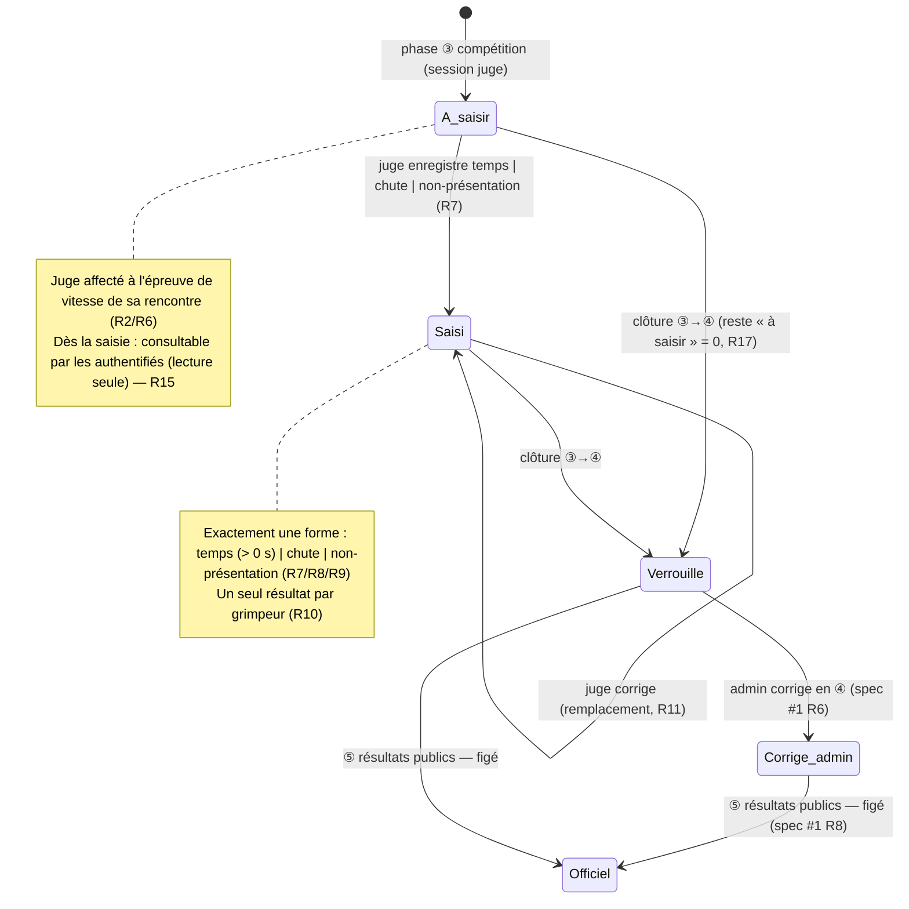
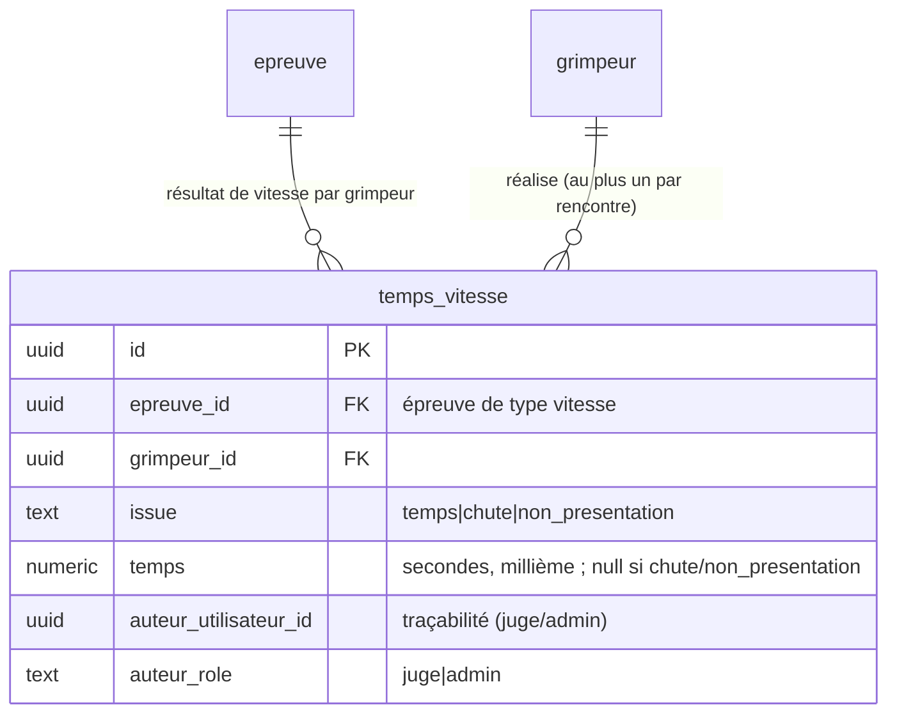

# Spec : Saisie de l'épreuve de vitesse — juge

- **Statut** : validée (le 2026-09-22) — décisions produit tranchées : **modèle
  `temps_vitesse` étendu** (colonne `issue` + `temps` nullable) pour matérialiser
  les trois formes de résultat ; **temps en secondes** (numeric au millième) ;
  **correction autorisée** (ressaisie = remplacement) ; **liste de tous les
  compétiteurs engagés de la rencontre, regroupés par sexe** (Filles / Garçons).
- **Sources** :
  - **Spec #1 — Rôles & autorisations** (`01-roles-et-autorisations.md`), vérité
    pour « qui peut faire quoi » : le **juge** est affecté par l'admin à
    l'épreuve de **vitesse** d'une rencontre (R15, R29) ; il **saisit uniquement
    les résultats de vitesse** (temps, chute ou non-présentation) de l'épreuve à
    laquelle il est affecté et **n'intervient ni sur la voie ni sur le bloc**
    (R30) ; en RLS son périmètre d'écriture est **l'épreuve de vitesse de sa
    rencontre**, le **couloir (`voie_vitesse`)** du jeton restant une simple
    **information d'organisation physique** (précision R30, rév. 2026-07-25) ;
    pour saisir il **sélectionne un grimpeur** puis enregistre son résultat, qui
    prend **exactement une des trois formes** ; **un seul résultat par grimpeur
    et par rencontre** (R31) ; le juge ne peut effectuer **aucune autre action**
    (R32) et n'a accès qu'à la **fenêtre ③ compétition** de sa rencontre via
    session QR (R33). En **④ clôture**, **seul l'admin** corrige (R6).
  - **Spec #2 — Authentification & sessions QR** (`02-authentification-et-sessions-qr.md`) :
    une session « juge » s'ouvre par **scan d'un jeton QR** (R11), a la fenêtre
    **③ compétition** (R12), et donne les droits du juge (R11). L'**affectation
    d'un juge** à une **voie de vitesse** vaut génération/affichage de son jeton
    par l'admin (R17) ; il y a **au plus un** jeton « juge » actif **par voie de
    vitesse** (R18). Le périmètre de la session juge est **une voie de vitesse**
    d'une rencontre (R10b).
  - **Spec #6 — Saisie des résultats voie & bloc** (`06-saisie-des-resultats.md`) :
    la saisie de la vitesse y est **explicitement renvoyée à cette spec dédiée**
    (« Hors périmètre ») ; l'écran coach n'affiche l'**état de vitesse qu'en
    lecture seule** (R22). La **visibilité au fil de l'eau** (authentifiés dès la
    ③, public à la ⑤) suit le même régime que les résultats voie/bloc (R6).
  - **Spec #7 — Classement** (`07-classement.md`) : les **points de vitesse** sont
    attribués **par rang dans un classement par sexe** (règlement CT33 §5/§8) —
    d'où la colonne `grimpeur.sexe` (`'F'`/`'G'`, obligatoire). Le **calcul** des
    points de vitesse et leur intégration au classement relèvent de la spec #7
    (**hors** de cette spec, qui s'arrête à la **saisie du résultat brut**).
  - **Règlement** « 2025 Interclubs — Reglement v3 » (CT33 FFME), p. 5 (matin) et
    p. 8 (après-midi) : l'épreuve de vitesse est **chronométrée** ; « **non
    présentation** à la voie = **0 pt** » (fonde la forme **non-présentation**) ;
    une **chute** invalide le passage (fonde la forme **chute**) ; les voies de
    vitesse et le classement sont **séparés filles / garçons**.
  - **Modèle de données socle** (migration `202607221100`) : table
    `interclub.temps_vitesse` (`temps numeric(7,3) not null check (temps > 0)`,
    `unique (epreuve_id, grimpeur_id)`) — **ne stocke aujourd'hui qu'un temps** :
    cette spec la **fait évoluer** pour porter les trois formes (voir « Modèle de
    données »). RLS déjà posée (`peut_ecrire_temps_vitesse`, migration
    `202607251000`).
  - **Domaine existant** (`src/domaine/vitesse.ts`) : `ResultatVitesse`
    (temps / chute / non-présentation) et unicité par grimpeur sont déjà modélisés
    (spec #1 R31) ; cette spec **aligne** l'unité (secondes) et la **correction**
    (remplacement).
- **Note de rédaction** : cette spec décrit le **quoi** de la **saisie du résultat
  de vitesse** par le **juge** (temps / chute / non-présentation). Le **calcul des
  points de vitesse** (par rang, par sexe) et leur **agrégation au classement**
  sont **hors périmètre** (spec #7). Elle nécessite **une migration** (extension de
  `temps_vitesse` + RPC de résolution du **contexte juge**) appliquée à la main.

## Objectif

Permettre au **juge** de vitesse d'**enregistrer, pendant la compétition, le
résultat de chaque compétiteur sur l'épreuve de vitesse** : le **temps
chronométré** réalisé, ou l'échec du passage (**chute**), ou l'absence au départ
(**non-présentation**). C'est la matière première des **points de vitesse** du
classement (calculés ultérieurement, hors de cette spec) : sans résultat de
vitesse saisi, la composante vitesse d'une rencontre n'a rien à classer.

La saisie est **bornée à l'épreuve de vitesse de la rencontre** du juge (spec #1
R30) et **à la phase ③ compétition** (spec #1 R33, spec #2 R12). Les résultats
sont **consultables au fil de l'eau** — l'écran coach en montre l'état en lecture
seule (spec #6 R22) — selon le même régime de visibilité que les résultats
voie/bloc (authentifiés dès la ③, public à la ⑤ ; spec #1 R8).

## Vocabulaire

- **Épreuve de vitesse** : épreuve de type `vitesse` d'une rencontre (au plus une
  par rencontre), chronométrée, à laquelle l'admin affecte un ou plusieurs
  **juges** (un par couloir, spec #2 R18).
- **Couloir de vitesse** (`voie_vitesse`) : ligne/piste physique de l'épreuve de
  vitesse (numérotée). Le **jeton juge** est rattaché à **un couloir**
  (organisation physique), mais le **périmètre d'écriture** du juge est
  **l'épreuve entière** de sa rencontre (spec #1 R30, précision) : le couloir **ne
  subdivise pas** ce que le juge peut saisir.
- **Résultat de vitesse** : issue enregistrée pour **un grimpeur sur l'épreuve de
  vitesse d'une rencontre**, prenant **exactement une** des trois formes :
  - **Temps** : durée chronométrée réellement mesurée, **en secondes**, précision
    au **millième** (ex. `8.123`), **strictement positive**.
  - **Chute** : passage tenté sans temps valide (0 pt à la vitesse).
  - **Non-présentation** : grimpeur non présenté au départ (0 pt).
- **Compétiteur engagé** : grimpeur composé dans une équipe de la rencontre
  (grimpeurs **prêtés** inclus). L'épreuve de vitesse concerne **tous** les
  compétiteurs engagés, **tous clubs confondus**.
- **Sexe** : `'F'` (Filles) / `'G'` (Garçons), obligatoire (`grimpeur.sexe`, spec
  #7). Les voies de vitesse et le classement sont **séparés par sexe** ; la
  **saisie du temps** est en revanche **indépendante du sexe** (une même mesure).
- **Phase** : ① `pre_competition`, ② `preparation`, ③ `competition`, ④ `cloture`,
  ⑤ `resultats_publics` (spec #1 R5).

## Règles fonctionnelles

### Accès et périmètre

- **R1.** La saisie de la vitesse se fait dans l'**espace juge** (sous `/juge`),
  **réservé au rôle `juge`** (session QR éphémère, spec #2 R11). Un utilisateur
  sans session juge active (admin, coach, anonyme sans jeton juge, non connecté)
  reçoit **404** — l'espace est **masqué** (aligné spec #1 R1/R22, spec #6 R1).
- **R2.** Le juge saisit et consulte les résultats de vitesse **de tous les
  compétiteurs engagés** de la rencontre à laquelle son épreuve de vitesse
  appartient (tous clubs, prêtés inclus). Son **périmètre d'écriture** est
  **l'épreuve de vitesse de sa rencontre** (spec #1 R30) ; le **couloir** de son
  jeton **ne restreint pas** la liste des grimpeurs qu'il peut saisir.
- **R3.** Chaque écriture passe par une **Server Action** qui **revérifie** côté
  serveur la **session juge**, l'**épreuve de vitesse** visée et la **phase** de
  la rencontre, indépendamment de l'UI (défense en profondeur). Un appel hors
  périmètre est refusé **sans écriture**. La **RLS**
  (`peut_ecrire_temps_vitesse`) reste la **frontière ultime**.
- **R4.** Une violation de contrainte en base (unicité, forme d'issue invalide,
  temps non positif, clé étrangère, refus RLS) est **traduite en message lisible**
  (jamais une erreur technique brute) (aligné spec #6 R4).
- **R5.** Le juge ne peut effectuer **aucune autre action** que la saisie définie
  ici (aucun CRUD club, équipe, grimpeur, rencontre, ni saisie de voie/bloc) —
  spec #1 R30/R32.

### Fenêtre temporelle (phase)

- **R6.** La **saisie et la correction** d'un résultat de vitesse ne sont
  possibles qu'en **phase ③ compétition** (spec #1 R33, spec #2 R12). Hors ③,
  **aucune session juge** ne s'ouvre (spec #2 R12) : l'espace juge est donc
  **inaccessible** avant la ③ et dès la **④ clôture**. En ④ et au-delà, **seul
  l'admin** corrige un résultat de vitesse (spec #1 R6).

### Saisie du résultat de vitesse

- **R7.** Pour saisir, le juge **sélectionne un grimpeur** (compétiteur engagé)
  puis enregistre son **résultat de vitesse**, qui prend **exactement une** des
  trois formes : **temps**, **chute**, **non-présentation** (spec #1 R31).
- **R8.** Un **temps** est une durée **en secondes**, **strictement positive**,
  de précision au **millième** (ex. `8.123`). Une valeur nulle, négative ou non
  numérique est **refusée** (un temps chronométré est une durée réellement
  mesurée).
- **R9.** Une **chute** et une **non-présentation** ne portent **aucun temps**
  (pas de durée associée). Réciproquement, un **temps** implique la forme
  « temps » (cohérence forme ↔ durée).
- **R10.** Un grimpeur a **au plus un résultat de vitesse** par rencontre
  (unicité `(épreuve de vitesse, grimpeur)`, garantie en base) — « pas d'autre
  passage » (spec #1 R31).
- **R11.** Une **ressaisie** sur un grimpeur déjà saisi **remplace** le résultat
  précédent (correction d'une erreur de saisie), elle n'en **ajoute pas** un
  second (décision produit 2026-09-22). Le remplacement peut changer de forme
  (ex. « chute » corrigée en un temps, ou l'inverse).

### Liste et retour IHM

- **R12.** L'écran liste **tous les compétiteurs engagés** de la rencontre (R2),
  **regroupés par sexe** — **Filles** puis **Garçons** — et, au sein de chaque
  groupe, **triés par ordre alphabétique** (nom puis prénom). Le regroupement par
  sexe est un **confort d'affichage** (voies de vitesse genrées) **sans effet**
  sur les données saisies.
- **R13.** Pour chaque grimpeur, l'écran affiche son **état de vitesse courant**
  — **temps** (valeur formatée), **chute**, **non-présentation**, ou **à saisir**
  (aucun résultat) — et permet la **saisie / correction** (R7/R11).
- **R14.** Après une saisie réussie, l'écran **reflète l'état à jour**
  (revalidation) : le résultat enregistré est visible immédiatement et la
  **progression** est actualisée. La progression est **séparée par sexe** — un
  **compteur Filles** (saisis / total) **et** un **compteur Garçons** (saisis /
  total) — cohérent avec le regroupement et le classement par sexe (R12 ; aligné
  spec #6 R20).
- **R14b.** L'écran est dimensionné pour un **grand volume** : une épreuve peut
  compter **plusieurs dizaines de compétiteurs par sexe** (ordre de grandeur : au
  moins 50). Il doit donc rester **exploitable rapidement** — au minimum une
  **recherche par nom/prénom**, un **filtre « à saisir »** (ne montrer que les
  grimpeurs sans résultat) et un **filtre par sexe** (Tous / Filles / Garçons,
  pour n'afficher qu'un groupe à la fois) — et présenter les grimpeurs sous une
  forme **dense** (une ligne compacte par grimpeur, pas une grande carte). Ces
  aides sont des **conforts d'affichage** (préférences, R12) **sans effet** sur
  les données.
- **R14c.** *(IHM — responsive, pas mobile-only)* Le juge saisit vraisemblablement
  sur **ordinateur ou tablette** : l'écran est **responsive**, pleine largeur, et
  **tire parti des écrans larges** (ex. Filles et Garçons **côte à côte** en deux
  colonnes sur grand écran, empilés sur mobile). La saisie d'un temps doit être
  **rapide au clavier** (champ numérique, validation à la touche Entrée). Conforme
  à la convention `08-ihm-responsive.md` (mobile-first, mais **montée en
  écran** assumée).

### Visibilité et score

- **R15.** Les résultats de vitesse sont **consultables au fil de l'eau** selon
  le **même régime** que les résultats voie/bloc (spec #1 R8) : par **tout compte
  authentifié dès la ③** (l'écran coach les montre en **lecture seule**, spec #6
  R22), par le **public** seulement **à la ⑤** (surface publique, spec #8). La
  **⑤ résultats publics** **officialise** (fige) les résultats.
- **R16.** Le **calcul des points de vitesse** (par **rang** dans le classement
  **par sexe**) et leur **agrégation au score / classement** sont **hors
  périmètre** (spec #7). Cette spec s'arrête à la **saisie du résultat brut**
  (temps / chute / non-présentation).
- **R17.** **Aucun NP automatique** à la clôture pour la vitesse : la
  **non-présentation** est une **forme saisie par le juge** (R7). Un grimpeur
  **sans résultat** de vitesse à la clôture reste « à saisir » côté données et
  **compte 0** à la vitesse (équivalent non-présentation), **sans** ligne
  `temps_vitesse` matérialisée — l'admin peut la corriger en ④ (spec #1 R6). *(À
  distinguer du NP automatique des voies/blocs enfant, spec #6 R18.)*

## Scénarios

### Nominal — saisie d'un temps

Étant donné une rencontre en **phase ③ compétition** et un **juge** affecté à son
épreuve de vitesse (session QR active), quand un compétiteur réalise son passage
en **8,123 s** et que le juge sélectionne ce grimpeur puis saisit ce temps
(R7/R8), alors l'écran enregistre un résultat de vitesse **temps = 8.123** pour ce
grimpeur et actualise sa progression (R13/R14).

### Nominal — chute puis correction

Étant donné un grimpeur dont le juge a saisi une **chute** (R7/R9), quand le juge
constate qu'il s'agissait en fait d'un temps valide et ressaisit **8,450 s** sur
le **même** grimpeur (R11), alors l'unique résultat de ce grimpeur passe de
« chute » à **temps = 8.450** (remplacement, pas de doublon — R10).

### Nominal — non-présentation

Étant donné un compétiteur qui ne se présente pas au départ, quand le juge saisit
une **non-présentation** pour ce grimpeur (R7), alors le résultat enregistré est
**non-présentation** (aucun temps, R9) et le grimpeur compte **0** à la vitesse
(R16, calcul spec #7).

### Cas limites / erreurs

- Ouverture de `/juge` par un **admin**, un **coach** ou un **non connecté** (pas
  de session juge active) → **404** (R1).
- Tentative de saisie **hors phase ③** → **impossible** : aucune session juge
  n'existe hors ③ (R6, spec #2 R12).
- Saisie d'un **temps ≤ 0** ou non numérique → **refusée** (R8).
- Saisie d'un résultat sur une **épreuve de vitesse** à laquelle le juge **n'est
  pas affecté** → **refusée** par la RLS (R3, spec #1 R30).
- Saisie d'un **résultat de voie ou de bloc** par le juge → **hors périmètre**,
  non proposé (spec #1 R30/R32, R5).
- Deuxième saisie sur le **même** grimpeur → **remplace** la première (R11), n'en
  crée pas une seconde (R10).

## Cycle de vie d'un résultat de vitesse

## Modèle de données

- La table `interclub.temps_vitesse` (`temps numeric(7,3) not null check
  (temps > 0)`, un par `épreuve × grimpeur`, migration `202607221100`) ne stocke
  **qu'un temps** : elle est **étendue** (migration appliquée à la main) pour
  porter les **trois formes** de résultat.

- **`temps_vitesse`** — un résultat par `(epreuve_id, grimpeur_id)` :
  - ajout `issue text not null check (issue in ('temps','chute','non_presentation'))` ;
  - `temps` passe **nullable**, avec `check (temps is null or temps > 0)` (R8) ;
  - **cohérence forme ↔ durée** (R9) : `check ((issue = 'temps') = (temps is not
    null))` — un temps ⇔ `issue = 'temps'` ;
  - conservation de `unique (epreuve_id, grimpeur_id)` (R10) ; la correction (R11)
    est un **upsert** sur cette clé ;
  - `epreuve_id` doit référencer une épreuve **de type `vitesse`** — garanti par
    la RLS d'écriture (`peut_ecrire_temps_vitesse` teste déjà `ep.type =
    'vitesse'`) ; à **doubler d'un `check`/trigger** si nécessaire.
  - **traçabilité de l'auteur** (aligné spec #9) : `auteur_utilisateur_id uuid
    null`, `auteur_role text null check (auteur_role in ('juge','admin'))`.
- **Résolution du contexte juge** : une **RPC** `contexte_juge()` (SECURITY
  DEFINER, analogue à `contexte_coach_temporaire`, migration `202609011500`)
  renvoie, pour la **session juge active** de l'utilisateur courant (jeton juge,
  fenêtre ③), la **rencontre**, l'**épreuve de vitesse** et le **couloir** ; sinon
  `null` (fail-closed). Elle permet à l'espace `/juge` de charger la liste des
  grimpeurs et de cibler l'épreuve sans que l'anonyme lise `jeton_qr` directement.
- **RLS** : réutilise `peut_ecrire_temps_vitesse(epreuve)` (juge affecté à la
  rencontre **et** épreuve de type vitesse, R3/R30) pour `insert`/`update` ; la
  **lecture** suit `temps_vitesse_select` (déjà : admin, périmètre juge, ou
  visibilité au fil de l'eau via les helpers de résultats). L'ouverture `anon`
  (⑤) relève de la surface publique (spec #8). *(Aligner la lecture authentifiée
  dès la ③ sur le même helper que les résultats voie/bloc, `resultats_visibles`,
  si ce n'est pas déjà le cas.)*
- **NP automatique** (R17) : **aucun** — pas d'insertion de lignes à la clôture
  pour la vitesse (contrairement à voie/bloc, spec #6 R18).

## Points à valider

- **Extension `temps_vitesse`** (issue + temps nullable + checks) — **tranché le
  2026-09-22**. Application **manuelle** en recette puis prod (convention
  migrations manuelles).
- **Unité du temps** = **secondes**, `numeric(7,3)` (millième) — **tranché le
  2026-09-22**. Le domaine `vitesse.ts` (aujourd'hui en `centiemes`) est **aligné**
  sur les secondes.
- **Correction par le juge** (remplacement) — **tranché le 2026-09-22**.
- **Regroupement par sexe** de la liste — **tranché le 2026-09-22**.
- **Lecture au fil de l'eau des `temps_vitesse`** : vérifier que la policy
  `temps_vitesse_select` ouvre bien la lecture aux **authentifiés dès la ③** (même
  régime que voie/bloc) ; sinon, l'**élargir** dans la migration (cf. spec #6
  « Modèle de données »).

## Hors périmètre

- **Calcul des points de vitesse** (par **rang**, dans le classement **par sexe**)
  et leur **agrégation au score / classement** individuel/équipe/club → **spec #7**
  (« Classement »). Cette spec s'arrête au **résultat brut**.
- **Affectation d'un juge** à un couloir (génération/affichage du jeton QR par
  l'admin) et **cycle de vie de la session juge** → **spec #2** (R17/R18).
- **Surface publique** de consultation (visiteur non authentifié, ⑤) → **spec #8**.
- **Correction admin** en ④ et **officialisation ⑤** → **spec #1** (R6/R8) et
  espace admin (IHM non détaillée ici).
- **Paramétrage du nombre de couloirs** de vitesse d'une rencontre → **spec #2 /
  spec #3** (gabarit).
