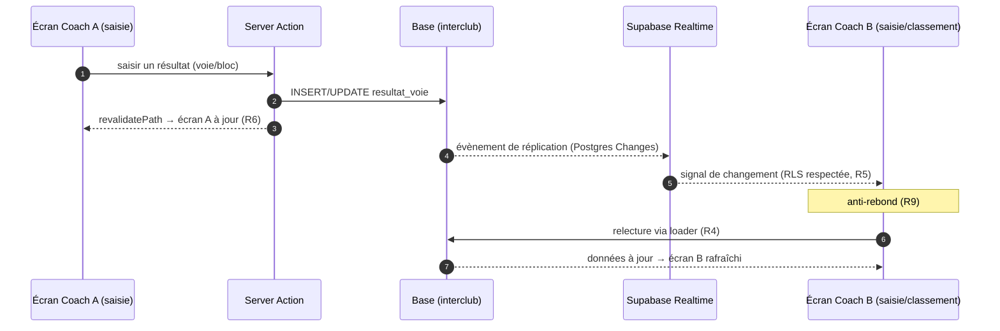

# Spec : Realtime — mises à jour en direct (écrans authentifiés)

- **Statut** : validée (le 2026-09-23)
- **Sources** :
  - **Spec #6 — Saisie des résultats** (`06-saisie-des-resultats.md`) : « Temps réel
    (pousser les MAJ sur les autres écrans) » noté **évolution future différée**
    (2026-09-22) ; aujourd'hui « au fil de l'eau » = recalcul à la **lecture /
    revalidation**, seul l'écran de **celui qui écrit** se rafraîchit. Tables
    `resultat_voie` / `resultat_bloc`.
  - **Spec #7 — Classement** (`07-classement.md`) : classement **recalculé à la
    lecture** (R10), non poussé en direct (§ « Temps réel », différé 2026-09-22).
    La table **`points_vitesse`** est **matérialisée par trigger** (R20) et déclarée
    **« prête pour un abonnement Realtime »** — introduite en partie pour cela.
    Le classement est conçu **realtime-compatible**.
  - **Spec #9 — Saisie admin des résultats** (`09-saisie-admin-resultats.md`) :
    même note « Temps réel » différée (2026-09-22), abonnement aux changements de
    `resultat_voie` / `resultat_bloc`.
  - **Spec #10 — Saisie vitesse (juge)** (`10-saisie-vitesse-juge.md`) : le **juge**
    saisit les **temps** (`temps_vitesse`) ; le trigger en dérive `points_vitesse`
    (spec #7 R20). L'**écran juge** est inclus au live (décision 2026-09-23) pour
    synchroniser **plusieurs juges / appareils** sur une même épreuve.
  - **Spec #8 — Espace public** (`08-espace-public.md`), **contrainte structurante** :
    l'espace public est **rendu côté serveur via `service_role`**, **aucune policy
    RLS ouverte à `anon`** (pour ne pas fuiter les résultats avant la ⑤). Le
    navigateur du visiteur **n'interroge jamais** Supabase directement.
  - **Décision produit du 2026-09-23** : première itération **bornée aux écrans
    authentifiés** (coach + admin) via **Supabase Realtime *Postgres Changes***, qui
    s'appuie sur la **RLS existante** (« authentifié dès ③ ») **sans rien ouvrir à
    `anon`**. Le **live public** (spectateur du classement) est **différé** à une
    itération ultérieure (approche **Broadcast serveur**, cf. « Hors périmètre »).

## Objectif

Aujourd'hui, quand un résultat est saisi, **seul l'écran de l'auteur** se met à
jour (Server Action + `revalidatePath`). Les **autres écrans déjà ouverts** — un
second coach qui saisit en parallèle, l'admin qui supervise, un compte authentifié
qui regarde le classement — restent figés jusqu'à un rechargement manuel ou une
revalidation fortuite.

Cette spec fait **pousser les changements en direct** vers ces écrans : dès qu'une
écriture survient sur les tables de résultats, les écrans **authentifiés** concernés
se **rafraîchissent d'eux-mêmes**, sans action ni rechargement de l'utilisateur.

## Vocabulaire

- **Live / temps réel** : mise à jour d'un écran **déjà ouvert** consécutive à une
  écriture faite **ailleurs**, sans rechargement manuel.
- **Postgres Changes** : mécanisme Supabase Realtime qui diffuse les évènements
  `INSERT` / `UPDATE` / `DELETE` d'une table à un client **abonné**, en **respectant
  la RLS** du rôle abonné.
- **Canal (channel)** : abonnement temps réel ouvert par un écran pour une ou
  plusieurs tables sources.
- **Loader** : fonction serveur existante qui lit et (pour le classement) recalcule
  les données à l'affichage (calcul à la lecture, spec #7 R10).
- **Écrivain / auteur** : le compte qui effectue l'écriture ; son écran continue de
  se rafraîchir par le mécanisme existant (revalidation).
- **Tables sources** : `resultat_voie`, `resultat_bloc`, `points_vitesse`,
  `temps_vitesse`.

## Règles fonctionnelles

### Périmètre & déclenchement

- **R1.** En **itération 1**, les écrans rafraîchis en direct sont **exclusivement
  des écrans authentifiés** :
  - la **saisie des résultats coach** (spec #6),
  - la **saisie admin des résultats** (spec #9),
  - l'**écran de classement** consulté par un compte **authentifié** (spec #7),
  - la **saisie vitesse du juge** (spec #10).

  L'**espace public / anonyme** (spec #8) est **hors périmètre** : il reste en rendu
  serveur + revalidation (aucune ouverture `anon`, cf. R5 et « Hors périmètre »).

- **R2.** Un écran concerné se **met à jour tout seul** lorsqu'une écriture
  (`INSERT`, `UPDATE` ou `DELETE`) survient sur l'une des **tables sources qu'il
  observe** — **sans action** de l'utilisateur et **sans rechargement manuel**.

- **R3.** Tables observées **par type d'écran** :
  - **saisie des résultats** (coach #6 / admin #9) : `resultat_voie`, `resultat_bloc`,
    **`temps_vitesse`** et **`points_vitesse`**. Ces écrans affichent la **vitesse en
    lecture seule** (temps ⚡, points) et un **score qui agrège voie + bloc + vitesse**
    (spec #6 R22/R23) : un **temps** saisi par le juge doit donc les rafraîchir
    **en direct** ;
  - **classement** (#7) : `resultat_voie`, `resultat_bloc`, **`points_vitesse`**.
    Le classement lit la table **dérivée** `points_vitesse` (matérialisée par
    trigger, spec #7 R20) : elle change à chaque écriture de `temps_vitesse`, donc
    s'abonner à `points_vitesse` **suffit** pour que le classement bouge en direct
    (pas besoin de `temps_vitesse` ici) ;
  - **saisie vitesse** (juge #10) : **`temps_vitesse`** — pour synchroniser
    **plusieurs juges / appareils** sur une même épreuve (temps et progression).

### Mécanique de rafraîchissement

- **R4.** Le live **réutilise le chemin de lecture existant** : à réception d'un
  évènement, l'écran **relit ses données via son loader serveur** (recalcul à la
  lecture, spec #7 R10). Le canal temps réel ne transporte qu'un **signal de
  changement**, **jamais** de données recalculées. → **aucune logique de calcul
  n'est dupliquée côté client** ; le domaine (`score.ts`, etc.) reste l'unique
  référence.

  **Compromis assumé (relecture vs. diff appliqué).** On **ne** met **pas** à jour
  l'écran avec la seule ligne reçue, parce qu'**une écriture ne correspond pas à une
  case de l'écran** : une seule modification de `temps_vitesse` **réordonne le rang
  et recalcule les points de tous les grimpeurs du même sexe** (spec #7 R15/R20), et
  tout score affiché **agrège** voie + bloc + vitesse. Appliquer la valeur brute
  imposerait donc de **réimplémenter le domaine côté navigateur** (agrégation,
  ex æquo par sexe, points de vitesse) — source de divergence. La relecture garde
  **une seule source de vérité de calcul**. Le surcoût réseau reste **borné** :
  `router.refresh()` renvoie un **payload RSC** (pas un rechargement de page ni les
  assets), le loader est **borné à une rencontre** (volume faible — cf. spec #7,
  ~8000 lignes/an pour toute la saison), les évènements rapprochés sont **regroupés**
  (R9), et le **public n'est pas abonné** (pas de fan-out de masse, R1). Une bascule
  vers un **diff poussé par le serveur** (points/rangs déjà calculés via Broadcast)
  reste une **optimisation ultérieure**, à n'engager que si la mesure le justifie
  (cf. « Points à surveiller »).

- **R5.** **Autorisation = RLS existante.** Un abonnement ne reçoit que les
  évènements des lignes que le rôle **serait autorisé à lire** par les policies RLS
  déjà en place (« authentifié dès ③ », spec #6). **Aucune policy n'est ouverte à
  `anon`** et **aucune nouvelle policy de lecture** n'est créée pour le realtime.

- **R6.** **Complément, pas remplacement.** L'écran de **l'auteur** de l'écriture
  continue de se rafraîchir via le mécanisme existant (Server Action +
  `revalidatePath`). Le realtime **s'ajoute** pour les **autres** écrans ouverts ;
  il ne modifie pas le flux de saisie ni la revalidation actuelle.

- **R7.** **Cycle de vie de l'abonnement.** Le canal est **ouvert à l'affichage** de
  l'écran concerné et **fermé à son démontage** (navigation, fermeture). Aucune
  connexion temps réel ne subsiste après avoir quitté l'écran (pas de fuite de
  canal).

- **R8.** **Bornage à la rencontre — best effort.** Un écran ne doit refléter que
  **sa** rencontre. Comme les tables sources **ne portent pas `rencontre_id`**
  (elles référencent voie / bloc / épreuve, cf. « Contraintes de données »), le
  **filtrage strict au niveau base n'est pas garanti**. En conséquence : la **RLS
  reste la frontière de sécurité** (R5), et un éventuel rafraîchissement déclenché
  par une **autre** rencontre autorisée est **sans effet visible** (le loader ne lit
  que la rencontre **courante**).

- **R9.** **Anti-rebond.** Les évènements **rapprochés** sont **regroupés** en un
  **seul** rafraîchissement (anti-rebond court), pour éviter une rafale de
  rechargements lors d'une saisie en série.

### Robustesse & retour utilisateur

- **R10.** **Indicateur d'état.** L'écran signale **discrètement** l'état du canal
  temps réel (**connecté** / **interrompu**), afin que l'utilisateur sache si
  l'affichage peut ne plus être à jour.

- **R11.** **Rattrapage à la reconnexion.** À la **reconnexion** du canal (après une
  coupure réseau), l'écran **relit intégralement ses données** (un refresh complet)
  pour **rattraper** les évènements éventuellement manqués pendant la coupure. La
  correction ne dépend donc **pas** de la livraison exacte de chaque évènement.

- **R12.** **Dégradation gracieuse.** Si le temps réel est **indisponible** (canal
  jamais établi), l'écran **reste fonctionnel** : il se comporte comme aujourd'hui
  (rendu au chargement + revalidation de l'auteur). Le live est une **amélioration**,
  pas une dépendance dure.

## Scénarios

### Nominal — deux coachs saisissent en parallèle

- **Étant donné** deux écrans authentifiés ouverts sur une rencontre en **③**
  (coach A en saisie, coach B en saisie ou en classement),
- **quand** le coach A enregistre un résultat,
- **alors** l'écran de A se met à jour (revalidation, R6) **et** l'écran de B se
  **rafraîchit tout seul** en quelques instants (R2/R4), sans que B ne fasse rien.

### Nominal — un temps de vitesse se propage partout

- **Étant donné**, sur une rencontre en ③, des écrans ouverts en parallèle : un
  **classement** (compte authentifié), une **saisie coach**, une **saisie admin**,
  et un **second écran juge**,
- **quand** le **juge** saisit / corrige un **temps de vitesse** (spec #10) —
  écriture sur `temps_vitesse`, le trigger recalculant `points_vitesse` (spec #7 R20),
- **alors** :
  - le **classement** se **rafraîchit** et **bouge** (R3 : `points_vitesse` observée) ;
  - la **saisie coach** et la **saisie admin** se rafraîchissent : temps ⚡, points
    et **score voie+bloc+vitesse** à jour (R3 : `temps_vitesse` + `points_vitesse`) ;
  - le **second écran juge** voit le **temps** apparaître (R3 : `temps_vitesse`).

### Cas limites / erreurs

- **Coupure réseau puis retour** → à la reconnexion, l'écran **relit tout** (R11) ;
  l'indicateur repasse **connecté** (R10). Aucun évènement manqué ne subsiste à
  l'écran.
- **Saisie en rafale** (plusieurs résultats en quelques secondes) → **un seul**
  rafraîchissement groupé côté écrans observateurs (R9), pas une par écriture.
- **Écriture sur une autre rencontre** autorisée pour le même compte → peut
  déclencher un refresh **sans effet visible** sur l'écran courant (R8).
- **Realtime indisponible** (canal non établi) → écran **fonctionnel** en mode
  chargement + revalidation, indicateur **interrompu** (R10/R12).
- **Rencontre hors ③/④** (aucune écriture attendue) → **aucun** évènement, aucun
  live requis ; comportement normal.
- **Visiteur public / anonyme** → **aucun** abonnement temps réel (hors périmètre,
  R1) ; l'espace public reste en SSR + revalidation.

## Contraintes de données

- **Publication Realtime.** Les tables `resultat_voie`, `resultat_bloc`,
  `points_vitesse` et `temps_vitesse` doivent être **ajoutées à la publication
  `supabase_realtime`** pour émettre des évènements *Postgres Changes*. →
  **migration SQL versionnée**, **appliquée à la main** (recette/prod), consignée au
  JOURNAL (convention 03 §5 ; pas de CLI/Docker de push).
- **`REPLICA IDENTITY`.** Pour que les évènements **`DELETE`** portent assez
  d'information pour l'évaluation RLS côté Realtime, positionner
  `REPLICA IDENTITY FULL` sur ces quatre tables (sinon seule la clé primaire est
  diffusée, ce qui peut empêcher la diffusion d'un DELETE légitime). À valider en
  recette (cahier de test).
- **Aucune nouvelle policy RLS.** Le realtime **réutilise** les policies `SELECT`
  existantes (« authentifié dès ③ », spec #6). **Aucune ouverture `anon`** (spec #8
  préservée).
- **Pas de `rencontre_id` sur les tables sources.** `resultat_voie` /
  `resultat_bloc` référencent `voie_difficulte_id` / `bloc_id`, `points_vitesse`
  référence `epreuve_id`, `temps_vitesse` référence `epreuve_id` ; **aucune** ne
  porte `rencontre_id`. → le filtrage
  *Postgres Changes* par rencontre n'est **pas** applicable au niveau base (cf. R8) ;
  la RLS et le loader (rencontre courante) suffisent.
- **Client navigateur existant.** L'abonnement s'appuie sur le client **browser**
  déjà en place (`src/lib/supabase/client.ts`, `createBrowserClient`, schéma
  `interclub`). Aucun nouveau helper d'accès données n'est requis pour la lecture
  (loader inchangé).

## Points à surveiller

- **Taille du payload de relecture (R4).** Mesurer en recette le poids du
  `router.refresh()` d'un classement / d'une saisie sur une rencontre bien remplie
  (cahier de test). Tant qu'il reste de l'ordre de quelques dizaines de Ko et que la
  fréquence de saisie est humaine, la relecture est le bon choix (simplicité +
  source de calcul unique).
- **Seuil de bascule vers un diff serveur.** Si la mesure révèle une gêne réelle
  (payload volumineux × fan-out × réseau de gymnase), envisager de faire **pousser
  par le serveur les valeurs déjà calculées** (points/rangs) via **Broadcast**,
  plutôt qu'un refresh complet — **sans** recalcul côté client. Décision différée,
  « on verra à l'usage » (2026-09-23).

## Hors périmètre

- **Live public / anonyme** (spectateur du classement, spec #8) — **différé** à une
  itération ultérieure. Un abonnement direct exigerait d'**ouvrir `anon`**, ce qui
  **contredit spec #8** ; l'approche retenue le moment venu sera le **Broadcast
  serveur** (le serveur, qui lit déjà en `service_role` et applique le gating,
  pousse des évènements **assainis** sur un canal public) — non traité ici.
- **UI optimiste / fusion fine** (n'appliquer que la ligne modifiée sans relire) —
  non retenue : R4 relit via le loader (simplicité, cohérence du calcul).
- **Présence / « qui est en train de saisir »**, curseurs, notifications, sons.
- **Mode hors-ligne** et **file d'attente d'évènements garantie** (Realtime =
  best-effort + rattrapage par relecture, R11).
- **Officialisation / figement ⑤** et mécanique de phase → spec #1 (inchangée).

## Références croisées

- Spec #6 (`06-saisie-des-resultats.md`) — § « Temps réel » (différé) : cette spec
  le concrétise pour la saisie coach.
- Spec #7 (`07-classement.md`) — R10 (calcul à la lecture), R20 (`points_vitesse`
  matérialisée « prête realtime »), § « Temps réel » : cette spec l'active.
- Spec #9 (`09-saisie-admin-resultats.md`) — § « Temps réel » (différé) : idem
  saisie admin.
- Spec #8 (`08-espace-public.md`) — contrainte « aucune RLS `anon` » : **respectée**
  (public hors périmètre, live public → Broadcast serveur ultérieur).
