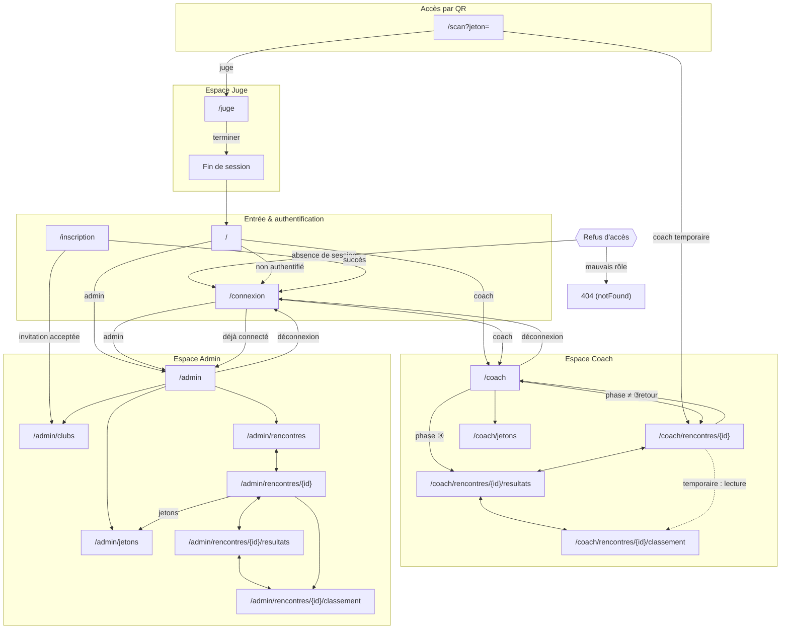

# Spec : Navigation & routing

- **Statut** : validée (2026-09-25)
- **Sources** :
  - **Décision produit du 2026-09-25** (arbitrages navigation) : entrée coach
    unique, vue classement admin dédiée, sortie de session juge, classement en
    lecture pour le coach temporaire, politique de garde hybride, garde admin
    unifiée. Tracée dans [`../navigation-enchainements.md`](../navigation-enchainements.md)
    (§2 cible, §3 analyse de cohérence, §4 plan d'action).
  - **Spec #01 — Rôles & autorisations** : périmètres admin/coach/juge, coach
    temporaire borné à une rencontre (R27/R28), *fail-closed* (R4/R5).
  - **Spec #02 — Authentification & sessions QR** : login par rôle, sessions QR
    anonymes (coach temporaire / juge), fenêtres d'ouverture.
  - **Spec #05 — Espace coach** : liste « Mes rencontres » (R6/R7), coach
    temporaire (R8bis).
  - **Spec #07 — Classement** : contenu et périmètre du classement.
  - **Spec #10 — Saisie vitesse juge** : écran juge en ③ compétition (R1).
- **Note de rédaction** : cette spec décrit le **quoi** des enchaînements de
  pages et de la politique de garde, transverse aux espaces. Elle **ne
  redéfinit pas** le contenu des écrans (spec de chaque domaine fait foi). Les
  règles ci-dessous impactent des specs validées (#02, #04, #05, #07) ; ces
  révisions sont listées en Phase 2 du plan d'action et suivent la **règle de
  changement** (validation explicite avant modification).

## Objectif

Garantir des enchaînements de pages **cohérents, prévisibles et sûrs** entre les
espaces (accueil, coach, juge, admin) : un point d'entrée unique par rôle, des
remontées explicites, une politique de refus d'accès uniforme, et aucun lien
menant à une impasse (404 non intentionnel).

## Vocabulaire

- **Garde de route** : contrôle d'accès exécuté au rendu d'une page, **première
  barrière UX** ; la **RLS reste la frontière ultime** (spec #01).
- **Refus par absence de session** : l'utilisateur n'est pas authentifié (ni
  compte, ni session QR active).
- **Refus par rôle** : l'utilisateur est authentifié mais n'a pas le périmètre
  requis pour la page.
- **Coach permanent / temporaire** : cf. spec #05. Le temporaire est borné à
  **une** rencontre (spec #01 R27/R28).

## Règles fonctionnelles

### Politique de garde d'accès

- **R1.** Toute page applicative protégée résout son accès via un **helper de
  garde de route** dédié à son espace : `exigerUtilisateur` (authentification
  seule), `getContexteCoach`, `getContexteJuge`, `exigerAdmin`. Aucune page ne
  duplique la logique de rôle en ligne.
- **R2.** Refus **par absence de session** → `redirect('/connexion')`. La page
  cible n'est jamais rendue.
- **R3.** Refus **par rôle** (authentifié mais périmètre insuffisant) →
  `notFound()` (404). L'existence de l'espace n'est pas révélée.
- **R4.** Un helper de garde admin unifié (`exigerAdmin`) applique R2 puis R3 :
  pas de session → `redirect('/connexion')` ; session sans rôle `admin` →
  `notFound()`. Il est utilisé par **toutes** les pages `/admin/**`.
- **R5.** Les pages d'un espace coach ou juge appliquent la même distinction :
  absence de contexte par défaut de session → `redirect('/connexion')` ; contexte
  présent mais hors périmètre → `notFound()`.

### Entrées & redirections

- **R6.** `/connexion` (succès) redirige selon le rôle : `admin` → `/admin`,
  `coach` → `/coach`, aucun rôle → `/`.
- **R7.** L'accueil `/` d'un utilisateur authentifié propose l'accès à **son
  espace** avec la **même destination que le login** (R6) : `admin` → `/admin`,
  `coach` → `/coach`. *(C1 : supprime la divergence `/coach/jetons`.)*
- **R8.** `/connexion` et `/inscription` ouverts par un utilisateur **déjà
  authentifié avec un rôle** redirigent vers son espace (R6) au lieu d'afficher le
  formulaire.
- **R9.** Le scan QR `/scan?jeton=` redirige selon la **nature** de la session :
  `coach_temporaire` → `/coach/rencontres/{rencontreId}` ; `juge` → `/juge`.

### Espace coach

- **R10.** `/coach` (« Mes rencontres ») est l'**entrée unique** du coach
  permanent ; « Mes jetons QR » (`/coach/jetons`) y est un lien interne, pas une
  destination d'entrée.
- **R11.** Le coach **temporaire** a une navigation **bornée à sa rencontre** :
  `Accueil`, `Ma rencontre`, et **le classement de sa rencontre en lecture**.
  *(C6.)*
- **R12.** Le coach temporaire accédant à une route `coach/rencontres/{id}/**`
  dont l'`id` ≠ sa rencontre → `notFound()` (anti-traversée d'`id`, déjà en place).
- **R13.** L'accès du coach temporaire au classement est en **lecture seule** :
  aucune action d'écriture n'y est exposée. Le périmètre reste sa seule
  rencontre.

### Espace admin

- **R14.** Il existe une **vue classement admin dédiée**
  `/admin/rencontres/{id}/classement`, accessible via `exigerAdmin` (R4),
  périmètre **tous clubs**. *(C2.)*
- **R15.** Les liens « voir le classement » des écrans admin
  (`/admin/rencontres/{id}` et `…/resultats`) pointent vers la vue admin (R14),
  **jamais** vers l'espace coach. *(Corrige B1 : le lien actuel vers
  `/coach/rencontres/{id}/classement` produit un 404 pour l'admin.)*
- **R16.** Le tableau de bord `/admin` expose un accès à la **liste des
  rencontres** `/admin/rencontres` de façon visible et cohérente avec les autres
  accès rapides. *(C4.)*

### Espace juge

- **R17.** L'écran juge `/juge` expose une action explicite de **fin de session**
  (« Terminer / Quitter ») menant à un écran de fin ou à `/`. *(C5.)*
- **R18.** L'entrée dans l'espace juge reste **exclusivement par QR** (R9) : aucun
  lien de navigation permanent n'y mène.

### Remontées

- **R19.** Chaque écran « profond » (classement coach et admin, liste des jetons
  admin, écrans de résultats) expose un **retour explicite** (fil d'Ariane ou
  lien « ← ») vers son écran parent. Aucun écran ne dépend du seul bouton
  « précédent » du navigateur. *(C3.)*

### Déconnexion (comptes permanents)

- **R20.** La déconnexion est accessible depuis **chaque écran** des espaces
  **admin** et **coach permanent** (via la coquille de navigation), sans repasser
  par l'accueil `/`. *(C7.)*
- **R21.** La déconnexion ferme la session Supabase (`seDeconnecter`) puis
  redirige vers `/connexion`.
- **R22.** Le coach **temporaire** et le **juge** sont des **sessions QR
  anonymes** : ils ne relèvent pas de la déconnexion de compte (R20) mais de la
  **fin de session** (R17 pour le juge ; retour `Accueil` pour le coach
  temporaire). Aucune action « Se déconnecter » ne leur est présentée.

### Bandeau de navigation

- **R23.** Le bandeau supérieur est un **composant commun** (coquille) dont les
  liens proviennent d'un **jeu centralisé par rôle** — `liensAdmin` pour
  l'espace admin, `liensCoach` pour l'espace coach. Le bandeau est **identique
  sur toutes les pages d'un même espace** : aucune page ne définit sa propre
  liste de liens. Le bandeau admin donne accès à toutes les sections admin ;
  celui du coach dépend du type (permanent / temporaire, cf. R10/R11).

## Scénarios

### Nominal — entrée par rôle

- Étant donné un coach permanent authentifié, quand il ouvre `/`, alors le lien
  d'accès à son espace mène à `/coach` (R7), identique au login (R6).
- Étant donné un admin sur `/admin/rencontres/{id}/resultats`, quand il clique
  « voir le classement », alors il arrive sur `/admin/rencontres/{id}/classement`
  (R14/R15) et **non** sur un 404.

### Nominal — session QR

- Étant donné un juge scannant un QR valide en ③, quand la session s'ouvre, alors
  il est redirigé vers `/juge` (R9) ; quand il choisit « Terminer », alors il
  quitte vers l'écran de fin / `/` (R17).
- Étant donné un coach temporaire, quand il ouvre le classement de sa rencontre,
  alors il le voit en lecture seule (R11/R13).

### Cas limites / erreurs

- Utilisateur **non authentifié** ouvrant `/admin`, `/coach` ou une route
  profonde → `redirect('/connexion')` (R2/R4/R5).
- Utilisateur **coach** ouvrant `/admin/**` → `notFound()` (R3/R4).
- Coach temporaire ouvrant `/coach/rencontres/{autre-id}/classement` →
  `notFound()` (R12).
- Utilisateur déjà connecté ouvrant `/connexion` → redirigé vers son espace (R8).

## Diagramme cible

## Contraintes de données

- Aucune nouvelle table. La vue classement admin (R14) réutilise le loader de
  classement existant (spec #07) avec un **périmètre tous clubs** ouvert par la
  RLS admin ; aucune donnée nouvelle n'est exposée au-delà de ce que l'admin peut
  déjà lire.
- Le classement en lecture du coach temporaire (R11/R13) reste borné par la RLS à
  sa rencontre ; la garde de route ne fait que refléter cette frontière.
- Les gardes de route (R1–R5) ne remplacent pas la RLS : elles améliorent l'UX et
  masquent l'existence des espaces, la RLS reste la frontière ultime.

## Hors périmètre

- **Espace public** (spec #08) et son routing : non couvert ici.
- **Contenu** des écrans (colonnes du classement, champs de saisie, realtime) :
  spec de chaque domaine (#06, #07, #10, #11).
- **Cycle de vie des jetons QR** et fenêtres d'ouverture : spec #02.
- Refonte visuelle / design system.
