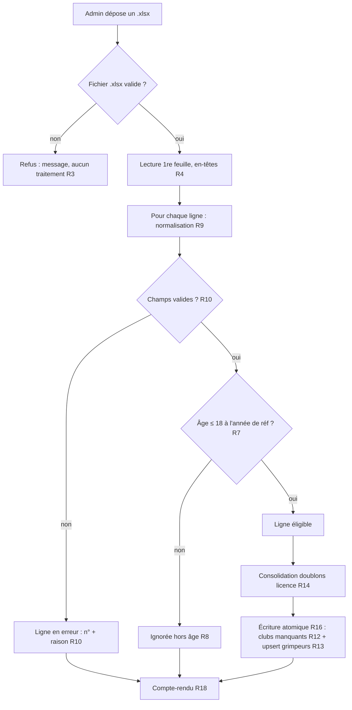

# Spec : Import des licenciés (admin)

- **Statut** : validée (2026-09-25)
- **Sources** :
  - Décision produit du **2026-09-25** (cette itération) : mécanisme d'import de
    grimpeurs à partir d'un export de licenciés. Premier périmètre : licenciés
    **FFME** (la FFCAM viendra plus tard, même table `grimpeur`, sans typage de
    fédération).
  - Spec **#3 — Écrans de paramétrage** (`03-ecrans-de-parametrage-admin.md`)
    R20–R26 (écran Grimpeurs, volet admin ; licence obligatoire et unique R21b) :
    reste la vérité pour le **modèle grimpeur** et l'écran de gestion unitaire.
  - Spec **#1 — Rôles & autorisations** (`01-roles-et-autorisations.md`) R11–R13
    (écriture réservée à l'admin), R37 (calcul de la saison), R34 (âge rapporté à
    la saison).
  - Modèle socle (migration `202607221100`), colonnes `grimpeur.sexe`
    (`202609181000`, valeurs `F`/`H` depuis `202609250900`) et `grimpeur.licence`
    (`202609251000`).
  - Format du fichier : export **FFME** des licenciés (référence de structure :
    `docs/reglement/Licenciés 2027.xlsx`, **non versionné** — vraies données).

## Objectif

Permettre à l'admin de **peupler et rafraîchir le roster** de grimpeurs en
**important un fichier `.xlsx`** exporté depuis la base des licenciés FFME, plutôt
que de saisir chaque grimpeur un par un (spec #3 R21–R24). L'import :

- ne retient que les grimpeurs **concernés par la compétition** (filtre d'âge) ;
- **rattache** chaque grimpeur à son **club** (création du club si nécessaire) ;
- est **rejouable** sans créer de doublons (mise à jour sur la licence) ;
- rend un **compte-rendu** clair de ce qui a été créé, mis à jour, ignoré ou
  rejeté.

## Vocabulaire

- **Fichier d'import** : classeur `.xlsx` exporté de la base des licenciés FFME,
  déposé par l'admin. Sa première feuille contient les licenciés.
- **Ligne de licencié** : une ligne de données du fichier (une par licencié),
  hors ligne d'en-têtes.
- **Structure** : nom du club tel qu'il figure dans l'export FFME (colonne « Nom
  de la structure »). Correspond à un **club** de l'application (table
  `interclub.club`).
- **Année de référence** : année servant au **filtre d'âge**. Par défaut, l'année
  de **fin** de la saison courante (cf. R6) ; modifiable par l'admin avant import.
- **Grimpeur éligible (à l'import)** : licencié dont l'âge à l'année de référence
  est **≤ 18 ans** (cf. R7). À ne pas confondre avec l'éligibilité par
  **catégorie** d'une rencontre (spec #1 R34), qui est un autre calcul.
- **Compte-rendu d'import** : synthèse retournée après traitement (créés, mis à
  jour, ignorés hors âge, lignes en erreur, clubs créés).

## Règles fonctionnelles

### Accès & garde (comme tout écran de paramétrage)

- **R1.** L'écran d'import et son action sont **réservés à l'admin**. Un rôle
  non-admin reçoit un **404** (écran masqué) et tout appel direct de l'action est
  **refusé** côté serveur, sans écriture. La **RLS** `grimpeur_*` / `club_*`
  reste la frontière ultime. (Source : spec #1 R11–R13 ; spec #3 R1–R2.)
- **R2.** L'import est accessible depuis l'écran **Grimpeurs** (`/admin/grimpeurs`)
  et/ou l'accueil admin (spec #3 R7). L'URL de l'écran est `/admin/grimpeurs/import`.

### Fichier & dépôt

- **R3.** L'admin **dépose un unique fichier `.xlsx`**. Un fichier d'un autre type
  (ex. `.csv`, `.xls`, `.pdf`) ou l'absence de fichier est **refusé** avec un
  message explicite, sans traitement.
- **R4.** Les données sont lues sur la **première feuille** du classeur. La
  **ligne d'en-têtes** attendue porte, dans cet ordre, les colonnes : **Nom**,
  **Prénom**, **Date de naissance**, **Sexe**, **N° de licence**, **Nom de la
  structure**. Les colonnes sont repérées par leur **position** (A→F) ; les
  colonnes supplémentaires à droite sont ignorées.
- **R5.** Si la feuille ne comporte **aucune ligne de données** exploitable
  (fichier vide sous les en-têtes), l'import n'écrit rien et le compte-rendu
  indique **0 ligne traitée**.

### Année de référence & filtre d'âge

- **R6.** L'année de référence par défaut est l'**année de fin de la saison
  courante** : `anneeSaison(date du jour) + 1` (spec #1 R37 — la saison courante
  est identifiée par son année de **début**, l'année de référence est l'année
  **suivante**). Exemple : le 2026-09-25, saison courante = 2026 (2026–2027) →
  **année de référence = 2027**. L'admin peut **remplacer** cette valeur par une
  autre année à 4 chiffres avant de lancer l'import.
- **R7.** Seuls sont importés les licenciés **âgés de 18 ans au plus** à l'année
  de référence, soit **`année de naissance ≥ année de référence − 18`**. Exemple
  (référence 2027) : seuil = **2009** ; un licencié né en 2009 (18 ans en 2027)
  est importé, un né en 2008 (19 ans) est **ignoré**. Ce filtre est **propre à
  l'import** et distinct de l'âge de compétition (spec #1 R34), qui rapporte l'âge
  à l'année de **début** de saison.
- **R8.** Une ligne **ignorée pour cause d'âge** (né avant le seuil) n'est **pas
  une erreur** : elle est comptée séparément dans le compte-rendu (R18), sans
  message d'erreur.

### Lecture & normalisation d'une ligne

- **R9.** Pour chaque ligne de licencié, l'import lit et **normalise** :
  - **Nom**, **Prénom** : texte obligatoire, ≤ 100 caractères, normalisé (espaces
    de bord retirés, espaces internes réduits à un seul) — mêmes règles que spec
    #3 R22 / R4.
  - **Date de naissance** : format **`JJ/MM/AAAA`** ; seule l'**année** (4
    chiffres) est conservée en base (`grimpeur.annee_naissance`), bornée à
    `[1900, 2100]` (spec #3 R23).
  - **Sexe** : la valeur **« Homme »** est convertie en **`H`**, **« Femme »** en
    **`F`** (insensible à la casse et aux espaces). Toute autre valeur est
    **invalide**.
  - **N° de licence** : **entier strictement positif** (spec #3 R21b).
  - **Nom de la structure** : texte obligatoire, ≤ 100 caractères, normalisé
    (mêmes règles de normalisation que le nom de club, spec #3 R8/R4).
- **R10.** Une ligne dont **au moins un champ obligatoire est absent ou invalide**
  (nom/prénom vide ou trop long, date non `JJ/MM/AAAA` ou année hors bornes, sexe
  non reconnu, licence non entière ou ≤ 0, structure vide ou trop longue) est
  **rejetée** : elle n'est pas importée et figure dans les **erreurs** du
  compte-rendu (R18) avec son **numéro de ligne** et la **raison**. Les autres
  lignes ne sont pas bloquées (R17).

### Rattachement au club

- **R11.** Chaque grimpeur importé est rattaché au **club dont le nom
  (normalisé) est exactement** celui de sa structure (comparaison **exacte** sur
  le libellé normalisé, R9). Un club existant est **réutilisé**.
- **R12.** Si **aucun club** ne porte ce nom, le club est **créé automatiquement**
  pendant l'import (nom = structure normalisée, ≤ 100 caractères — contrainte
  `club.nom` unique, spec #3 R8). Chaque club ainsi créé est listé dans le
  compte-rendu (R18).

### Doublons & mise à jour (rejouabilité)

- **R13.** L'identité d'un grimpeur pour l'import est son **numéro de licence**
  (unique, spec #3 R21b). Si un grimpeur portant cette licence **existe déjà**, il
  est **mis à jour** : `nom`, `prénom`, `sexe`, `année de naissance` et
  **`club`** de rattachement prennent les valeurs du fichier. Sinon, il est
  **créé**.
- **R14.** Si une **même licence** apparaît **plusieurs fois** dans le fichier
  (après filtre d'âge), la **dernière occurrence** valide prévaut ; les occurrences
  précédentes sont **consolidées** (une seule écriture par licence) et le fait est
  signalé dans le compte-rendu (R18).

### Transaction & compte-rendu

- **R15.** Le traitement se déroule en **deux temps** : (1) **analyse** de toutes
  les lignes (parsing, normalisation, filtre d'âge, détection des erreurs et des
  doublons internes) — **fonction pure**, sans accès base ; (2) **écriture** des
  seules lignes **valides et éligibles** (création des clubs manquants puis upsert
  des grimpeurs).
- **R16.** L'**écriture** (R15.2) est **atomique** : soit toutes les lignes
  valides sont écrites, soit — en cas d'erreur base (ex. violation de contrainte)
  — **aucune** ne l'est (rollback), et le compte-rendu signale l'**échec** sans
  écriture partielle.
- **R17.** Les lignes **en erreur** (R10) et les lignes **ignorées pour âge** (R8)
  n'empêchent **pas** l'import des lignes valides : l'import est **partiel** et le
  compte-rendu détaille chaque catégorie.
- **R18.** Après traitement, l'écran affiche un **compte-rendu** indiquant au
  moins : le **nombre de grimpeurs créés**, **mis à jour**, **ignorés (hors
  tranche d'âge)**, le **nombre de lignes en erreur** (avec, pour chacune, son
  **numéro de ligne** dans le fichier et la **raison**), la liste des **clubs
  créés**, et l'**année de référence** utilisée. Après un import réussi, les
  écrans qui listent les grimpeurs (spec #3 R26) reflètent l'état à jour.

## Déroulé (vue d'ensemble)

## Scénarios

### Nominal — premier import

Étant donné un admin connecté et une base sans grimpeurs, quand il dépose l'export
FFME et lance l'import avec l'année de référence par défaut (2027), alors seuls
les licenciés nés en **2009 ou après** sont créés (R7), chaque club absent est
créé (R12), et le compte-rendu affiche le nombre de créés, d'ignorés (hors âge) et
la liste des clubs créés (R18).

### Nominal — ré-import (mise à jour)

Étant donné un roster déjà importé, quand l'admin ré-importe un fichier où
certains licenciés ont changé de club ou d'orthographe, alors ces grimpeurs sont
**mis à jour** (même licence, R13) sans doublon, et le compte-rendu distingue
créés et mis à jour (R18).

### Nominal — remplacement de l'année de référence

Étant donné l'admin qui veut préparer la saison suivante, quand il saisit `2028`
comme année de référence puis importe, alors le seuil devient **2010** (R7) et le
filtre d'âge s'applique en conséquence.

### Cas limites / erreurs

- Fichier non `.xlsx` ou absent → refus, aucun traitement (R3).
- Feuille sans ligne de données → 0 ligne traitée (R5).
- Ligne avec sexe non reconnu, date mal formée, licence ≤ 0, nom/prénom/structure
  vide → ligne en erreur avec n° + raison ; les autres lignes passent (R10, R17).
- Licencié né avant le seuil d'âge → ignoré, non compté en erreur (R8).
- Structure inconnue en base → club créé automatiquement (R12).
- Licence déjà présente en base → mise à jour (R13).
- Même licence en double dans le fichier → une seule écriture, dernière occurrence
  gagnante, signalée (R14).
- Erreur base pendant l'écriture (ex. contrainte) → rollback total, aucun grimpeur
  écrit, échec signalé (R16).

## Contraintes de données

- Aucune **nouvelle table** ni colonne : l'import écrit dans `interclub.club`
  (création R12) et `interclub.grimpeur` (upsert R13), via les colonnes existantes
  `nom`, `prenom`, `annee_naissance`, `sexe` (`F`/`H`), `licence`, `club_id`.
- **Unicité** exploitée : `club.nom` (rattachement/création R11–R12) et
  `grimpeur.licence` (upsert R13). Ces contraintes existent déjà (migrations
  `202607221100`, `202609251000`).
- **Bornes de saisie** identiques à la saisie unitaire (spec #3) : `nom`/`prenom`
  ≤ 100 ; `annee_naissance` ∈ [1900, 2100] ; `licence` entier > 0 ; `sexe` ∈
  {`F`, `H`} ; `club.nom` ≤ 100.
- **RLS** : aucune nouvelle policy. L'écriture des `grimpeur` et `club` par l'admin
  est déjà couverte (`grimpeur_*`, `club_*`, migration `202607251000`). L'écran
  applique en plus la garde applicative (R1).
- **Logique métier pure** (testable hors Supabase) : parsing + normalisation d'une
  ligne, conversion du sexe, extraction de l'année depuis `JJ/MM/AAAA`, filtre
  d'âge (R7), consolidation des doublons internes (R14) et construction du plan
  d'import (créations de clubs, upserts, erreurs, ignorés). L'écriture Supabase
  (R16) et la lecture du binaire `.xlsx` en lignes sont les seuls adaptateurs
  non purs.

## Hors périmètre

- Import des licenciés **FFCAM** (même table `grimpeur`, sans typage de
  fédération) — itération ultérieure ; la présente spec vise l'export **FFME**.
- **Suppression / désactivation** des grimpeurs absents du fichier (un licencié
  retiré de l'export n'est **pas** supprimé par l'import).
- **Fusion / rapprochement** de grimpeurs sans licence ou sur des critères autres
  que la licence (nom + date de naissance, etc.).
- Détermination de la **catégorie** (matin/après-midi) d'un grimpeur (spec #1 R34).
- Historisation ou journal des imports au-delà du compte-rendu affiché.
- Mapping manuel structure → club (choix d'un club cible différent du nom de la
  structure) : le rattachement est automatique par nom (R11–R12).
