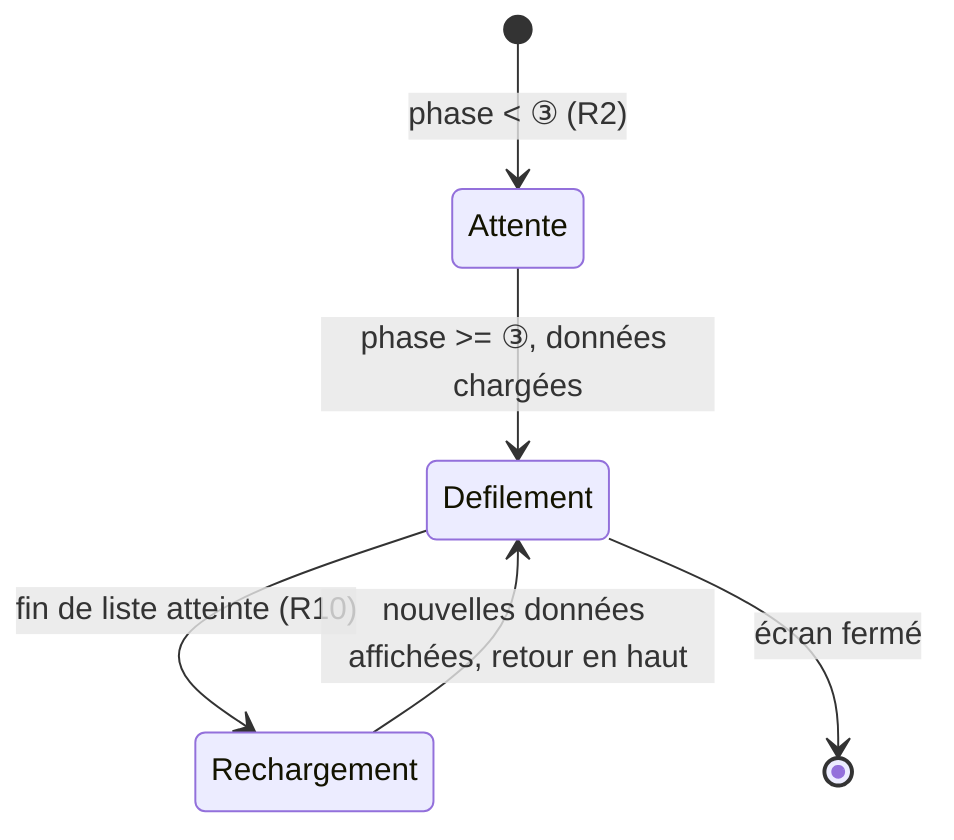

# Spec : Affichage écran secondaire — classement individuel en boucle (admin)

- **Statut** : validée (le 2026-09-28)
- **Sources** :
  - **Décision produit du 2026-09-28** : l'admin, pendant la compétition, veut
    brancher un **second écran** (TV/vidéoprojecteur) qui déroule en boucle le
    **classement individuel**, hommes et femmes **mélangés**, sans intervention
    manuelle.
  - **Spec #7 — Classement** (`07-classement.md`) : source du calcul (R1–R4,
    R15–R20) et du classement individuel **par sexe** (R8b, R12) — cette spec en
    réutilise le résultat **sans le recalculer**, elle **fusionne** l'affichage
    des deux classements Filles/Garçons déjà calculés.
  - **Spec #1 — Rôles** (`01-roles-et-autorisations.md`) R8 : classement
    consultable par un compte authentifié dès la ③, non officiel avant ⑤.
  - **Décisions de cadrage (2026-09-28)** : écran réservé à l'**admin
    authentifié** (pas d'accès anonyme) ; le mélange affiché **conserve les rangs
    déjà calculés par sexe** (pas de nouveau rang mixte recalculé) — la liste est
    triée par la **valeur du rang**, puis **nom**, puis **prénom** ; l'écran ne
    porte que le classement **individuel** (pas l'équipe) ; l'écran **ne s'abonne
    pas** au temps réel (spec #11 hors périmètre pour cet écran) — il **charge
    les données une fois** à l'affichage, défile, puis ne **relit** qu'à la
    **fin de la boucle** (R10). Plus simple qu'un abonnement live, et suffisant
    pour un écran qui se recharge de toute façon en continu.
- **Maquette** : à produire (`docs/maquettes/affichage-ecran-secondaire.html`),
  design « Nuit », **format grand écran** (l'usage mobile-first ne s'applique
  pas : c'est un écran de diffusion, pas un écran de consultation individuelle).
- **Note de rédaction** : cette spec **ne modifie aucune règle** des specs #7/#11
  (aucun recalcul, aucune nouvelle policy). Elle ajoute un **mode d'affichage**
  au-dessus des données déjà exposées à un compte authentifié.

## Objectif

Donner à l'admin, pendant une rencontre, un écran à **brancher tel quel** sur un
second afficheur pour le **public présent dans la salle** : le classement
individuel de la rencontre défile **seul**, en boucle continue, sans qu'il faille
cliquer, faire défiler ou recharger la page manuellement.

## Vocabulaire

- **Écran d'affichage** : la page dédiée à cet usage, distincte de l'écran de
  classement de consultation (spec #7 R12).
- **Classement mixte affiché** : liste **unique** obtenue en **fusionnant** les
  deux classements individuels Filles et Garçons (spec #7 R8b), **sans**
  recalculer de rang global — chaque ligne garde le **rang de son classement de
  sexe**.
- **Boucle** : cycle défilement → fin de liste → rechargement des données →
  reprise du défilement depuis le haut.
- **Défilement automatique** : translation verticale continue du contenu, sans
  action de l'utilisateur.

## Règles fonctionnelles

### Accès

- **R1.** L'écran d'affichage est accessible à la route
  `/admin/rencontres/[id]/affichage`, **réservée à l'admin authentifié** (même
  garde que les autres écrans admin : 404 sinon, spec #1 R11–R13). Aucun accès
  anonyme n'est créé (pas d'espace public, spec #1 R8).
- **R2.** L'écran est accessible dès que le classement l'est pour un compte
  authentifié, c'est-à-dire dès la **③ compétition** (spec #1 R8, spec #7 R11).
  Avant la ③, l'écran affiche un **état d'attente** (aucune liste à dérouler,
  aucun défilement).

### Contenu

- **R3.** L'écran présente le **classement individuel** de la rencontre
  (spec #7), **jamais** le classement par équipe ni par club.
- **R4.** Les grimpeurs Filles et Garçons sont présentés dans **une seule liste
  mélangée** (pas de séparation par sexe, ni de bascule).
- **R5.** L'ordre de la liste mélangée est : **rang croissant** (valeur du rang
  tel que calculé séparément par sexe, spec #7 R8b), puis, à **rang égal** entre
  les deux classements, **nom de famille** (ordre alphabétique français), puis
  **prénom** (ordre alphabétique français).
- **R6.** Chaque ligne affiche : le **rang**, le **nom**, le **prénom**, le
  **club d'origine**, le **score**, et une **indication du sexe** (étiquette
  **F** / **H**, alignée sur le champ `grimpeur.sexe`) — nécessaire pour lever
  l'ambiguïté d'un même numéro de rang partagé entre les deux classements (R5).
- **R7.** L'écran indique l'état **« officiel »** / **« non officiel »** de
  l'affichage, comme les autres écrans de classement (spec #7 R12, officiel à
  partir de la ⑤).
- **R8.** La liste affichée est **complète, sans pagination** (à la différence
  de l'écran de consultation, spec #7 R12b) : c'est le défilement (R9) qui
  permet de la parcourir en entier.

### Défilement et rechargement

- **R9.** Une fois affichée, la liste **défile automatiquement** de haut en bas,
  à **vitesse constante**, sans action requise de l'utilisateur.
- **R10.** Quand le défilement atteint la **fin de la liste**, l'écran
  **recharge les données** du classement (nouvelle lecture, R4/R5 réappliquées à
  l'ordre courant) puis **reprend le défilement depuis le début** de la liste
  mise à jour. Ce cycle se répète **indéfiniment** tant que l'écran reste ouvert.
- **R11.** L'écran **ne s'abonne à aucun canal temps réel** (spec #11 hors
  périmètre pour cet écran, cf. décision de cadrage) : entre deux boucles, le
  défilement se déroule sur les **données chargées au dernier rechargement**
  (chargement initial ou fin de boucle précédente, R10), **sans** rafraîchissement
  déclenché par une écriture externe survenant en cours de défilement. Une
  écriture (résultat saisi ailleurs) n'apparaît qu'à la **prochaine fin de
  boucle** (R10).
- **R12.** Aucune interaction utilisateur n'est requise ni attendue sur cet
  écran une fois lancé (pas de recherche, pas de filtre, pas de pagination
  manuelle — à la différence de spec #7 R12b) : c'est un écran de **diffusion**,
  pas de **consultation**.

## Diagramme — cycle de l'écran

## Scénarios

### Nominal — défilement en boucle

Étant donné une rencontre en **③ compétition** avec des résultats saisis, quand
l'admin ouvre `/admin/rencontres/[id]/affichage` sur le second écran, alors la
liste mixte (R4/R5) défile automatiquement (R9) ; en atteignant la fin, elle
recharge les données et reprend en haut (R10) — sans aucune action de l'admin.

### Nominal — un résultat est saisi pendant le défilement

Étant donné l'écran d'affichage ouvert et en cours de défilement, quand un coach
ou un juge saisit un résultat ailleurs, alors l'écran **continue de dérouler**
les données déjà chargées (R11) — le nouveau résultat n'apparaîtra qu'à la
**prochaine fin de boucle**, quand l'écran recharge (R10).

### Cas limites / erreurs

- Rencontre en **① / ②** (avant ③) → état d'attente, aucun défilement (R2).
- Aucun grimpeur classé (aucun résultat saisi) → liste vide, l'écran l'indique
  sans tenter de défiler.
- Deux grimpeurs de sexes différents partageant la **même valeur de rang** →
  départagés par nom puis prénom (R5), tous deux visibles avec leur étiquette de
  sexe (R6).
- Non-admin (ou session expirée) accédant à la route → 404 (R1).

## Contraintes de données

- **Aucune migration.** Aucune nouvelle table ni colonne : l'écran **réutilise**
  le classement individuel déjà calculé (spec #7, `filles` + `garcons`) et se
  contente de le **fusionner et trier pour l'affichage** (R5) — logique pure,
  testable sans Supabase.
- **Aucune nouvelle policy RLS**, aucun accès anonyme : la route est protégée
  par la même garde admin que les autres écrans `/admin` (spec #1).
- **Aucun abonnement temps réel** (R11) : le rechargement des données se fait
  uniquement à la **fin de la boucle de défilement** (R10), par une relecture
  classique du loader — pas de canal Supabase Realtime ouvert sur cet écran.

## Hors périmètre

- **Accès public/anonyme** à cet écran (spectateur sans compte) — nécessiterait
  l'approche Broadcast serveur différée par la spec #11 ; non traité ici.
- **Classement par équipe ou par club** sur cet écran (R3) — reste sur l'écran
  de consultation existant (spec #7).
- **Paramétrage de la vitesse de défilement** ou de l'apparence par l'admin
  (thème unique, vitesse fixe) — évolution possible ultérieure si demandée.
- **Pause / reprise manuelle du défilement**, contrôle depuis un autre appareil
  — hors périmètre (R12).
- **Affichage combiné avec le classement par équipe** en alternance — hors
  périmètre (cadré en amont, cf. décisions de cadrage).
