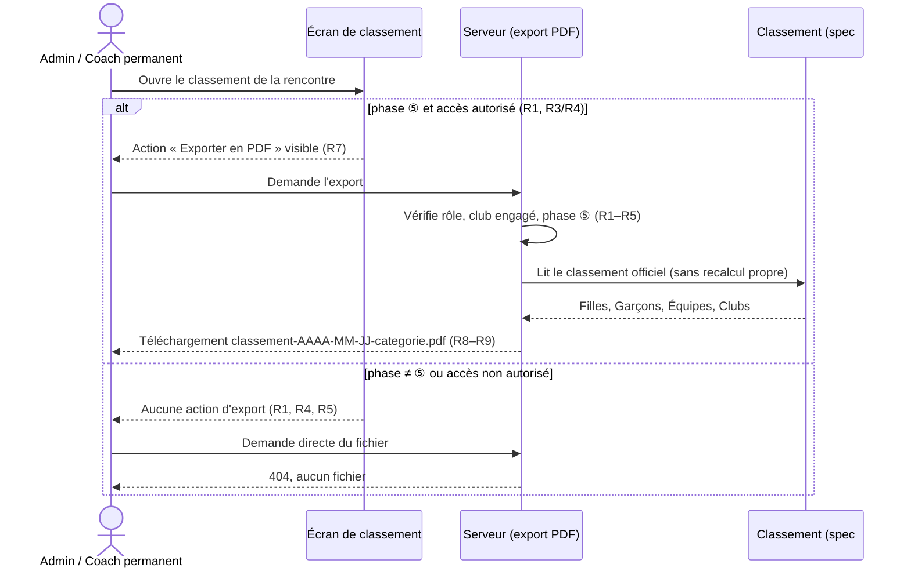

# Spec : Export PDF des classements officiels d'une rencontre

- **Statut** : validée (le 2026-09-29)
- **Sources** :
  - **Décision produit du 2026-09-29** : lorsqu'une rencontre est terminée et
    que ses résultats sont **officiels**, une fonction d'**export** produit un
    **fichier PDF** reprenant les classements **individuel**, **par équipe** et
    **par club** de la rencontre. Fonction accessible aux **coachs** et aux
    **admins**.
  - **Règlement** « CT33 FFME — 2025-2026 » §8 (« Classements ») : « un
    classement individuel et d'équipes de clubs est établi et **communiqué** » —
    le PDF est le support de cette communication.
  - **Spec #7 — Classement** (`07-classement.md`) : source **unique** du calcul
    (R1–R8b, R15–R20), des rangs/ex æquo (R8), de l'ordre d'affichage (R9) et de
    l'état officiel (R10). Cette spec **réutilise** le classement calculé **sans
    le recalculer**.
  - **Spec #1 — Rôles** (`01-roles-et-autorisations.md`) R5/R8 : la phase **⑤
    résultats publics** rend les résultats **définitifs / figés** ; R9 : les
    sessions QR (coach temporaire, juge) sont **invalides dès la ④**.
  - **Décisions de cadrage (2026-09-29)** :
    - un **vrai fichier PDF** est **généré côté serveur** et **téléchargé**
      directement (pas d'impression navigateur) — écart **justifié** au principe
      « pas d'API custom » (conventions) : Supabase ne produit pas de PDF ;
    - le **coach** n'exporte que les rencontres où **son club est engagé** ; le
      PDF contient néanmoins le classement **complet, tous clubs** ;
    - lignes individuelles au **même niveau de détail que l'écran** (rang,
      grimpeur, club, score) — **sans** décomposition voie/bloc/vitesse ;
    - **un seul fichier**, toutes sections incluses (pas de choix de sections).
- **Maquette** : [`docs/maquettes/export-pdf-classements.html`](../maquettes/export-pdf-classements.html) —
  bouton d'export sur les écrans de classement + **rendu des pages du PDF**
  (A4 portrait).
- **Note de rédaction** : cette spec **ne modifie aucune règle de calcul** de la
  spec #7. Elle ajoute un **format de sortie** du classement officiel. Elle
  retire l'« export (PDF) » de la section *Hors périmètre* de la spec #7 (mise à
  jour de note, cf. *Impacts sur les specs existantes*).

## Objectif

Permettre aux coachs et à l'admin de **conserver et diffuser** le résultat
officiel d'une rencontre (affichage au club, envoi au comité, archives) sous la
forme d'un **document PDF unique, fidèle au classement officiel**, sans recopie
manuelle ni capture d'écran.

## Vocabulaire

- **Rencontre officielle** : rencontre en phase **⑤ résultats publics** (spec #1
  R5/R8) — ses classements sont **officiels / figés** (spec #7 R10).
- **Export PDF** : action qui produit et **télécharge** le fichier PDF des
  classements d'une rencontre officielle.
- **Document d'export** : le fichier PDF produit.
- **Section** : partie du document consacrée à un classement — *Individuel
  Filles*, *Individuel Garçons*, *Équipes*, *Clubs*.
- **Club engagé** : club ayant **au moins une équipe** dans la rencontre
  (spec #5).

## Règles fonctionnelles

### Disponibilité

- **R1.** L'export PDF n'est disponible **que** pour une rencontre en phase **⑤
  résultats publics**. Pour une rencontre en ①, ②, ③ ou ④, aucune action
  d'export n'est affichée et toute demande directe du fichier est **refusée**
  (réponse 404, aucun fichier produit).
- **R2.** Si une rencontre **quitte** la ⑤ (retour en ④ par l'admin, spec #1),
  l'export redevient **indisponible** (R1) jusqu'à un nouveau passage en ⑤.

### Accès

- **R3.** L'**admin** authentifié peut exporter **toute** rencontre officielle
  (R1).
- **R4.** Le **coach permanent** authentifié peut exporter une rencontre
  officielle **si et seulement si son club y est engagé** (au moins une équipe du
  club dans la rencontre). Sinon : aucune action d'export affichée, demande
  directe refusée (404).
- **R5.** Le **coach temporaire** et le **juge** n'ont **pas** accès à l'export
  (404) ; le **visiteur non authentifié** est redirigé vers `/connexion` (spec #12
  R2, rév. 2026-10-02). *(Pour le coach temporaire
  et le juge, c'est aussi la conséquence de spec #1 R9 : leur session est
  invalide dès la ④, donc a fortiori en ⑤.)*
- **R6.** Le document d'export est **identique** quel que soit l'utilisateur
  autorisé qui le produit (admin ou coach de n'importe quel club engagé) :
  **aucune mise en évidence** d'un club, **aucun filtre** appliqué — c'est un
  document officiel neutre.

### Point d'accès

- **R7.** Une action **« Exporter en PDF »** est proposée sur l'**écran de
  classement** de la rencontre — vue admin `/admin/rencontres/{id}/classement`
  (spec #12 R14) et vue coach `/coach/rencontres/{id}/classement` — **dès que**
  R1 et R3/R4 sont satisfaites, et **seulement** alors.
- **R8.** L'action déclenche le **téléchargement direct** d'un fichier `.pdf`
  (pas d'ouverture d'une page intermédiaire ni de boîte d'impression). Le
  fichier est servi par `/admin/rencontres/{id}/classement/pdf` (admin) et
  `/coach/rencontres/{id}/classement/pdf` (coach).
- **R9.** Le fichier téléchargé est nommé
  `classement-<AAAA-MM-JJ>-<categorie>.pdf`, où `<AAAA-MM-JJ>` est la **date de
  la rencontre** et `<categorie>` vaut `enfant` ou `ado` (ex.
  `classement-2026-10-12-ado.pdf`).

### Contenu du document

- **R10.** Le document s'ouvre sur un **en-tête** comportant : le titre
  **« Classement officiel »**, la **date** de la rencontre (format français, ex.
  « 12 octobre 2026 »), la **catégorie** (libellé court), le **club porteur** de
  la rencontre, et la **date et l'heure de génération** du document (fuseau
  Europe/Paris).
- **R11.** Le document contient **quatre sections**, dans cet ordre :
  **Individuel Filles**, **Individuel Garçons**, **Équipes**, **Clubs**
  (individuel séparé par sexe, équipe et club mixtes — spec #7 R8b).
- **R12.** Chaque section **commence sur une nouvelle page** et porte un **titre**
  (nom de la section) et le **nombre de lignes** qu'elle contient.
- **R13.** Les lignes de chaque section reprennent **exactement** le classement
  officiel calculé par la spec #7 : **mêmes rangs** (ex æquo standard, R8),
  **même ordre** (R9), **mêmes scores**. Aucun recalcul, aucun arrondi
  supplémentaire.
- **R14.** Chaque section liste **toutes** les lignes du classement concerné —
  **sans pagination applicative, sans filtre ni recherche** (à la différence de
  l'écran, spec #7 R12b).
- **R15.** Colonnes par section :
  - **Individuel** (Filles, Garçons) : **Rang**, **Nom Prénom**, **Club
    d'origine** (spec #7 R7 pour un grimpeur prêté), **Score** ;
  - **Équipes** : **Rang**, **Équipe**, **Club**, **Score** ;
  - **Clubs** : **Rang**, **Club**, **Score**.
- **R16.** Une section **sans aucune ligne** (ex. aucune fille engagée) est
  **présente** avec son titre et la mention **« Aucun classement »** (elle n'est
  pas omise).

### Mise en page

- **R17.** Le document est au format **A4 portrait**.
- **R18.** Quand une section dépasse une page, le tableau **continue** sur la page
  suivante et l'**en-tête de colonnes est répété** en haut de chaque page de la
  section.
- **R19.** Chaque page porte un **pied de page** indiquant la rencontre (date +
  catégorie) et la **pagination** « Page *n* / *N* » (*N* = nombre total de pages
  du document).
- **R20.** Le texte du document est **sélectionnable** (pas une image) et les
  **caractères du français** (accents, cédille, apostrophes, traits d'union dans
  les noms) sont **rendus à l'identique** des données saisies.

## Diagramme — parcours d'export

## Scénarios

### Nominal — export par l'admin

Étant donné une rencontre **ado** du 12/10/2026 en **⑤**, quand l'admin ouvre
`/admin/rencontres/{id}/classement` et clique « Exporter en PDF », alors le
navigateur télécharge `classement-2026-10-12-ado.pdf` contenant l'en-tête (R10),
puis les sections Individuel Filles, Individuel Garçons, Équipes, Clubs, chacune
sur une nouvelle page (R11/R12), aux rangs et scores identiques à l'écran (R13).

### Nominal — export par un coach de club engagé

Étant donné un coach permanent du club A, engagé dans une rencontre en ⑤, quand
il clique « Exporter en PDF » depuis son écran de classement, alors il obtient le
**même** document que l'admin (R6) : classement complet tous clubs, sans mise en
évidence du club A.

### Nominal — section longue

Étant donné une rencontre avec 55 garçons classés, quand le PDF est produit, alors
la section Individuel Garçons s'étend sur plusieurs pages, l'en-tête de colonnes
est répété sur chacune (R18) et le pied de page affiche « Page *n* / *N* » (R19).

### Cas limites / erreurs

- Rencontre en **④ clôture** (non officielle) → pas d'action d'export ; URL
  d'export appelée directement → 404 (R1).
- Rencontre repassée de ⑤ à ④ → export de nouveau indisponible (R2).
- Coach permanent d'un club **non engagé** → pas d'action, 404 en accès direct
  (R4).
- Coach temporaire / juge → 404 ; visiteur non connecté → `/connexion` (R5).
- Aucune fille engagée → section « Individuel Filles » présente avec « Aucun
  classement » (R16).
- Ex æquo → rang partagé et saut de rang, identiques à l'écran (R13, spec #7 R8).
- Grimpeur prêté → apparaît à l'individuel sous son **club d'origine**, et son
  score compte pour son **équipe/club d'accueil** (R15, spec #7 R7).
- Nom avec accent ou apostrophe (ex. « Léa D'Aubigné ») → rendu à l'identique
  (R20).

## Contraintes de données

- **Aucune migration**, aucune nouvelle table ni colonne : le document est
  produit **à la demande** à partir du classement calculé par la spec #7 (loader
  existant) ; **rien n'est stocké** (pas d'historique des exports).
- **Aucune nouvelle policy RLS** : la lecture cross-club du classement utilise
  déjà le client `service_role` côté serveur (spec #7, ADR 0002/0003). Les
  contrôles **rôle / club engagé / phase ⑤** (R1–R5) sont faits **côté serveur**,
  dans le point d'accès de l'export, **avant** toute lecture — le point d'accès
  est joignable directement (URL), l'absence de bouton ne protège pas.
- **Point d'accès serveur dédié** (production d'un flux binaire PDF) : seul écart
  au principe « Supabase-first, pas d'API custom », justifié par l'absence de
  génération PDF côté Supabase.
- **Logique pure testable** (Vitest, `src/domaine/`) : nom du fichier (R9),
  éligibilité à l'export (R1–R5, à partir de la phase, du rôle et des clubs
  engagés), et **modèle du document** (en-tête, ordre des sections, colonnes,
  mention « Aucun classement » — R10–R16) indépendamment de la bibliothèque de
  rendu. Le **rendu PDF** (mise en page, pagination, polices — R17–R20) est
  vérifié par **cahier de test**.
- **Volumétrie** : ≈ 100 grimpeurs, ≈ 15 équipes, ≈ 8 clubs par rencontre ⇒
  quelques pages ; génération à la demande, sans cache.

## Impacts sur les specs existantes (à valider)

- **Spec #7 — Classement**, *Hors périmètre* : la ligne « Stockage /
  historisation des classements et **export** (PDF, communication CT33) → hors
  périmètre » devient « **Export PDF** → spec #15 ; stockage / historisation →
  hors périmètre ». Aucune règle `Rn` modifiée.
- **Spec #12 — Navigation**, carte des routes : ajout de l'action d'export sur
  les écrans de classement admin et coach (R7). Aucune règle `Rn` modifiée.

## Hors périmètre

- **Décomposition** voie / bloc / vitesse par grimpeur dans le PDF (spec #7 R13)
  — non retenu (décision de cadrage).
- **Choix des sections** à exporter, ou export d'un seul classement.
- **Export avant officialisation** (③/④, classement provisoire).
- **Autres formats** (CSV, Excel) et **envoi automatique** (e-mail au comité).
- **Accès public/anonyme** à l'export : sans objet (pas d'espace public, spec #1
  R8).
- **Classement cumulé de la saison** (fonctionnalité distincte, cf. spec #7).
- **Historisation** des documents produits (aucun stockage).
- **Personnalisation** du document (logo, couleurs du comité, mentions libres).
