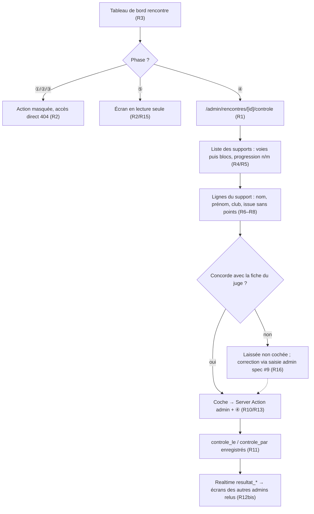

# Spec : Contrôle des résultats contre les fiches papier des juges (admin)

- **Statut** : validée (le 2026-10-02) — décisions tranchées : lecture seule en
  ⑤, pas de coche groupée, temps réel sur les coches (voir « Décisions
  tranchées »)
- **Sources** :
  - **Décision produit du 2026-10-02** : après la compétition, l'**admin**
    rapproche les résultats **saisis dans l'application** des **fiches papier**
    remplies par les **juges** sur chaque voie et chaque bloc. Pour **chaque
    voie / bloc**, l'écran liste les **participants** et leur **résultat saisi**
    (l'issue : Top, Prise valorisée, Zone, 1er essai, Échec, NP… — **pas les
    points**) ; l'admin **coche** chaque ligne dont la valeur concorde avec la
    fiche.
  - **Décisions de cadrage (2026-10-02)** :
    - la coche est **stockée en base** (partagée entre admins, conservée d'un
      poste à l'autre) ;
    - le contrôle (coches) a lieu **uniquement en ④ clôture** : les résultats y
      sont figés pour les coachs (spec #1 R5), seul l'admin peut encore les
      corriger ; en **⑤** l'écran reste **consultable en lecture seule** ;
    - une coche **n'est pas annulée** si le résultat est modifié ensuite : seuls
      les admins écrivent en ④ et agissent en connaissance de cause ;
    - **première version** : en cas d'écart, l'écran **n'offre aucune action**
      (pas de correction ni de marquage « écart ») ; l'admin note l'écart à part
      et corrige plus tard via la saisie admin (spec #9) ;
    - le contrôle **ne bloque pas** le passage en ⑤ ;
    - **voie et bloc seulement** : la vitesse est saisie directement par le juge
      dans l'application (spec #10), il n'y a pas de fiche papier à rapprocher ;
    - **temps réel sur les coches** : chaque admin voit **en direct** ce qu'un
      autre admin valide (R12bis).
  - **Spec #11 — Temps réel** (`11-realtime.md`) : mécanique réutilisée telle
    quelle (signal + relecture serveur, anti-rebond, indicateur, rattrapage).
  - **Spec #6 — Saisie des résultats** (`06-saisie-des-resultats.md`) : modèle
    des résultats (`resultat_voie` / `resultat_bloc`), issues admises (R10/R12/
    R16), **NP automatique à la clôture** (R18) — en ④, chaque attendu enfant et
    chaque bloc ont donc une ligne de résultat.
  - **Spec #9 — Saisie admin** (`09-saisie-admin-resultats.md`) : correction
    admin en ④ (R5/R8), assemblage **tous clubs** côté serveur (`service_role`,
    ADR 0002/0003).
  - **Spec #1 — Rôles** (`01-roles-et-autorisations.md`) : R5 (④ = admin seul
    écrit), R8 (⑤ = résultats figés), R12 (écrans admin).
- **Maquette** : [`docs/maquettes/controle-resultats.html`](../maquettes/controle-resultats.html)
  — maître-détail (supports / lignes), ④ contrôle et ⑤ lecture seule, coche
  d'un autre admin en temps réel (démo).
- **Note de rédaction** : cette spec **ne modifie aucune règle** de saisie,
  de score ou de classement. Elle ajoute une **vue de contrôle** (par voie/bloc)
  et un **marqueur de contrôle** sur chaque résultat de voie et de bloc
  (migration, voir *Contraintes de données*).

## Objectif

Pendant la compétition, les résultats remontent par les coachs (et l'admin) dans
l'application, tandis que les **juges** notent sur une **fiche papier par voie ou
par bloc** ce qu'ils ont vu. Avant d'officialiser (⑤), l'admin veut **vérifier que
les deux sources concordent**, fiche en main, **voie par voie et bloc par bloc**
— c'est-à-dire dans **l'organisation de la fiche du juge**, pas par grimpeur
comme les écrans de saisie. La coche garde la trace de ce qui a déjà été vérifié,
pour pouvoir reprendre le contrôle plus tard ou le partager entre plusieurs admins.

## Vocabulaire

- **Fiche de juge** : feuille papier tenue par le juge d'**une** voie de
  difficulté ou d'**un** bloc, sur laquelle il note le résultat de chaque
  grimpeur qui s'y présente. Hors application.
- **Support contrôlé** : une **voie de difficulté** ou un **bloc** de la
  rencontre (épreuves de type `voie` et `bloc`, spec #3). L'épreuve de **vitesse**
  n'en fait pas partie.
- **Ligne de contrôle** : un **résultat** existant (`resultat_voie` ou
  `resultat_bloc`) sur un support, c'est-à-dire un participant et son issue.
- **Issue affichée** : le libellé de l'issue saisie — voie : *Top*, *Prise
  valorisée*, *Zone 2*, *Zone 1*, *Échec*, *NP* ; bloc : **libellé du palier**
  atteint (*1er essai*, *2e essai*, *3e essai*, *Zone*, *Zone 1*, *Zone 2*, *Bloc
  complet*), *Échec*, *NP*. **Jamais les points.**
- **Coche de contrôle** : marque posée par un admin sur une ligne pour attester
  que l'issue de l'application **concorde** avec la fiche de juge.
- **Progression du contrôle** : pour un support (ou la rencontre), nombre de
  lignes cochées sur le nombre de lignes (`n/m`).

## Règles fonctionnelles

### Accès et disponibilité

- **R1.** Le contrôle se fait sur un **écran admin dédié**,
  `/admin/rencontres/[id]/controle`, **réservé au rôle `admin`**. Tout autre rôle
  (coach permanent ou temporaire, juge, non connecté) reçoit **404**.
- **R2.** L'écran est disponible en **④ clôture** (contrôle : coches
  modifiables) et en **⑤ résultats publics** (**lecture seule** : coches,
  auteurs, horodatages et progressions affichés, aucune case modifiable). En ①,
  ② et ③, il n'est pas proposé et son accès direct renvoie **404**.
- **R3.** L'accès se fait depuis le **tableau de bord de la rencontre**
  (`/admin/rencontres/[id]`) par une action affichée **en ④ et en ⑤** — libellée
  **« Contrôler les résultats (fiches juges) »** en ④ et **« Voir le contrôle des
  résultats »** en ⑤ — avec la progression globale du contrôle (`n/m lignes
  contrôlées`).

### Contenu — supports et participants

- **R4.** L'écran liste **tous les supports contrôlés** de la rencontre : les
  **voies de difficulté** (dans l'ordre de la structure, avec niveau et cotation)
  puis les **blocs** (`B1`, `B2`). La vitesse n'apparaît pas.
- **R5.** Pour chaque support, l'écran affiche sa **progression du contrôle**
  (`n/m`) et signale visuellement un support **entièrement contrôlé**
  (`m/m`, `m > 0`).
- **R6.** Le détail d'un support liste **une ligne par résultat existant** sur ce
  support, **tous clubs confondus** : **nom**, **prénom**, **club** du grimpeur
  (grimpeur prêté : son club d'origine, avec l'indication du club d'accueil),
  **issue affichée**, **coche de contrôle**.
  - *Enfant* : en ④, chaque grimpeur attendu sur la voie (groupe de départ) a une
    ligne, au besoin **NP** posé à la clôture (spec #6 R18).
  - *Ado* : seuls les grimpeurs ayant un résultat sur **cette** voie y figurent
    (voies choisies librement, pas de NP par voie — spec #6 R18).
  - *Blocs* : chaque grimpeur engagé a une ligne sur B1 et sur B2 (NP inclus).
- **R7.** Les lignes d'un support sont triées par **nom**, puis **prénom**
  (ordre alphabétique, locale française), pour retrouver vite un grimpeur sur la
  fiche.
- **R8.** L'issue est affichée **telle que saisie**, **sans points** ni score.
  Pour un bloc, c'est le **libellé du palier** atteint (spec #6 R16), pas son
  numéro ni sa valeur.
- **R9.** Une **recherche par nom/prénom** filtre les lignes du support affiché ;
  un filtre **« non contrôlées seulement »** masque les lignes déjà cochées. Ces
  filtres sont des préférences d'affichage, sans effet sur les données ni sur la
  progression.

### Coche de contrôle

- **R10.** L'admin **coche** une ligne pour attester la concordance avec la
  fiche, et peut la **décocher** (erreur de manipulation). Chaque changement est
  **enregistré immédiatement** en base, sans bouton de validation globale. La
  coche se fait **ligne par ligne** : il n'y a **pas** de « tout cocher » par
  support (décision 2026-10-02).
- **R11.** Une coche **conserve son auteur** (compte admin) et son **horodatage** ;
  l'écran affiche l'**auteur directement sur la ligne cochée** (nom court de
  l'admin) et l'horodatage en détail (« contrôlé par … le … »), pour que chaque
  admin sache **qui** a validé quoi. Décocher efface l'auteur et l'horodatage.
- **R12.** La coche est **partagée** : tout admin voit les coches posées par les
  autres. Deux admins peuvent contrôler des supports différents en parallèle ; sur
  une même ligne, la **dernière écriture l'emporte**.
- **R12bis.** **Temps réel.** L'écran de contrôle se **met à jour tout seul**
  lorsqu'un **autre** admin coche ou décoche une ligne (ou qu'un résultat est
  corrigé) : coche, auteur (R11), progression du support (R5) et progression
  globale (R3) reflètent l'écriture **sans rechargement manuel**. Mécanique de la
  **spec #11** à l'identique : abonnement à `resultat_voie` / `resultat_bloc`,
  signal de changement puis **relecture par le loader serveur** (R4), anti-rebond
  (R9), indicateur d'état connecté/interrompu (R10), rattrapage à la reconnexion
  (R11), dégradation gracieuse (R12), canal fermé en quittant l'écran (R7). Le
  rafraîchissement **préserve l'état d'affichage** de l'admin (support
  sélectionné, recherche, filtre « non contrôlées seulement », R9).
- **R13.** Chaque écriture de coche passe par une **Server Action** qui
  **revérifie côté serveur** le **rôle admin** et la **phase ④** (défense en
  profondeur). Hors de ce périmètre, l'écriture est **refusée sans effet**, avec
  un message lisible.
- **R14.** La coche porte sur le **résultat** (la ligne), pas sur la valeur : si
  le résultat est **modifié après** avoir été coché (correction admin, spec #9),
  la coche **est conservée** (décision 2026-10-02). La coche **n'entre** ni dans
  le score ni dans les classements.
- **R15.** Le contrôle **ne conditionne pas** le passage en **⑤** : la rencontre
  peut être publiée avec des lignes non contrôlées, sans avertissement ni blocage.
  En ⑤, les coches sont **conservées en base** et l'écran passe en **lecture
  seule** (R2) : la trace du contrôle reste consultable.

### Écarts

- **R16.** L'écran **n'offre aucune action** sur un écart entre la fiche et
  l'application : l'admin **ne coche pas** la ligne et corrige, s'il le souhaite,
  par la **saisie admin** (spec #9). Aucun état « écart » n'est enregistré.

### Présentation

- **R17.** L'écran est **responsive** : sur ordinateur, **maître-détail** (liste
  des supports à gauche, lignes du support sélectionné à droite) ; sur
  téléphone/tablette, **une colonne** (choix du support puis ses lignes), avec des
  cibles de coche tactiles (conv. 08).
- **R18.** Après un changement de coche, l'écran **reflète l'état à jour** : la
  ligne, la progression du support (R5) et la progression globale (R3).

## Scénarios

### Nominal — contrôle d'une voie enfant

Étant donné une rencontre **enfant** en **④ clôture** et un admin, fiche du juge
de la voie **T3** en main, quand l'admin ouvre `/admin/rencontres/[id]/controle`
et sélectionne **T3** (R4), alors il voit les grimpeurs attendus sur T3, tous
clubs, triés par nom (R6/R7), chacun avec son issue (*Top*, *Prise valorisée*,
*Échec*, *NP*) sans points (R8). Quand il coche les lignes concordantes (R10),
alors la progression de T3 passe à `n/m` et la progression globale du tableau de
bord est mise à jour (R18/R3).

### Nominal — contrôle d'un bloc

Étant donné une rencontre **ado** en ④, quand l'admin sélectionne **B2**, alors
chaque grimpeur engagé y figure avec le libellé du palier atteint (*Zone 1*,
*Zone 2*, *Bloc complet*), *Échec* ou *NP* (R6/R8).

### Nominal — écart puis correction

Étant donné une ligne T5 affichant *Zone 1* alors que la fiche du juge indique
*Zone 2*, quand l'admin la laisse **non cochée** (R16) et corrige plus tard le
résultat via la saisie admin (spec #9), alors il revient sur le contrôle et coche
la ligne, qui affiche désormais *Zone 2*.

### Nominal — reprise par un autre admin

Étant donné un admin A ayant contrôlé B1 entièrement, quand un admin B ouvre
l'écran, alors B1 apparaît **entièrement contrôlé** (`m/m`) avec, par ligne,
l'auteur et l'horodatage de la coche (R11/R12).

### Nominal — consultation en lecture seule (⑤)

Étant donné une rencontre passée en **⑤** après un contrôle partiel, quand un
admin ouvre l'écran depuis « Voir le contrôle des résultats », alors il voit
supports, lignes, coches (avec auteur et horodatage) et progressions, **sans
pouvoir cocher ni décocher** (R2/R15).

### Nominal — deux admins en parallèle (temps réel)

Étant donné les admins A et B sur l'écran de contrôle de la même rencontre, B
affichant la voie T4 filtrée sur « non contrôlées seulement », quand A coche une
ligne de T4, alors, sans action de B, la ligne disparaît de sa liste filtrée, la
progression de T4 et la progression globale augmentent, et T4 reste sélectionnée
avec son filtre (R12bis). Quand B affiche le filtre désactivé, la ligne apparaît
cochée avec l'auteur **A** (R11).

### Cas limites / erreurs

- Ouverture de l'écran par un **coach**, un **juge** ou un **non connecté** →
  **404** (R1).
- Ouverture de l'écran en **①**, **②** ou **③** → **404** ; l'action n'est pas
  affichée sur le tableau de bord (R2/R3).
- Ouverture de l'écran en **⑤** → **lecture seule**, cases non modifiables
  (R2).
- Rencontre repassée de ⑤ en ④ par l'admin → les coches redeviennent
  modifiables, celles déjà posées sont conservées (R2/R15).
- Coche envoyée hors ④ (onglet resté ouvert pendant le passage en ⑤) →
  **refusée**, message lisible, aucune écriture (R13).
- Résultat corrigé après avoir été coché → la coche reste (R14).
- Voie **ado** sans aucun résultat → support affiché avec `0/0`, non signalé
  comme « entièrement contrôlé » (R5/R6).
- Passage en ⑤ avec des lignes non contrôlées → **autorisé** (R15).
- Canal temps réel coupé → indicateur « interrompu » ; l'écran reste utilisable
  et relit tout à la reconnexion (R12bis, spec #11 R10–R12).

## Flux (vue d'ensemble)

## Contraintes de données

- **Migration (appliquée à la main)** : ajoute sur `resultat_voie` **et**
  `resultat_bloc` :
  - `controle_le timestamptz null` — horodatage de la coche ; **la ligne est
    contrôlée ssi `controle_le is not null`** ;
  - `controle_par uuid null references auth.users (id) on delete set null` —
    admin auteur de la coche (même choix que l'auteur de saisie, spec #9 R14) ;
  - `check (controle_par is null or controle_le is not null)` — pas d'auteur
    sans coche (l'inverse est toléré : compte auteur supprimé, `set null`).
  Colonnes **nullable**, sans rétro-remplissage.
- **Pas de nouvelle table** : une coche par résultat, portée par la ligne de
  résultat elle-même (1-pour-1). La coche suit donc naturellement le résultat
  (R14) et disparaît avec lui s'il est supprimé.
- **Écriture** : par la branche `est_admin()` déjà présente dans les policies
  `resultat_voie_update` / `resultat_bloc_update` (migration `202609081000`) ;
  aucun changement de RLS. Le **gating ④** est porté par la Server Action (R13).
  La Server Action de coche **ne modifie que** `controle_le` / `controle_par`
  (jamais l'issue, le palier ni l'auteur de saisie).
- **Lecture tous clubs** : assemblage côté serveur sous **session admin** — la
  branche `est_admin()` des policies `select` (résultats, grimpeurs, équipes,
  compositions) ouvre tous les clubs. Le client `service_role` ne sert qu'à
  résoudre l'**email** des auteurs de coche (`auth.admin`, ADR 0002) : les
  comptes n'ont pas de nom, l'auteur affiché (R11) est la partie de l'email avant
  « @ ».
- **Temps réel (R12bis)** : **aucune migration supplémentaire** —
  `resultat_voie` / `resultat_bloc` sont **déjà** dans la publication
  `supabase_realtime` avec `replica identity full` (migration `202609231000`,
  spec #11). La lecture d'un évènement reste bornée par la **RLS existante**
  (admin = lecture de tous les résultats). Réutilise le composant `TempsReel`
  avec les tables `resultat_voie` et `resultat_bloc`.
- **Effets de bord connus** : la mise à jour d'une coche **met à jour
  `updated_at`** de la ligne (trigger existant) et émet un événement **Realtime**
  sur `resultat_*` : les **autres** écrans abonnés (saisie coach/admin, classement)
  se rafraîchissent aussi, sans changement de valeur visible. Aucun effet sur le
  score ni le classement. En ④, les sessions coach temporaire/juge sont déjà
  invalides (spec #1 R9) : seuls les écrans admin et coachs permanents sont
  concernés, volume négligeable.
- **Domaine pur** (`src/domaine/controle.ts`) : libellé d'issue affiché (R8), tri
  des lignes (R7), filtres (R9), calcul des progressions (R5/R3) — testables sans
  Supabase.

## Impacts sur les specs existantes (ajouts, sans changement de règle)

- **Tableau de bord d'une rencontre** (`/admin/rencontres/[id]`, spec #3) :
  ajout de l'action de contrôle en ④ (et de consultation en ⑤) (R3), sur le
  modèle de l'action « Saisir / Corriger les résultats » (spec #9 R12).
- **Spec #12 — Navigation & routing** : ajout de la route
  `/admin/rencontres/{id}/controle` au plan des routes admin.
- **Spec #11 — Temps réel** : ajout de l'**écran de contrôle** à la liste des
  écrans rafraîchis en direct (R1) et de ses tables observées (`resultat_voie`,
  `resultat_bloc`, R3). Aucune autre règle modifiée.

## Décisions tranchées

- **Consultation en ⑤** — **tranché le 2026-10-02** : l'écran reste accessible en
  ⑤, en **lecture seule** (R2/R15).
- **Coche groupée** — **tranché le 2026-10-02** : **pas** de « tout cocher » par
  support ; coche ligne par ligne (R10).
- **Temps réel sur les coches** — **demandé le 2026-10-02** : R12bis, mécanique
  spec #11 (ajout des tables observées à spec #11 R1/R3).

## Hors périmètre

- **Marquage ou commentaire d'écart**, correction depuis l'écran de contrôle →
  évolution future (R16) ; correction via la **saisie admin** (spec #9).
- **Vitesse** : saisie directe du juge dans l'application (spec #10), pas de
  fiche papier à rapprocher.
- **Impression / export des fiches de juge** depuis l'application.
- **Blocage ou avertissement** au passage en ⑤ selon l'état du contrôle (R15).
- **Présence** (voir quel admin est en train de contrôler quel support) et
  **verrou** d'un support par un admin : non prévus ; seul le résultat des coches
  est partagé en direct (R12bis).
