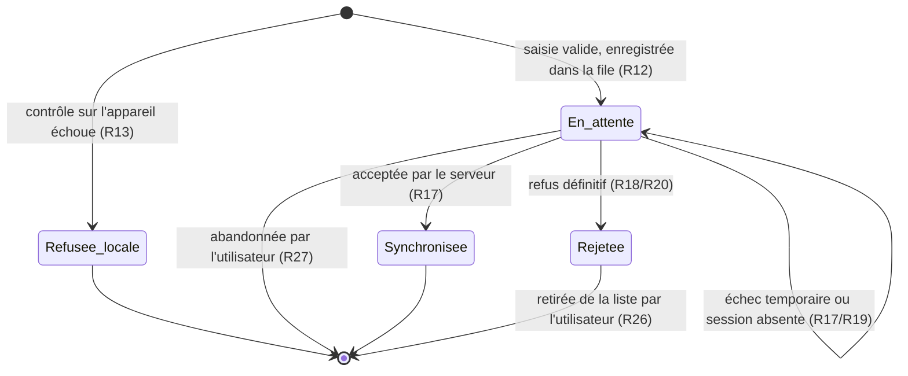
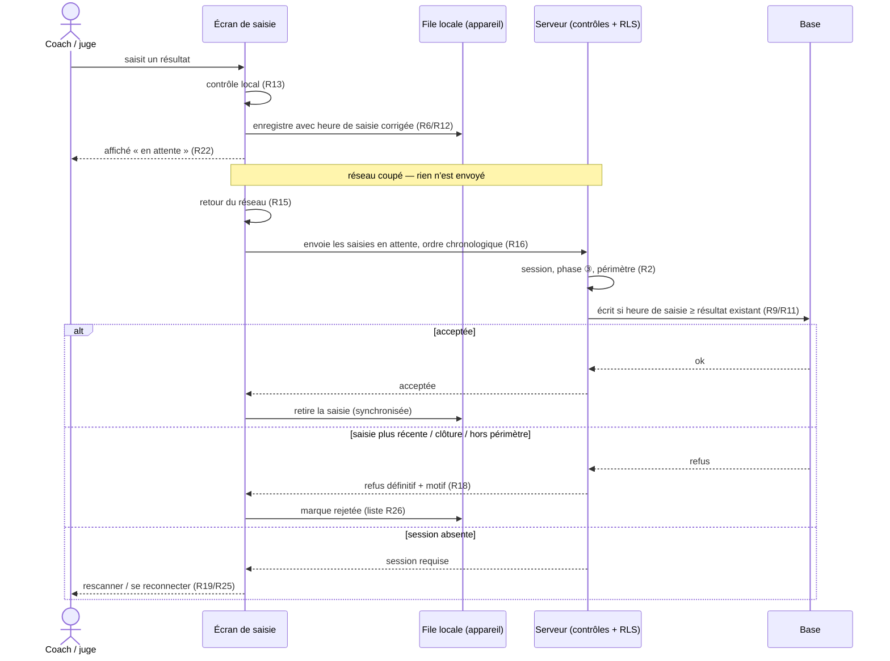

# Spec : Saisie hors ligne — coach et juge (phase compétition)

- **Statut** : validée (le 2026-10-07) — rédigée le 2026-10-03 ; points à valider
  tranchés le 2026-10-07 (déploiement pendant la ③ : perte acceptée, R21 ; retrait
  concurrent sans trace : accepté, ressaisie si besoin) ; **rév. 2026-10-09
  (validée le 2026-10-09)** : **R24** — en ligne, l'envoi en cours n'est signalé
  par le bandeau que s'il dure **plus de 2 secondes** (un envoi normal le faisait
  clignoter à chaque saisie)
- **Sources** :
  - **Maquette validée** (le 2026-10-07) : [`docs/maquettes/saisie-hors-ligne.html`](../maquettes/saisie-hors-ligne.html)
    (bandeau réseau, états des saisies, saisies non envoyées, juge sur tablette).
  - **Besoin exprimé le 2026-10-03** : dans les salles d'escalade, le réseau est
    souvent de mauvaise qualité et subit des **coupures**. Les **coachs** et les
    **juges de vitesse** doivent pouvoir **continuer leur saisie sans réseau**,
    la synchronisation se faisant **dès le retour du réseau**.
  - **Décisions produit du 2026-10-03** :
    - **(1b)** chaque saisie porte son **heure de saisie** ; la base **refuse**
      une écriture **plus ancienne** que le résultat existant (rejet signalé) ;
    - **(2a)** une saisie qui arrive **après la clôture** de la compétition est
      **refusée et signalée** (pas d'acceptation tardive) ;
    - **(3)** si la **session** est expirée ou révoquée, les saisies en attente
      sont **conservées** et **rejouées** après un nouveau scan / une nouvelle
      connexion ;
    - **(4)** périmètre limité aux **saisies de résultats** (voie, bloc, vitesse) ;
      composition, prêts et autres écrans restent **en ligne uniquement** ;
    - la fonctionnalité ne vaut que pour la **③ compétition** et pour **une seule
      rencontre** : un coach ou un juge ne traite qu'une rencontre à la fois ;
    - l'heure de saisie est **corrigée** de l'écart entre l'horloge de l'appareil
      et celle du serveur.
  - **Spec #6 — Saisie des résultats (coach)** (`06-saisie-des-resultats.md`) :
    saisie voie/bloc, correction par remplacement (R13/R17), retrait d'un résultat
    de voie, ③ uniquement (R5/R7). Révisée le 2026-10-03 (R4, R13bis, R20bis, modèle).
  - **Spec #9 — Saisie admin** (`09-saisie-admin-resultats.md`) : l'admin écrit
    en parallèle des coachs (R6). Révisée le 2026-10-03 : « la saisie la plus
    récente gagne » au lieu de « la dernière écriture gagne ».
  - **Spec #10 — Saisie vitesse (juge)** (`10-saisie-vitesse-juge.md`) : ③
    uniquement (R6), correction par remplacement (R11). Révisée le 2026-10-03 (R4,
    R11bis, R14bis, modèle).
  - **Spec #2 — Sessions QR** (`02-authentification-et-sessions-qr.md`) : une
    session QR n'est valide que dans sa fenêtre (R12) et prend fin à sa sortie ou
    à la révocation du jeton (R13/R22). **Inchangée.**
  - **Spec #11 — Realtime** (`11-realtime.md`) : rafraîchissement en direct des
    écrans de saisie. **Inchangée** (articulation en R22).

## Objectif

Le jour J, une coupure réseau ne doit **ni bloquer la saisie, ni perdre une
saisie**. Le coach (voie, bloc) et le juge (vitesse) continuent à saisir comme si
le réseau était là : chaque saisie est **conservée sur l'appareil** puis
**envoyée automatiquement** dès que le réseau revient. L'utilisateur sait à tout
moment ce qui est **envoyé**, ce qui est **en attente** et ce qui a été
**refusé**.

Un retard de synchronisation ne doit pas non plus **écraser une correction plus
récente** (par exemple celle de l'admin) : c'est l'**heure de saisie**, et non
l'heure d'arrivée au serveur, qui départage deux écritures sur un même résultat.

## Vocabulaire

- **Saisie** : une écriture de résultat faite par un coach ou un juge sur l'écran
  de saisie : résultat de voie, résultat de bloc, **retrait** d'un résultat de
  voie (coach, spec #6) ou résultat de vitesse (juge, spec #10).
- **Cible** d'une saisie : le résultat visé, identifié par `(voie, grimpeur)`,
  `(bloc, grimpeur)` ou `(épreuve de vitesse, grimpeur)`. Une cible porte au plus
  un résultat (spec #6 R13/R17, spec #10 R10).
- **Heure de saisie** : l'instant où l'utilisateur a fait la saisie sur son
  appareil, **corrigé** de l'écart d'horloge avec le serveur (R6). Stockée avec le
  résultat (`saisi_le`).
- **File d'attente locale** : la liste des saisies conservées **sur l'appareil**
  tant qu'elles n'ont pas été acceptées ou refusées par le serveur. Elle survit à
  un rechargement de la page, à la mise en veille et à la fermeture du navigateur.
- **Synchronisation** : l'envoi des saisies de la file au serveur, qui les
  **contrôle comme une saisie en ligne** (session, phase, périmètre, règles des
  specs #6 et #10).
- **Périmètre de file** : `(rôle, rencontre, club)` pour un coach ;
  `(rôle, rencontre)` pour un juge. Une file n'est **visible et rejouée** que par
  une session de ce périmètre.
- **États d'une saisie** :
  - **en attente** : conservée sur l'appareil, pas encore acceptée ;
  - **synchronisée** : acceptée et enregistrée par le serveur ;
  - **rejetée** : refusée définitivement par le serveur (R18), avec un motif.
- **Saisie plus récente** : pour une même cible, le résultat dont l'heure de
  saisie est la plus tardive.

## Règles fonctionnelles

### Périmètre

- **R1.** La saisie hors ligne couvre **uniquement** :
  - la saisie, la correction et le retrait des résultats de **voie** et de
    **bloc** par un **coach** (permanent ou temporaire, spec #6) ;
  - la saisie et la correction des résultats de **vitesse** par un **juge**
    (spec #10).
  Aucun autre écran ni aucune autre écriture (engagement, composition, prêts,
  paramétrage, saisie **admin**) ne fonctionne hors ligne.
- **R2.** La saisie hors ligne ne vaut qu'en **③ compétition** (spec #6 R5/R7,
  spec #10 R6). Elle ne crée **aucun droit nouveau** : une saisie synchronisée est
  soumise aux **mêmes contrôles** qu'une saisie en ligne (session, phase,
  périmètre, règles de saisie). Les contrôles serveur et la RLS restent la
  frontière ultime (spec #6 R3, spec #10 R3).
- **R3.** Une file d'attente locale porte sur **une seule rencontre** (périmètre
  de file). Un coach ou un juge ne traite qu'une rencontre à la fois : l'écran de
  saisie d'une rencontre n'affiche et ne synchronise **que** les saisies de cette
  rencontre.
- **R4.** Une file n'est **ni affichée ni rejouée** par une session d'un autre
  périmètre de file. Exemple : sur un même téléphone, les saisies d'un coach du
  club A ne sont jamais envoyées par une session coach du club B.
- **R5.** La saisie hors ligne suppose que l'**écran de saisie est déjà ouvert**
  (chargé alors que le réseau était disponible). **Ouvrir** ou **recharger**
  l'écran sans réseau est **hors périmètre** (évolution future, voir « Hors
  périmètre »).

### Heure de saisie

- **R6.** Chaque saisie coach ou juge porte son **heure de saisie**, prise au
  moment où l'utilisateur valide. Elle est **corrigée** de l'écart entre l'horloge
  de l'appareil et celle du serveur, mesuré au **chargement de l'écran** (et
  remesuré à chaque échange réussi avec le serveur).
- **R7.** Une heure de saisie **postérieure à l'heure du serveur** au moment de
  l'enregistrement est **ramenée à l'heure du serveur**. Une saisie ne peut donc
  jamais se « dater dans le futur ».
- **R8.** Une écriture **admin** (spec #9) a pour heure de saisie l'**heure du
  serveur** au moment de l'enregistrement. Avec R7, une saisie admin est donc
  toujours au moins aussi récente que le résultat existant : elle n'est **jamais
  refusée** par la règle R9 (spec #9 R8).
- **R9.** Pour une même cible, la base **refuse** une écriture dont l'heure de
  saisie est **strictement antérieure** à celle du résultat existant. La saisie
  plus récente est conservée ; la saisie refusée est **rejetée** (R18) avec le
  motif « une saisie plus récente existe déjà ». Cette règle s'applique à
  **tous** les auteurs (coach, juge, admin) et à **tous** les chemins d'écriture
  (écran, appel direct à l'API).
- **R10.** Un **retrait** de résultat de voie (coach) suit la même règle : il est
  **refusé** si le résultat existant a une heure de saisie **strictement
  postérieure** à celle du retrait. Un retrait sur une cible **sans** résultat est
  accepté sans effet.
- **R11.** Une écriture dont l'heure de saisie est **égale** à celle du résultat
  existant est **acceptée** (rejouer deux fois la même saisie, par exemple après
  une réponse perdue, ne produit ni doublon ni rejet).

### File d'attente et synchronisation

- **R12.** Toute saisie coach ou juge passe par la **file d'attente locale**,
  **réseau présent ou non** : elle y est enregistrée **avant** tout envoi, puis
  synchronisée. Il n'existe qu'un seul chemin de saisie.
- **R13.** Avant d'entrer dans la file, une saisie est contrôlée **sur
  l'appareil** avec les règles de saisie connues localement (issues admises par
  catégorie et type de voie, forme d'un résultat de vitesse, plafond de 6 voies
  ado compté sur l'état affiché). Une saisie **invalide** est refusée
  **immédiatement**, avec le même message qu'en ligne, et **n'entre pas** dans la
  file.
- **R14.** Pour une même cible, **seule la saisie la plus récente** de la file est
  envoyée : une nouvelle saisie sur une cible déjà en attente **remplace** la
  précédente ; un retrait sur une cible dont la saisie est encore en attente
  **remplace** cette saisie par le retrait.
- **R15.** La synchronisation se déclenche **automatiquement**, sans action de
  l'utilisateur : à chaque nouvelle saisie, au **retour du réseau**, au retour sur
  l'écran (onglet réactivé) et par **nouvel essai périodique** tant que la file
  n'est pas vide (au plus toutes les **30 secondes**). Elle ne s'exécute que
  lorsque l'**écran de saisie est ouvert**.
- **R16.** Les saisies en attente sont envoyées dans l'**ordre chronologique** de
  leur heure de saisie.
- **R17.** Le serveur classe l'issue de chaque envoi en trois catégories :
  - **acceptée** → la saisie passe **synchronisée** et quitte la file ;
  - **échec temporaire** (réseau absent, délai dépassé, serveur indisponible) →
    la saisie **reste en attente** et sera renvoyée (R15) ;
  - **refus définitif** → la saisie passe **rejetée** (R18) et n'est **plus
    renvoyée**.
- **R18.** Sont des **refus définitifs** : une saisie plus récente existe (R9/R10),
  la rencontre n'est plus en ③ compétition (R20), la cible est hors du périmètre
  de la session (autre club, grimpeur non engagé), une règle de saisie violée
  (plafond de 6 voies ado atteint côté serveur, issue invalide). Chacun est
  affiché avec un **message lisible** (spec #6 R4, spec #10 R4), jamais une erreur
  technique brute.
- **R19.** Une **absence de session valide** (session QR expirée ou révoquée,
  coach permanent déconnecté) **n'est pas** un refus définitif : les saisies
  **restent en attente** et l'écran invite à **rescanner le QR** (coach
  temporaire, juge) ou à **se reconnecter** (coach permanent). Dès qu'une session
  du **même périmètre de file** (R4) est rétablie, la file est rejouée. L'auteur
  enregistré (spec #9 R14) est celui de la **session qui synchronise**.
- **R20.** Une saisie synchronisée **après la sortie de la ③ compétition** (④
  clôture ou au-delà) est **refusée** (décision 2a) avec le message : *« La
  compétition est clôturée : cette saisie n'a pas été enregistrée. Signalez-la à
  l'organisateur. »* La correction relève alors de l'**admin** (spec #9 R5).
- **R21.** L'application n'est **pas mise à jour** (déploiement) pendant une
  rencontre en ③ compétition (consigne d'exploitation, décision du 2026-10-07).
  Si une mise à jour a lieu malgré tout, les saisies **en attente** à ce moment
  **peuvent être perdues** : aucune reprise n'est garantie.

### Affichage

- **R22.** Une saisie est affichée **immédiatement** sur l'écran (issue,
  progression, compteurs), dans l'état **en attente**, sans attendre le serveur.
  Tant qu'une saisie est en attente, elle **prime** sur la valeur venue du serveur
  pour sa cible (y compris lors d'un rafraîchissement temps réel, spec #11). Une
  fois **synchronisée**, la valeur du serveur fait foi. Si elle est **rejetée**,
  l'écran revient à la **valeur du serveur** pour cette cible.
- **R23.** Chaque cible saisie montre son état — **en attente**, **synchronisée**
  ou **rejetée** — de façon distincte et lisible (pas uniquement par la couleur).
- **R24.** Un **bandeau** est affiché dès que l'appareil est **hors ligne** ou
  que la file contient au moins une saisie **en attente**. Il indique l'état du
  réseau et le **nombre de saisies en attente** (ex. *« Hors ligne · 3 saisies en
  attente »*). Il disparaît quand l'appareil est en ligne et la file vide.
  *(Rév. 2026-10-09.)* Appareil **en ligne** : l'envoi en cours n'est signalé par
  le bandeau que si des saisies attendent depuis **plus de 2 secondes** sans
  interruption ; un envoi plus court ne l'affiche pas (l'état de chaque saisie
  reste visible sur sa cible, R23). Le bandeau reste **immédiat** hors ligne, en
  cas de session absente (R25) et de saisie rejetée (R26).
- **R25.** En cas d'absence de session valide (R19), le bandeau l'indique et
  propose l'action attendue (rescanner le QR ou se reconnecter).
- **R26.** Les saisies **rejetées** sont regroupées dans une **liste consultable**
  depuis l'écran de saisie : grimpeur, cible (voie, bloc ou vitesse), valeur
  saisie, heure de saisie et motif du refus. L'utilisateur peut ainsi les
  transmettre à l'organisateur. Une saisie rejetée reste dans la liste jusqu'à ce
  que l'utilisateur la **retire** explicitement.
- **R27.** Les saisies **en attente** sont consultables de la même façon (même
  informations, sans motif). L'utilisateur peut **abandonner** une saisie en
  attente, après **confirmation** ; elle quitte la file sans être envoyée.
- **R28.** Si l'utilisateur tente de **quitter ou recharger** l'écran alors que la
  file contient des saisies en attente, le navigateur lui demande
  **confirmation**. Les saisies restent de toute façon conservées sur l'appareil
  (R12) et seront synchronisées à la prochaine ouverture de l'écran.

## Scénarios

### Nominal — coupure pendant la saisie coach

Étant donné une rencontre en **③ compétition** et un coach du club A sur l'écran
de saisie, quand le réseau coupe puis que le coach saisit T1 = Top et B1 = 1er
essai pour un grimpeur, alors les deux résultats s'affichent aussitôt **en
attente** et le bandeau indique *« Hors ligne · 2 saisies en attente »* (R22/R24).
Quand le réseau revient, alors les deux saisies sont envoyées sans action du
coach, passent **synchronisées**, et le bandeau disparaît (R15/R17).

### Nominal — correction hors ligne d'une même voie

Étant donné le réseau coupé, quand le coach saisit T2 = Échec puis corrige en
T2 = Top, alors **une seule** saisie est en attente pour T2 (Top) et c'est elle qui
est envoyée au retour du réseau (R14).

### Nominal — juge de vitesse hors ligne

Étant donné le réseau coupé sur la tablette du juge, quand il saisit trois temps
et une chute, alors les quatre résultats s'affichent en attente, les compteurs
Filles/Garçons sont à jour (R22) et, au retour du réseau, les quatre sont
synchronisés dans l'ordre de saisie (R16).

### Nominal — correction admin plus récente

Étant donné un coach hors ligne qui saisit T3 = Échec à 10:00, quand l'admin
saisit T3 = Top à 10:05 sur le même grimpeur, puis que le coach retrouve le
réseau à 10:10, alors l'envoi du coach est **refusé** (saisie plus récente, R9),
T3 reste **Top**, et la saisie du coach apparaît dans la liste des **rejetées**
avec le motif *« une saisie plus récente existe déjà »* (R26).

### Nominal — session QR expirée pendant la coupure

Étant donné un coach temporaire avec 2 saisies en attente dont la session QR a été
révoquée pendant la coupure, quand le réseau revient, alors les saisies **restent
en attente** et le bandeau invite à rescanner le QR (R19/R25). Quand il scanne le
nouveau jeton du **même club** pour la **même rencontre**, alors les 2 saisies sont
synchronisées et enregistrées au nom de la nouvelle session.

### Cas limites / erreurs

- Réseau revenu **après la clôture** (coach permanent) → saisies **rejetées** avec
  le message de clôture (R20) ; l'admin corrige (spec #9).
- Coach temporaire ou juge dont la session a pris fin **à la clôture** (spec #2
  R13) → aucune session ne peut être rétablie (spec #2 R12) : les saisies restent
  **en attente**, consultables (R27) pour être transmises à l'organisateur.
- Réponse du serveur perdue après un enregistrement réussi → la saisie est
  renvoyée ; l'heure de saisie étant **identique**, elle est acceptée sans doublon
  (R11).
- Horloge de l'appareil en avance d'une heure → l'heure de saisie est corrigée de
  l'écart mesuré (R6) ; à défaut de mesure, elle est ramenée à l'heure du serveur
  (R7).
- Ado : 6 voies déjà affichées (dont une en attente), le coach tente une 7ᵉ hors
  ligne → **refusée immédiatement** sur l'appareil (R13).
- Ado : deux appareils du même club saisissent chacun une 6ᵉ voie différente hors
  ligne → la seconde envoyée est **rejetée** par la base (plafond, spec #6 R14 ;
  R18).
- Un coach du club B se connecte sur le téléphone utilisé par le club A avec des
  saisies en attente → il ne voit ni n'envoie la file du club A (R4).
- L'utilisateur ferme le navigateur avec des saisies en attente → confirmation
  demandée (R28) ; à la réouverture de l'écran, la file est synchronisée.
- Mise à jour de l'application pendant la compétition (contraire à la consigne)
  → les saisies en attente peuvent être **perdues** (R21).
- Ouverture de l'écran de saisie **sans réseau** → hors périmètre (R5).

## Cycle de vie d'une saisie

## Synchronisation (vue d'ensemble)

## Contraintes de données

- **Heure de saisie** : une colonne `saisi_le timestamptz not null default now()`
  est ajoutée sur `resultat_voie`, `resultat_bloc` et `temps_vitesse`. Les lignes
  existantes reçoivent l'heure de la migration.
- **Pas de date future (R7)** : un trigger `before insert or update` ramène
  `saisi_le` à `now()` lorsqu'il est absent ou postérieur à `now()`.
- **Saisie la plus récente (R9/R11)** : le même trigger, en mise à jour (y compris
  via `upsert`), **refuse** l'écriture si le nouveau `saisi_le` est **strictement
  antérieur** à celui de la ligne existante, avec un code d'erreur dédié
  (`saisie_plus_ancienne`) traduit en message lisible.
- **Retrait (R10)** : la suppression d'un `resultat_voie` par un coach est
  **conditionnée** à `saisi_le <= heure du retrait`. Si une ligne existe et ne
  satisfait pas la condition, le retrait est refusé avec le même code
  `saisie_plus_ancienne`. Une cible sans ligne est un succès sans effet.
- **Admin (R8)** : les écritures admin ne transmettent pas d'heure de saisie ;
  la base applique `now()`.
- **NP automatique à la clôture** (spec #6 R18) : les lignes insérées reçoivent
  `saisi_le = now()` (valeur par défaut).
- **Purge au retrait d'un grimpeur** (spec #10 R18) : non soumise à R9 (une
  suppression de composition n'est pas une saisie).
- **Aucune nouvelle policy RLS** : les policies d'écriture existantes
  (`peut_ecrire_resultat_voie/_bloc`, `peut_ecrire_temps_vitesse`) restent la
  frontière ; le trigger s'ajoute à elles.
- **File locale** : stockée **sur l'appareil** (stockage persistant du
  navigateur), jamais en base. Elle contient, par saisie : cible, valeur, heure de
  saisie, état, motif de rejet éventuel, périmètre de file.

## Livraison par lots

- **Lot 1 — affichage instantané** (2026-10-07, cahier
  [29](../tests/29-saisie-hors-ligne.cahier.md)) : saisie coach (voie, bloc,
  retrait) et juge (vitesse) affichée **dès le clic**, « en attente », puis
  « enregistré » ou « rejetée » avec retour à la valeur du serveur et motif ;
  compteurs tenant compte des saisies en attente. Couvre **R13** (contrôle local,
  juge), **R18** (motifs), **R22**, **R23**, spec #6 **R20bis** et spec #10
  **R14bis**. Les saisies en attente vivent **en mémoire de la page** : quitter ou
  recharger l'écran pendant un envoi l'interrompt.
- **Lot 2 — file hors ligne** (2026-10-09, cahier
  [29](../tests/29-saisie-hors-ligne.cahier.md) CT-07 à CT-14, migration
  `202610091100_heure_saisie`) : file conservée sur l'appareil (stockage local
  du navigateur) et rejouée automatiquement (R12, R14–R17), session absente
  gardée en attente (R19), refus de clôture (R20), heure de saisie corrigée de
  l'écart d'horloge et départage en base (R6–R11), bandeau, listes des saisies
  rejetées / en attente et confirmation de sortie (R24–R28). Le lot 1 est
  absorbé : toute saisie passe désormais par la file.

## Points à valider

- **Retrait concurrent sans trace** : un retrait accepté supprime la ligne ; une
  saisie hors ligne **plus ancienne** que ce retrait, arrivée ensuite, recrée donc
  le résultat (aucune trace du retrait ne subsiste pour la comparer). Cas jugé
  marginal (deux appareils du même club agissant sur la même voie, l'un hors
  ligne) — **tranché le 2026-10-07** : **accepté en l'état** ; le cas échéant, le
  résultat est **ressaisi** ou retiré à nouveau.
- **Déploiement pendant une compétition** — **tranché le 2026-10-07** : **pas de
  push sur `main`** pendant une rencontre en ③ (push = déploiement Netlify) ; en
  cas de déploiement malgré tout, la perte des saisies en attente est **acceptée**
  (R21).

## Hors périmètre

- **Ouvrir ou recharger** l'écran de saisie **sans réseau** (mise en cache de
  l'application et des données de la rencontre sur l'appareil) : évolution
  future (« niveau 2 »).
- **Synchronisation en arrière-plan** quand l'écran de saisie est fermé : la file
  n'est envoyée que lorsque l'écran est ouvert (R15).
- **Saisie admin hors ligne** (spec #9) et tout autre écran (engagement,
  composition, prêts, paramétrage, classement).
- **Plusieurs rencontres** traitées en parallèle par un même coach ou juge (R3).
- **Fusion** de deux saisies concurrentes : la saisie la plus récente l'emporte
  (R9), sans fusion ni arbitrage manuel.
