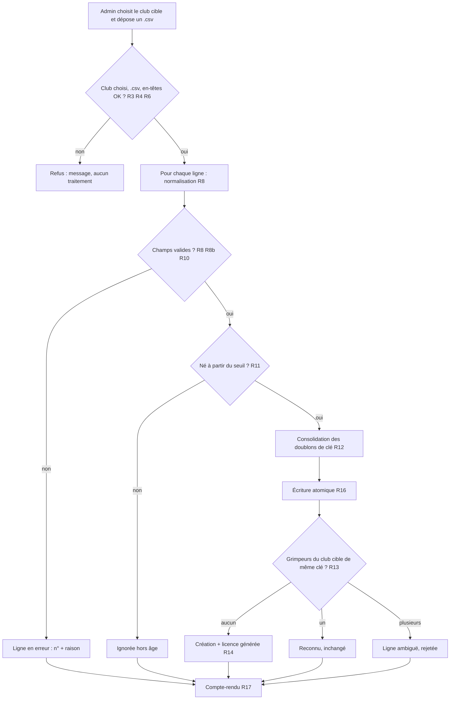

# Spec : Import CSV sans licence (format Marsas)

- **Statut** : validée (2026-10-10)
- **Sources** :
  - Décision produit du **2026-10-10** : le club de **Marsas** fournit la liste
    de ses grimpeurs en CSV **sans numéro de licence** (référence de structure :
    `docs/listing marsas.csv`). Choix validés : identifiant généré dans
    `grimpeur.licence` sur une **plage réservée** + indicateur « licence
    générée » ; rapprochement sur **l'année** de naissance seule (pas de date
    complète en base) ; import **spécifique** à ce format.
  - Spec **#13 — Import des licenciés** (`13-import-des-licencies.md`) : reste la
    vérité pour l'import FFME `.xlsx`. La présente spec en **réutilise** le garde
    d'accès (R1), l'année de référence (R6), le filtre d'âge (R7–R8), le
    principe analyse pure / écriture atomique (R15–R17).
  - Spec **#3 — Écrans de paramétrage** R20–R26 (modèle grimpeur, licence
    obligatoire et unique R21b — **amendée** par la présente spec, cf.
    « Impacts sur les specs existantes »).
  - Spec **#1** R11–R13 (écriture réservée à l'admin), R37 (saison).

## Objectif

Permettre à l'admin d'**importer en masse** les grimpeurs d'un club qui ne
dispose **pas des numéros de licence** (cas de Marsas), sans saisie unitaire.
Faute de licence, l'import **reconnaît** un grimpeur déjà en base par son
**identité** (sexe, nom, prénom, année de naissance) et **génère** un
identifiant technique pour chaque nouveau grimpeur, afin de respecter la
contrainte `licence` obligatoire et unique. L'import est **rejouable** : un
second import du même fichier ne crée aucun doublon.

## Vocabulaire

- **Fichier CSV Marsas** : fichier texte CSV, une ligne d'en-têtes puis une
  ligne par grimpeur, colonnes `QUALITE`, `NOM`, `PRENOM`, `DATNAISS`.
- **Club cible** : club de l'application auquel **tous** les grimpeurs du
  fichier sont rattachés ; choisi par l'admin avant l'import (le fichier ne
  porte pas de colonne club).
- **Clé d'identité** : quadruplet (sexe, nom comparable, prénom comparable,
  année de naissance) servant au rapprochement (R10).
- **Forme comparable** d'un nom ou prénom : libellé ramené à une forme
  canonique pour la comparaison seulement (R9) ; la valeur **stockée** reste le
  libellé normalisé (R8).
- **Licence générée** : numéro attribué par l'application dans la **plage
  réservée** (R13), et non par une fédération.

## Règles fonctionnelles

### Accès & écran

- **R1.** L'écran et son action sont **réservés à l'admin**, avec la même garde
  que l'import FFME (spec #13 R1) : 404 pour un non-admin, refus serveur d'un
  appel direct sans écriture ; la RLS reste la frontière ultime.
- **R2.** L'écran est accessible à l'URL `/admin/grimpeurs/import-csv`, via un
  lien depuis l'écran d'import FFME (`/admin/grimpeurs/import`). Il est
  distinct de l'import FFME : l'import `.xlsx` (spec #13) est inchangé.
- **R3.** Avant import, l'admin **choisit le club cible** parmi les clubs
  existants (liste déroulante, obligatoire). Sans club choisi, l'import est
  refusé avec un message, sans traitement.

### Fichier

- **R4.** L'admin dépose un **unique fichier `.csv`**. Un autre type ou
  l'absence de fichier est **refusé** avec un message explicite, sans
  traitement.
- **R5.** Le fichier est lu en **UTF-8** (un BOM éventuel est ignoré). Le
  séparateur est la **virgule** ou le **point-virgule**, déterminé par la ligne
  d'en-têtes. Les fins de ligne `LF` et `CRLF` sont acceptées ; les lignes
  entièrement vides sont ignorées.
- **R6.** La première ligne doit contenir, dans cet ordre, les en-têtes
  `QUALITE`, `NOM`, `PRENOM`, `DATNAISS` (insensibles à la casse et aux espaces
  de bord). Sinon le fichier est **refusé** (« en-têtes inattendus »), sans
  traitement. Les colonnes supplémentaires à droite sont ignorées.
- **R7.** Un fichier sans ligne de données n'écrit rien ; le compte-rendu
  indique **0 ligne traitée**.

### Lecture & normalisation d'une ligne

- **R8.** Pour chaque ligne, l'import lit et normalise :
  - **QUALITE** → sexe : `M` → **`H`**, `MME` → **`F`** (insensible à la casse
    et aux espaces de bord). Toute autre valeur est **invalide**.
  - **NOM**, **PRENOM** : obligatoires, ≤ 100 caractères, normalisés (espaces de
    bord retirés, espaces internes réduits à un seul — spec #3 R22/R4). La
    valeur normalisée est celle **stockée** à la création.
  - **DATNAISS** : format **`AAAA-MM-JJ`**, date calendaire valide ; seule
    l'**année** est conservée, bornée à `[1900, 2100]` (spec #3 R23).
- **R8b.** Un nom ou prénom contenant le **caractère de remplacement** `�`
  (U+FFFD, trace d'un accent perdu à l'export) est **invalide** : la ligne est
  rejetée avec la raison « caractère illisible, corriger le fichier ». Cela
  évite de créer un doublon mal orthographié d'un grimpeur existant.
- **R9.** La **forme comparable** d'un nom ou prénom est obtenue à partir du
  libellé normalisé (R8) en : mettant en **majuscules** ; retirant les
  **accents** (é → E, ç → C…) ; remplaçant **tirets** et **apostrophes**
  (`'`, `’`) par une **espace** ; réduisant les espaces multiples à une seule et
  retirant les espaces de bord. Exemples : `Robin-Brosse` ≡ `ROBIN BROSSE` ;
  `L’Hostis` ≡ `L HOSTIS` ; `Léa` ≡ `LEA`.
- **R10.** Une ligne dont au moins un champ est absent ou invalide (R8, R8b) est
  **rejetée** : non importée, listée dans les erreurs du compte-rendu avec son
  **numéro de ligne** (dans le fichier, en-tête = ligne 1) et la **raison**. Les
  autres lignes ne sont pas bloquées.

### Filtre d'âge

- **R11.** L'année de référence et le filtre d'âge sont **ceux de l'import
  FFME** (spec #13 R6–R8) : seuls les grimpeurs nés en
  `année de référence − 18` ou après sont importés ; les autres sont **ignorés**
  (comptés à part, pas en erreur). Aucun âge minimal n'est appliqué.

### Rapprochement & doublons

- **R12.** Deux lignes du fichier de **même clé d'identité** (R9) désignent le
  même grimpeur : la **dernière occurrence** prévaut, les précédentes sont
  consolidées (une seule écriture) et signalées dans le compte-rendu
  (« doublon dans le fichier »).
- **R13.** Pour chaque ligne retenue, l'import cherche, **parmi les grimpeurs du
  club cible** (quelle que soit la nature de leur licence), ceux de **même clé
  d'identité** (sexe, nom comparable, prénom comparable, année de naissance) :
  - **aucun** → le grimpeur est **créé** dans le club cible, avec une **licence
    générée** (R14) ;
  - **exactement un** → le grimpeur est **reconnu** : il n'est **pas modifié**
    (sa licence, réelle ou générée, et ses libellés sont conservés) et compte
    parmi les « déjà présents » ;
  - **plusieurs** → la ligne est **rejetée** (« rapprochement ambigu : N
    grimpeurs correspondent »), sans écriture pour elle.

### Licence générée

- **R14.** Une licence générée est un entier de la **plage réservée**
  `[2 000 000 000, 2 147 483 647]`. Chaque nouveau grimpeur reçoit le **plus
  petit entier de la plage strictement supérieur** à la plus grande licence de
  la plage déjà attribuée (ou `2 000 000 000` si aucune). Deux grimpeurs
  créés reçoivent des licences **distinctes** ; une licence générée n'est
  **jamais réattribuée** par l'import à un autre grimpeur.
- **R15.** Un grimpeur **porte une licence générée si et seulement si** sa
  licence appartient à la plage réservée. Cet indicateur (`licence_generee`)
  est **dérivé** de la licence : remplacer la licence par un vrai numéro (spec
  #3 R21c) le fait passer à « non générée » sans autre action.

### Transaction & compte-rendu

- **R16.** Comme l'import FFME (spec #13 R15–R17) : **analyse pure** (lecture,
  normalisation, filtre d'âge, erreurs, doublons internes) puis **écriture
  atomique** des seules lignes valides et éligibles (rapprochement R13 et
  création R14). Une erreur base annule **toute** l'écriture ; le compte-rendu
  signale l'échec. Le rapprochement et l'attribution des licences se font
  **dans la même transaction** que l'écriture, pour qu'un import concurrent ne
  puisse ni dupliquer une licence ni créer deux fois le même grimpeur.
- **R17.** Le compte-rendu affiche au moins : le **club cible**, le nombre de
  grimpeurs **créés**, **déjà présents**, **ignorés (hors âge)**, les
  **doublons dans le fichier**, et les **lignes en erreur** ou **ambiguës**
  (numéro de ligne, identité, raison), ainsi que l'année de référence. Après un
  import réussi, l'écran Grimpeurs (spec #3 R26) reflète l'état à jour.

## Déroulé (vue d'ensemble)

## Scénarios

### Nominal — premier import

Étant donné un admin connecté, le club « Marsas » existant sans grimpeur, quand
il choisit ce club et dépose `listing marsas.csv` (102 lignes, dont un doublon
exact et deux prénoms à accent perdu), alors 99 grimpeurs sont **créés** avec
des licences générées distinctes à partir de 2 000 000 000 (R13–R14), 1 doublon
est signalé (R12), 2 lignes sont en erreur « caractère illisible » (R8b), et
aucun n'est ignoré pour l'âge (tous nés en 2009 ou après, référence 2027).

### Nominal — fichier corrigé

Étant donné le club « Marsas » sans grimpeur, quand l'admin importe la copie
corrigée (accents rétablis, nom/prénom remis dans l'ordre, doublon retiré,
espaces nettoyés — 101 lignes), alors les 101 grimpeurs sont **créés**, sans
erreur ni doublon.

### Nominal — ré-import

Étant donné le premier import fait (fichier brut), quand l'admin importe la
copie corrigée, alors 98 grimpeurs sont **déjà présents** (aucune
modification, aucune nouvelle licence) et 3 sont **créés** (R13) : les 2 dont
le prénom est corrigé (`CLÉOPHÉE`, `NOÉMIE`) et `L'HOSTIS Gabin`, dont nom et
prénom remis dans l'ordre forment une identité différente de la fiche
`GABIN L’HOSTIS` du premier import (à supprimer à la main). Un troisième import
du même fichier ne crée plus rien.

### Cas limites / erreurs

- Aucun club choisi, fichier non `.csv`, en-têtes différents → refus sans
  traitement (R3, R4, R6).
- `QUALITE` = `MLLE` ou vide → ligne en erreur (R8, R10).
- `DATNAISS` = `12/08/2012` ou `2012-02-30` → ligne en erreur (R8).
- `ROBIN-BROSSE` en base, `ROBIN BROSSE` dans le fichier, mêmes prénom, sexe et
  année → reconnu, pas de doublon (R9, R13).
- Même identité mais année de naissance différente → considéré comme un autre
  grimpeur, créé (R13).
- Grimpeur de même identité présent dans **un autre club** → non rapproché ; un
  grimpeur est créé dans le club cible (R13).
- Deux grimpeurs du club cible de même clé → ligne ambiguë rejetée (R13).
- Grimpeur reconnu dont la licence a été remplacée par un vrai numéro → reste
  reconnu, licence conservée (R13, R15).
- Erreur base pendant l'écriture → rollback total, échec signalé (R16).

## Impacts sur les specs existantes (validés le 2026-10-10)

- **Spec #3 R21b** (licence) : ajout d'une règle **R21c** — « La plage
  `[2 000 000 000, 2 147 483 647]` est **réservée** aux licences générées par
  l'import CSV (spec #18 R14). La saisie unitaire **refuse** un numéro dans
  cette plage, sauf à **conserver** la licence générée déjà portée par le
  grimpeur modifié. Remplacer une licence générée par un vrai numéro est
  autorisé. »
- **Spec #3 R26** (liste des grimpeurs) : une licence générée est affichée avec
  la mention **« générée »** (au lieu du seul numéro brut).
- **Spec #13** « Hors périmètre » : la ligne « Fusion / rapprochement de
  grimpeurs sans licence » renvoie désormais vers la spec #18 pour le format
  CSV Marsas. Aucune règle de la spec #13 ne change.

## Contraintes de données

- Nouvelle colonne **dérivée** `grimpeur.licence_generee boolean generated
  always as (licence >= 2000000000) stored` (R15) — aucune désynchronisation
  possible avec la licence.
- `licence` reste `integer not null check (licence > 0) unique` (spec #3 R21b) :
  l'unicité garantit l'absence de licence générée en double (R14).
- **Écriture** via une RPC **SECURITY INVOKER** dédiée (comme
  `importer_licencies`, spec #13) : garde `est_admin()`, rapprochement R13 et
  attribution R14 dans la transaction, sous un **verrou** sérialisant les
  imports concurrents (R16). Aucune nouvelle policy RLS (`grimpeur_*` couvre
  l'écriture admin).
- **Logique pure** (testable hors Supabase, `src/domaine/`) : découpage CSV et
  détection du séparateur, contrôle des en-têtes, normalisation et validation
  d'une ligne, conversion du sexe, extraction de l'année ISO, détection
  U+FFFD, forme comparable, clé d'identité, filtre d'âge, consolidation des
  doublons. L'écriture Supabase est le seul adaptateur non pur. La forme
  comparable est **recalculée côté SQL** pour le rapprochement de façon
  équivalente (R9) ; un cas de cahier vérifie l'équivalence.

## Hors périmètre

- **Mise à jour** d'un grimpeur reconnu (nom, prénom, club) : un grimpeur
  reconnu n'est jamais modifié par cet import.
- Rapprochement **entre clubs** et rapprochement avec un grimpeur importé par
  l'import FFME sous une autre identité (orthographe différente au-delà de R9).
  Un même enfant arrivé ensuite avec sa vraie licence via l'import FFME est un
  **doublon** que l'admin résout à la main (remplacer la licence générée par la
  vraie, R21c, puis supprimer l'autre fiche).
- Stockage de la **date de naissance complète** (seule l'année est conservée).
- Autres formats CSV (autres colonnes, autres libellés de sexe) et colonne club
  dans le fichier.
- Suppression des grimpeurs absents du fichier.
